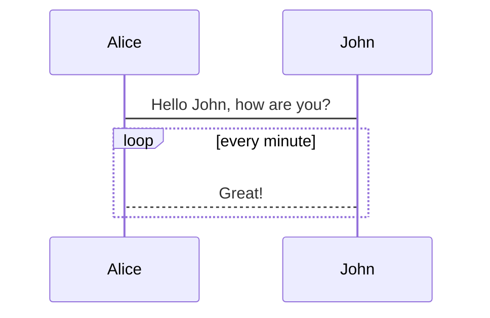

## 1、💡 **Alerts信息框** 


```markdown
::: tip
这是一条提示
:::

::: warning
这是一条注意
:::

::: danger
这是一条警告
:::

::: note
这是笔记容器，在 <Badge text="v1.5.0 +" /> 版本才支持哦~
:::

::: tip 我的提示
自定义标题的提示框
:::
```

::: details 示例效果

::: tip
这是一条提示
:::

::: warning
这是一条注意
:::

::: danger
这是一条警告
:::

::: note
这是笔记容器，在 <Badge text="v1.5.0 +" /> 版本才支持哦~
:::

::: tip 我的提示
自定义标题的提示框
:::

:::

## 2、📐 **布局容器** 


````markdown
::: center
  ## 我是居中的内容

  （可用于标题、图片等的居中）
:::

::: right
  [我是右浮动的内容](https://www.google.com/)
:::

::: theorem 牛顿第一定律
假若施加于某物体的外力为零，则该物体的运动速度不变。
::: right
来自 [维基百科](https://www.google.com/)
:::
````

::: details 示例效果

::: center
**我是居中的内容**  
（可用于标题、图片等的居中）
:::

::: right
[我是右浮动的内容](https://www.google.com/)
:::

::: theorem 牛顿第一定律
假若施加于某物体的外力为零，则该物体的运动速度不变。
::: right
来自 [维基百科](https://www.google.com/)
:::

:::

## 3、📇 **普通卡片列表** 


````markdown
::: cardList
```yaml
- name: 麋鹿鲁哟
  desc: 大道至简，知易行难
  avatar: https://jsd.cdn.zzko.cn/gh/xugaoyi/image_store/blog/20200122153807.jpg # 可选
  link: https://www.cnblogs.com/miluluyo/ # 可选
  bgColor: '#CBEAFA' # 可选，默认var(--bodyBg)。颜色值有#号时请添加单引号
  textColor: '#6854A1' # 可选，默认var(--textColor)
- name: XAOXUU
  desc: '#IOS #Volantis主题作者'
  avatar: https://jsd.cdn.zzko.cn/gh/xaoxuu/assets@master/avatar/avatar.png
  link: https://xaoxuu.com
  bgColor: '#718971'
  textColor: '#fff'
- name: 平凡的你我
  desc: 理想成为大牛的小陈同学
  avatar: https://reinness.com/avatar.png
  link: https://reinness.com
  bgColor: '#FCDBA0'
  textColor: '#A05F2C'
```
:::
````

::: details 示例效果

::: cardList
```yaml
- name: 麋鹿鲁哟
  desc: 大道至简，知易行难
  avatar: https://jsd.cdn.zzko.cn/gh/xugaoyi/image_store/blog/20200122153807.jpg # 可选
  link: https://www.cnblogs.com/miluluyo/ # 可选
  bgColor: '#CBEAFA' # 可选，默认var(--bodyBg)。颜色值有#号时请添加单引号
  textColor: '#6854A1' # 可选，默认var(--textColor)
- name: XAOXUU
  desc: '#IOS #Volantis主题作者'
  avatar: https://jsd.cdn.zzko.cn/gh/xaoxuu/assets@master/avatar/avatar.png
  link: https://xaoxuu.com
  bgColor: '#718971'
  textColor: '#fff'
- name: 平凡的你我
  desc: 理想成为大牛的小陈同学
  avatar: https://jsd.cdn.zzko.cn/gh/xugaoyi/image_store/blog/20200122153807.jpg
  link: https://reinness.com
  bgColor: '#FCDBA0'
  textColor: '#A05F2C'
```
:::

:::

### 🔸 **两列布局卡片**


````markdown
::: cardList 2
```yaml
- name: 《静夜思》
  desc: 床前明月光，疑是地上霜。举头望明月，低头思故乡。
  bgColor: '#F0DFB1'
  textColor: '#242A38'
- name: Vdoing
  desc: 🚀一款简洁高效的VuePress 知识管理&博客(blog) 主题
  link: https://github.com/xugaoyi/vuepress-theme-vdoing
  bgColor: '#DFEEE7'
  textColor: '#2A3344'
```
:::
````

::: details 示例效果

::: cardList 2
```yaml
- name: 《静夜思》
  desc: 床前明月光，疑是地上霜。举头望明月，低头思故乡。
  bgColor: '#F0DFB1'
  textColor: '#242A38'
- name: Vdoing
  desc: 🚀一款简洁高效的VuePress 知识管理&博客(blog) 主题
  link: https://github.com/xugaoyi/vuepress-theme-vdoing
  bgColor: '#DFEEE7'
  textColor: '#2A3344'
```
:::

:::

## 4、🖼️ **图文卡片列表** 


````markdown
::: cardImgList
```yaml
- img: https://jsd.cdn.zzko.cn/gh/xugaoyi/image_store/blog/20200529162253.jpg
  link: https://xugaoyi.com/
  name: 标题
  desc: 描述内容描述内容描述内容描述内容描述内容描述内容描述内容描述内容 # 描述，可选
  author: Evan Xu # 作者，可选
  avatar: https://jsd.cdn.zzko.cn/gh/xugaoyi/image_store/blog/20200103123203.jpg # 头像，可选
- img: https://jsd.cdn.zzko.cn/gh/xugaoyi/image_store/blog/20200530100256.jpg
  link: https://xugaoyi.com/
  name: 标题
  desc: 描述内容描述内容描述内容描述内容描述内容描述内容描述内容描述内容
  author: Evan Xu
  avatar: https://jsd.cdn.zzko.cn/gh/xugaoyi/image_store/blog/20200103123203.jpg
- img: https://jsd.cdn.zzko.cn/gh/xugaoyi/image_store/blog/20200530100257.jpg
  link: https://xugaoyi.com/
  name: 标题
  desc: 描述内容描述内容描述内容描述内容描述内容描述内容描述内容描述内容
  author: Evan Xu
  avatar: https://jsd.cdn.zzko.cn/gh/xugaoyi/image_store/blog/20200103123203.jpg
```
:::
````

::: details 示例效果

::: cardImgList
```yaml
- img: https://jsd.cdn.zzko.cn/gh/xugaoyi/image_store/blog/20200529162253.jpg
  link: https://xugaoyi.com/
  name: 标题
  desc: 描述内容描述内容描述内容描述内容描述内容描述内容描述内容描述内容 # 描述，可选
  author: Evan Xu # 作者，可选
  avatar: https://jsd.cdn.zzko.cn/gh/xugaoyi/image_store/blog/20200103123203.jpg # 头像，可选
- img: https://jsd.cdn.zzko.cn/gh/xugaoyi/image_store/blog/20200530100256.jpg
  link: https://xugaoyi.com/
  name: 标题
  desc: 描述内容描述内容描述内容描述内容描述内容描述内容描述内容描述内容
  author: Evan Xu
  avatar: https://jsd.cdn.zzko.cn/gh/xugaoyi/image_store/blog/20200103123203.jpg
- img: https://jsd.cdn.zzko.cn/gh/xugaoyi/image_store/blog/20200530100257.jpg
  link: https://xugaoyi.com/
  name: 标题
  desc: 描述内容描述内容描述内容描述内容描述内容描述内容描述内容描述内容
  author: Evan Xu
  avatar: https://jsd.cdn.zzko.cn/gh/xugaoyi/image_store/blog/20200103123203.jpg
```
:::

:::

### 🔸 **单列图文卡片（高级配置）**


````markdown
::: cardImgList  1
```yaml
config:
    target: _self  #打开方式，默认_blank/_self
    imgHeight: '500px' #设置图片高度，默认 auto 带单位
    objectFit: cover # 图片的填充方式 fill contain  cover none scale-down
    lineClamp: 1 # 描述文本超出多少行显示省略号，默认1
data:
  - img: https://xxx.jpg
    link: https://xugaoyi.com/
    name: 标题
    desc: 描述内容
    author: Evan Xu
    avatar: https://xxx.jpg
```
:::
````

::: details 示例效果

::: cardImgList  1
```yaml
config:
    target: _self  #打开方式，默认_blank/_self
    imgHeight: '500px' #设置图片高度，默认 auto 带单位
    objectFit: cover # 图片的填充方式 fill contain  cover none scale-down
    lineClamp: 1 # 描述文本超出多少行显示省略号，默认1
data:
  - img: https://jsd.cdn.zzko.cn/gh/xugaoyi/image_store/blog/20200530100256.jpg
    link: https://xugaoyi.com/
    name: 标题
    desc: 描述内容
    author: Evan Xu
    avatar: https://jsd.cdn.zzko.cn/gh/xugaoyi/image_store/blog/20200103123203.jpg
```
:::

:::

## 5、🏷️ **内置标记** 


```markdown
<Badge text="beta" type="warning"/>
<Badge text="Vdoing主题"/>

《沁园春·雪》 <Badge text="摘" vertical="middle"/>
北国风光<Badge text="注释" type="warning"/>，千里冰封，万里雪飘。
> <Badge text="译文" type="error" vertical="middle"/>: 北方的风光。

参数说明：
type ： "tip"|"warning"|"error"，默认值是： "tip"
vertical ： "top"|"middle"，默认值是： "top"
```

::: details 示例效果

<Badge text="beta" type="warning"/>
<Badge text="Vdoing主题"/>

**《沁园春·雪》** <Badge text="摘"/>

北国风光<Badge text="注释" type="warning" />，千里冰封，万里雪飘。
> <Badge text="译文" type="error" vertical="middle"/>: 北方的风光。

:::

## 6、🔗 **外部标记** 


```markdown


```

::: details 示例效果


:::

## 7、💻 **代码块选项卡** 


~~~markdown
<code-group>
  <code-block title="YARN" active>
  ```bash
  yarn add vuepress-theme-vdoing -D
  ```
  </code-block>

  <code-block title="NPM">
  ```bash
  npm install vuepress-theme-vdoing -D
  ```
  </code-block>
</code-group>
~~~

::: details 示例效果

<code-group>
  <code-block title="YARN" active>
  ```bash
  yarn add vuepress-theme-vdoing -D
  ```
  </code-block>

  <code-block title="NPM">
  ```bash
  npm install vuepress-theme-vdoing -D
  ```
  </code-block>
</code-group>

:::

## 8、📊 **Mermaid图** 


::: details 示例效果



:::

## 9、🎯 **Flowchart图** 


```markdown
介绍：https://github.com/ulivz/vuepress-plugin-flowchart/tree/master/docs
@flowstart
cond=>condition: Process?
process=>operation: Process
e=>end: End

cond(yes)->process->e
cond(no)->e
@flowend
```

::: details 示例效果

@flowstart
st=>start: 开始|past:>http://www.google.com[blank]
e=>end: 结束|future:>http://www.google.com
op1=>operation: 操作1|past
op2=>operation: 操作2|current
sub1=>subroutine: 子程序|invalid
cond=>condition: 是/否?|approved:>http://www.google.com
c2=>condition: 判断2|rejected
io=>inputoutput: 进行反思...|future
st->op1(right)->cond
cond(yes, right)->c2
cond(no)->sub1(left)->op1
c2(yes)->io->e
c2(no)->op2->e
@flowend

:::

##  10、📑 **Tabs选项卡** 


````markdown
参考：https://github.com/pskordilakis/vuepress-plugin-tabs
:::: tabs cache-lifetime="10" :options="{ useUrlFragment: false }"

::: tab "Tab Title" id="first-tab"
__markdown content__
:::

::: tab javascript id="second-tab"
``` javascript
() => {
  console.log('JavaScript code example')
}
```
:::

::::
````

::: details 示例效果

:::: tabs cache-lifetime="10" :options="{ useUrlFragment: false }"

::: tab "Tab Title" id="first-tab"
**markdown content**
:::

::: tab javascript id="second-tab"
``` javascript
() => {
  console.log('JavaScript code example')
}
```
:::

::::

:::

##  11、⚙️ **Code-switcher** 


````markdown
参考：https://github.com/padarom/vuepress-plugin-code-switcher/blob/vuepress-1/README.md#installation

<CodeSwitcher :languages="{js:'JavaScript',ts:'TypeScript'}">
<template v-slot:js>

```js
module.exports = function (str) {
    return typeof str === 'string' && str.trim() === str
}
```

</template>
<template v-slot:ts>

```ts
export default function isString (str: string) : str is string {
    return typeof str === 'string' && str.trim() === str
}
```

</template>
</CodeSwitcher>
````

::: details 示例效果

<CodeSwitcher :languages="{js:'JavaScript',ts:'TypeScript'}">
<template v-slot:js>

```js
module.exports = function (str) {
    return typeof str === 'string' && str.trim() === str
}
```

</template>
<template v-slot:ts>

```ts
export default function isString (str: string) : str is string {
    return typeof str === 'string' && str.trim() === str
}
```

</template>
</CodeSwitcher>

:::
