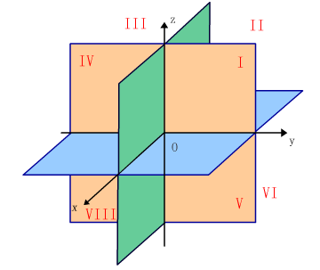

## 一、空间直角坐标系的建立 

- 坐标系的建立：过空间一个定点$O$，作三条互相垂直的数轴，它们都以$O$为原点且一般具有相同的长度单位，它们的正向通常符合右手规则．这样的三条坐标轴就组成了一个空间直角坐标系。

- 坐标面：三条坐标轴中的任意两条可以确定一个平面，这样定出的三个平面统称为坐标面，$x$轴及$y$轴所确定的坐标面叫做$x O y$面，另两个坐标面是$y O z$面和$z O x$面。

 

 

- 空间直角坐标系卦限：三个坐标面把空间分成八个部分，每一部分叫做卦限。

 
 

$$\begin{array}{l}
\begin{array}{|l|l|l|l|}
\hline  \quad 卦限编号 \quad  & \quad X坐标  \quad & \quad Y坐标 \quad & \quad Z 坐标 \quad  \\
\hline  \quad 第一卦限 & \quad + \quad  &\quad  + \quad  & \quad  +  \quad \\
\hline  \quad 第二卦限 & \quad - \quad  &\quad  + \quad  & \quad  +  \quad \\
\hline  \quad 第三卦限 & \quad - \quad  &\quad  - \quad  & \quad  +  \quad \\
\hline  \quad 第四卦限 & \quad + \quad  &\quad  - \quad  & \quad  +  \quad \\
\hline  \quad 第五卦限 & \quad + \quad  &\quad  + \quad  & \quad  -  \quad \\
\hline  \quad 第六卦限 & \quad - \quad  &\quad  + \quad  & \quad  -  \quad \\
\hline  \quad 第七卦限 & \quad - \quad  &\quad  - \quad  & \quad  -  \quad \\
\hline  \quad 第八卦限 & \quad + \quad  &\quad  - \quad  & \quad  -  \quad \\
\hline
\end{array}
\end{array}$$

- 点的坐标：设$M$为空间一已知点。过点$M$ 作三个平面分别垂直于$x$ 轴，$y$轴和$z$轴，三个平面在$x$轴，$y$轴和$z$轴的交点依次为$P, Q, ~R$，在$x$轴，$y$轴和  $z$轴上的坐标依次为$x, y,z$，我们称这组数为 点$M$的坐标，并把$x, y, z$分别称为点$M$的横坐标，纵坐标，坚坐标。坐标为$x,y,z$的点 $M$记为$M(x, y, z)$。

$$ 
\begin{array}{|l|l|l|l|}
\hline \quad 坐标面 \quad &\quad  固定坐标值  (= 0)  \quad & \quad 变化坐标范围 \quad  &  \quad 示例点 \\ 
\hline  \quad X Y  平面 &\qquad  z=0  &\quad  x  和  y  可正可负  & \quad (3,-2,0) \quad \\
\hline  \quad  X Z 平面 & \qquad y=0  &\quad  x  和  z  可正可负  & \quad (-4,0,5) \quad \\
\hline  \quad YZ 平面 &  \qquad x=0   &\quad  y  和  z  可正可负  & \quad (0,6,-3) \quad \\
\hline
\end{array}$$

$$ \begin{array}{|l|l|l|l|}
\hline \quad 坐标轴 \quad&  \quad 固定坐标值  ( = 0 )  \quad& \quad 变化坐标范围 \quad   & \quad 示例点 \\ 
\hline \quad X 轴   & \quad y=0, z=0 &\quad  x   可正可负    &  \quad   (5,0,0)  \quad \\
\hline \quad Y 轴   & \quad x=0, z=0 &\quad  y   可正可负   &   \quad  (0,-3,0)  \quad \\
\hline \quad Z 轴   & \quad x=0, y=0 &\quad  z   可正可负    &  \quad   (0,0,7)  \quad \\
\hline
\end{array}$$

## 二、空间中两点间的距离公式 

- 平面两点距离：若$A(x_{1}, y_{1}), B(x_{2}, y_{2})$则 ：
$$|A B|=\sqrt{(x_{2}-x_{1})^{2}+(y_{2}-y_{1})^{2}}$$

- 空间两点距离：若$P_{1}(x_{1}, y_{1}, z_{1}), P_{2}(x_{2}, y_{2}, z_{2})$，则 ：
$$|P_{1} P_{2}|=\sqrt{(x_{2}-x_{1})^{2}+(y_{2}-y_{1})^{2}+(z_{2}-z_{1})^{2}}  \Longrightarrow  |O P|=\sqrt{x^{2}+y^{2}+z^{2}}$$

- 点到坐标轴的距离：
 $$点P_{0} (x_{0}, y_{0}, z_{0}) 到 \begin{cases}
  &  x 轴的距离 \mathrm{d}=\sqrt{y_{0}^{2}+z_{0}^{2}} \\ \newline 
  &  y 轴的距离 \mathrm{d}=\sqrt{x_{0}^{2}+z_{0}^{2}}  \\ \newline 
  &  z 轴的距离  \mathrm{d}=\sqrt{x_{0}^{2}+y_{0}^{2}}  \\
\end{cases}$$

- 点到坐标平面的距离：
 $$ 点  P_{0}(x_{0}, y_{0}, z_{0})  到 \begin{cases}
  &  O x y  平面的距离 \mathrm{d}=|z_{0}| \\ \newline 
  &  O y z  平面的距离 \mathrm{d}=|x_{0}|  \\ \newline 
  &  O x z  平面的距离  \mathrm{d}=|y_{0}| \\
\end{cases}$$

- 点$(a, b, c)$的对称点坐标 ：
$$\begin{array}{|l|l|l|}
\hline  \qquad 对称类型 \quad&  \quad对称点坐标 \quad & \quad  取反的坐标 \quad \\
\hline  \quad  关于 XY 平面对称 & \quad   (a, b,-c)  & \quad   Z 轴 \\
\hline  \quad  关于 XZ 平面对称 & \quad  (a,-b, c)   & \quad  Y轴 \\
\hline  \quad  关于 YZ 平面对称 & \quad  (-a, b, c)  & \quad  X 轴  \\
\hline  \quad  关于 X  轴对称   & \quad  (a,-b,-c)   & \quad  Y, Z轴\\
\hline  \quad  关于 Y  轴对称   & \quad  (-a, b,-c)  & \quad X, Z 轴 \\
\hline  \quad  关于 Z  轴对称   & \quad  (-a,-b, c)  & \quad X,Y 轴\\
\hline  \quad  关于原点对称     & \quad  (-a,-b, -c) & \quad X, Y, Z 轴\\
\hline
\end{array} $$ 

  
$$证明：\begin{cases}
  & |P_{1} P_{2}|^{2}=|P_{1} B|^{2}+|B P_{2}|^{2}  \\ \newline 
  & |P_{1} B|^{2}=|P_{1} A|^{2}+|A B|^{2} \\  \newline 
  & |P_{1} P_{2}|^{2}=|P_{1} A|^{2}+|A B|^{2}+|B P_{2}|^{2}  \\ \newline
  & =|x_{2}-x_{1}|^{2}+|y_{2}-y_{1}|^{2}+|z_{2}-z_{1}|^{2}  \\ \newline
  & =(x_{2}-x_{1})^{2}+(y_{2}-y_{1})^{2}+(z_{2}-z_{1})^{2} \\ \newline
  & |P_{1} P_{2}|=\sqrt{(x_{2}-x_{1})^{2}+(y_{2}-y_{1})^{2}+(z_{2}-z_{1})^{2}}
\end{cases}$$

