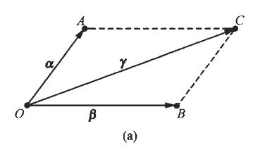
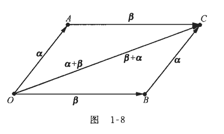
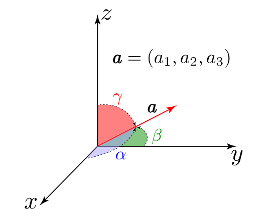
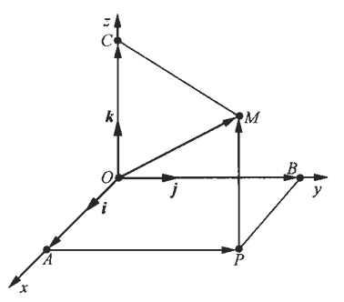

## 一、向量的概念

向量概念：既有大小又有方向的量称为向量，通常用粗黑希腊字母表示向量，如 $\overrightarrow{\boldsymbol{\alpha}}, \overrightarrow{\boldsymbol{\beta}},  \overrightarrow{\boldsymbol{\gamma}}$。

向量表示：设$\vec{\alpha }$在$x$轴，$y$轴，$z$ 轴上的投影分别为$a, b, c$，则$a, b, c$分别称为$\vec{ \alpha }$的三个坐标 ，记 $\vec{ \alpha }=  \{ a,b,c  \}$ 。
$$(a,b,c) \Longrightarrow  \begin{cases}
  & a=x_{2}-x_{1} \\
  & b=y_{2}-y_{1} \\
  & c=z_{2}-z_{1}
\end{cases}$$

基本单位向量：在空间直角坐标系中，与$x$轴，$y$轴，$z$轴三个坐标轴同方向的单位向量$\vec{i} \quad  \vec{j}  \quad \vec{k}$称为基本单位向量。

$$单位向量 \Longrightarrow  \begin{cases}
  & \vec{i}=\{1,0,0\} \\
  &  \vec{j}=\{0,1,0\} \\
  &  \vec{k}=\{0,0,1\}
\end{cases}$$

有向线段及坐标表示：在空间中，以$A(x_{1}, y_{1}, z_{1})$为起点，$B(x_{2}, y_{2}, z_{2})$为终点的线段称为有向线段，记为:
$$ \overrightarrow{A B}=\{x_{2}-x_{1}, y_{2}-y_{1}, z_{2}-z_{1}\}=(x_{2}-x_{1}) \vec{i}+(y_{2}-y_{1}) \vec{j}+(z_{2}-z_{1}) \vec{k}$$  

模长：向量的模长表示该向量在空间中的长度或大小。
$$|\vec{\alpha}|=\sqrt{a^{2}+b^{2}+c^{2}}|  \quad \Longrightarrow  \quad  | \overrightarrow{A B} \mid=\sqrt{(x_{2}-x_{1})^{2}+(y_{2}-y_{1})^{2}+(z_{2}-z_{1})^{2}}$$

零向量：若$|\overrightarrow{A B}|=0$，则称$\overrightarrow{A B}$为零向量，记作$\overrightarrow0=\{0,0,0\}$。

单位向量：若$|\overrightarrow{A B}|=1$，则称$\overrightarrow{A B}$为单位向量。

## 二、向量的加法

平行四边形法则：给定两个非零向量$\boldsymbol{\alpha}$与$\boldsymbol{\beta}$，将它们的起点平移到同一个点$O$，它们的终点分别设为$A$和$B$，则$\overrightarrow{O A}=\boldsymbol{\alpha}, \overrightarrow{O B}=\boldsymbol{\beta}$以$\overrightarrow{O A}, \overrightarrow{O B}$为邻边可构造一个平行四边形$O B C A$以  $O$为起点，$C$为终点的向量$\boldsymbol{\gamma}=\overrightarrow{O C}$称为向量$\alpha$与$\boldsymbol{\beta}$的和，记为：
$$\boldsymbol{\alpha}+\boldsymbol{\beta}=\boldsymbol{\gamma} \Longrightarrow  \overrightarrow{O A}+\overrightarrow{O B}=\overrightarrow{O C}$$

三角形法则：对给定的两个向量$\boldsymbol{\alpha}, \boldsymbol{\beta}$，如果将$\boldsymbol{\beta}$平移，使其起点平移到$\boldsymbol{\alpha}$的终点 ，此时  $\boldsymbol{\beta}$的终点与用平行四边形法则确定的点$C$重合，从而$\boldsymbol{\beta}=\overrightarrow{A C}$，$于是  \boldsymbol{\alpha}$与$\boldsymbol{\beta}$的和也为$\overrightarrow{O A}+\overrightarrow{A C}=\overrightarrow{O C}$这种确定两个向量的和的方法称为三角形法则：

向量减法：给定向量$\boldsymbol{\alpha}$与$\boldsymbol{\beta}$  ，如果存在  $\boldsymbol{\gamma}$  ，使得  $\boldsymbol{\alpha}=\boldsymbol{\beta}+\boldsymbol{\gamma}$  ，则称  $\boldsymbol{\gamma}$  是向量  $\alpha$  与  $\beta$  的差，记为  $\alpha-\beta=\gamma$  。如果设  $\overrightarrow{O A}=\boldsymbol{\alpha}, \overrightarrow{O B}=\boldsymbol{\beta}$  ，则由三角形法则可知  $\overrightarrow{O A}=\overrightarrow{O B}+\overrightarrow{B A}$于是  $\boldsymbol{\alpha}-\boldsymbol{\beta}=\overrightarrow{O A}-\overrightarrow{O B}=\overrightarrow{B A}$也就是说，将  $\boldsymbol{\alpha}$  与  $\boldsymbol{\beta}$  的起点放在一起，则  $\boldsymbol{\beta}$  的终点到  $\boldsymbol{\alpha}$  的终点的向量即为 $\boldsymbol{\alpha}-\boldsymbol{\beta}$

向量加法与减法的几何意义：$\boldsymbol{\alpha}+\boldsymbol{\beta}$与$\boldsymbol{\alpha}-\boldsymbol{\beta}$分别是以$\boldsymbol{\alpha}$和  $\boldsymbol{\beta}$为邻边的平行四边形的两条对角线向量 

交换律：
$$\boldsymbol{\alpha}+\boldsymbol{\beta}=\boldsymbol{\beta}+\boldsymbol{\alpha}$$

设$O B C A$为平行四边形，并设$\overrightarrow{O A}=\boldsymbol{\alpha}, \overrightarrow{O B}=\boldsymbol{\beta}$，则由向量相等的定义有$\overrightarrow{O A}=\overrightarrow{B C}=\boldsymbol{\alpha}, \quad \overrightarrow{O B}=\overrightarrow{A C}=\boldsymbol{\beta}$由三角形法则可得$\overrightarrow{O A}+\overrightarrow{A C}=\overrightarrow{O C}=\boldsymbol{\alpha}+\boldsymbol{\beta}, \quad \boldsymbol{\beta}+\boldsymbol{\alpha}=\overrightarrow{O B}+\overrightarrow{B C}=\overrightarrow{O C}$从而$\boldsymbol{\alpha}+\boldsymbol{\beta}=\boldsymbol{\beta}+\boldsymbol{\alpha}$，即交换律成立。

结合律： 
$$(\boldsymbol{\alpha}+\boldsymbol{\beta})+\boldsymbol{\gamma}=\boldsymbol{\alpha}+(\boldsymbol{\beta}+\boldsymbol{\gamma})$$

设$\overrightarrow{O A}=\boldsymbol{\alpha}, \overrightarrow{A B}=\boldsymbol{\beta}, \overrightarrow{B C}=\boldsymbol{\gamma}$，则由三角形法则可得
$(\boldsymbol{\alpha}+\boldsymbol{\beta})+\boldsymbol{\gamma}  =(\overrightarrow{O A}+\overrightarrow{A B})+\overrightarrow{B C} =\overrightarrow{O B}+\overrightarrow{B C}  =\overrightarrow{O C}$， $\boldsymbol{\alpha}+(\boldsymbol{\beta}+\boldsymbol{\gamma})  =\overrightarrow{O A}+(\overrightarrow{A B}+\overrightarrow{B C})=\overrightarrow{O A}+\overrightarrow{A C}=\overrightarrow{O C}$ 从而结合律成立。

## 三、向量与数的乘法

给定数量$\lambda$及向量$\boldsymbol{\alpha}$，规定$\lambda$与$\boldsymbol{\alpha}$的乘积$\lambda \boldsymbol{\alpha}$是一个向量，它的大小规定为$|\lambda \boldsymbol{\alpha}|=   |\lambda||\boldsymbol{\alpha}|$，它的方向规定为：当$\lambda>0$时，$\lambda \boldsymbol{\alpha}$的方向与$\boldsymbol{\alpha}$的方向相同；当$\lambda<0$时，$\lambda \boldsymbol{\alpha}$的方向与$\boldsymbol{\alpha}$ 的方向相反$\lambda$与$\boldsymbol{\alpha}$的乘积运算称为向量的数量乘法，简称为数乘。

向量平行：设向量$\boldsymbol{\alpha} \neq \mathbf{0}$，则向量$\boldsymbol{\beta}$平行于$\boldsymbol{\alpha}$的充要条件是，存在数量$\lambda$，使得$\boldsymbol{\beta}=\lambda \boldsymbol{\alpha}$。 

由于$1 \boldsymbol{\alpha}=\boldsymbol{\alpha}$，亦记$(-1) \boldsymbol{\alpha}=-\boldsymbol{\alpha}$，它表示与$\boldsymbol{\alpha}$大小相同，方向相反的向量，从而：
$$\boldsymbol{\alpha}-\boldsymbol{\beta}=\boldsymbol{\alpha}+(-\boldsymbol{\beta})$$ 

数乘运算规律：
$$\begin{cases}
  & 结合律： \lambda(\mu \boldsymbol{\alpha})=\mu(\lambda \boldsymbol{\alpha})=(\lambda \mu) \boldsymbol{\alpha}  \\ \newline
  & 分配律： (\lambda+\mu) \boldsymbol{\alpha}=\lambda \boldsymbol{\alpha}+\mu \boldsymbol{\alpha} \\ \newline
  & 分配律： \lambda(\boldsymbol{\alpha}+\boldsymbol{\beta})=\lambda \boldsymbol{\alpha}+\lambda \boldsymbol{\beta}
\end{cases}$$

单位向量：如果向量$\boldsymbol{\alpha}$的模为$1$，即$|\boldsymbol{\alpha}|=1$，则称$\boldsymbol{\alpha}$为单位向量 ，它表示与$\boldsymbol{\alpha}$同方向的单位向量。如果 $\boldsymbol{\alpha} \neq \mathbf{0}$，记 $\boldsymbol{\alpha}^{0}=\frac{1}{|\boldsymbol{\alpha}|} \boldsymbol{\alpha}$，称之为 $\boldsymbol{\alpha}$的单位化向量。由数量乘法的定义可知  $\boldsymbol{\alpha}^{0}$与$\boldsymbol{\alpha}$同向，$\boldsymbol{\alpha}^{0}$的长度为$\left|\boldsymbol{\alpha}^{0}\right|=\frac{1}{|\boldsymbol{\alpha}|}|\boldsymbol{\alpha}|=1$，并有$\boldsymbol{\alpha}=|\boldsymbol{\alpha}| \boldsymbol{\alpha}^{0}$

  单位向量方向余弦：其中$\cos \alpha, \cos \beta, \cos \gamma$是 $\boldsymbol{\alpha}$的方向余弦 
$$
\boldsymbol{\alpha}^{0}= ( \frac{a_{1}}{\sqrt{a_{1}^{2}+a_{2}^{2}+a_{3}^{2}}}, \frac{a_{2}}{\sqrt{a_{1}^{2}+a_{2}^{2}+a_{3}^{2}}}, \frac{a_{3}}{\sqrt{a_{1}^{2}+a_{2}^{2}+a_{3}^{2}}})=\{\cos \alpha, \cos \beta, \cos \gamma\} 
$$

## 四、向量的投影

向量投影：设 $\vec{\alpha}$在 $\vec{\beta}$上的投影记为$\operatorname{Pr}_{j_{\bar{\beta}}} \vec{\alpha}=|\vec{\alpha}| \cos \varphi =\dfrac{\vec{\alpha} \cdot \vec{\beta}}{|\vec{\beta}|}$，其中$\varphi$为$\vec{\alpha}$与$\vec{\beta}$的夹角。

若非零向量 $\boldsymbol{\alpha}$与$\boldsymbol{\beta}$的夹角$(\widehat{\boldsymbol{\alpha}, \boldsymbol{\beta}})=\frac{\pi}{2}$，则称$\boldsymbol{\alpha}$与$\boldsymbol{\beta}$垂直。规定零向量与任何向量垂直。

给定向量$\boldsymbol{\alpha}=\overrightarrow{A B}$及数轴$u$，过点$A, B$向数轴$u$作垂线，设垂足分别为$A^{\prime}, B^{\prime}$，这两个点在数轴$u$上的坐标分别为$u_{A}, u_{B}$。分别称$A^{\prime}, B^{\prime}$为点$A, B$在数轴$u$上的投影点；称向量$\overrightarrow{A^{\prime} B^{\prime}}$为 $\overrightarrow{A B}$在数轴$u$上的投影向量；记  $\operatorname{Prj}_{u} \overrightarrow{A B}=u_{B}-u_{A}$  ，称之为向量  $\overrightarrow{A B}$  在数轴  $u$  上的投影。

相似方向的投影：

相反方向的投影：
 

投影公式的推导：

$$ \begin{cases}
  & \cos \theta=\dfrac{\left|\operatorname{Proj}_{\vec{v}} \vec{u}\right|}{|\vec{u}|}   \Longrightarrow   \left|\operatorname{Proj}_{\vec{v}} \vec{u}\right|=|\vec{u}| \cos \theta    \\ \newline
  & \left|\operatorname{Proj}_{\vec{v}} \vec{u}\right|=|\vec{u}| \dfrac{\vec{u} \cdot \vec{v}}{|\vec{u} \| \vec{v}|} =\dfrac{\vec{u} \cdot \vec{v}}{|\vec{v}|} \Longrightarrow  \operatorname{Proj}_{\vec{v}} \vec{u}=\dfrac{\vec{u} \cdot \vec{v}}{|\vec{v}|^{2}} \vec{v} \\  
\end{cases}$$

投影的线性性质：
$$ \begin{cases}
  & \operatorname{Prj}_{u}(\boldsymbol{\alpha}+\boldsymbol{\beta})=\operatorname{Prj}_{u} \boldsymbol{\alpha}+\operatorname{Prj}_{u} \boldsymbol{\beta}   \\ \newline
  & \operatorname{Prj}_{u}(\boldsymbol{\alpha}-\boldsymbol{\beta})=\operatorname{Prj}_{u} \boldsymbol{\alpha}-\operatorname{Prj}_{u} \boldsymbol{\beta} \\ \newline
  &   \operatorname{Prj}_{\mu}(\lambda \boldsymbol{\alpha})=\lambda \operatorname{Prj}_{u} \boldsymbol{\alpha}   \quad (\lambda 是数量) \\ 
\end{cases}$$

 证明：将$\boldsymbol{\alpha}$的终点与$\boldsymbol{\beta}$的起点相接，并设$\boldsymbol{\alpha}=\overrightarrow{A B}$，$\boldsymbol{\beta}=\overrightarrow{B C}$，则由三角形法则知$\boldsymbol{\alpha}+\boldsymbol{\beta}=\overrightarrow{A C}$ ，设点$A, B, C$在$u$轴上的投影点分别为$A^{\prime}$，$B^{\prime}$, $C^{\prime}$，坐标分别为$u_{A}, u_{B}, u_{C}$，则：
 $$\operatorname{Prj}_{u}(\boldsymbol{\alpha}+\boldsymbol{\beta})=u_{C}-u_{A}=\left(u_{B}-u_{A}\right)+\left(u_{C}-u_{B}\right)=\operatorname{Prj}_{u} \boldsymbol{\alpha}+\operatorname{Prj}_{u} \boldsymbol{\beta}$$

## 五、向量的坐标

在空间直角坐标系中，与$x$轴，$y$轴，$z$轴三条坐标轴同方向的单位向量分别记为$i, j, k$，称为基本单位向量，给定空间中的点$M(a, b, c)$，向量$\overrightarrow{O M}$称为向径，显然，$\overrightarrow{O M}$在三条坐标轴上的投影分别为：
$$\operatorname{Prj}_{x} \overrightarrow{O M}=a, \quad \operatorname{Prj}_{y} \overrightarrow{O M}=b, \quad \operatorname{Prj}_{z} \overrightarrow{O M}=c$$
设点$M$在$x$轴，$y$ 轴，$z$轴上的投影点分别为  $A, B, C$  ，则向径  $\overrightarrow{O M}$  在  $x$  轴， $y$  轴， $z$  轴上的投影向量分别为：
$$\overrightarrow{O A}=a \boldsymbol{i}, \quad \overrightarrow{O B}=b \boldsymbol{j}, \quad \overrightarrow{O C}=c \boldsymbol{k}$$
称之为$\overrightarrow{O M}$在三条坐标轴上的分向量，设点$P$是$M$在$O x y$平面上的投影点，则$\overrightarrow{O B}=\overrightarrow{A P}, \overrightarrow{O C}=\overrightarrow{P M}$，由向量的加法法则有$\overrightarrow{O M}=\overrightarrow{O A}+\overrightarrow{A P}+\overrightarrow{P M}$，从而  $\overrightarrow{O M}=\overrightarrow{O A}+\overrightarrow{O B}+\overrightarrow{O C}$，称其为向量$\overrightarrow{O M}$ 的分解式，即：
$$\overrightarrow{O M}=a \boldsymbol{i}+b \boldsymbol{j}+c \boldsymbol{k}$$

空间中的两点$M_{1}\left(x_{1}, y_{1}, z_{1}\right), M_{2}\left(x_{2}, y_{2}, z_{2}\right)$，其向量$\overrightarrow{M_{1} M_{2}}$在 $x$轴，$y$  轴，$z$轴上的投影分别为$x_{2}-x_{1}, y_{2}-y_{1}, z_{2}-z_{1}$可将 $\overrightarrow{M_{1} M_{2}}$平移为向径$\overrightarrow{O M}$，于是  $\overrightarrow{O M}=a \boldsymbol{i}+b \boldsymbol{j}+c \boldsymbol{k}$，其中$a，  b, c$分别为 $\overrightarrow{O M}$在$x$轴，$y$  轴，$z$轴上的投影，由于向量的投影具有平移不变性，从而$a=x_{2} －  x_{1}, b=y_{2}-y_{1}, c=z_{2}-z_{1}$，因此由$\overrightarrow{M_{1} M_{2}}=\overrightarrow{O M}$可知：
$$\overrightarrow{M_{1} M_{2}}=a \boldsymbol{i}+b \boldsymbol{j}+c \boldsymbol{k}=\left(x_{2}-x_{1}\right) \boldsymbol{i}+\left(y_{2}-y_{1}\right) \boldsymbol{j}+\left(z_{2}-z_{1}\right) \boldsymbol{k}$$
如果$\boldsymbol{\alpha}=a \boldsymbol{i}+b \boldsymbol{j}+c \boldsymbol{k}$，则$a, b, c$分别称为 $\boldsymbol{\alpha}$的三个坐标，由坐标的唯一性，此时可将$\boldsymbol{\alpha}$简记为$\{a, b, c\}$，其意义为：
$$\{a, b, c\}=a \boldsymbol{i}+b \boldsymbol{j}+c \boldsymbol{k}$$

向量线性运算的坐标表示：设向量$\boldsymbol{\alpha}=\left\{a_{1}, a_{2}, a_{3}\right\}, \boldsymbol{\beta}=\left\{b_{1}, b_{2}, b_{3}\right\}, \lambda$为数量，则：
$$ \begin{cases}
  &   \boldsymbol{\alpha}+\boldsymbol{\beta}=\left\{a_{1}+b_{1}, a_{2}+b_{2}, a_{3}+b_{3}\right\}, \boldsymbol{\alpha}-\boldsymbol{\beta}=\left\{a_{1}-b_{1}, a_{2}-b_{2}, a_{3}-b_{3}\right\}  \\ \newline
  &  \lambda \boldsymbol{\alpha}=\left\{\lambda a_{1}, \lambda a_{2}, \lambda a_{3}\right\}   \quad   -\boldsymbol{\alpha}=\left\{-a_{1},-a_{2},-a_{3}\right\} \\  
\end{cases}$$

方向余弦：方向余弦是指一个向量与坐标轴正方向所成角度的余弦值。设$\vec{v}=\{a, b, c\} \neq \overrightarrow{0}$，$v$与$x,y,z$轴正向的夹角$\alpha, \beta, \gamma$称为$v$的方向角，$\cos \alpha, \cos \beta, \cos \gamma$称为$\vec{v}$方向余弦。
$$ \begin{cases}
  &  \cos \alpha=\dfrac{a}{|v|} =\dfrac{a}{\sqrt{a^{2}+b^{2}+c^{2}}}  \\ \newline
  &  \cos \beta=\dfrac{b}{|v|}=\dfrac{b}{\sqrt{a^{2}+b^{2}+c^{2}}} \\ \newline
  & \cos \gamma=\dfrac{c}{|v|} =\dfrac{c}{\sqrt{a^{2}+b^{2}+c^{2}}} 
\end{cases}$$

  

给定非零向量  $v=\left\{a_{1}, a_{2}, a_{3}\right\}$，求它与$x$轴，$y$轴，$z$轴的夹角$\alpha, \beta, \gamma$的余弦，由投影定理有：
$$\operatorname{Prj}_{x} \boldsymbol{v}=|\boldsymbol{v}| \cos \alpha, \operatorname{Prj}_{y} \boldsymbol{v}=|\boldsymbol{v}| \cos \beta, \operatorname{Prj}_{z} \boldsymbol{v}=|\boldsymbol{v}| \cos \gamma$$
再根据向量坐标的意义得：
$$\operatorname{Prj}_{x} \boldsymbol{v}=a_{1}, \operatorname{Prj}_{\boldsymbol{y}} \boldsymbol{v}=a_{2}, \operatorname{Prj}_{z} \boldsymbol{v}=a_{3} \Longrightarrow  \cos \alpha=\frac{a_{1}}{|\boldsymbol{v}|}, \cos \beta=\frac{a_{2}}{|\boldsymbol{v}|}, \cos \gamma=\frac{a_{3}}{|\boldsymbol{v}|}$$

非零向量 $v$ 与  $x$  轴， $y$  轴， $z$  轴的夹角  $\alpha, \beta, \gamma$  称为  $v$ 的方向角；  $\cos \alpha, \cos \beta, \cos \gamma$  称为  $v$  的方向余弦：

$$ \begin{cases}
  & \cos \alpha=\dfrac{a_{1}}{\sqrt{a_{1}^{2}+a_{2}^{2}+a_{3}^{2}}}    \\ \newline
  & \cos \beta=\dfrac{a_{2}}{\sqrt{a_{1}^{2}+a_{2}^{2}+a_{3}^{2}}}  \\ \newline
  &  \cos \gamma=\dfrac{a_{3}}{\sqrt{a_{1}^{2}+a_{2}^{2}+a_{3}^{2}}} \\
\end{cases}  \Longrightarrow   \cos ^{2} \alpha+\cos ^{2} \beta+\cos ^{2} \gamma=1$$

将非零向量  $\boldsymbol{v}$  单位化，得到：$\boldsymbol{v}^{0}=\{\cos \alpha, \cos \beta, \cos \gamma\}$，$\boldsymbol{v}^{0}$的三个坐标就是$\boldsymbol{v}$的方向余弦。
$$\boldsymbol{v}^{0} =\frac{1}{|\boldsymbol{v}|} \boldsymbol{v}=\frac{1}{\sqrt{a_{1}^{2}+a_{2}^{2}+a_{3}^{2}}}\left\{a_{1}, a_{2}, a_{3}\right\}
=\left\{\frac{a_{1}}{\sqrt{a_{1}^{2}+a_{2}^{2}+a_{3}^{2}}}, \frac{a_{2}}{\sqrt{a_{1}^{2}+a_{2}^{2}+a_{3}^{2}}}, \frac{a_{3}}{\sqrt{a_{1}^{2}+a_{2}^{2}+a_{3}^{2}}}\right\}$$

已知一个向量的单位向量$\hat{u}=\left(u_{x}, u_{y}, u_{z}\right)$，那么这个向量与坐标轴的夹角余弦值等于对应的坐标分量值。两个向量$\vec{a}$和$\vec{b}$的点积可以表示为：$\vec{a} \cdot \vec{b}=|\vec{a}||\vec{b}| \cos \theta$其中$\theta$是两个向量之间的夹角，单位向量的长度为 $1$ ，即  $|\hat{u}|=1$ 。
$$ \begin{cases}
  & x 轴的单位向量  \hat{i}=(1,0,0)  \\ \newline
  & y 轴的单位向量  \hat{j}=(0,1,0)   \\ \newline
  & Z 轴的单位向量  \hat{k}=(0,0,1)  \\  
\end{cases} \Longrightarrow
 \begin{cases}
  & \cos \alpha=\dfrac{\hat{u} \cdot \hat{i}}{|\hat{u}||\hat{i}|}=\frac{\hat{u} \cdot \hat{i}}{1 \cdot 1}=\hat{u} \cdot \hat{i}=u_{x}    \\ \newline
  &  \cos \beta=\dfrac{\hat{u} \cdot \hat{j}}{|\hat{u}| |\hat{j} \mid}=\hat{u} \cdot \hat{j}=u_{y}    \\ \newline
  &  \cos \gamma=\dfrac{\hat{u} \cdot \hat{k}}{|\hat{u}| |\hat{k} \mid}=\hat{u} \cdot \hat{k}=u_{z}   \\  
\end{cases}
  $$

**向量投影和方向余弦关系**

方向余弦的定义：对于向量$\mathbf{v}=\left(v_{x}, v_{y}, v_{z}\right)$，其方向余弦为$\cos \alpha, \cos \beta, \cos \gamma$，其中$\alpha, \beta, \gamma$  分别是向量  $\mathbf{v}$  与  $x$  轴， $y$  轴， $z$  轴的夹角。方向余弦的计算公式为：
$$\cos \alpha=\frac{v_{x}}{|\mathbf{v}|}, \quad \cos \beta=\frac{v_{y}}{|\mathbf{v}|}, \quad \cos \gamma=\frac{v_{z}}{|\mathbf{v}|}$$

向量投影的定义：向量$\mathbf{v}$ 在某一坐标轴上的投影是该向量在该坐标轴方向上的分量。例如，在 $x$ 轴上的投影为 $v_{x}$，在$y$轴上的投影为$v_{y}$，在$z$ 轴上的投影为$v_{z}$ 。任意方向投影：
$$\operatorname{Proj}_{\mathbf{u}} \mathbf{v}=\|\mathbf{v}\|\left(\cos \alpha \cos \alpha^{\prime}+\cos \beta \cos \beta^{\prime}+\cos \gamma \cos \gamma^{\prime}\right)$$

- 方向余弦与投影的关系：

  向量在坐标轴上的投影分量可以表示为方向余弦乘以向量的模长：
  $$v_{x}=|\mathbf{v}| \cos \alpha, \quad v_{y}=|\mathbf{v}| \cos \beta, \quad v_{z}=|\mathbf{v}| \cos \gamma$$

  方向余弦也可以表示为投影分量除以向量的模长：
   $$\cos \alpha=\frac{v_{x}}{|\mathbf{v}|}, \quad \cos \beta=\frac{v_{y}}{|\mathbf{v}|}, \quad \cos \gamma=\frac{v_{z}}{|\mathbf{v}|}$$
  如果我们把单位向量$\mathbf{u}$  投影到  $X,   Y,   Z$轴上，其投影值就是该方向的方向余弦：
   $$\begin{cases}
    & \operatorname{proj}_{x} \mathbf{u}=\cos \alpha=u_{x} \\ \newline
    & \operatorname{proj}_{y} \mathbf{u}=\cos \beta=u_{y} \\ \newline
    & \operatorname{proj}_{z} \mathbf{u}=\cos \gamma=u_{z}
   \end{cases} $$

  如果已知方向向量$\mathbf{v}$的方向余弦为$\left(\cos \alpha^{\prime}, \cos \beta^{\prime}, \cos \gamma^{\prime}\right)$，则：
  $$\cos \theta=\cos \alpha \cos \alpha^{\prime}+\cos \beta \cos \beta^{\prime}+\cos \gamma \cos \gamma^{\prime}$$

- 三角函数表：

## 六、向量的参数方程

向量的参数方程：
$$\begin{cases}
  & \vec{r}=(x, y, z) \\ \newline
  & \overrightarrow{r_{1}}=\left(x_{1}, y_{1}, z_{1}\right)  \\ \newline
  & \overrightarrow{r_{2}}=\left(x_{2}, y_{2}, z_{2}\right)
\end{cases} \Longrightarrow  \vec{r}=\overrightarrow{r_{1}}+t\left(\overrightarrow{r_{2}}-\overrightarrow{r_{1}}\right)$$

展开向量表达式为坐标形式：
$$\begin{cases}
  & x = x_1 + t(x_2 - x_1) \\ \newline
  & y = y_1 + t(y_2 - y_1)  \\ \newline
  & z = z_1 + t(z_2 - z_1)
\end{cases}   \Longrightarrow

\begin{cases}
  & x=x_{1}+t\left(x_{2}-x_{1}\right) \\ \newline
  &y=y_{1}+t\left(y_{2}-y_{1}\right)  \\ \newline
  & z=z_{1}+t\left(z_{2}-z_{1}\right)
\end{cases}  \Longrightarrow  \frac{x-x_{1}}{x_{2}-x_{1}}=\frac{y-y_{1}}{y_{2}-y_{1}}=\frac{z-z_{1}}{z_{2}-z_{1}}
$$

