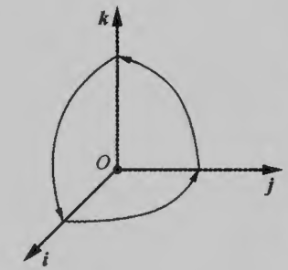

## 一、向量的数量积

- 给定两个向量$\vec{\alpha}$  和  $\vec{\beta}$  ，定义它们的数量积为：其中$\theta$ 是$\vec{\alpha}$与$\vec{\beta}$的夹角。
$$\vec{\alpha} \cdot \vec{\beta}=|\vec{\alpha}| \cdot|\vec{\beta}| \cos \theta $$

- 坐标表示 设$\vec{\alpha}= (a_{1}, a_{2}, a_{3})$，$\vec{\beta}= (b_{1}, b_{2}, b_{3})$
$$ \begin{cases} 
  & \vec{\alpha} \cdot \vec{\beta}=a_{1} b_{1}+a_{2} b_{2}+a_{3} b_{3}   \\ \newline
  & \cos \theta=\dfrac{\vec{\alpha} \cdot \vec{\beta}}{|\vec{\alpha}| \cdot|\vec{\beta}|}=\dfrac{a_{1} b_{1}+a_{2} b_{2}+a_{3} b_{3}}{\sqrt{a_{1}^{2}+a_{2}^{2}+a_{3}^{2}} \cdot \sqrt{b_{1}^{2}+b_{2}^{2}+b_{3}^{2}}}
\end{cases}$$

- 数量积与投影的关系：
$$\vec{\alpha} \cdot \vec{\beta}=|\vec{\alpha}| \operatorname{Pr} \mathrm{j}_{\alpha} \vec{\beta}=|\vec{\beta}| \operatorname{Pr} \mathrm{j}_{\vec{\beta}} \vec{\alpha}$$

- 数量积的运算规律：
  $$\begin{cases}
  & 交换律：  \vec{\alpha} \cdot \vec{\beta}=\vec{\beta} \cdot \vec{\alpha}  \\ \newline
  & 结合律： \lambda(\vec{\alpha} \cdot \vec{\beta})=(\lambda \vec{\alpha}) \cdot \vec{\beta}=\vec{\alpha} \cdot(\lambda \vec{\beta})  \\ \newline
  & 分配律： (\vec{\alpha}+\vec{\beta}) \cdot \vec{\gamma}=\vec{\alpha} \cdot \vec{\gamma}+\vec{\beta} \cdot \vec{\gamma} \\ \newline
  &  不满足消去律  \vec{\alpha} \cdot \vec{\beta}=\vec{\alpha} \cdot \vec{\gamma} \not\Longrightarrow  \vec{\beta}=\vec{\gamma}  \\  
  \end{cases}$$
   分配律推导：
  $$ ({\alpha}+\boldsymbol{\beta}) \cdot \boldsymbol{\gamma} =|\boldsymbol{\gamma}| \operatorname{Prj}_{\boldsymbol{\gamma}}(\boldsymbol{\alpha}+\boldsymbol{\beta})=|\boldsymbol{\gamma}| \operatorname{Prj}_{\gamma} \boldsymbol{\alpha}+|\boldsymbol{\gamma}| \operatorname{Prj}_{\gamma} \boldsymbol{\beta}=\boldsymbol{\alpha} \cdot \boldsymbol{\gamma}+\boldsymbol{\beta} \cdot \boldsymbol{\gamma}$$

- 向量垂直与数量积的关系： 若$\cos \theta=0$  即  $\theta=\frac{\pi}{2}$  ，则称  $\vec{\alpha}$  与  $\vec{\beta}$  垂直，记作  $\vec{\alpha} \perp \vec{\beta}$。
$$\vec{\alpha} \perp \vec{\beta} \Leftrightarrow \cos \theta=0 \Leftrightarrow \vec{\alpha} \cdot \vec{\beta}=0 \Leftrightarrow a_{1} b_{1}+a_{2} b_{2}+a_{3} b_{3}=0$$ 

- 数量积的坐标表示：设向量 $\vec{\alpha}=\left\{a_{1}, a_{2}, a_{3}\right\}, \vec{\beta}=\left\{b_{1}, b_{2}, b_{3}\right\}$，则：
$$\vec{\alpha}=a_{1} \vec{i}+a_{2} \vec{j}+a_{3} \vec{k}, \quad \vec{\beta}=b_{1} \vec{i}+b_{2} \vec{j}+b_{3} \vec{k}$$

$$\begin{cases}
  &\vec{\alpha} \cdot \vec{\beta}=  (a_{1} \vec{i}+a_{2} \vec{j}+a_{3} \vec{k} )  \cdot (b_{1} \vec{i}+b_{2} \vec{j}+b_{3} \vec{k} ) \\ \newline
  & =(a_{1} \vec{i}+a_{2} \vec{j}+a_{3} \vec{k}) \cdot  b_{1} \vec{i}  + (a_{1} \vec{i}+a_{2} \vec{j}+a_{3} \vec{k}) \cdot b_{2} \vec{j}  +(a_{1} \vec{i}+a_{2} \vec{j}+a_{3} \vec{k}) \cdot b_{3} \vec{k}  \\ \newline 
  & p_1= (a_{1} b_{1}) \vec{i} \cdot \vec{i}+ (a_{2} b_{1} ) \vec{j} \cdot \vec{i}+ (a_{3} b_{1}) \vec{k} \cdot \vec{i} \\ \newline
  & p_2= (a_{1} b_{2}) \vec{i} \cdot \vec{j}+(a_{2} b_{2}) \vec{j} \cdot \vec{j}+(a_{3} b_{2}) \vec{k} \cdot \vec{j} \\ \newline 
  & p_3=  (a_{1} b_{3}) \vec{i} \cdot \vec{k}+(a_{2} b_{3}) \vec{j} \cdot \vec{k}+(a_{3} b_{3}) \vec{k} \cdot \vec{k}   \\ \newline
  & \vec{\alpha} \cdot \vec{\beta}= p_1+p_2+p_3=  a_{1} b_{1}+a_{2} b_{2}+a_{3} b_{3}  \\  
\end{cases}$$

- 数量积公式推导：

$$ \begin{cases}
  &  \mathbf{u} \cdot \mathbf{v}=u_{1} v_{1}+u_{2} v_{2}+u_{3} v_{3} \Longrightarrow   |\mathbf{u}|=\sqrt{u_{1}^{2}+u_{2}^{2}+u_{3}^{2}}  \quad|\mathbf{v}|=\sqrt{v_{1}^{2}+v_{2}^{2}+v_{3}^{2}}\\ \newline
  & u_{1}=|\mathbf{u}| \cos \alpha ,  u_{2}=|\mathbf{u}| \cos \beta ,  u_{3}=|\mathbf{u}| \cos \gamma  \quad    v_{1}=|\mathbf{v}| \cos \alpha^{\prime} ,  v_{2}=|\mathbf{v}| \cos \beta^{\prime} , v_{3}=|\mathbf{v}| \cos \gamma^{\prime} \\ \newline
 & \mathbf{u} \cdot \mathbf{v}=(|\mathbf{u}| \cos \alpha)\left(|\mathbf{v}| \cos \alpha^{\prime}\right)+(|\mathbf{u}| \cos \beta)\left(|\mathbf{v}| \cos \beta^{\prime}\right)+(|\mathbf{u}| \cos \gamma)\left(|\mathbf{v}| \cos \gamma^{\prime}\right) \\ \newline
  & \mathbf{u} \cdot \mathbf{v}=|\mathbf{u}||\mathbf{v}|\left(\cos \alpha \cos \alpha^{\prime}+\cos \beta \cos \beta^{\prime}+\cos \gamma \cos \gamma^{\prime}\right) \\ \newline
  & \mathbf{u} \cdot \mathbf{v}=|\mathbf{u}||\mathbf{v}| \cos \theta     \Longrightarrow    \cos \theta=\cos \alpha \cos \alpha^{\prime}+\cos \beta \cos \beta^{\prime}+\cos \gamma \cos \gamma^{\prime}  \\
\end{cases} $$

## 二、向量的向量积

给定两个向量$\vec{\alpha}$和$\vec{\beta}$，它们的向量积规定为一个向量$\vec{\gamma}$，它由下述方式确定：$\vec{\gamma}$  的长度为  $|\vec{\gamma}|=|\vec{\alpha}||\vec{\beta}| \sin \varphi$  ，其中  $\varphi$  是  $\vec{\alpha}$  与  $\vec{\beta}$  的夹角；$\vec{\gamma}$的方向垂直于$\alpha$与$\vec{\beta}$所确定的平面（即$\vec{\gamma}$  既垂直于$\alpha$，又垂直于$\vec{\beta}）$，$\vec{\gamma}$的指向按照右手法则由$\vec{\alpha}$ 转到  $\vec{\beta}$，按照上述方法确定的向量积$\vec{\gamma}$记为$\vec{\alpha} \times \vec{\beta}$，因此向量积也称为叉积。

向量积的模的几何意义：设非零向量$\vec{\alpha}=\overrightarrow{O A}, \vec{\beta}=\overrightarrow{O B}$，则模$|\vec{\alpha} \times \vec{\beta}|$表示了以$\vec{\alpha} 和  \vec{\beta}$为边的平行四边形$O B C A$的面积。

证：底边  $O B$  上的高为  $h=|\vec{\alpha}| \sin \varphi$  ，所以平行四边形  $O B C A$  的面积为：
$$S_{O B C A}=h|\vec{\beta}|=|\vec{\alpha}||\vec{\beta}| \sin \varphi=|\vec{\alpha} \times \vec{\beta}|$$

向量积的运算规律： 
$$ \begin{cases}
 & 反交换律：  \vec{\alpha} \times \vec{\beta}=-(\vec{\beta} \times \vec{\alpha})\\ \newline
 & 结合律： \lambda(\alpha \times \beta)=(\lambda \vec{\alpha}) \times \vec{\beta}=\vec{\alpha} \times(\lambda \vec{\beta}) \quad \lambda是数量 \\   \newline
 & 分配律：  \vec{\gamma} \times(\alpha+\beta)=\vec{\gamma} \times \alpha+\vec{\gamma} \times \beta,(\alpha+\beta) \times \gamma=\alpha \times \gamma+\beta \times \gamma \\ 
\end{cases} $$

$$反交换律证明：\begin{cases}
 &|\vec{\alpha} \times \vec{\beta}|=|\vec{\alpha}||\vec{\beta}| \sin \varphi   \\ \newline
 & |-(\vec{\beta} \times \vec{\alpha})|=|\vec{\beta} \times \vec{\alpha}|=|\vec{\beta}||\vec{\alpha}| \sin \varphi  \\ \newline
 & |\vec{\alpha} \times \vec{\beta}|  = |-(\vec{\beta} \times \vec{\alpha})|   \\ \newline
 &\vec{\alpha} \times \vec{\beta}  与  \vec{\beta} \times \vec{\alpha}  方向相反  \\ \newline
 & 从而  \vec{\alpha} \times \vec{\beta}  与  -(\vec{\beta} \times \vec{\alpha})  的方向相同\\ \newline
 & 可知  \vec{\alpha} \times \vec{\beta}=-(\vec{\beta} \times \vec{\alpha})  \\  
\end{cases} $$

向量积与向量的平行的关系：两个向量$\alpha$与$\beta$平行的充要条件是：$\vec{\alpha} \times \vec{\beta}=\mathbf{0}$

对于基本单位向量$i, j, k$，讨论它们的向量积：
$$\begin{cases}
 & i \times i=0  \qquad  j \times j=0 \qquad k \times k=0   \\ \newline
 &  i \times j=k \qquad j \times k=i \qquad k \times i=j  \\ \newline
 &  k \times j=-i  \qquad j \times i=-k  \qquad i \times k=-j  \\ 
\end{cases} $$

向量积的坐标表示：
对于给定的向量$\vec{\alpha}=\left\{a_{1}, a_{2}, a_{3}\right\}, \vec{\beta}=\left\{b_{1}, b_{2}, b_{3}\right\}$，我们来讨论向量积的坐标表示．此时  $\vec{\alpha}=a_{1} \vec{i}+a_{2} \vec{j}+a_{3} \vec{k}, \vec{\beta}=b_{1} \vec{i}+b_{2} \vec{j}+b_{3} \vec{k}$，根据向量积的运算规律可得：

$$\begin{cases}
 & \vec{\alpha} \times \vec{\beta}=  (a_{1} \vec{i}+a_{2} \vec{j}+a_{3} \vec{k}) \times(b_{1} \vec{i}+b_{2} \vec{j}+b_{3} \vec{k})  \\ \newline
 &=(a_{1} \vec{i}+a_{2} \vec{j}+a_{3} \vec{k}) \times(b_{1} \vec{i})+(a_{1} \vec{i}+a_{2} \vec{j}+a_{3} \vec{k}) \times(b_{2} \vec{j}) +(a_{1} \vec{i}+a_{2} \vec{j}+a_{3} \vec{k}) \times(b_{3} \vec{k})  \\ \newline
 & p_1=  (a_{1} b_{1}) \vec{i} \times \vec{i}+(a_{2} b_{1}) \vec{j} \times \vec{i}+(a_{3} b_{1}) \vec{k} \times \vec{i}  \\ \newline
 & p_2=(a_{1} b_{2}) \vec{i} \times \vec{j}+(a_{2} b_{2}) \vec{j} \times \vec{j}+(a_{3} b_{2}) \vec{k} \times \vec{j} \\ \newline
 & p_3=(a_{1} b_{3}) \vec{i} \times \vec{k}+(a_{2} b_{3}) \vec{j} \times \vec{k}+(a_{3} b_{3}) \vec{k} \times \vec{k}  \\ \newline
 & \vec{\alpha} \times \vec{\beta}= p_1+ p_2+ p_3   \\ \newline
 & = (a_{1} b_{1}) \vec{0}-(a_{2} b_{1}) \vec{k}+(a_{3} b_{1}) \vec{j}+(a_{1} b_{2}) \vec{k}+(a_{2} b_{2}) \vec{0}-(a_{3} b_{2}) \vec{i} -(a_{1} b_{3}) \vec{j}+(a_{2} b_{3}) \vec{i}+(a_{3} b_{3}) \vec{0}  \\ \newline
 &  = (a_{2} b_{3}-a_{3} b_{2}) \vec{i}+(a_{3} b_{1}-a_{1} b_{3}) \vec{j}+(a_{1} b_{2}-a_{2} b_{1}) \vec{k}  \\ 
\end{cases} $$

为了便于记忆，将上式写成行列式的形式：注下式中的三阶行列式并不是真正的三阶行列式，只是利用了三阶行列式按照第一行展开的公式。
$$\vec{\alpha} \times \vec{\beta}=\left|\begin{array}{ll}
a_{2} & a_{3} \\
b_{2} & b_{3}
\end{array}\right| \vec{i}-\left|\begin{array}{cc}
a_{1} & a_{3} \\
b_{1} & b_{3}
\end{array}\right| \vec{j}+\left|\begin{array}{cc}
a_{1} & a_{2} \\
b_{1} & b_{2}
\end{array}\right| \vec{k}=\left|\begin{array}{ccc}
\vec{i} & \vec{j} & \vec{k} \\
a_{1} & a_{2} & a_{3} \\
b_{1} & b_{2} & b_{3}
\end{array}\right| $$

## 三、坐标面上的向量

我们可将$O x y$平面上的向量$\vec{\alpha}, \vec{\beta}$看作空间中的向量，则它们在 $z$  轴上的投影都是零，则它们的坐标表示具有以下形式：
$$\begin{cases} 
&  \vec{\alpha}=a_{1} \vec{i}+a_{2} \vec{j}+0 \vec{k}=a_{1} \vec{i}+a_{2} \vec{j}=\left\{a_{1}, a_{2}, 0\right\}\\ \newline
&  \vec{\beta}=b_{1} \vec{i}+b_{2} \vec{j}+0 \vec{k}=b_{1} \vec{i}+b_{2} \vec{j}=\left\{b_{1}, b_{2}, 0\right\}  
\end{cases}$$
对于线性运算，则有：
$$\begin{cases} 
& \vec{\alpha}+\vec{\beta}=(a_{1}+b_{1}) \vec{i}+(a_{2}+b_{2}) \vec{j}=\{a_{1}+b_{1}, a_{2}+b_{2}, 0\} \Longrightarrow  \{a_{1}+b_{1}, a_{2}+b_{2}\} \\ \newline
& \lambda \vec{\alpha}=\lambda a_{1} \vec{i}+\lambda a_{2} \vec{j}=\{\lambda a_{1}, \lambda a_{2}, 0\}\Longrightarrow    \{\lambda a_{1}, \lambda a_{2}\}  \quad 其中\lambda 是数量
\end{cases}$$
可将$O x y$平面上的向量$\vec{\alpha}$和$\vec{\beta}$的坐标表示简记为：
$$\vec{\alpha}=a_{1} \vec{i}+a_{2} \vec{j}=\{a_{1}, a_{2}\}, \quad \vec{\beta}=b_{1} \vec{i}+b_{2} \vec{j}=\{b_{1}, b_{2}\}$$

向量$\vec{\alpha}$与$\vec{\beta}$平行的充要条件是$\vec{\alpha}$与$\vec{\beta}$对应坐标成比例，即$\dfrac{a_{1}}{b_{1}}=\dfrac{a_{2}}{b_{2}}$。

向量$\vec{\alpha}$与$\vec{\beta}$垂直的充要条件是$\vec{\alpha} \cdot \vec{\beta}=0$，即$a_{1} b_{1}+a_{2} b_{2}=0$；若非零向量$\vec{\alpha}$与$\vec{\beta}$的夹角为$\varphi$，则:
$$\cos \varphi=\dfrac{a_{1} b_{1}+a_{2} b_{2}}{\sqrt{a_{1}^{2}+a_{2}^{2}} \sqrt{b_{1}^{2}+b_{2}^{2}}} $$

非零向量$\vec{v}=\{c_{1}, c_{2} \}$与$x$  轴， $y$ 轴的夹角$\alpha, \beta$的余弦称为$\vec{v}$的方向余弦，且有：
$$\cos \alpha=\frac{c_{1}}{\sqrt{c_{1}^{2}+c_{2}^{2}}}   \quad \cos \beta=\frac{c_{2}}{\sqrt{c_{1}^{2}+c_{2}^{2}}} $$
