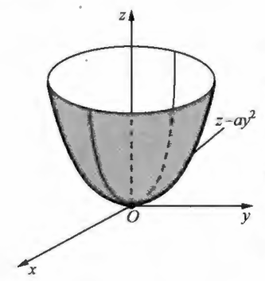
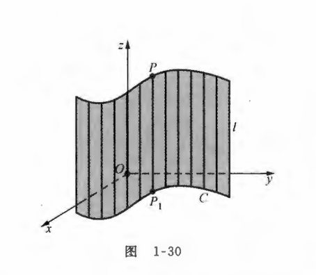
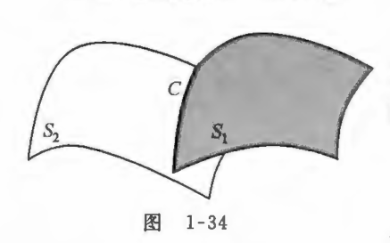
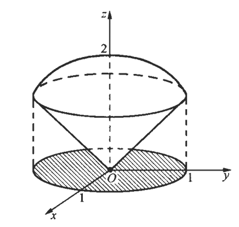

## 一、曲面方程

 - 曲面方程的定义：给定曲面$S$与三元方程$F(x, y, z)=0$且已知方程的解集非空，若曲面$S$与方程 有下述关系：
 
   - 曲面$S$上的点都满足方程 ，即$S$上任何点的坐标都是方程 的解；
   
   - 方程的解都在$S$上，即方程的任何解$x, y, z$所对应的点$P(x, y, z)$都在$S$上；
   
   - 则称该方程为曲面$S$的方程，并称$S$为方程所表示的曲面。

- 球的标准方程：其中球心为点$(a, b, c)$，半径为$R(>0)$
  $$(x-a)^{2}+(y-b)^{2}+(z-c)^{2}=R^{2} $$
  

  
  

  - $x^{2}+y^{2}+z^{2}=R^{2}$，表示球心在原点，半径为$R$  的球。

  - 球的一般式方程：$x^{2}+y^{2}+z^{2}+A x+B y+C z+D=0$。

  - $z=\sqrt{R^{2}-x^{2}-y^{2}}$，表示球心在原点，半径为$R$的上半球面。
  
  

  
  

- 定理 $1$：给定方程$F(x, y, z)=0$和$G(x, y, z)=0$，它们的解集非空，分别设为$\Omega_{F}, \Omega_{G}$
  - 这两个方程表示同一个曲面的充要条件是：它们为同解方程，即$\Omega_{F}=\Omega_{G}$；

  - 如果$\Omega_{F} \subset \Omega_{G}$，即$G(x, y, z)=0$的解集包含$F(x, y, z)=0$的解集；
  - 则$F(x, y, z)=0$表示的曲面是$G(x, y, z)=0$表示的曲面的一部分。

- 定理 $2$：设曲面$S$的方程是$F(x, y, z)=0$，则曲面$S$关于$O x y$平面对称的充要条件是，如果点$P(x, y, z)$的坐标满足方程，即 $F(x, y, z)=0$，那么必有点$P^{\prime}(x, y,-z)$的坐标也满足方程，即$F(x, y,-z)=0$。

- 曲面$S$关于其他坐标面的对称性条件可以简述如下：  
$$F(x, y, z)=0 \begin{cases} 
& S  关于  O x y对称 \Longrightarrow    F( x, y, -z)=0 或 F(x, y, z)=F(x, y, -z)    \\ \newline
& S  关于  O y z对称 \Longrightarrow    F(-x, y, z)=0   或 F(-x, y, z)=F(x, y, z)    \\ \newline
& S  关于  O z x对称 \Longrightarrow     F(x,-y, z)=0   或 F(x,-y, z)=F(x, y, z)   \\ 
\end{cases}$$

## 二、旋转曲面

- 一条平面曲线$C$绕它所在平面的一条直线$L$旋转一周所生成的曲面称为旋转曲面（简称旋转面），其中曲线$C$称为该旋转曲面的母线，直线$L$称为该旋转曲面的旋转轴 。

- 旋转面方程：求$O y z$平面上的曲线$C: f(y, z)=0$绕$z$轴旋转所生成的旋转面方程：
  1.  先找到二维曲线的方程$f(y, z)=0$ 。
  1.  旋转后，曲线上的点$(0, y^{*}, z)$变为三维空间点$(x, y, z)$ 。
  1.  旋转后， $y^{*}$  变成 $\pm \sqrt{x^{2}+y^{2}}$。
  1.  代入原方程$f\left(y^{*}, z\right)=0$，得到新的旋转曲面方程：
$$\begin{cases}
  &  绕  x  轴旋转 ：f(x, \pm \sqrt{y^{2}+z^{2}})=0   \\ \newline 
  & 绕  y  轴旋转 ：f(y, \pm \sqrt{x^{2}+z^{2}})=0  \\ \newline 
  & 绕  z  轴旋转： f ( \pm \sqrt{x^{2}+y^{2}}, z )=0
\end{cases}\Longrightarrow  
\begin{cases}
  &  y= \pm \sqrt{y^{2}+z^{2}}  或  z= \pm \sqrt{y^{2}+z^{2}}      \\ \newline 
  &   x= \pm \sqrt{x^{2}+z^{2}}  或  z= \pm \sqrt{x^{2}+z^{2}}    \\ \newline 
  &   x= \pm \sqrt{x^{2}+y^{2}}  或  y= \pm \sqrt{x^{2}+y^{2}} 
\end{cases} 
$$

  

  
  

  
$$图例：\begin{cases}
  &  M(0,0, z) \quad  P(x, y , z) \quad  P^{*}(0, y^{*}, z)    \\ \newline 
  & |M P|=|M P^{*}| \Longrightarrow   |M P|=\sqrt{x^{2}+y^{2}}  \quad |M P^{*}|=|y^{*}|  \\ \newline 
 &  |y^{*}|=   \sqrt{x^{2}+y^{2}} \Longrightarrow  y^{*}= \pm \sqrt{x^{2}+y^{2}} 
\end{cases}$$

- 顶点在原点的圆锥面：求$O y z$平面上的直线$z=a y(a>0)$绕$z$轴旋转所生成的旋转面方程: 

  根据绕$z$轴曲面方程知$z$保持不变，将$y$换为 $\pm \sqrt{x^{2}+y^{2}}$  ，得$z= \pm a \sqrt{x^{2}+y^{2}}$，再两端平方得到：$z^{2}=a^{2} (x^{2}+y^{2})$
  其中$\varphi=\operatorname{arccot} a$称为该圆雉面的半顶角，它是$O y z$平面上的直线$z=a y$与$z$轴的夹角。
  

  
  

  

- 旋转拋物面 ：求$O y z$平面上的抛物线$z=a y^{2}(a>0)$绕$z$轴旋转所生成的旋转面方程。

  根据绕$z$轴曲面方程知$z$保持不变，将$y$换为$\pm \sqrt{x^{2}+y^{2}}$，得所求的旋转面方程为$z=a (x^{2}+y^{2} )$。
  

  
  

  

## 三、母线平行坐标轴的柱面方程

- 平行于定直线$L$并沿定曲线$C$移动的直线$l$ 所生成的曲面称为柱面，其中动直线$l$在移动中的每一个位置称为该柱面的母线，曲线$C$ 称为该柱面的准线，总之，在空间直角坐标系下，二元方程表示母线平行于坐标轴的柱面。

   现在来建立以 $Oxy$平面上的曲线$C: f(x, y)=0$为准线，平行于$z$轴的直线 $l$为母线的柱面方程 ：

   设$P(x, y, z)$为该柱面上任一点，过$P$作平行于$z$ 轴的直线交 $O x y$平面于点$P_{1}(x, y, 0)$，根据柱面的几何意义可知，点$P_{1}$必在准线$C$上，所以点$P_{1}$满足曲线$C$的方程$f(x, y)=0$。
   
   由于这个方程不含$z$，所以点$P(x, y, z)$也满足方程 $f(x, y)=0$ 反之，只要点$P(x, y, z)$的前两个坐标满足 $f(x, y)=0$则点$P$就在所给定的柱面上， 因此，以  $O x y$平面上的曲线$C: f(x, y)=0$为准线，母线平行于$z$轴的柱面方程为：
   $$f(x, y)=0$$
   对于方程 $f(x, y)=0$，如果把它放在平面直角坐标系下考虑，则它表示平面上的一条曲线；如果这个方程放在空间直角坐标系下考虑，则它表示母线平行于$z$轴的柱面。
   
  

  
  

  
- 圆柱面：方程$x^{2}+y^{2}=R^{2}$在空间直角坐标系下表示以$O x y$平面上的圆$x^{2}+y^{2}=R^{2}$为准线，母线平行于$z$轴的柱面，称为圆柱面。类似地，方程$f(y, z)=0$和$f(x, z)=0$在空间直角坐标系下分别表示母线平行于$x$轴和$y$轴的柱面。

 

  
  

  

- 不同的柱面：

$$\begin{cases}
  & \dfrac{x^{2}}{a^{2}}-\dfrac{y^{2}}{b^{2}}=1为准线： 双曲柱面   \\ \newline 
  & \dfrac{x^{2}}{a^{2}}+\dfrac{y^{2}}{b^{2}}=1为准线： 椭圆柱面   \\ \newline 
  & y^{2}=2 p x(p>0)为准线：  抛物柱面  \\ \newline 
 & x^{2}+z^{2}=1为准线： 圆柱面
\end{cases}$$

 

  
 

  

- 曲平面：平面也是一种特殊的柱面
 $$z=1  \qquad y+z=1$$

  

  
  

  
$$\begin{cases}
  & 方程  z=h表示垂直于z轴的平面 ，当  h=0  时，平面  z=0 就是  O x y  平面   \\ \newline 
  & 方程  x=h表示垂直于x轴的平面 ，当  h=0  时，平面  x=0 就是  O y z  平面  \\ \newline 
  & 方程  y=h表示垂直于y轴的平面 ，当  h=0  时，平面  y=0 就是  O z x  平面
\end{cases}$$

## 四、空间中的曲线方程

  
- 空间中的曲线可以看作两个曲面的交线，例如，可将空间中的直线看作某两个平面的交线；将空间中的圆看作某个球面与某个平面的交线。给定空间中的两个曲面：
  $$S_{1}: F(x, y, z)=0 \qquad S_{2}: G(x, y, z)=0$$
  设它们的交线是$C$，则$C$上的点$P(x, y, z)$ 既在曲面$S_{1}$上又在曲面$S_{2}$上，从而点$P$的坐标既要满足方程$F(x, y, z)=0$，又要满足方程$G(x, y, z)=0$，于是点$P$的坐标$x, y, z$是方程组：的解．反之，方程组上的任何一个解$x, y, z$所对应的点$P(x, y, z)$既在曲面$S_{1}$  上，又在曲面$S_{2}$上，从而在它们的交线$C$上．我们称该方程组是空间曲线$C$ 的一般方程。
  $$空间曲线C 的一般方程： \left\{\begin{array}{l}
  F(x, y, z)=0  \\ \newline
  G(x, y, z)=0
  \end{array}\right.$$

   

   
   

- 相交曲线的形状举例：
  $$ C:\left\{\begin{array}{l}x^{2}+y^{2}+z^{2}=1  \\ \newline
  G(x, y, z)=0  x^{2}+(y-1)^{2}+(z-1)^{2}=1 \end{array}\right. $$
  空间中两个球相交：这时 $C$ 中的第一个方程表示球心在原点，半径是$1$ 的球面，第二个方程表示球心在点$P_{0}(0,1,1)$ ，半径也是 $1$ 的球面，因此它们的交线  $C$  是空间中的一个圆。
  $$ C:\left\{\begin{array}{l}z=\sqrt{1-x^{2}-y^{2}} \\ \newline  x^{2}+y^{2}-x=0 \end{array}\right. $$
  空间中球与柱面相交：曲面$z=\sqrt{1-x^{2}-y^{2}}$是球心在原点，半径为 $1$ 的上半球面，曲面$x^{2}+y^{2}-x=0$表示母线平行于$z$轴的柱面，此柱面方程可化为$\left(x-\frac{1}{2}\right)^{2}+y^{2}=\frac{1}{4}$。可见，这个柱面的准线是$O x y$平面上的圆，圆心在点$\left(\frac{1}{2}, 0,0\right)$，半径为 $\frac{1}{2}$半球面与柱面的交线。
  

  
  

 

## 五、空间曲线的参数方程

- 空间曲线的参数方程

  - 平面曲线可以用参数方程来表达，同样空间曲线$C$也有其参数方程表达式：
  $$ C:\left\{\begin{array}{l}
  x=x(t) \\   \newline
  y=y(t), \quad(a \leqslant t \leqslant b) \\  \newline
  z=z(t)
  \end{array}\right.$$ 
  - 其中$x(t), y(t), z(t)$都是$t$的函数，对于每一个$t \in[a, b]$有$x=x(t), y=y(t), z=z(t)$。
  - 这三个数值对应着空间中的点$P(x, y, z)$。
  - 当$t$在$[a, b]$中变化时，点$P$也在空间中变化，其变化的轨迹就是曲线$C$。

- 螺旋线方程：其中$a, k$是正的常数，参数$\theta \in(-\infty,+\infty)$
  $$\left\{\begin{array}{l}x=a \cos \theta \\ \newline y=a \sin \theta  \\ \newline z=k \theta\end{array}\right.   $$  
  - 坐标$z=k \theta$它表明曲线$C$上的动点$P(x, y, z)$随着参数 $\theta$ 的增大而升高，升高的幅度与 $\theta$成正比，比例系数为$k$。

  - 设点$P^{\prime}(x, y, 0)$是点$P$在$O x y$平面上的投影，则由参数方程可知$x^{2}+y^{2}=   a^{2} \cos ^{2} \theta+a^{2} \sin ^{2} \theta=a^{2}$。

  - 这说明$O P^{\prime}$的长度总是$a$，也表明点$P$到$z$轴距离总是$a, O P^{\prime}$与$x$轴的夹角为$\theta$。

  - 点$P$的三个坐标 $x, y, z$都随$\theta$的变化而变化，随着$\theta$的增大动点$P$ 在升高的同时还围绕$z$轴逆时针旋转，并保持与$z$轴的距离为$a$，这条曲线$C$称为螺旋线 。

  

  
  

  
## 六、空间曲线在坐标面上的投影

- 空间曲线在坐标面上的投影：给定曲线：
  $$C_1:\left\{\begin{array}{l}
  F(x, y, z)=0 \\ \newline
  G(x, y, z)=0
  \end{array}\right. 同解变形为 \Longrightarrow 
  C_2: \left\{\begin{array}{l}
  K(x, y, z)=0 \\ \newline
  H(x, y)=0
  \end{array}\right.$$

  - 由于是同解变形$C_1=C_2$，方程组$C_2$的几何意义为：$C_1$也是另外两个曲面$K(x, y, z)=0  与  H(x, y)=0$的交线。
  - 由于$H(x, y)=0$是母线平行于$z$轴（或垂直于  $O x y$平面）的柱面，其准线是$O x y$平面上的曲线$H(x, y)=0$。
  - 从而$O x y$平面上的曲线$H(x, y)=0$就是$C$在$O x y$平面上的投影曲线，严格地说，这条投影曲线方程  应记为：

  $$\left\{\begin{array}{l}
  H(x, y)=0  \\ \newline
  z=0
  \end{array}\right.$$
  
   - 它表示柱面$H(x, y)=0$与$O x y$平面的交线，称方程$H(x, y)=0$所表示的曲面为曲线$C$关于$O x y$平面的投影柱面。 
   - 因此，若求曲线$C$在 $O x y$平面上的投影柱面，可从方程组$C_1$的两个曲面方程出发，做一系列同解变形。
   - 将$z$消去后即可得到投影柱面的方程。
   - 将$C_1$的两个曲面方程做同解变形，分别消去$x$ 和$y$得到曲线$C$关于$O y z$平面和 $O z x$平面的投影柱面方程。
   - 记为：$I(y, z)=0 \quad \text { 和 } \quad J(x, z)=0$

  则曲线$C$在$O y z$和$O z x$及$O x y$平面上的投影曲线方程分别为：
  $$O y z：\left\{\begin{array} { l } 
  { I ( y , z ) = 0 , } \\ \newline
  { x = 0 }
  \end{array} \quad 
  O z x：\left\{\begin{array}{l}
  J(x, z)=0 \\ \newline
  y=0 
  \end{array}\right.\right. \quad 
  O x y ：\left\{\begin{array}{l}
  H(x, y)=0  \\ \newline
  z=0 
  \end{array}\right. $$
  
- 求投影曲线举例：*求曲线$C$在$O x y$平面和$O y z$平面上的投影曲线 $\quad$ *求曲线$C$的参数方程。
  $$C:\left\{\begin{array}{l}
   (1) \quad x^{2}+y^{2}+z^{2}=1 \\  \newline
   (2) \quad  x^{2}+(y-1)^{2}+(z-1)^{2}=1
  \end{array}\right.$$
  对所给方程组做同解变形$1$式减去$2$式得方程  $y+z=1$  ，已经消去了$x$，所以曲线$C$在$O y z$平面的投影曲线方程为：
   $$\left\{\begin{array}{l}
   y+z=1 \\ \newline
   x=0
  \end{array}\right.$$
  它是一条直线段 ，再由$z=1-y$  ，代入$1$式，得到方程$x^{2}+2 y^{2}-2 y=0$，此时已经消去$z$，可再化为：
  $$\frac{x^{2}}{\frac{1}{2}}+\frac{\left(y-\frac{1}{2}\right)^{2}}{\frac{1}{4}}=1$$
  则曲线 $C$在 $O x y$平面上的投影曲线方程为：它是一个椭圆。
  $$C_2： \begin{array}{l}
  \left\{\begin{array}{l}
  \dfrac{x^{2}}{\dfrac{1}{2}}+\frac{(y-\dfrac{1}{2})^{2}}{\dfrac{1}{4}}=1 \\ \newline
   z=0 \end{array}\right. \end{array}$$
  注意到方程组$C_3$与原方程组是同解的: 则它也表示了曲线 $C$ ，由于 $y+z=1$是平行于$x$轴的平面，从而可知$C$是球面$x^{2}+y^{2}+z^{2}=1$与平面$y+z=1$交线，据此可判断曲线$C$是空间中的一个圆，这个圆所在的位置及其在$O x y$平面上的投影如下图。
    $$C_3 : \left\{\begin{array}{l}
   x^{2}+y^{2}+z^{2}=1, \\ \newline
   y+z=1
   \end{array}\right. $$
   

  
   

   
  因曲线$C$在$O x y$平面上的投影曲线是椭圆$C_2$，其参数方程为:
  $$C_4 \left\{\begin{array}{l}
  x=\frac{1}{\sqrt{2}} \cos t, \\ \newline
  y=\frac{1}{2}+\frac{1}{2} \sin t
  \end{array} t \in[0,2 \pi]\right.  $$

  又因曲线$C$在平面$z=1-y$上，将$C_4$式代入这个平面方程，则可以得到曲线$C$的参数方程 :
  $$\begin{array}{l}
  \left\{\begin{array}{l}
  x=\dfrac{1}{\sqrt{2}} \cos t \\ \newline
  y=\dfrac{1}{2}+\dfrac{1}{2} \sin t  \quad t \in[0,2 \pi] \\ \newline
  z=\dfrac{1}{2}-\dfrac{1}{2} \sin t
  \end{array}\right.
  \end{array}$$

- 求投影曲线举例：设有一个立体由上半球面$z=\sqrt{4-x^{2}-y^{2}}$及圆锥面$z=\sqrt{3\left(x^{2}+y^{2}\right)}$ 所围成，求它在$O x y$平面上的投影区域。  

  由该立体的图形可知，它在$O x y$平面上的投影区域的边界就是半球面$z=\sqrt{4-x^{2}-y^{2}}$与圆锥面 $z=\sqrt{3\left(x^{2}+y^{2}\right)}$的交线$C$在$O x y$ 平面上的投影曲线，先求出投影曲线，从交线 $C$ 中消去  $z$  即可得到投影曲线 ：
  $$C:\left\{\begin{array}{l}z=\sqrt{4-x^{2}-y^{2}}  \newline  \\ z=\sqrt{3\left(x^{2}+y^{2}\right)}\end{array}\right.  $$

  由交线$C$ 的方程组可得$\sqrt{4-x^{2}-y^{2}}=\sqrt{3\left(x^{2}+y^{2}\right)}$ ，化简后可得交线$C$在$O x y$平面上的投影曲线$x^{2}+y^{2}=1$。于是，立体的投影区域为$x^{2}+y^{2} \leqslant 1$，见图阴影部分。

  

  
  

