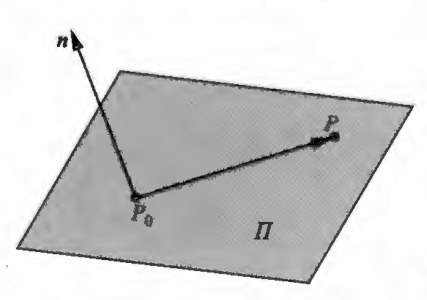
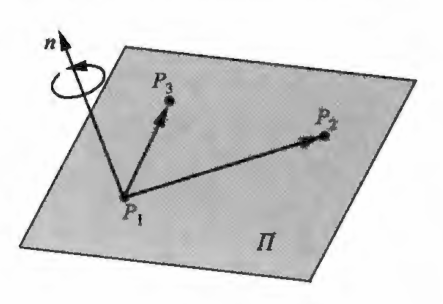
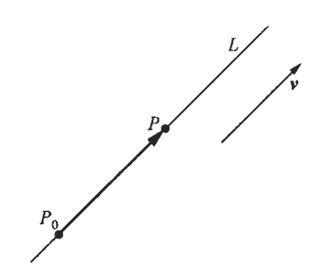
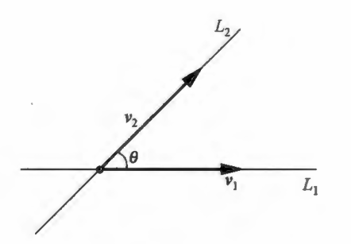

## 一、平面方程

- 平面的点法式方程

  给定点$P_{0}\left(x_{0}, y_{0}, z_{0}\right)$及非零向量$\boldsymbol{n}=\{A, B, C\}$，求经过点$P_{0}$且垂直于$\boldsymbol{n}$ 的平面$\Pi$的方程，当  $P_{0}$与$\boldsymbol{n}$给定之后，平面$\Pi$就被确定下来，因此$P_{0}$与$\boldsymbol{n}$是确定平面$\Pi$的两个要素，设点$P(x, y, z)$是平面$\Pi$上的任一点，则向量$\overrightarrow{P_{0} P}$总与$n$垂直 ，从而数量积：
  $$n \cdot \overrightarrow{P_{0} P}=0$$
  由$\overrightarrow{P_{0} P}=\left\{x-x_{0}, y-y_{0}, z-z_{0}\right\}$，再根据数量积的坐标表示，得到：
  $$\boldsymbol{n} \cdot \overrightarrow{P_{0} P}=A\left(x-x_{0}\right)+B\left(y-y_{0}\right)+C\left(z-z_{0}\right)=0  $$
  反之，如果点$P(x, y, z)$满足方程 ，则说明向量 $\overrightarrow{P_{0} P}$垂直于$\boldsymbol{n}$，从而点 $P(x, y, z)$在平面 $\Pi$ 上。称$\boldsymbol{n}$ 为平面$\Pi$的法向量，称方程 为平面$\Pi$的点法式方程 。
  

  
  

- 平面的一般方程

  将平面的点法式方程展开，得$A x+B y+C z+\left(-A x_{0}-B y_{0}-C z_{0}\right)=0$，令$\left(-A x_{0}-B y_{0}-C z_{0}\right)=D$
  则点法式方程可变为平面的一般方程，它是一个三元一次方程。
  $$A x+B y+C z+D=0$$
  反之，任给三元一次方程 ，其中$A, B, C$不全为零，则它必是某个平面的方程，事实上，取平面的一般方程的一个解$x_{0}, y_{0}, z_{0}$ ，则它满足$A x_{0}+B y_{0}+C z_{0}+D=0$将这个式子与该式相减，可得：
  $$A\left(x-x_{0}\right)+B\left(y-y_{0}\right)+C\left(z-z_{0}\right)=0  $$
  它恰是平面的点法式方程所表示的经过点$P_{0}\left(x_{0}, y_{0}, z_{0}\right)$，法向量为$\boldsymbol{n}=\{A, B, C\}$的平面方程，由于$A，B，C$  不全为零，则$\boldsymbol{n}=\{A, B, C\} \neq \mathbf{0}$ 由平面的一般方程中一次项的系数，我们可以直接写出平面的法向量。

- 求平面方程例题：已知平面$\Pi$经过三点$P_{1}(1,1,1), P_{2}(-2,1,2), P_{3}(-3,3,1)$，求平面$\Pi$的方程

  - 用点法式方程：空间中不共线的三点可确定一个平面，需根据这三点确定平面$\Pi$的两个要素：法向量及$\Pi$所经过的点，点 $P_{1}, P_{2}  ，  P_{3}$中的任何一点都可以当作$\Pi$所经过的点，故余下的问题就是确定$\Pi$的法向量 $\boldsymbol{n}$  ，设  $\boldsymbol{n}=\{a, b, c\}$
  $$点法式 \begin{cases}
  & \overrightarrow{P_{1} P_{2}}=\{-3,0,1\}在\Pi上且垂直于\boldsymbol{n} \Longrightarrow \boldsymbol{n} \cdot \overrightarrow{\boldsymbol{P}_{1} P_{2}}=0  \\ \newline
  &\Longrightarrow  \{a, b, c\} \cdot\{-3,0,1\}=-3 a+c=0 \\  \newline
  & \overrightarrow{P_{1} P_{3}}=\{-4,2,0\}  也在  \Pi  上且垂直于  \boldsymbol{n} \Longrightarrow n \cdot \overrightarrow{P_{1} P_{3}}=0 \\ \newline
  & \Longrightarrow  \{a, b, c\} \cdot\{-4,2,0\}=-4 a+2 b=0 \\ \newline
  &  - 3 a + c = 0   \quad - 4 a + 2 b = 0 \Longrightarrow   c=3 a \quad   b=2 a  \\ \newline
  & 取  a=1  ，则  b=2， c=3   \Longrightarrow  可取  n=\{1,2,3\}  作为法向量     \\ \newline
  & 取  P_{1}  为  \Pi  经过的点\Longrightarrow (x-1)+2(y-1)+3(z-1)=0   \\ \newline
  &  \Longrightarrow        \Pi  的方程为x+2 y+3 z-6=0 \\ 
  \end{cases}  $$

  - 待定系数法： 设平面$\Pi$的一般方程为$A x+B y+C z+D=0$，只需确定系数$A, B, C, D$。 将点$P_{1}, P_{2}, P_{3}$ 的坐标代人一般方程，则有：  
  $$待定系数法\begin{cases}
  &  (1)    A+B+C+D=0   \\ \newline
  &  (2)   -2 A+B+2 C+D=0  \\ \newline
  &  (3)  -3 A+3 B+C+D=0   \\ \newline
  &   (2)- (1)=  -3 A+C=0 \\ \newline
  &   (3)- (1)= -4 A+2 B=0 \\ \newline
  &  所以  C=3 A, B=2 A \\ \newline
  &  (1)=A+2 A+3 A+D=0,  故 D=-6 A    \\ \newline
  &  由于  A, B, C  不能同时为零，因此取  A=1  \\ \newline
  & 得到  C=3, B=2, D=-6   \\ \newline
  & 所求的方程为x+2 y+3 z-6=0  \\  
  \end{cases}  $$
  - 向量积法：因为法向量$\boldsymbol{n}$同时垂直于$\overrightarrow{P_{1} P_{2}}, \overrightarrow{P_{1} P_{3}}$，所以法向量$n$必平行于$\overrightarrow{P_{1} P_{2}} \times \overrightarrow{P_{1} P_{3}}$ ，直接取法向量：
   $$\boldsymbol{n}=\overrightarrow{\boldsymbol{P}_{1} P_{2}} \times \overrightarrow{P_{1} P_{3}}=\left|\begin{array}{rrr}
  \boldsymbol{i} & \boldsymbol{j} & \boldsymbol{k} \\
  -3 & 0 & 1  \\ \newline
  -4 & 2 & 0
  \end{array}\right|=\{-2,-4 ;-6\}  $$
    仍取 $P_{1}$为$\Pi$经过的点，则由点法式方程得：
   $$-2(x-1)-4(y-1)-6(z-1)=0 \Longrightarrow   x+2 y+3 z-6=0$$

  

  
  

- 特殊位置的平面方程：在平面的一般方程$A x+B y+C z+D=0$中，根据各项的系数可以判断出平面相对于坐标系的特殊位置。
  - 当$D=0$时，平面方程变为$A x+B y+C z=0$，它表示过原点的平面。
  
  - 当$A=0$且$D=0$时，得方程$B y+C z=0$，它表示通过$x$轴的平面。
  - 通常把平行于$O x y$平面的平面方程化为$z=h$，其中$h=\frac{-D}{C}$ 。

  $$ \begin{cases}
  & 当  A=0\Longrightarrow   B y+C z+D=0  表示平行于  x  轴的平面 \\ \newline
  & 当  B=0\Longrightarrow   A x+C z+D=0  表示平行于  y  轴的平面 \\ \newline
  & 当  C=0\Longrightarrow   A x+B y+D=0  表示平行于  z  轴的平面 \\ \newline
  & 当  A=B=0\Longrightarrow   Cz+D=0  (可化为  z=h)  表示平行于  O x y  平面的平面 (垂直于  z  轴)  \\ \newline
  & 当  B=C=0\Longrightarrow   A x+D=0 (可化为  x=h) 表示平行于  O y z  平面的平面 (垂直于  x  轴)  \\ \newline
  & 当  A=C=0\Longrightarrow   B y+D=0 (可化为  y=h) 表示平行于  O z x  平面的平面 (垂直于  y  轴)  \\   
  \end{cases}  $$

 

- 截距式方程：设平面 $\Pi$的一般方程为$A x+B y+C z+D=0$。如果$\Pi$不过原点，并且不与任何坐标轴平行，则$A, B, C, D$都不为零，且 $\Pi$必与三条坐标轴各有一个交点，$\Pi$的方程可化为：
  $$\frac{A}{-D} x+\frac{B}{-D} y+\frac{C}{-D} z=1$$
  令$a=\frac{-D}{A}, b=\frac{-D}{B}, c=\frac{-D}{C}$，则$\Pi$的方程又化为：
  $$\frac{x}{a}+\frac{y}{b}+\frac{z}{c}=1$$
  称方程为平面$\Pi$的截距式方程，显然，点$(a, 0,0) \quad  (0, b, 0)  \quad   (0,0, c)$都在平面$\Pi$上，称$a, b, c$是平面$\Pi$分别在$x$轴，$y$轴，$z$轴上的截距。

  

  
  

  

- 两个平面的夹角：给定两个平面，则它们的法向量分别为 $\boldsymbol{n}_{1}=\left\{A_{1}, B_{1}, C_{1}\right\}  和 \boldsymbol{n}_{2}=\left\{A_{2}, B_{2}, C_{2}\right\}$

  $$\begin{array}{l}
  \Pi_{1}: A_{1} x+B_{1} y+C_{1} z+D_{1}=0  \\ \newline
  \Pi_{2}: A_{2} x+B_{2} y+C_{2} z+D_{2}=0 
  \end{array}$$
  规定$\Pi_{1}$与$\Pi_{2}$的夹角$\theta$为它们法向量的夹角，取锐角 ，于是，当 $\boldsymbol{n}_{1}  与  \boldsymbol{n}_{2}$的夹角为锐角时，有：
  $$\cos \theta=\frac{\boldsymbol{n}_{1} \cdot \boldsymbol{n}_{2}}{\left|\boldsymbol{n}_{1}\right|\left|\boldsymbol{n}_{2}\right|} \Longrightarrow   \cos \theta=\frac{\left|\boldsymbol{n}_{1} \cdot \boldsymbol{n}_{2}\right|}{\left|\boldsymbol{n}_{1}\right|\left|\boldsymbol{n}_{2}\right|}=\frac{\left|A_{1} A_{2}+B_{1} B_{2}+C_{1} C_{2}\right|}{\sqrt{A_{1}^{2}+B_{1}^{2}+C_{1}^{2}} \sqrt{A_{2}^{2}+B_{2}^{2}+C_{2}^{2}}}$$

  两个平面垂直就是它们的法向量垂直，两个平面平行就是它们的法向量平行，得到下列结论：
   $$\begin{cases}
     &  \Pi_{1}  与  \Pi_{2}  垂直的充要条件：  A_{1} A_{2}+B_{1} B_{2}+C_{1} C_{2}=0  \\ \newline  
     &  \Pi_{1}  与  \Pi_{2}  平行的充要条件：  \frac{A_{1}}{A_{2}}=\frac{B_{1}}{B_{2}}=\frac{C_{1}}{C_{2}} 
   \end{cases}$$
  
  

  
  

  

- 平面方程求解：已知平面$\Pi$经过两点$P(1,1,1)$和$Q(0,1,-1)$且垂直于给定的平面$x+y+z=0$，求平面$\Pi$的方程。

  - 点法式方程求解：只需求出平面$\Pi$的法向量，设其为$\boldsymbol{n}=\{A, B, C\}$ 。显然，给定平面的法向量为$\{1,1,1\}$，由于$\Pi$垂直于给定的平面，则  $n$必垂直于$\{1,1,1\}$，从而数量积为零。

  $$ \begin{cases}
  &  \{1,1,1\} \cdot \boldsymbol{n}=0 \Longrightarrow    A+B+C=0   \\ \newline
  &  又由于  n  垂直于向量  \overrightarrow{P Q}=\{-1,0,-2\}   \\ \newline
  & 则数量积 \overrightarrow{P Q}  \cdot n=0  \Longrightarrow  -A-2 C=0    \\ \newline
  & A+B+C=0  \quad  -A-2 C=0     \\ \newline
  & 令A=2 \Longrightarrow    A=2  \quad  B=-1   \quad C=-1  \\ \newline
  & 则  \boldsymbol{n}=\{2,-1,-1\} \quad 因  \Pi 经过点P，则\Pi的方程为： \\ \newline
  &  2(x-1)-(y-1)-(z-1)=0 即 2 x-y-z=0    \\ 
  \end{cases}  $$

  - 向量积解法：由于$\boldsymbol{n}$垂直于给定平面的法向量$\{1,1,1\}$及$\overrightarrow{P Q}=\{-1,0,-2\}$，所以取$II$的法向量如下式，再由点法式方程可得到同样的平面方程$2 x-y-z=0$。[两个向量的叉积会产生一个同时垂直于这两个向量的新向量]
  $$n=\{1,1,1\} \times\{-1,0,-2\}=\left|\begin{array}{rrr}
  i & j & k \\
  1 & 1 & 1 \\
  -1 & 0 & -2
  \end{array}\right|=\{-2,1,1\}$$

- 点到平面的距离公式：给定平面$\Pi: A x+B y+C z+D=0$及点$P_{0} (x_{0}, y_{0}, z_{0})$，求点$P_{0}$到平面$\Pi$的距离$d$。

  - 此时平面$\Pi$的法向量为$n=\{A, B, C\}$，过$P_{0}$向 $\Pi$作垂线，垂足为$M(x_{1}, y_{1}, z_{1})$。
  
  - 法向量$\boldsymbol{n}$ 必与向量$\overrightarrow{M P_{0}}=\left\{x_{0}-x_{1}, y_{0}-y_{1}, z_{0}-z_{1}\right\}$平行，则它们的夹角$\theta=0$或 $\pi$，于是数量积为：
  $$\boldsymbol{n} \cdot \overrightarrow{M P_{0}}=|\boldsymbol{n}|\left|\overrightarrow{M P_{0}}\right| \cos \theta= \pm|\boldsymbol{n}|\left|\overrightarrow{M P_{0}}\right| \Longrightarrow     d=|\overrightarrow{M P_{0}}|=| \pm \frac{\boldsymbol{n} \cdot \overrightarrow{M P_{0}}}{|\boldsymbol{n}|}|=\frac{|\boldsymbol{n} \cdot \overrightarrow{M P_{0}}|}{|\boldsymbol{n}|} $$
  - 由于数量积：
  $$\boldsymbol{n} \cdot \overrightarrow{M P_{0}}  =A(x_{0}-x_{1})+B(y_{0}-y_{1})+C(z_{0}-z_{1}) =A x_{0}+B y_{0}+C z_{0}-(A x_{1}+B y_{1}+C z_{1})$$
  - 而$M$在$\Pi$上，应有$A x_{1}+B y_{1}+C z_{1}=-D$，于是数量积：
  $$\boldsymbol{n} \cdot \overrightarrow{M P_{0}}=A x_{0}+B y_{0}+C z_{0}+D$$
  - 又$|\boldsymbol{n}|=\sqrt{A^{2}+B^{2}+C^{2}}$，代入之前的式子，得：
  $$d=\frac{\left|A x_{0}+B y_{0}+C z_{0}+D\right|}{\sqrt{A^{2}+B^{2}+C^{2}}} $$

  

  
  

  

## 二、直线方程

- 直线的对称式方程：给定点$P_{0}(x_{0},y_{0},z_{0})$及非零向量$\boldsymbol{v}=\{l,m,n\}$，则经过点$P_{0}$且与$\boldsymbol{v}$平行的直线$L$就被确定下来，因此，点$P_{0}$与向量$\boldsymbol{v}$是确定直线$L$的两个要素，称向量$\boldsymbol{v}$为$L$的方向向量,下面我们求直线$L$的方程 ：

  - 设点$P(x, y, z)$在直线$L$上，于是向量$\overrightarrow{P_{0} P}$平行于向量$\boldsymbol{v}$，则它们对应的坐标成比例。
  $$\overrightarrow{P_{0} P}=\left\{x-x_{0}, y-y_{0}, z-z_{0}\right\} \Longrightarrow  \frac{x-x_{0}}{l}=\frac{y-y_{0}}{m}=\frac{z-z_{0}}{n}$$
  - 反之，如果点$P(x, y, z)$的坐标满足比例方程，则说明向量$\overrightarrow{P_{0} P}$平行于向量$\boldsymbol{v}$，从而点 $P(x, y, z)$在直线 $L$  上，称方程为直线$L$的对称式方程。
  - 在向量坐标对应成比例的等式中，我们约定，当某个分式的分母为零时，相应的分子也为零。

  

  
  

- 直线的参数方程：
  $$\frac{x-x_{0}}{l}=\frac{y-y_{0}}{m}=\frac{z-z_{0}}{n}=t  \Longrightarrow   \left\{\begin{array}{l}
   x=x_{0}+l t \\ \newline  
   y=y_{0}+m t \\ \newline  
   z=z_{0}+n t
   \end{array}\right.   (-\infty<t<+\infty)$$

- 直线的一般方程：给定空间中两个平面$\Pi_{1}: A_{1} x+B_{1} y+C_{1} z+D_{1}=0  \quad \Pi_{2}: A_{2} x+B_{2} y+C_{2} z+D_{2}=0$如果它们不相互平行，则它们的交线就是空间中的一条直线$L$于是，直线$L$的方程可表示为：
 $$\begin{cases}
  &  A_{1} x+B_{1} y+C_{1} z+D_{1}=0  \\ \newline  
  &  A_{2} x+B_{2} y+C_{2} z+D_{2}=0 \\
 \end{cases} $$
   
- 求直线参数方程和对称式方程：求满足下式的参数方程和对称式方程。
  $$L:\left\{\begin{array}{l}
  x+2 y+3 z-6=0 \\  \newline  
  2 x+3 y-4 z-1=0
  \end{array}\right.$$

  - 解法$1$ ：根据对称式方程和参数方程的形式，只需根据方程组 确定出直线 $L$ 的两个要素：$L$经过的点$P_{0}$和方向向量$v$显然，点$P_{0}$的坐标是方程组的一个解。令$z=0$，则方程组 变为：
   $$\left\{\begin{array}{l}
   x+2 y=6 \\ \newline  
   2 x+3 y=1
   \end{array}\right.$$
   - 解这个方程组得$x=-16, y=11$于是，点$P_{0}(-16,11,0)$在直线$L$上，第一个方程$x+2 y+3 z-6=0$所表示的平面的法向量为$\boldsymbol{n}_{1}=\{1,2,3\}$；第二个方程$2 x+3 y-4 z-1=0$所表示的平面的法向量为 $\boldsymbol{n}_{2}=\{2,3,-4\}$  。因直线$L$ 的方向向量$\boldsymbol{v}=\{l, m, n\}$ 与  $\boldsymbol{n}_{1}, \boldsymbol{n}_{2}$都垂直，故数量积$\boldsymbol{v} \cdot \boldsymbol{n}_{1}=0, \boldsymbol{v} \cdot \boldsymbol{n}_{2}=0$，即有方程组：
   $$\left\{\begin{array}{l}
    l+2 m+3 n=0 \\  \newline 
    2 l+3 m-4 n=0
   \end{array}\right. $$
   - 第一个方程乘$2$后减去第二个方程得$m=-10 n$，再代人到第一个方程可得$l=17 n$取$n=1$，则 $l=17, m=-10$即$\boldsymbol{v}=\{17,-10,1\}$。于是，直线$L$的参数方程为：
   $$\left\{\begin{array}{l}
   x=-16+17 t \\  \newline 
   y=11-10 t \\  \newline 
   z=t
  \end{array}\right.   $$
  - 对称式方程为：
  $$\frac{x+16}{17}=\frac{y-11}{-10}=\frac{z}{1} $$
  - 解法$2$ ：此时$\boldsymbol{v}$必平行于$\boldsymbol{n}_{1} \times \boldsymbol{n}_{2}$，可取$L$的方向向量为：
   $$\boldsymbol{v}=\boldsymbol{n}_{1} \times \boldsymbol{n}_{2}=\left|\begin{array}{rrr}
   \boldsymbol{i} & \boldsymbol{j} & \boldsymbol{k} \\
   1 & 2 & 3 \\
   2 & 3 & -4
   \end{array}\right|=\{-17,10,-1\}$$
  - 于是$L$的参数方程为：
   $$\left\{\begin{array}{l}
   x=-16-17 t \\ \newline 
   y=11+10 t \\ \newline 
   z=-t
   \end{array}\right.   $$
   - $L$的对称式方程为：
   $$\frac{x+16}{-17}=\frac{y-11}{10}=\frac{z}{-1}$$

- 两条直线的夹角：给定两条直线$L_{1}$和$L_{2}$，它们的方向向量分别为$\boldsymbol{v}_{1}=\left\{l_{1}, m_{1}, n_{1}\right\}, \boldsymbol{v}_{2}=\left\{l_{2}, m_{2}, n_{2}\right\}$

  - 直线$L_{1}$与 $L_{2}$  的夹角规定为它们方向向量的夹角$\theta$， 于是，当方向向量$\boldsymbol{v}_{1}$与$\boldsymbol{v}_{2}$的夹角$\theta$为锐角时：
  - 有$\cos \theta=\dfrac{\boldsymbol{v}_{1} \cdot \boldsymbol{v}_{2}}{\left|\boldsymbol{v}_{1}\right|\left|\boldsymbol{v}_{2}\right|}$  但是，给定的  $\boldsymbol{v}_{1}, \boldsymbol{v}_{2}$的夹角$\theta$不一定是锐角，当$\theta$为钝角时，由于方向向量不是唯一的
  - $-\boldsymbol{v}_{1}$也是$L_{1}$的方向向量，则$-\boldsymbol{v}_{1}$ 与$\boldsymbol{v}_{2}$的夹角是锐角$\theta$，无论何种情况，总有：
  $$\cos \theta=\frac{\left|\boldsymbol{v}_{1} \cdot \boldsymbol{v}_{2}\right|}{\left|\boldsymbol{v}_{1}\right|\left|\boldsymbol{v}_{2}\right|}=\frac{\left|l_{1} l_{2}+m_{1} m_{2}+n_{1} n_{2}\right|}{\sqrt{l_{1}^{2}+m_{1}^{2}+n_{1}^{2}} \sqrt{l_{2}^{2}+m_{2}^{2}+n_{2}^{2}}}$$

  

  
  

  - 显然，直线$L_{1}$与$L_{2}$垂直就是$\boldsymbol{v}_{1}  与  \boldsymbol{v}_{2}$垂直；直线$L_{1}$与$L_{2}$平行就是$\boldsymbol{v}_{1}$与  $\boldsymbol{v}_{2}$平行，于是我们得到：
  $$\begin{cases}
  &  直线L_{1}与L_{2}垂直的充要条件是：l_{1} l_{2}+m_{1} m_{2}+n_{1} n_{2}=0   \\ \newline  
  &  直线L_{1}与L_{2}平行的充要条件是：\dfrac{l_{1}}{l_{2}}=\dfrac{m_{1}}{m_{2}}=\dfrac{n_{1}}{n_{2}}    \\
  \end{cases} $$

- 求两条直线的夹角举例：求下列两直线的夹角$\theta$：
    $$L_{1}:\left\{\begin{array}{l}x+2 y+z-1=0\\ \newline   x-2 y+z+1=0\end{array}\right.  L_{2}:\left\{\begin{array}{l}x-y-z-1=0 \\ \newline   x-y+2 z+1=0\end{array}\right.   $$  
    - 解法 $1$ 只需求出直线$L_{1}$和 $L_{2}$的方向向量$\boldsymbol{v}_{1}  与  \boldsymbol{v}_{2}$，再利用公式 即可。 在$L_{1}$的方程中，平面$x+2 y+z-1=0$的法向量为$\boldsymbol{n}_{1}=\{1,2,1\}$，平面$x-2 y+z+1=0$的法向量为$\boldsymbol{n}_{2}=\{1,-2,1\}$。
    - 取$L_{1}$的方向向量$\boldsymbol{v}_{1}=\{l, m, n\}$，它与$\boldsymbol{n}_{1}, \boldsymbol{n}_{2}$都垂直，则数量积$\boldsymbol{v}_{1} \cdot \boldsymbol{n}_{1}   =0, \boldsymbol{v}_{1} \cdot \boldsymbol{n}_{2}=0$，即有方程组：
    $$\left\{\begin{array}{l}
     l+2 m+n=0  \\ \newline
     l-2 m+n=0 
     \end{array}  \Longrightarrow  \quad l=-n \quad  m=0 \right.    $$
    - 取 $n=1$，则 $l=-1$ ，即$\boldsymbol{v}_{1}=\{1,0,-1\}$ 。同理$\boldsymbol{v}_{2}=\{1,1,0\}$ 。所以由公式得
     $$\cos \theta=\frac{|1 \cdot 1+0 \cdot 1+(-1) \cdot 0|}{\sqrt{2} \sqrt{2}}=\frac{1}{2}  \quad \Longrightarrow   \quad \theta=\frac{\pi}{3} $$
    - 解法$2$在$L_{1}$的方程中，平面$x+2 y+z-1=0$的法向量为$\{1,2,1\}$，平面$x-2 y+z+1=0$的法向量为$\{1,-2,1\}$，故可取直线$L_{1}$ 的方向向量为：
    $$\boldsymbol{v}_{1}=\{1,2,1\} \times\{1,-2,1\}=\left|\begin{array}{rrr}
    \boldsymbol{i} & \boldsymbol{j} & \boldsymbol{k} \\
    1 & 2 & 1 \\
    1 & -2 & 1
    \end{array}\right|=\{4,0,-4\} $$
    - 同理，取直线$L_{2}$的方向向量为：
   $$\boldsymbol{v}_{2}=\{1,-1,-1\} \times\{1,-1,2\}=\{-3,-3,0\}   $$
    - 最后根据公式可得：
   $$\cos \theta=\frac{|4 \cdot(-3)+0 \cdot(-3)+(-4) \cdot 0|}{\sqrt{4^{2}+0^{2}+(-4)^{2}} \sqrt{(-3)^{2}+(-3)^{2}+0^{2}}}=\frac{12}{24}=\frac{1}{2}  \quad \Longrightarrow  \quad \theta=\frac{\pi}{3}   $$

- 直线与平面的夹角：设直线$L$的方向向量为$\boldsymbol{v}=\{l, m, n\}$，平面$\Pi$的法向量为$\boldsymbol{n}=\{A, B, C\}$，规定$L$与$\Pi$的夹角$\varphi$  为：当$L$与$\Pi$垂直时，$\varphi=\dfrac{\pi}{2}$；当$L$与$\Pi$不垂直时，$\varphi$ 是 $L$与它在$\Pi$上的投影直线$L^{\prime}$的夹角，此时$0 \leqslant \varphi<\dfrac{\pi}{2}$。
  - 设$\boldsymbol{v}$与$\boldsymbol{n}$ 的夹角为$\theta$，则$\varphi=\frac{\pi}{2}-\theta$，于是$\sin \varphi  =|\cos \theta|$ 从而  ：
   $$\sin \varphi=\frac{|\boldsymbol{v} \cdot \boldsymbol{n}|}{|\boldsymbol{v}||\boldsymbol{n}|}=\frac{|l A+m B+n C|}{\sqrt{l^{2}+m^{2}+n^{2}} \sqrt{A^{2}+B^{2}+C^{2}}} $$

  - 显然，直线$L$与平面$\Pi$垂直就是$\boldsymbol{v}$与$\boldsymbol{n}$平行；直线$L$与平面$\Pi$平行就是$\boldsymbol{v}$与$\boldsymbol{n}$垂直，于是我们得到：
   $$\begin{cases}
     &直线  L  与平面  \Pi  垂直的充要条件是  \quad   \dfrac{l}{A}=\dfrac{m}{B}=\dfrac{n}{C} \\ \newline  
     & 直线  L  与平面  \Pi  平行的充要条件是 \quad   l A+m B+n C=0 
   \end{cases}  $$
 

  
  

  

- 直线与平面的夹角例题：求直线$L: \dfrac{x-1}{2}=\dfrac{y-2}{-1}=\dfrac{z-3}{1}$与平面$\Pi: x+y+2 z-3=0$的夹角 $\varphi$及交点。

   - 直线$L$的方向向量为$\boldsymbol{v}=\{2,-1,1\}$，平面$\Pi$的法向量为$\boldsymbol{n}=\{1,1,2\}$ 由上公式有：
   $$\sin \varphi=\frac{|\boldsymbol{v} \cdot \boldsymbol{n}|}{|\boldsymbol{v}||\boldsymbol{n}|}=\frac{|3|}{\sqrt{6} \sqrt{6}}=\frac{1}{2}  \quad \Longrightarrow   \quad \varphi=\frac{\pi}{6} $$
   - 直线$L$的参数方程为：
   $$\left\{\begin{array}{l}
    x=1+2 t \\ \newline  
    y=2-t \\ \newline  
    z=3+t
    \end{array}\right.   $$
   - 此参数方程的意义是：随着参数$t$的变化，由参数方程确定的点$P(x, y, z)$在直线$L$上变化，当点$P$变化到某个位置时，恰落到平面$\Pi$上，这正是所求的交点，求出此时的参数$t$，它所对应的点$P$就是交点，因此，将直线$L$的参数方程代入平面$\Pi$的方程，得到：
   $$(1+2 t)+(2-t)+2(3+t)-3=0$$
   - 化简得$3 t+6=0$，从而$t=-2$再代人参数方程，得：
   $$\left\{\begin{array} { l } 
   { x = 1 + 2 \cdot ( - 2 ) } \\ \newline  
   { y = 2 - ( - 2 ) } \\ \newline  
   { z = 3 + ( - 2 ) } 
   \end{array} \quad \Longrightarrow   \quad \left\{\begin{array}{l}
   x=-3 \\ \newline 
   y=4 \\ \newline 
   z=1
   \end{array}\right.\right.\quad \Longrightarrow \quad 交点为： P(-3,4,1)$$

 