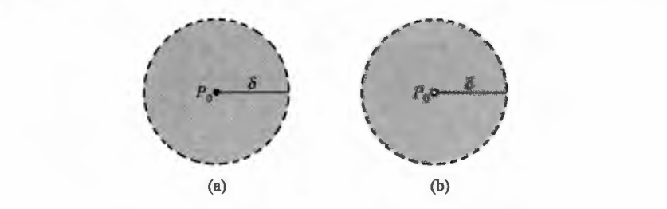
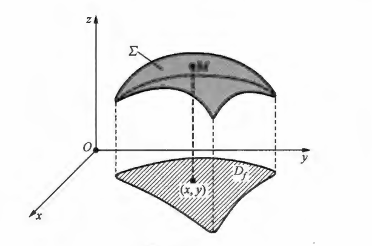

## 一、平面点集

平面中某些点所构成的集合称为平面点集，当建立平面直角坐标系后，平面上的每个点都可以用它的坐标来表示．因此，平面点集也可以用它们的坐标来表示。

点集$D=\left\{(x, y) \mid \sqrt{x^{2}+y^{2}}<1\right\}$表示到原点的距离小于$1$的点构成的集合,简记为$D: \sqrt{x^{2}+y^{2}}<1$。

点集$D=\{(x, y) \mid x>0\}$表示横坐标大于零的点构成的集合，简记为$D: x>0$。

平面上所有点构成的集合记为$\mathbf{R}^{2}$，或$-\infty<x<+\infty,-\infty<y<+\infty$。

 

 

给定点$P_{0}\left(x_{0}, y_{0}\right)$，点集$\left\{(x, y) \mid \sqrt{\left(x-x_{0}\right)^{2}+\left(y-y_{0}\right)^{2}}<\delta\right\}$ （  $\delta>0$  为常数）称为点$P_{0}$的 $\delta$邻域，记作$U_{\delta}\left(P_{0}\right)$。

它表示与$P_{0}$的距离小于$\delta$的点构成的集合 ，有时将它简记为 $U\left(P_{0}\right)$。称点集$U_{\delta}\left(P_{0}\right) \backslash\left\{P_{0}\right\}$为点$P_{0}$的$\delta$去心邻域，记作$U_{\delta}^{\circ}\left(P_{0}\right)$，它表示从邻域$U_{\delta}\left(P_{0}\right)$中去掉点 $P_{0}$后的集合 。

点的$\delta$去心邻域：
$$U_{\delta}^{\circ}\left(P_{0}\right)=U_{\delta}\left(P_{0}\right) \backslash\left\{P_{0}\right\}  \Longrightarrow    U_{\delta}^{\circ}\left(P_{0}\right)=\left\{(x, y) \mid \sqrt{\left(x-x_{0}\right)^{2}+\left(y-y_{0}\right)^{2}}<\delta,(x, y) \neq P_{0}\right\}$$

$$\begin{cases}
  & \delta  邻域  U_{\delta}\left(P_{0}\right)  ：以  P_{0}  为中心，半径为  \delta  ，不包括边界。  \\ \newline
  & \delta  去心邻域  U_{\delta}^{\circ}\left(P_{0}\right)  ：从  \delta  邻域中去掉中心点  P_{0}  后的集合 \\ \newline
  & U_{\delta}\left(P_{0}\right) \backslash\left\{P_{0}\right\} ：集合差运算  \backslash 表示去掉集合  U_{\delta}\left(P_{0}\right)  里的点  P_{0} \\ \newline
  &  \{(x, y) \mid \ldots\}  表示＂满足．．．条件的所有点  (x, y)  的集合 \\ \newline
  & \sqrt{\left(x-x_{0}\right)^{2}+\left(y-y_{0}\right)^{2}}  是点  (x, y)  到点  P_{0}\left(x_{0}, y_{0}\right)  的欧几里得距离  \\ \newline
  & 简记形式 U\left(P_{0}\right)  ：当不需要强调具体半径  \delta  时，可简写为  U\left(P_{0}\right)  \\  
\end{cases}$$

$$\begin{cases}
  &   例一： \\ \newline
  &  设  P_{0}(1,1), ~ \delta=2  ，U_{2}(1,1)=\left\{(x, y) \mid \sqrt{(x-1)^{2}+(y-1)^{2}}<2\right\}  \\ \newline
  &  这表示一个以  (1,1)  为圆心，半径 2 的开圆盘。 \\ \newline
  & U_{2}^{\circ}(1,1)=\left\{(x, y) \mid \sqrt{(x-1)^{2}+(y-1)^{2}}<2,(x, y) \neq(1,1)\right\} \\ \newline
  & 这个集合的几何形状和  U_{\delta}\left(P_{0}\right)  一样，只是中心点不再属于这个集合。 \\ \newline
  &   例二： \\ \newline
  & 设  P_{0}(2,3)  ，取  \delta=1，U_{1}(2,3)=\left\{(x, y) \mid \sqrt{(x-2)^{2}+(y-3)^{2}}<1\right\} \\ \newline
  & 这个邻域是以  (2,3)  为圆心，半径 1 的开圆盘。   \\ \newline
  & U_{1}^{\circ}(2,3)=\left\{(x, y) \mid \sqrt{(x-2)^{2}+(y-3)^{2}}<1,(x, y) \neq(2,3)\right\}  \\ \newline
  & 这个集合是以  (2,3)  为圆心，半径 1 的开圆盘，但不包含点  (2,3)  本身。  \\  
 \end{cases}$$

 

 

在平面上由一条或几条曲线围成并且连成一片的点集称为区域，这些曲线称为该区域的边界。

边界上的每个点称为该区域的边界点，如果区域含有它的所有边界，则称该区域是闭区域；否则称该区域为开区域。

如果平面点集 $D$包含在以原点为圆心的某个圆中，则称点集 $D$是有界的；否则，称点集$D$是无界的。

## 二、二元函数

定义 $1$： 设$x, y, z$是三个变量。如果变量$x, y$在一定范围内变化时，对于$x, y$的每一组取值，变量$z$按照某个法则$f$总有确定的值与$x, y$对应，则称变量$z$是变量$x, y$ 的二元函数，简称为函数，记为$z=f(x, y)$或$z=z(x, y)$，并称变量$x, y$为自变量，称变量$z$为因变量 。

如果每一组 $x, y$所对应的 $z$值都是唯一的，则称这样的函数为单值函数；否则，称为多值函数，对于多值函数，我们通常将它拆成若干个单值函数来处理。

将二元函数 $z=f(x, y)$的自变量 $x, y$的变化范围称为该函数的定义域，记为 $D_{f}$。对于自变量 $x, y$的某组固定的取值 $x=x_{0}, y=y_{0}$，如果按照法则$f$ 所对应的因变量 $z$的值是 $z_{0}$，则记之为：
$$\large z_{0}=f\left(x_{0}, y_{0}\right) = z\left(x_{0}, y_{0}\right)  =\left.f(x, y)\right|_{\substack{x=x_{0} \\ y=y_{0}}} =\left.f(x, y)\right|_{\substack{ (x_0,y_0) }}  =z_{0}=\left.z(x,y)\right|_{\substack{ (x_0,y_0) }} $$

$z_{0}$称为二元函数$z=f(x, y)$在点$\left(x_{0}, y_{0}\right)$处的函数值，二元函数$z=f(x, y)$的所有函数值构成的集合称为该函数的值域，记为$R_{f}$。通常我们把变化的$x, y$记为$(x, y)$，将它看作平面上的点$P(x, y)$，则函数的定义域$D_{f}$就可以看作平面上的点集，点$P$在点集$D_{f}$内变化。因此，单值的二元函数$z=f(x, y)$就是平面点集$D_{f}$到实数集的映射：

二元函数其定义域被默认为使得二元函数$z=f(x, y)$有意义的点$(x, y)$构成的集合。二元函数$z=f(x, y)$的几何图形通常表示空间中的曲面：

将点$(x, y)$和它所对应的值$z$放在一起可以构成空间中的点$M(x, y, z)$，当点$(x, y)$在$D_{f}$上变化时，点$M$在空间中变化的轨迹通常是空间中的一个曲面$\Sigma$，于是点$M$的坐标可以写成$(x, y, f(x, y))$这时曲面$\Sigma$在$O x y$平面上的投影就是二元函数$z=f(x, y)$的定义域$D_{f}$，如图：

设二元函数$z=f(x, y)$，点$P_{0}\left(x_{0}, y_{0}\right) \in D_{f}$，当固定$y_{0}$，让$x$变化时，$z=f\left(x, y_{0}\right)$就是关于$x$的一元函数，记之为$F(x)$，一元函数$F(x)=f\left(x, y_{0}\right)$的定义域为直线$y=y_{0}$上的线段：

$$L_{y_{0}}=\left\{\left(x, y_{0}\right) \mid x \in[a, b]\right\} $$

其中$L_{y_{0}}$在$x$轴上的投影为闭区间$[a, b]$。同理，当固定$x_{0}$，让$y$变化时，$z=f\left(x_{0}, y\right)$是关于$y$的一元函数，记之为$G(y)$一元函数$G(y)=f\left(x_{0}, y\right)$的定义域为直线$x=x_{0}$上的线段：

$$L_{x_{0}}=\left\{\left(x_{0}, y\right) \mid y \in[c, d]\right\}$$

其中$L_{x_{0}}$在$y$轴上的投影为闭区间$[c, d]$，显然：
$$F\left(x_{0}\right)=G\left(y_{0}\right)=f\left(x_{0}, y_{0}\right)$$

设函数$z=f(x, y)=x+y^{2}-\sin x y$，取点$P_{0}(1,2)$：
$$\begin{cases}
  &  固定y=2 \Longrightarrow    z=x+4-\sin 2 x \xlongequal{\text { 记为 }}   F(x)  \\  \newline
  & 固定  x=1  \Longrightarrow   z=1+y^{2}-\sin y \xlongequal{\text { 记为 }} G(y)   \\  \newline
  & \Longrightarrow   F(1)=G(2)=f(1,2)=5-\sin 2 \\
\end{cases}$$

设函数$f(x, y)$在点集$D$上有定义，如果存在$M>0$，使得对于任何$(x, y) \in D$，都有$|f(x, y)| \leqslant M$成立，则称$f(x, y)$是$D$上的有界函数；否则，称为无界函数。

## 三、多元函数的构造

多元函数的构造：很多复杂的多元函数往往是由几个简单的函数经过加，减，乘，除四则运算或复合而得到的，还有些函数是由多元方程所确定的隐函数，这就是多元函数的构造问题。

多元函数的四则运算：给定二元函数$f(x, y)$及$g(x, y)$，且$D_{f} \cap D_{g} \neq \emptyset$，则可用四则运算构造新的函数：
$$\begin{cases}
  & 函数的加法： F(x, y)=f(x, y)+g(x, y), D_{F}=D_{f} \cap D_{g}    \\  \newline
  & 函数的减法： F(x, y)=f(x, y)-g(x, y), D_{F}=D_{f} \cap D_{g}    \\  \newline
  & 函数的乘法： F(x, y)=f(x, y) g(x, y), D_{F}=D_{f} \cap D_{g}   \\  \newline
  & 函数的除法： F(x, y)=\dfrac{f(x, y)}{g(x, y)}, D_{F}=D_{f} \cap D_{g} \backslash\{(x, y) \mid g(x, y)=0\}    \\  
\end{cases}$$

多元函数的复合函数：若函数$u=f(v), v=g(x, y)$，则复合后构成的新函数为：$u=F(x, y)=f(g(x, y))$它是二元函数，这时称$v$为中间变量，称$F(x, y)$为复合函数。

设有若干个自变量，由它们各自的一元基本初等函数出发，经过有限次加，减，乘，除四则运算及有限次复合得到的可用一个式子表示的函数称为多元初等函数，简称为初等函数。

隐函数：给定二元方程$F(x, y)=0$，如果该方程有解，则可以确定一元函数$y=y(x)$，确定的方法是：给定一个$x$，根据这个方程确定一个$y$，使得数组$x, y$成为方程$F(x, y)=0$的解（如果有解），按照这样的法则让$x$对应于$y$，就构成$y$为$x$的函数$y=y(x)$，称之为由方程$F(x, y)=0$所确定的隐函数。

## 四、多元函数的极限

二重极限定义： 设函数$z=f(x, y)$在点$P_{0}\left(x_{0}, y_{0}\right)$的某个去心邻域$U^{\circ}\left(P_{0}\right)$内有定义。若当点$P(x, y)$无限接近点$P_{0}$时，函数$z=f(x, y)$在点$P$处的函数值$f(x, y)$与某个实数$A$也无限接近，则称$A$是函数$z=f(x, y)$ 在点$P_{0}$处的二重极限，简称为极限，记为：

$$\large \lim _{\substack{x \rightarrow x_{0} \\ y \rightarrow y_{0}}} f(x, y)=A \quad \text { 或 } \quad \lim _{(x, y) \rightarrow\left(x_{0}, y_{0}\right)} f(x, y)=A $$

二元初等函数的极限结论：若$f(x, y)$是初等函数，$P_{0}\left(x_{0}, y_{0}\right) \in D_{f}$，则  ：

$$\large \lim _{\substack{x \rightarrow x_{0} \\ y \rightarrow y_{0}}} f(x, y)=f\left(x_{0}, y_{0}\right) $$

定理 ： 函数$z=f(x, y)$在点$P_{0}(x_{0}, y_{0})$的二重极限存在的充要条件是，当点$P(x, y)$以任何方式趋向于点$P_{0}\left(x_{0}, y_{0}\right)$时，函数 $f(x, y)$的极限都存在且相等。

极限使用$\varepsilon － \delta$语言严格定义：设函数$z=f(x, y)$在点$P_{0}\left(x_{0}, y_{0}\right)$的某个去心邻域$U^{\circ}\left(P_{0}\right)$内有定义，$A$是一个实数。如果对于任意给定的$\varepsilon>0$，总存在$\delta>0$，使得点$P_{0}$ 的去心邻域$U_{\delta}^{\circ}\left(P_{0}\right) \subset U^{\circ}\left(P_{0}\right)$，且当点$P(x, y) \in U_{\delta}^{\circ}\left(P_{0}\right)$时，总有不等式$|f(x, y)-A|<\varepsilon$成立，则称$A$是函数$f(x, y)$在点$P_{0}$处的二量极限。

在一元函数的极限$\lim _{x \rightarrow x_{0}} f(x)$中，自变量沿$x$轴趋向于$x_{0}$只有左，右两种方式，所以$\lim _{x \rightarrow x_{0}} f(x)$存在的充要条件是它的左，右极限都存在且相等，但在二元函数的极限中，由于平面上的点$P(x, y)$ 趋向于点$P_{0}\left(x_{0}, y_{0}\right)$的方式有无穷多种，所以要求点$P$以任何方式趋向于$P_{0}$时的极限是同一个数值$A$，如果点$P$只以某些特殊方式趋向于$P_{0}$，比如沿某几条曲线趋向于点$P_{0}$，即使这时极限值都是同一个数值$A$，我们也不能断定函数的二重极限存在。

由定理可知，对于二重极限，如果能够找到两条不同的路径，使得沿这两条路径$(x, y) \rightarrow\left(x_{0}, y_{0}\right)$时的极限不同，则二重极限一定不存在。

## 五、多元函数的连续性

定义：设函数$f(x, y)$在点$P_{0}\left(x_{0}, y_{0}\right)$的某个邻域内有定义，若满足下式，则称函数$f(x, y)$在点$P_{0}\left(x_{0}, y_{0}\right)$处连续；否则，称函数$f(x, y)$在点$P_{0}\left(x_{0}, y_{0}\right)$ 处间断。

$$\lim _{\substack{x \rightarrow x_{0} \\ y \rightarrow y_{0}}} f(x, y)=f\left(x_{0}, y_{0}\right)$$

多元函数的连续性相关结论：
$$\begin{cases}
  & 1）由连续函数经加，减，乘，除（除式不为零）四则运算得到的函数仍是连续函数；    \\  \newline
  & 2）连续函数与连续函数的复合函数仍是连续函数；   \\  \newline
  & 3）初等函数在其有定义的区域内连续。     \\  
\end{cases}$$

定理：（最值定理）如果函数 $f(x, y)$在有界闭区域$D$上连续，则函数$f(x, y)$在$D$上一定有最大值和最小值。由此可知，有界闭区域上的连续函数一定有界。

定理：（介值定理）设函数 $f(x, y)$在有界闭区域$D$上连续，$M$和$m$分别是函数$f(x, y)$在$D$上的最大值和最小值。对于任何实数$c$，只要满足$m \leqslant c \leqslant M$，则至少存在一点$(\bar{x}, \bar{y}) \in D$，使得$f(\bar{x}, \bar{y})=c$。

