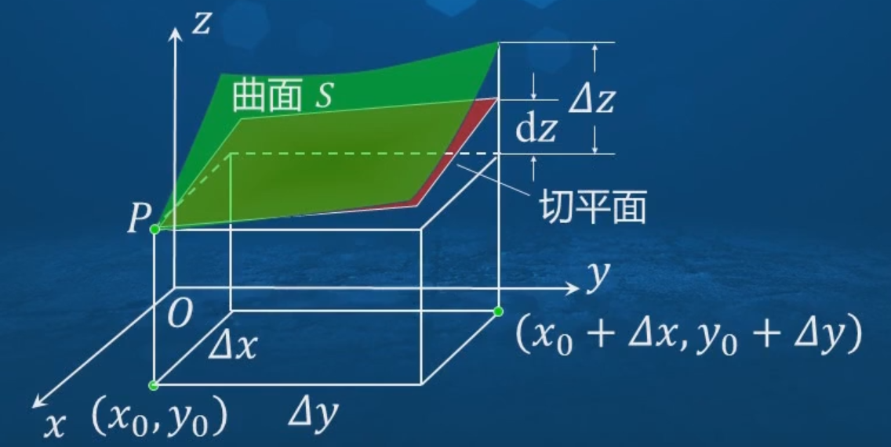

## 一、偏导数的概念

在研究一元函数的变化率时，我们引入了导数的概念。对于多元函数，我们也需要研究它的变化率问题。由于多元函数的自变量不止一个，因变量与自变量的关系比较复杂，所以当我们研究多元函数时，首先考虑的是因变量关于单个自变量的变化率问题。这就引人了偏导数的概念。

定义：设函数$z=f(x, y)$在点$\left(x_{0}, y_{0}\right)$的某个邻域内有定义。固定$y=y_{0}$，对一元函数$F(x)=f\left(x, y_{0}\right)$的自变量$x$在点$x_{0}$  处给出增量$\Delta x$，则有函数增量：
$$\Delta F=F\left(x_{0}+\Delta x\right)-F\left(x_{0}\right)=f\left(x_{0}+\Delta x, y_{0}\right)-f\left(x_{0}, y_{0}\right)$$

若极限存在：

$$\lim _{\Delta x \rightarrow 0} \frac{\Delta F}{\Delta x}=\lim _{\Delta x \rightarrow 0} \frac{f\left(x_{0}+\Delta x, y_{0}\right)-f\left(x_{0}, y_{0}\right)}{\Delta x}$$
则称此极限值为函数$z=f(x, y)$在点$\left(x_{0}, y_{0}\right)$处对$x$的偏导数，记为：
$$\left.\frac{\partial z}{\partial x}\right|_{\substack{x=x_{0} \\ y=y_{0}}} \Leftrightarrow  \quad  \left. \frac{\partial f}{\partial x}\right|_{\substack{x=x_{0} \\ y=y_{0}}}  \Leftrightarrow  \quad f_{x}\left(x_{0} , y_{0}\right)  \Leftrightarrow  \quad z_{x}\left(x_{0}, y_{0}\right) \quad \Leftrightarrow  \left.\quad z_{x}\right|_{\substack{x=x_{0} \\ y=y_{0}}} \quad  或  \quad  \left. z_{x}\right|_{\left(x_{0}, y_{0}\right)}$$ 

同样，函数$z=f(x, y)$在点$\left(x_{0}, y_{0}\right)$处对$y$的偏导数定义为极限：
$$\lim _{\Delta y \rightarrow 0} \frac{f\left(x_{0}, y_{0}+\Delta y\right)-f\left(x_{0}, y_{0}\right)}{\Delta y}$$
对$y$的偏导数记为：
$$\left.\frac{\partial z}{\partial y}\right|_{\substack{x=x_{0} \\ y=y_{0}}}  \Leftrightarrow \quad  \left.\frac{\partial f}{\partial y}\right|_{\substack{x=x_{0} \\ y=y_{0}}} \Leftrightarrow \quad f_{y}\left(x_{0}, y_{0}\right)  \Leftrightarrow \quad z_{y}\left(x_{0}, y_{0}\right)    \quad\Leftrightarrow \left.\quad z_{y}\right|_{\substack{x=x_{0} \\ y=y_{0}}} \quad   或  \quad \left.z_{y}\right|_{\left(x_{0}, y_{0}\right)}  $$

$z=f(x, y)$在点$(x_{0}, y_{0})$处：
$$  \begin{cases}
  & 关于x的偏增量：\Delta F=f\left(x_{0}+\Delta x, y_{0}\right)-f\left(x_{0}, y_{0}\right) \\  \newline
  & 关于y的偏增量：\Delta_{y} z=f\left(x_{0}, y_{0}+\Delta y\right)-f\left(x_{0}, y_{0}\right) \\ \newline
  & 全增量：\Delta z=f\left(x_{0}+\Delta y, y_{0}+\Delta y\right)-f\left(x_{0}, y_{0}\right)
\end{cases}$$

偏导函数表达形式：（简称偏导数）
$$  \begin{cases}
  &  f_{x}\left(x_{0}, y_{0}\right)  \Longleftrightarrow  f_{x}^{\prime}\left(x_{0}, y_{0}\right) \Longleftrightarrow     f_{1}\left(x_{0}, y_{0}\right)  \\  \newline
  & f_{y}\left(x_{0}, y_{0}\right) \Longleftrightarrow f_{y}^{\prime}\left(x_{0}, y_{0}\right)  \Longleftrightarrow  f_{2}\left(x_{0}, y_{0}\right) \\   \newline
  & f_{x}\left(x_{0}, y_{0}\right)  \Longrightarrow F(x)   =f\left(x, y_{0}\right)  的 导数 F^{\prime}\left(x_{0}\right)=f_{x}\left(x_{0}, y_{0}\right)  \\  \newline
  & f_{y}\left(x_{0}, y_{0}\right)  \Longrightarrow   G(y)=f\left(x_{0}, y\right) 的导数G^{\prime}\left(y_{0}\right)=f_{y}\left(x_{0}, y_{0}\right)  \\  
\end{cases}$$

一元函数中 ＂可导必连续＂的性质在多元函数中不再成立，即在多元函数中可导不一定连续。这是因为偏导数反映的仅仅是函数在沿坐标轴方向上的变化率，不能全面反映函数在其他方向上的变化率。

## 二、高阶偏导数

设函数$z=f(x, y)$在区域$D$内有偏导函数$\frac{\partial z}{\partial x}=f_{x}(x, y), \frac{\partial z}{\partial y}=f_{y}(x, y)$。如果这两个偏导函数在  $D$内仍有偏导数，则称它们的偏导数为函数$f(x, y)$的二阶偏导数．例如：
$$  \begin{cases}
  & 对  \dfrac{\partial z}{\partial x}  求关于  x  的偏导数：记为  \dfrac{\partial^{2} z}{\partial x^{2}} \Longrightarrow  \dfrac{\partial^{2} z}{\partial x^{2}}=\dfrac{\partial}{\partial x}\left(\dfrac{\partial z}{\partial x}\right)  \Longleftrightarrow   f_{x x}(x, y) \quad  f_{11}(x, y) \quad z_{x x}   \\  \newline
  & 对  \dfrac{\partial z}{\partial x}  求关于  y  的偏导数：记为  \dfrac{\partial^{2} z}{\partial x \partial y}     \Longrightarrow  \dfrac{\partial^{2} z}{\partial x \partial y}=\dfrac{\partial}{\partial y}\left(\dfrac{\partial z}{\partial x}\right)   \Longleftrightarrow    f_{x y}(x, y) \quad f_{12}(x, y) \quad  z_{x y}   \\  \newline
  & 对  \dfrac{\partial z}{\partial y}  求关于  x  的偏导数：记为\dfrac{\partial^{2} z}{\partial y \partial x} \Longrightarrow  \dfrac{\partial^{2} z}{\partial y \partial x}=\dfrac{\partial}{\partial x}\left(\dfrac{\partial z}{\partial y}\right)    \Longleftrightarrow    f_{y x}(x, y) \quad f_{21}(x, y)  \quad  z_{\mathrm{yx}} \\  \newline
  & 对  \dfrac{\partial z}{\partial y}  求关于  y  的偏导数 ：记为  \dfrac{\partial^{2} z}{\partial y^{2}}  \Longrightarrow   \dfrac{\partial^{2} z}{\partial y^{2}}=\dfrac{\partial}{\partial y}\left(\dfrac{\partial z}{\partial y}\right)    \Longleftrightarrow f_{y y}(x, y) \quad f_{22}(x, y) \quad z_{y y}    \\ 
\end{cases}$$

二元函数$z=f(x, y)$ 的二阶偏导数共有四个，其中将$\dfrac{\partial^{2} z}{\partial x \partial y}$和 $\dfrac{\partial^{2} z}{\partial y \partial x}$称为二阶混合偏导数，二阶及二阶以上的偏导数统称为高阶偏导数，而$\dfrac{\partial z}{\partial x}, \dfrac{\partial z}{\partial y}$可称为一阶偏导数。

求函数$z=x^{3}-3 x^{2} y+y^{3}$的所有二阶偏导数:因为$\frac{\partial z}{\partial x}=3 x^{2}-6 x y, \frac{\partial z}{\partial y}=-3 x^{2}+3 y^{2}$，所
以$z$的所有二阶偏导数如下：
$$  \begin{cases}
  & \dfrac{\partial^{2} z}{\partial x^{2}}=\dfrac{\partial}{\partial x}\left(\dfrac{\partial z}{\partial x}\right)=\dfrac{\partial}{\partial x}\left(3 x^{2}-6 x y\right)=6 x-6 y   \\  \newline
  &\dfrac{\partial^{2} z}{\partial x \partial y}=\dfrac{\partial}{\partial y}\left(\dfrac{\partial z}{\partial x}\right)=\dfrac{\partial}{\partial y}\left(3 x^{2}-6 x y\right)=-6 x    \\  \newline
  & \dfrac{\partial^{2} z}{\partial y \partial x}=\dfrac{\partial}{\partial x}\left(\dfrac{\partial z}{\partial y}\right)=\dfrac{\partial}{\partial x}\left(-3 x^{2}+3 y^{2}\right)=-6 x   \\  \newline
  & \dfrac{\partial^{2} z}{\partial y^{2}}=\dfrac{\partial}{\partial y}\left(\dfrac{\partial z}{\partial y}\right)=\dfrac{\partial}{\partial y}\left(-3 x^{2}+3 y^{2}\right)=6 y   \\ 
\end{cases}$$

定理:如果函数$z=f(x, y)$的两个混合偏导数$\frac{\partial^{2} z}{\partial x \partial y}$及$\frac{\partial^{2} z}{\partial y \partial x}$在区域$D$内连续，则在该区域内这两个混合偏导数必相等，即:
$$\dfrac{\partial^{2} z}{\partial x \partial y}=\dfrac{\partial^{2} z}{\partial y \partial x}$$

## 三、全微分

**全微分概念：**

对于一元函数$y=f(x)$，如果它在点$x$处的增量$\Delta y$可以表示如下式：其中$A$不随变量$\Delta x$的变化而变化，它仅与$x$有关，$o(\Delta x)$是$\Delta x$的高阶无穷小量$(\Delta x \rightarrow 0)$，则称函数$f(x)$在点$x$处可微，称$\mathrm{d} y=A \Delta x$为函数$f(x)$在点$x$处的微分。
$$\Delta y=f(x+\Delta x)-f(x)=A \Delta x+o(\Delta x)   \Longrightarrow  A=f^{\prime}(x) $$

定义：设二元函数$z=f(x, y)$在点$(x, y)$的某邻域内有定义，其全增量为$\Delta z=f(x+\Delta x, y+\Delta y)-f(x, y)$，如果全增量$\Delta z$可以表示为：
$$\Delta z=A \Delta x+B \Delta y+o(\rho) $$
其中$A, B$不随变量$\Delta x, \Delta y$的变化而变化，它们仅与$x, y$有关，$\rho=\sqrt{(\Delta x)^{2}+(\Delta y)^{2}}, o(\rho)$是$\rho$ 的高阶无穷小量  ($\rho \rightarrow 0$) 则称函数$f(x, y)$在点$(x, y)$处可微，并称$A \Delta x+B \Delta y$为此函数在点$(x, y)$处的全微分，记为$\mathrm{d} z$，即：

$$\mathrm{d} z=A \Delta x+B \Delta y $$

注：$\rho$表示点$P(x, y)$与点$P^{\prime}(x+\Delta x, y+\Delta y)$的距离 ，当 $\Delta x \rightarrow 0, \Delta y \rightarrow 0$时，意味着 $P^{\prime}(x+\Delta x, y+\Delta y) \rightarrow   P(x, y)$，则有$\rho \rightarrow 0$，反之，若$\rho \rightarrow 0$，则也有$\Delta x \rightarrow 0, \Delta y \rightarrow 0$，根据$o(\rho)$的意义，就有：

$$\lim _{\substack{\Delta x \rightarrow 0 \\ \Delta y \rightarrow 0}} \frac{o(\rho)}{\sqrt{(\Delta x)^{2}+(\Delta y)^{2}}}=\lim _{\rho \rightarrow 0} \frac{o(\rho)}{\rho}=0 $$

由可微的定义，有$\Delta z-\mathrm{d} z=o(\rho)$，这说明，当点$P$与 $P^{\prime}$的距离$\rho$很小时，差 $\Delta z-\mathrm{d} z$比$\rho$小得多，此时  $\Delta z \approx \mathrm{d} z$全微分 $\mathrm{d} z   =A \Delta x+B \Delta y$是变量$\Delta x, \Delta y$的线性函数（即一次函数）。

令$\frac{o(\rho)}{\rho}=\omega$，则$o(\rho)=\omega \rho$，由$\lim _{\rho \rightarrow 0} \frac{o(\rho)}{\rho}=0$，可知$\lim _{\rho \rightarrow 0} \omega=0$，可以写为：

$$\Delta z=A \Delta x+B \Delta y+\omega \rho$$

显然，当函数$z=f(x, y)$在点$(x, y)$处可微时，它也在点$(x, y)$处连续，如果函数$z=f(x, y)$在区域$D$上的每一点处都可微，则称该函数在区域$D$上可微。

**全微分充要条件：**

可微的充分条件：若函数$z=f(x, y)$的两个偏导数在点$(x, y)$处连续，则函数$f(x, y)$在点$(x, y)$处可微 。

可微的必要条件：如果函数$z=f(x, y)$在点$(x, y)$处可微，则函数$f(x, y)$在点$(x, y)$处的两个偏导数都存在，且上式中的常数$A, B$恰是函数$f(x, y)$的两个偏导数，即：
$$A=f_{x}(x, y), \quad B=f_{y}(x, y)$$

当函数$z=f(x, y)$ 在点 $(x, y)$处可微时，$\mathrm{d} z=f_{x}(x, y) \Delta x+f_{y}(x, y) \Delta y$与一元函数一样，将$\Delta x, \Delta y$分别记为  $\mathrm{d} x, \mathrm{d} y$分别称为关于自变量 $x, y$的微分，于是函数$z=f(x, y)$的全微分可记为：

$$\mathrm{d} z=\frac{\partial z}{\partial x} \mathrm{~d} x+\frac{\partial z}{\partial y} \mathrm{~d} y \quad \text { 或 } \quad \mathrm{d} z=f_{x}(x, y) \mathrm{d} x+f_{y}(x, y) \mathrm{d} y$$

全微分的概念及其有关结论都可推广到$n(n \geq 3)$元函数上。例如，三元函数$u=f(x, y, z)$可微时，有：

$$\mathrm{d} u=\frac{\partial u}{\partial x} \mathrm{~d} x+\frac{\partial u}{\partial y} \mathrm{~d} y+\frac{\partial u}{\partial z} \mathrm{~d} z$$

**全微分必要条件证明：**

设函数$z=f(x, y)$在点$(x, y)$处可微，则在点$(x, y)$的某个邻域中成立，令$\Delta y=0$，此时$\rho=\sqrt{(\Delta x)^{2}}=|\Delta x|$，则：
$$\Delta z=A \Delta x+B \Delta y+\omega \rho \Longrightarrow    f(x+\Delta x, y)-f(x, y)=A \Delta x+\omega|\Delta x|$$

当 $\Delta x \neq 0$时，上式两端同除以$\Delta x$，而$\lim _{\Delta x \rightarrow 0} \omega=\lim _{\rho \rightarrow 0} \omega=0$且$\frac{|\Delta x|}{\Delta x}= \pm 1$有界，则根据偏导数的定义有：

$$f_{x}(x, y)=\lim _{\Delta x \rightarrow 0} \frac{f(x+\Delta x, y)-f(x, y)}{\Delta x}=\lim _{\Delta x \rightarrow 0}\left(A+\omega \frac{|\Delta x|}{\Delta x}\right)=A$$

其中用到$\lim _{\Delta x \rightarrow 0} \omega \frac{|\Delta x|}{\Delta x}=0$，同理可证$f_{y}(x, y)=B$。

## 四、全微分概念解析

- $\rho$ 的内涵：$\rho=\sqrt{(\Delta x)^{2}+(\Delta y)^{2}}$

  - 几何意义：表示平面上两点$P(x,y)$和 $P'(x+Δx, y+Δy)$ 之间的欧几里得距离。这为二元函数中的"接近"提供了自然的度量，类似于一元函数中的 $|Δx|$。
  - 方向独立性：在二元函数中，我们可以从任意方向接近点$(x,y)$，而不仅仅是沿坐标轴方向。$\rho$ 提供了一个与方向无关的量度，确保函数的可微性在所有方向上都成立。
  - 通过 $\rho$ 我们可以精确地表达"当两点足够接近时，函数值的变化近似于一个线性函数"这一概念。

- 高阶无穷小的表示：$o(\rho)$ 
   - 它描述了线性近似（即全微分）与函数实际增量之间的误差。这个误差必须是高阶无穷小量，确保近似的精确性。
   - 函数连续只需要 $Δz→0$当 $(Δx,Δy)→(0,0)$，而可微则要求更强的条件，即 $Δz$ 与线性项的差是高阶无穷小。

## 五、混合偏导数相等证明

**第一步：明确定理及前提条件**

定理（$Clairaut$定理）：若函数$f(x, y)$在开区域$D$内具有连续的二阶混合偏导数$f_{x y}$和$f_{y x}$，则在该区域内$f_{x y}=f_{y x}$。

前提条件：函数$f(x, y)$在区域$D$内有二阶偏导数，二阶偏导数$f_{x y}$和$f_{y x}$在区域$D$内连续，这个条件确保了我们可以应用后续的平均值定理，并且在极限过程中保证结果的一致性。

**第二步：设定证明框架**

 我们将从任意选定的点$(a, b) \in D$出发，证明在该点处$f_{x y}(a, b)=f_{y x}(a, b)$。由于点的选择是任意的，这将证明定理在整个区域内成立。
为了简化符号，我们用$f_{x}$表示$\dfrac{\partial f}{\partial x}$，用 $f_{y}$表示$\dfrac{\partial f}{\partial y}$，用$f_{x y}$表示$\dfrac{\partial^{2} f}{\partial y \partial x}$ ，用$f_{y x}$表示$\dfrac{\partial^{2} f}{\partial x \partial y}$。

**第三步：构造辅助函数**

$(a, b)$周围的小矩形区域，其四个顶点为如下，其中$h>0$和$k>0$是足够小的正数，使得闭矩形$[a, a+h] \times[b, b+k]$完全包含在区域$D$内。
$$(a, b) \quad  (a+h, b)  \quad (a, b+k)  \quad (a+h, b+k)    $$

定义辅助函数：
$$\Phi(x, y)=f(x, y)-f(x, b)-f(a, y)+f(a, b)$$

这样构造的目的：这个函数被精心设计，使得在矩形的三个顶点$(a, b), (a+h, b)  和  (a, b+k)$处函数值均为零，这将简化后续的计算。从几何上看，我们构造了一个函数，它测量了函数$f$ 从点$(a, b)$到点$(x, y)$的＂净增长＂，排除了沿坐标轴方向的单独变化。

**第四步：验证辅助函数在三个顶点的值**

计算$\Phi(x, y)$在四个顶点的值：前三个点的函数值为零，而第四个点的函数值正是我们要研究的表达式。

$$\begin{cases}

  &  \Phi(x, y)=f(x, y)-f(x, b)-f(a, y)+f(a, b)  \\ \newline
  &  \Phi(a, b)=f(a, b)-f(a, b)-f(a, b)+f(a, b)=0   \\ \newline
  &  \Phi(a+h, b)=f(a+h, b)-f(a+h, b)-f(a, b)+f(a, b)=0  \\ \newline
  & \Phi(a, b+k)=f(a, b+k)-f(a, b)-f(a, b+k)+f(a, b)=0  \\ \newline
  & \Phi(a+h, b+k)=f(a+h, b+k)-f(a+h, b)-f(a, b+k)+f(a, b)
\end{cases}$$

**第五步：定义两条不同的路径**

现在，我们将从点$(a, b)$到点$(a+h, b+k)$定义两条不同的路径，并分析沿这两条路径计算得到的函数值：

路径$1$：先沿$x$轴方向从$(a, b)$到$(a+h, b)$，再沿$y$轴方向从$(a+h, b)$到$(a+h, b+k)$

路径$2$：先沿$y$轴方向从$(a, b)$到$(a, b+k)$，再沿$x$轴方向从$(a, b+k)$到$(a+h, b+k)$

目的：通过比较从同一起点到同一终点的两条不同路径上的函数变化，我们可以建立二阶混合偏导数之间的关系。

**第六步：定义一元辅助函数**

对于路径$1$（先$x$后$y$）的第二段，定义：

$$\phi(y)=\Phi(a+h, y), \quad y \in[b, b+k]$$

对于路径$2$（先$y$后$x$）的第二段，定义：

$$\psi(x)=\Phi(x, b+k), \quad x \in[a, a+h]$$

目的：将二元函数问题转化为一元函数问题，使我们能够应用一元函数的平均值定理，这是证明的关键步骤。

**第七步：应用一元函数的平均值定理**

对于函数$\phi(y)$，由于$\phi(b)=\Phi(a+h, b)=0$，应用拉格朗日中值定理，存在$\eta \in(b, b+ k)$使得：

$$\phi(b+k)-\phi(b)=\phi^{\prime}(\eta) \cdot k   \Longrightarrow 
\phi(b+k)=\phi^{\prime}(\eta) \cdot k=\left.\frac{d \Phi(a+h, y)}{d y}\right|_{y=\eta} \cdot k=\frac{\partial \Phi}{\partial y}(a+h, \eta) \cdot k
$$

同理，对于函数$\psi(x)$，由于$\psi(a)=\Phi(a, b+k)=0$，存在$\xi \in(a, a+h)$使得：
$$\psi(a+h)=\psi^{\prime}(\xi) \cdot h=\frac{\partial \Phi}{\partial x}(\xi, b+k) \cdot h$$

目的：通过平均值定理，我们将函数值的变化与偏导数联系起来，为后续建立二阶偏导数之间的关系奠定基础。

**第八步：计算辅助函数的一阶偏导数**

计算$\Phi(x, y)$关于$x$和$y$的偏导数：

$$\begin{cases}
  & \dfrac{\partial \Phi}{\partial x}(x, y)=\dfrac{\partial}{\partial x}[f(x, y)-f(x, b)-f(a, y)+f(a, b)]=\dfrac{\partial f}{\partial x}(x, y)-\dfrac{\partial f}{\partial x}(x, b) \\ \newline
  &  \dfrac{\partial \Phi}{\partial y}(x, y)=\dfrac{\partial}{\partial y}[f(x, y)-f(x, b)-f(a, y)+f(a, b)]=\dfrac{\partial f}{\partial y}(x, y)-\dfrac{\partial f}{\partial y}(a, y) \\
\end{cases}$$

计算偏导数的目的：为下一步计算二阶偏导数做准备，同时验证辅助函数的特性。

**第九步：进一步应用中值定理**

对于$\dfrac{\partial \Phi}{\partial y}(a+h, \eta)$，有：

$$\frac{\partial \Phi}{\partial y}(a+h, \eta)=\frac{\partial f}{\partial y}(a+h, \eta)-\frac{\partial f}{\partial y}(a, \eta)$$

对函数$g(x)=\dfrac{\partial f}{\partial y}(x, \eta)$在区间$[a, a+h]$上应用中值定理，存在$\zeta \in(a, a+h)$使得：

$$\frac{\partial f}{\partial y}(a+h, \eta)-\frac{\partial f}{\partial y}(a, \eta)=\frac{\partial^{2} f}{\partial y  \partial x}(\zeta, \eta) \cdot h   \Longrightarrow     \frac{\partial \Phi}{\partial y}(a+h, \eta)=\frac{\partial^{2} f}{\partial y \partial x}(\zeta, \eta) \cdot h$$

对于$\dfrac{\partial \Phi}{\partial x}(\xi, b+k)$，有：
$$\dfrac{\partial \Phi}{\partial x}(\xi, b+k) = \dfrac{\partial f}{\partial x}(\xi, b+k)-\dfrac{\partial f}{\partial x}(\xi, b)$$

对函数$\dfrac{\partial f}{\partial x}(\xi, b)$在区间$[b, b+k]$上应用中值定理，存在$\gamma \in(b, b+k)$使得：

$$\dfrac{\partial f}{\partial x}(\xi, b+k)-\dfrac{\partial f}{\partial x}(\xi, b)=\frac{\partial^{2} f}{\partial x \partial y}(\xi, \gamma) \cdot k   \Longrightarrow      \frac{\partial \Phi}{\partial x}(\xi, b+k)=\frac{\partial^{2} f}{\partial x \partial y}(\xi, \gamma) \cdot k$$

**第十步：建立二阶混合偏导数之间的关系**

由以上推导，我们有：
$$\begin{cases}
  & \phi(b+k)=\dfrac{\partial \Phi}{\partial y}(a+h, \eta) \cdot k=\dfrac{\partial^{2} f}{\partial y \partial x }(\zeta, \eta) \cdot h \cdot k \\ \newline
  & \psi(a+h)=\dfrac{\partial \Phi}{\partial x}(\xi, b+k) \cdot h=\dfrac{\partial^{2} f}{\partial  x \partial y}(\xi, \gamma) \cdot k \cdot h  \\
\end{cases}$$

同时，我们知道：$\phi(b+k)=\Phi(a+h, b+k)=\psi(a+h)$，因此：
$$\frac{\partial^{2} f}{\partial y \partial x }(\zeta, \eta) \cdot h \cdot k=\frac{\partial^{2} f}{\partial  x \partial y}(\xi, \gamma) \cdot k \cdot h$$
简化后得到：
$$\frac{\partial^{2} f}{\partial y \partial x}(\zeta, \eta)=\frac{\partial^{2} f}{\partial x \partial y}(\xi, \gamma)$$

建立关系的意义：我们已经证明，在两个不同但接近原点$(a,b)$的点处，两种不同顺序的二阶混合偏导数是相等的。

**第十一步：应用连续性完成证明**

当  $h, k \rightarrow 0$  时，由于点  $(\zeta, \eta)$  和点  $(\xi, \gamma)$  都位于以  $(a, b)$  为左下角顶点的矩形内，所以：
$$\begin{cases}
  & \zeta \rightarrow a  \\ \newline
  & \eta \rightarrow b  \\ \newline
  & \xi \rightarrow a  \\ \newline
    &  \gamma \rightarrow b  \\  
\end{cases}$$
由于二阶混合偏导数  $f_{x y}$  和  $f_{y x}$  在区域  $D$  内连续，我们有：
$$\begin{cases}
    & \lim _{h, k \rightarrow 0} \dfrac{\partial^{2} f}{\partial y \partial x}(\zeta, \eta) & =\dfrac{\partial^{2} f}{\partial y \partial x}(a, b)=f_{y x}(a, b) \\ \newline
    & \lim _{h, k \rightarrow 0} \dfrac{\partial^{2} f}{\partial x \partial y}(\xi, \gamma) & =\dfrac{\partial^{2} f}{\partial x \partial y}(a, b)=f_{x y}(a, b)  \\  
  \end{cases} \Longrightarrow    f_{y x}(a, b)=f_{x y}(a, b)$$

应用连续性的目的：通过极限过程，我们将不同点处二阶混合偏导数的相等性转化为同一点处二阶混合偏导数的相等性。

## 六、全微分几何说明

**切平面方程推导：**

- **步骤$1$：曲面表示与点的确定**

    给定曲面$z=f(x, y)$和曲面上一点$P_{0}\left(x_{0}, y_{0}, z_{0}\right)$，其中$z_{0}=f\left(x_{0}, y_{0}\right)$

- **步骤$2$：确定曲面在该点的法向量**
  $$\begin{cases}
    &  求曲面在点P_{0}处关于x的偏导数：f_{x}\left(x_{0}, y_{0}\right) \\ \newline
    & 求曲面在点P_{0}处关于y的偏导数：f_{y}\left(x_{0}, y_{0}\right)  \\ \newline
    & 曲面在点P_{0}的法向量为：\vec{n} = (-f_x(x_0, y_0), -f_y(x_0, y_0), 1)
  \end{cases}$$
   点积法：利用点积求法向量,已知曲面$z=f(x, y)$，在点$P_{0}\left(x_{0}, y_{0}\right)$处的两个切向量为：
  $$\begin{array}{l} 
  \overrightarrow{t_{x}}=\left(1,0, f_{x}\left(x_{0}, y_{0}\right)\right) \\ \newline
  \overrightarrow{t_{y}}=\left(0,1, f_{y}\left(x_{0}, y_{0}\right)\right)
  \end{array}  $$
  法向量$\vec{n}=(a, b, c)$必须与$\overrightarrow{t_{x}}$和$\overrightarrow{t_{y}}$都正交，因此我们有两个点积方程：
  $$\begin{cases}
    &  \overrightarrow{t_{x}} \cdot \vec{n}=0  =  \left(1,0, f_{x}\right) \cdot(a, b, c)=1 \cdot a+0 \cdot b+f_{x} \cdot c \Longrightarrow  a+f_{x} c=0\\ \newline
    & \overrightarrow{t_{y}} \cdot \vec{n}=0 =  \left(0,1, f_{y}\right) \cdot(a, b, c)=0 \cdot a+1 \cdot b+f_{y} \cdot c \Longrightarrow b+f_{y} c=0\\ 
  \end{cases}$$

  这个方程组有无穷多个解，我们可以取一个特别简单的解，比如设$c=1$，代入：
  $$a=-f_{x}, \quad b=-f_{y}, \quad c=1$$

   叉积法：曲面的法向量是这两个切向量的，通过叉积我们可以得到一个垂直于这两个切向量的向量。
  $$   \vec{n}=\overrightarrow{t_{x}} \times \overrightarrow{t_{y}}  \Longrightarrow  \vec{n}=\left|\begin{array}{ccc}
  \hat{i} & \hat{j} & \hat{k} \\
  1 & 0 & f_{x}\left(x_{0}, y_{0}\right) \\
  0 & 1 & f_{y}\left(x_{0}, y_{0}\right)
  \end{array}\right|    \Longrightarrow     \vec{n}=\left(-f_{x}\left(x_{0}, y_{0}\right),-f_{y}\left(x_{0}, y_{0}\right), 1\right) $$

- **步骤$3$：利用点法式方程** 

   点法式平面方程的一般形式：
  $$\left(x-x_{0}\right) n_{x}+\left(y-y_{0}\right) n_{y}+\left(z-z_{0}\right) n_{z}=0$$

   将法向量 $\vec{n}=\left(-f_{x}\left(x_{0}, y_{0}\right),-f_{y}\left(x_{0}, y_{0}\right), 1\right)$代入：

  $$-f_{x}\left(x_{0}, y_{0}\right)\left(x-x_{0}\right)-f_{y}\left(x_{0}, y_{0}\right)\left(y-y_{0}\right)+\left(z-z_{0}\right)=0  $$

- **步骤$4$：整理切平面方程** 

    $$z-z_{0}=f_{x}\left(x_{0}, y_{0}\right)\left(x-x_{0}\right)+f_{y}\left(x_{0}, y_{0}\right)\left(y-y_{0}\right)  $$

   代入  $z_{0}=f\left(x_{0}, y_{0}\right)$，得到切平面方程：

  $$z=f\left(x_{0}, y_{0}\right)+f_{x}\left(x_{0}, y_{0}\right)\left(x-x_{0}\right)+f_{y}\left(x_{0}, y_{0}\right)\left(y-y_{0}\right)  $$

 

- **步骤$5$：近似得到关于曲面的全微分** 

   设起始点为$(x_0,y_0)$，曲面在$x,y$方向各自增加了$\Delta x$ 和$\Delta y$，变化得到$(x,y)$那么这两点的切平面方程分别是：
  $$\begin{cases}
    & z_{(x_0,y_0)}=f\left(x_{0}, y_{0}\right)+f_{x}\left(x_{0}, y_{0}\right)\left(x_{0}-x_{0}\right)+f_{y}\left(x_{0}, y_{0}\right)\left(y_{0}-y_{0}\right)  \\  \newline
    & z_{(x,y)}=f\left(x_{0}, y_{0}\right)+f_{x}\left(x_{0}, y_{0}\right)\left(x-x_{0}\right)+f_{y}\left(x_{0}, y_{0}\right)\left(y-y_{0}\right)  \\ 
  \end{cases}$$
  
   曲面的高度变化可以近似使用切面的高度变化，则：

    $$\Delta z \approx  dz=z_{(x,y)}-z_{(x_0,y_0)}=f_{x}\left(x_{0}, y_{0}\right)\left(x-x_{0}\right)+f_{y}\left(x_{0}, y_{0}\right)\left(y-y_{0}\right) $$

## 七、可微、可导及连续之间的关系

- 在多元函数中，可微、可导及连续之间的关系与一元函数的情况有所不同：

  - 可微必可导，可导不一定可微。

  - 可微必连续，连续不一定可微。

  - 可导不一定连续，连续不一定可导 。

