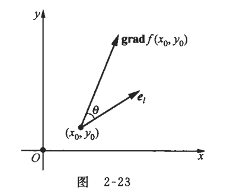

## 一、多元函数的极值与最值

定义：设函数$z=f(x, y)$在区域$D$上有定义，点$P_{0}\left(x_{0}, y_{0}\right)$的某个邻域$U \subset D$  

如果对于$U$中异于$P_{0}\left(x_{0}, y_{0}\right)$的任何点 $P(x, y)$  ，总有不等式$f(x, y)<f\left(x_{0}, y_{0}\right)$成立，则称$f\left(x_{0}, y_{0}\right)$为函数$f(x, y)$的一个极大值，其中$P_{0}\left(x_{0}, y_{0}\right)$称为极大值点；

如果对于$U$中异于$P_{0}\left(x_{0}, y_{0}\right)$的任何点 $P(x, y)$，总有不等式$f(x, y)>f\left(x_{0}, y_{0}\right)$成立，则称 $f\left(x_{0}, y_{0}\right)$为函数$f(x, y)$的一个极小值，其中$P_{0}\left(x_{0}, y_{0}\right)$称为极小值点；

极大值和极小值统称为极值，极大值点和极小值点统称为极值点，以极大值为例，$f\left(x_{0}, y_{0}\right)$是函数$z=f(x, y)$在$U$上的最大值，但它不一定是$D$上的最大值，故极大值是函数在局部范围$U$上的最大值。

如果 $f(x, y)$在$D$上的最大值在点 $P_{0}$处取到，则它一定是极大值，同理，极小值也是局部范围$U$上的最小值，如果$f(x, y)$在$D$上的最小值在点$P_{0}$处取到，则它也一定是极小值，极值是可疑的最值，极值是局部范围内的最值，极值点$P_{0}$ 应是函数定义域的内点，即$P_{0}$不是定义域的边界点。

极值的必要条件定理：设函数$z=f(x, y)$在点$P_{0}\left(x_{0}, y_{0}\right)$处的两个偏导数都存在，且此函数在该点处取得极值，则：
$$f_{x}\left(x_{0}, y_{0}\right)=0, \quad f_{y}\left(x_{0}, y_{0}\right)=0$$

设$z=f(x, y)$在点$P_{0}\left(x_{0}, y_{0}\right)$处有极小值，由极小值的定义知，在点 $\left(x_{0}, y_{0}\right)$  的某个邻域  $U$  内，对于异于  $P_{0}$ 的任何点 $P(x, y)$，都有$f(x, y)>f\left(x_{0}, y_{0}\right)$成立，在这个邻域中取点$P\left(x, y_{0}\right) \neq P_{0}\left(x_{0}, y_{0}\right)$，令一元函数$F(x) =f\left(x, y_{0}\right)$，则在邻域$U$ 内恒有如下关系成立：
$$F(x)=f\left(x, y_{0}\right)>f\left(x_{0}, y_{0}\right)=F\left(x_{0}\right)$$

这说明一元函数$F(x)$ 在点$x_{0}$ 处取得极小值，由于$f_{x}\left(x_{0}, y_{0}\right)$存在，所以$F(x)$在点$x_{0}$ 处可导，根据一元函数极值存在的必要条件，有：
$$F^{\prime}\left(x_{0}\right)=0 \text {, 即 } f_{x}\left(x_{0}, y_{0}\right)=0 $$

同理有$f_{y}\left(x_{0}, y_{0}\right)=0$ ，使得  $f_{x}(x, y)=0$和$f_{y}(x, y)=0$  的点统称为函数  $f(x, y)$  的驻点，可导的极值点一定是驻点，反之，驻点不一定是极值点。

极值的充分条件定理：设函数$f(x, y)$在其驻点$\left(x_{0}, y_{0}\right)$ 的某个邻域内具有二阶的连续偏导数。

$$\begin{cases}
  &  A=f_{x x}\left(x_{0}, y_{0}\right)  \\ \newline
  &  B=f_{x y}\left(x_{0}, y_{0}\right)  \\ \newline
  &  C=f_{y y}\left(x_{0}, y_{0}\right) \\ \newline
  & \Delta=B^{2}-A C \\  
\end{cases} \Longrightarrow
\begin{cases}
  & \Delta<0 \Longrightarrow   \left(x_{0}, y_{0}\right)  \quad    A<0 ， f\left(x_{0}, y_{0}\right)  是极大值\\ \newline
  & \Delta<0 \Longrightarrow   \left(x_{0}, y_{0}\right)  \quad   A>0 ， f\left(x_{0}, y_{0}\right)  是极小值\\ \newline
  &  \Delta>0  \Longrightarrow   \left(x_{0}, y_{0}\right)  不是函数  f(x, y)  的极值点 \\ \newline
  &  \Delta=0  \Longrightarrow   f(x, y)  在 \left(x_{0}, y_{0}\right)  处有无极值不能确定 \\  
\end{cases}$$

求二元函数$f(x, y)$极值的步骤：
$$\begin{cases}
  & 求出f(x, y)的全部驻点：f_{x}(x, y)=0,  f_{y}(x, y)=0  \quad \\ \newline
  & A=f_{x x}\left(x_{0}, y_{0}\right) \quad B=f_{x y}\left(x_{0}  y_{0}\right) \quad C=f_{y y}\left(x_{0}, y_{0}\right) \quad \Delta=B^{2}-A C \\ \newline
  & 根据定理 判断在驻点  \left(x_{0}, y_{0}\right)  处函数  f(x, y)  有无极值，有何种极值 \\  
\end{cases}$$

**偏导数不存在的特殊情况**

对于偏导数不存在的点来说，也可能是极值点，例如，函数$z=\sqrt{x^{2}+y^{2}}$在点 $(0,0)$处的两个偏导数都不存在 ，但由极值的定义，该函数在点$(0,0)$处取得极小值。因此，二元函数的极值点可能是驻点或偏导数不存在的点，即这些点都是可疑的极值点。

如果我们计算$x$ 方向的偏导数，需要固定$y$ ，然后计算：
$$\frac{\partial z}{\partial x}=\lim _{h \rightarrow 0} \frac{\sqrt{(0+h)^{2}+0^{2}}-\sqrt{0^{2}+0^{2}}}{h}=\lim _{h \rightarrow 0} \frac{|h|}{h}$$

这个极限不存在，因为：当$h>0$时，$\frac{|h|}{h}=1$ ，当$h<0$时， $\frac{|h|}{h}=-1$ ，由于从左右两侧得到的极限不同，所以在$(0,0)$点处，$\frac{\partial z}{\partial x}$不存在。类似地，$\frac{\partial z}{\partial y}$在原点也不存在。

从几何角度看，函数$z=\sqrt{x^{2}+y^{2}}$在原点处形成一个尖点，这个点没有明确定义的切平面，因此偏导数不存在。这是一个典型的函数可微和偏导数存在性质的反例。

对于函数$z=\sqrt{x^{2}+y^{2}}$，要求$\frac{\partial z}{\partial x}$ ，我们需要对$x$求偏导，同时把$y$看作常数，可以将函数写成复合形式：$z=g(u)$ 其中$u=x^{2}+y^{2}$ 且 $g(u)=\sqrt{u}$，使用链式法则：
$$\begin{cases}
    & \dfrac{\partial z}{\partial x}=\dfrac{d g}{d u} \cdot \dfrac{\partial u}{\partial x} \\ \newline
    &  \dfrac{d g}{d u}=\dfrac{d \sqrt{u}}{d u}=\dfrac{1}{2 \sqrt{u}}=\dfrac{1}{2 \sqrt{x^{2}+y^{2}}}  \\ \newline
    &  \dfrac{\partial u}{\partial x}=\dfrac{\partial\left(x^{2}+y^{2}\right)}{\partial x}=2 x  \\ \newline
    & \dfrac{\partial z}{\partial x}=\dfrac{1}{2 \sqrt{x^{2}+y^{2}}} \cdot 2 x=\dfrac{x}{\sqrt{x^{2}+y^{2}}} \\  
  \end{cases}$$
同样的方法可以得到：$\dfrac{\partial z}{\partial y}=\dfrac{y}{\sqrt{x^{2}+y^{2}}}$，这些表达式在 $(0,0)$ 点处是不定式  $\frac{0}{0}$  ，因此在原点处不能使用这个公式，必须回到定义式。

对于二元以上的多元函数取得极值的必要条件与定理的结论类似。例如，设三元函数$u=f(x, y, z)$在点$P_{0}\left(x_{0}, y_{0}, z_{0}\right)$处取得极值，且在点$P_{0}$处的偏导数都存在，则：
$$f_{x}\left(x_{0}, y_{0}, z_{0}\right)=0, \quad f_{y}\left(x_{0}, y_{0}, z_{0}\right)=0, \quad f_{z}\left(x_{0}, y_{0}, z_{0}\right)=0$$

多元函数的最值：函数的最大值和最小值问题（统称为最值问题）通常包含两个方面的内容，首先，需要解决最值的存在性问题，即什么样的函数，自变量在什么样的范围内存在最值，对于多元函数，我们已有的结论是：有界闭区域上的连续函数一定有最值。但是，在其他情况下函数是否有最值往往需要对具体情况做具体分析。这个问题在数学上一直是很困难和复杂的问题。

其次，需要解决在函数最值存在的前提下如何求得最值的问题。求最值的基本思想是：在给定的区域上找出全部可疑的最值点，在这些可疑的最值点上比较函数值的大小，最大者为最大值，最小者为最小值。如果最值在区域内部（不在边界上）取到，则最值点一定是极值点。于是，极值点是可疑的最值点，从而驻点和不可导点都是可疑的最值点。

在实际应用中，我们经常用这种方法来求函数在开区域$D$内的最大值或最小值，但使用这种方法的前提是所求的最值必须存在。例如，根据实际情况已经认定可微函数在区域$D$的内部有最大值或最小值，并且在$D$ 内求得了唯一的驻点（可疑点），则该点处的函数值就是所求的最大值或最小值。

如果函数在闭区域上存在最值，则它可能在区域内部取到，也可能在边界上取到。因此，可疑的最值点不仅是区域内的驻点和不可导点，也可能是边界上的某些点，这时还需要在区域的边界上讨论函数的取值情况。

条件极值：前面讨论的极值问题，对自变量除了定义域的限制外，别无其他限制条件，一般称为无条件极值问题。但在实际问题中，会遇到对函数的自变量还有附加条件的极值问题。我们将此类极值问题称为条件极值问题。

**拉格朗日（Lagrange）乘数法定理：**

设二元函数$f(x, y)$和$\varphi(x, y)$  在所考虑的区域内具有连续的偏导数，且  $\varphi_{x}(x, y), \varphi_{y}(x, y)$  不同时为零，令：
$$L(x, y)=f(x, y)+\lambda \varphi(x, y)$$

其中常数 $\lambda$称为拉格朗日乘数，$L(x, y)$称为拉格朗日函数，求$L$的两个偏导数，并建立方程组：

$$\begin{cases}
  & \frac{\partial L}{\partial x}=f_{x}(x, y)+\lambda \varphi_{x}(x, y)=0  \\  \newline  
  & \frac{\partial L}{\partial y}=f_{y}(x, y)+\lambda \varphi_{y}(x, y)=0 \\  \newline
  & \varphi(x, y)=0 \\  
\end{cases}$$

如果函数$z=f(x, y)$在约束条件$\varphi(x, y)=0$下的极值点是$\left(x_{0}, y_{0}\right)$，则存在 $\lambda_{0}$，使得$\lambda_{0}, x_{0}, y_{0}$是方程组的解。

注意：拉格朗日乘数法只给出了在点  $\left(x_{0}, y_{0}\right)$  处取得条件极值的必要条件，即  $\left(x_{0}, y_{0}\right)$ 是可疑的极值点，而是否为极值点还需具体分析。此外，在求解方程组时往往没有必要将相应的 $\lambda_{0}$ 解出。

拉格朗日乘数法给出了求条件极值的一般方法，它的步骤是：

$$\begin{cases}
  & 根据目标函数和约束条件写出拉格朗日函数 \\  \newline  
  & 建立方程组 ，求出方程组的全部解。\\  \newline
  & 如果  \lambda_{0}, x_{0}, y_{0}  是方程组的解，则点（  x_{0}, y_{0}  ）是可疑极值点 \\  \newline
  & 判断点  \left(x_{0}, y_{0}\right)  是否为极值点 \\  
\end{cases}$$

定理：设三元函数 $f(x, y, z)$  和  $\varphi(x, y, z)$  在所考虑的区域内具有连续的偏导数，且  $\varphi_{x}(x, y, z), \varphi_{y}(x, y, z), \varphi_{z}(x, y, z)$不同时为零，令：
$$L(x, y, z)=f(x, y, z)+\lambda \varphi(x, y, z)$$

其中常数$\lambda$称为拉格朗日乘数， $L(x, y, z)$  称为拉格朗日函数，求  $L$  的三个偏导数，并建立方程组：
$$\begin{cases}
  & \frac{\partial L}{\partial x}=f_{x}(x, y, z)+\lambda \varphi_{x}(x, y, z)=0  \\  \newline  
  &\frac{\partial L}{\partial y}=f_{y}(x, y, z)+\lambda \varphi_{y}(x, y, z)=0  \\  \newline  
  & \frac{\partial L}{\partial z}=f_{z}(x, y, z)+\lambda \varphi_{z}(x, y, z)=0  \\  \newline  
  & \varphi(x, y, z)=0 \\    
\end{cases}$$

若函数$u=f(x, y, z)$在约束条件$\varphi(x, y, z)=0$下的极值点是$\left(x_{0}, y_{0}, z_{0}\right)$，则存在$\lambda_{0}$，使得$\lambda_{0}, x_{0}, y_{0}, z_{0}$是方程组的解。

有多个约束条件的条件极值问题：例如，在约束条件$\varphi(x, y, z)=0$和$\psi(x, y, z)=  0$下，求$u=f(x, y, z)$的极值，此时拉格朗日函数为：
$$L(x, y, z)=f(x, y, z)+\lambda \varphi(x, y, z)+\mu \psi(x, y, z)$$

其中常数$\lambda, \mu$是拉格朗日乘数，令$L$ 的三个偏导数等于零，并与两个约束条件放在一起建立方程组并求解，若得到的解为$\lambda_{0}, \mu_{0}, x_{0}, y_{0}, z_{0}$，则点$\left(x_{0}, y_{0}, z_{0}\right)$就是可疑极值点。

## 二、偏导数的几何应用

**空间曲线的切线与法平面**

定义：给定空间 中的曲线$L$，点$P_{0}$是$L$上的一个定点。设$P$是$L$上异于点$P_{0}$的点，直线$P_{0} P$称为经过$P_{0}$的一条割线，当点$P$沿曲线$L$无限接近点  $P_{0}$时，割线$P_{0} P$ 的极限位置$P_{0} T$称为曲线$L$在点$P_{0}$处的切线，经过点$P_{0}$且垂直于切线的平面$\Pi$称为曲线$L$在点 $P_{0}$处的法平面。

给定空间曲线：其中三个函数$x(t), y(t), z(t)$都具有连续导数且导数不同时为零，$L$上的点$P_{0}\left(x_{0}, y_{0}, z_{0}\right)$对应的参数为$t_{0}$，即$x_{0}=x\left(t_{0}\right), y_{0}=y\left(t_{0}\right), z_{0}=z\left(t_{0}\right)$。我们来推导在点$P_{0}$处的切线与法平面的方程。
$$\begin{cases}
  & x=x(t) \\  \newline  
  & y=y(t)  \\  \newline  
  & z=z(t)  \\   
\end{cases}$$

如果在$t_{0}$处给出增量$\Delta t$，则：

$$\begin{cases}
  & \Delta x=x\left(t_{0}+\Delta t\right)-x\left(t_{0}\right)  \\  \newline  
  & \Delta y=y\left(t_{0}+\Delta t\right)-y\left(t_{0}\right)   \\  \newline  
  & \Delta z=z\left(t_{0}+\Delta t\right)-z\left(t_{0}\right)   \\   
\end{cases} \Longrightarrow 
\begin{cases}
  & x_{0}+\Delta x=x\left(t_{0}+\Delta t\right) \\  \newline  
  & y_{0}+\Delta y=y\left(t_{0}+\Delta t\right) \\  \newline  
  & z_{0}+\Delta z=z\left(t_{0}+\Delta t\right) \\  
\end{cases} $$

割线$P_{0} P$的方向向量为$\overrightarrow{P_{0} P}$：
$$\begin{cases}
  &  t=t_{0}+\Delta t  \Longrightarrow   P\left(x_{0}+\Delta x, y_{0}+\Delta y, z_{0}+\Delta z\right) \\  \newline  
  &\overrightarrow{P_{0} P}=\{\Delta x, \Delta y, \Delta z\}    \Longrightarrow  \overrightarrow{P_{0} P}=\left\{\dfrac{\Delta x}{\Delta t}, \dfrac{\Delta y}{\Delta t}, \dfrac{\Delta z}{\Delta t}\right\} \\  
\end{cases}$$

当$\Delta t \to 0$，点$P$沿$L$趋向于点$P_{0}$，此时有：

$$\begin{cases}
  &  \dfrac{\Delta x}{\Delta t} \rightarrow x^{\prime}\left(t_{0}\right) \\  \newline  
  &  \dfrac{\Delta y}{\Delta t} \rightarrow y^{\prime}\left(t_{0}\right)  \\  \newline   
  &  \dfrac{\Delta z}{\Delta t} \rightarrow z^{\prime}\left(t_{0}\right)  \\   
\end{cases} \Longrightarrow 
\left\{\frac{\Delta x}{\Delta t}, \frac{\Delta y}{\Delta t}, \frac{\Delta z}{\Delta t}\right\} \rightarrow\left\{x^{\prime}\left(t_{0}\right), y^{\prime}\left(t_{0}\right), z^{\prime}\left(t_{0}\right)\right\} \neq \mathbf{0}$$

这表明，当割线趋向于切线时，割线的方向向量趋向于切线的方向向量．因此，可以取切线$P_{0} T$的方向向量为:

$$\boldsymbol{s}=\left\{x^{\prime}\left(t_{0}\right), y^{\prime}\left(t_{0}\right), z^{\prime}\left(t_{0}\right)\right\} $$

于是，切线$P_{0} T$的方程为：

$$\frac{x-x_{0}}{x^{\prime}\left(t_{0}\right)}=\frac{y-y_{0}}{y^{\prime}\left(t_{0}\right)}=\frac{z-z_{0}}{z^{\prime}\left(t_{0}\right)}$$

由于切线$P_{0} T$的方向向量就是法平面$\Pi$的法向量，因此根据平面的点法式方程可得法平面$\Pi$的方程为:

$$x^{\prime}\left(t_{0}\right)\left(x-x_{0}\right)+y^{\prime}\left(t_{0}\right)\left(y-y_{0}\right)+z^{\prime}\left(t_{0}\right)\left(z-z_{0}\right)=0$$

将向量$\left\{x^{\prime}\left(t_{0}\right), y^{\prime}\left(t_{0}\right), z^{\prime}\left(t_{0}\right)\right\}$称为曲线$L$在点$P_{0}$处的切向量，切线是与曲线在该点有相同斜率（或导数值）的直线。

**切向量方程的转换**

$\vec{P}_{0}=\left(x_{0}, y_{0}, z_{0}\right)$是点 $P_0$ 的位置向量，$\vec{v}=\left(x^{\prime}\left(t_{0}\right), y^{\prime}\left(t_{0}\right), z^{\prime}\left(t_{0}\right)\right)$是切向量：
$$\begin{cases}
  & x=x_{0}+t \cdot x^{\prime}\left(t_{0}\right)  \\  \newline  
  & y=y_{0}+t \cdot y^{\prime}\left(t_{0}\right)  \\  \newline  
  & z=z_{0}+t \cdot z^{\prime}\left(t_{0}\right)  \\   
\end{cases}$$

根据$P=\vec{P}_{0}+t \cdot \vec{v}$则有：
$$P=P_{0}+t \cdot\left(x^{\prime}\left(t_{0}\right), y^{\prime}\left(t_{0}\right), z^{\prime}\left(t_{0}\right)\right)$$

当我们写$P = P_0 + t  \cdot  v$时，我们实际上是在说：点$P$的位置向量等于点$P_0$的位置向量加上向量 $v$ 的 $t$ 倍。这描述了从点 $P_0$出发，沿着向量 $v$ 方向移动 $t|v|$ 距离后到达的点 $P$。当我们将点 $P_0(x, y, z)$ 表示为"位置向量"时，我们实际上是指从原点 $O(0, 0, 0)$ 到点 $P_0$ 的向量 $\overrightarrow{OP_0}=(x,y,z)$

 

**空间曲面的切平面与法线**

设曲面$\Sigma$的方程为$F(x, y, z)=0$，假定函数$F(x, y, z)$具有连续的偏导数且三个偏导数不同时为零，设点$P_{0}\left(x_{0}, y_{0}, z_{0}\right)$是  $\Sigma$上的一个点，$\Gamma$是曲面$\Sigma$上经过点$P_{0}$的曲线，$\Gamma$的参数方程为 ： 

$$\begin{cases}
  & x=x(t)  \\  \newline  
  & y=y(t)  \\  \newline  
  & z=z(t)  \\   
\end{cases}  \Longrightarrow 
\begin{cases}
  &   x_{0}=x\left(t_{0}\right)  \\  \newline  
  &   y_{0}=y\left(t_{0}\right)  \\  \newline  
  &   z_{0}=z\left(t_{0}\right)  \\   
\end{cases}$$

函数$x(t) ,y(t) ,z(t)$具有连续的导数且导数不同时为零，因为$\Gamma$在$\Sigma$上，则：
$$\begin{cases}
  & F(x(t), y(t), z(t)) \equiv 0    \Longrightarrow  \dfrac{\mathrm{d}}{\mathrm{~d} t} F(x(t), y(t), z(t)) \equiv 0     \\  \newline  
  &  F_{x}(x, y, z) x^{\prime}(t)+F_{y}(x, y, z) y^{\prime}(t)+F_{z}(x, y, z) z^{\prime}(t) \equiv 0 \\    
\end{cases}$$

取$t=t_{0}$，则有：

$$F_{x}\left(x_{0}, y_{0}, z_{0}\right) x^{\prime}\left(t_{0}\right)+F_{y}\left(x_{0}, y_{0}, z_{0}\right) y^{\prime}\left(t_{0}\right)+F_{z}\left(x_{0}, y_{0}, z_{0}\right) z^{\prime}\left(t_{0}\right)=0  $$

令向量$\boldsymbol{n}$和$\boldsymbol{s}$分别为：
$$\begin{cases}
  & \boldsymbol{n}=\left\{F_{x}\left(x_{0}, y_{0}, z_{0}\right), F_{y}\left(x_{0}, y_{0}, z_{0}\right), F_{z}\left(x_{0}, y_{0}, z_{0}\right)\right\}    \\  \newline  
  &  \boldsymbol{s}=\left\{x^{\prime}\left(t_{0}\right), y^{\prime}\left(t_{0}\right), z^{\prime}\left(t_{0}\right)\right\} \\    
\end{cases}$$

$\boldsymbol{s}$的几何意义是$\Gamma$在点$P_{0}$处切线的方向向量，则$t=t_{0}$时的公式可表示为数量积$\boldsymbol{n} \cdot \boldsymbol{s}=0$，这说明  $\boldsymbol{n}$与$\boldsymbol{s}$ 垂直。显然，向量$\boldsymbol{n}$只与$\Sigma$上的点$P_{0}$有关。

当点$P_{0}$固定时，$\boldsymbol{n}$就唯一确定下来。但$\boldsymbol{s}$不仅与点$P_{0}$ 有关，也与 $\Gamma$有关， $\Sigma$  上所有经过点  $P_{0}$  的曲线的切线都与固定方向  $\boldsymbol{n}$  垂直，于是，这些曲线在点$P_{0}$处的切线都位于同一个平面$\Pi$上。

我们将这个平面$\Pi$称为曲面 $\Sigma$在点$P_{0}$的切平面。因为切平面$\Pi$经过点$P_{0}$ ，且与$\boldsymbol{n}$垂直，所以由平面的点法式方程可得切平面$\Pi$的方程为：

$$F_{x}\left(x_{0}, y_{0}, z_{0}\right)\left(x-x_{0}\right)+F_{y}\left(x_{0}, y_{0}, z_{0}\right)\left(y-y_{0}\right)+F_{z}\left(x_{0}, y_{0}, z_{0}\right)\left(z-z_{0}\right)=0$$

经过点$P_{0}$且垂直于切平面$\Pi$的直线称为曲面 $\Sigma$在该点处的法线，此时法线的方程为：
$$\frac{x-x_{0}}{F_{x}\left(x_{0}, y_{0}, z_{0}\right)}=\frac{y-y_{0}}{F_{y}\left(x_{0}, y_{0}, z_{0}\right)}=\frac{z-z_{0}}{F_{z}\left(x_{0}, y_{0}, z_{0}\right)} $$

在点$P_{0}$处，垂直于切平面的向量称为在该点处的法向量，则法向量可以取为：

$$\boldsymbol{n}=\left\{F_{x}\left(x_{0}, y_{0}, z_{0}\right), F_{y}\left(x_{0}, y_{0}, z_{0}\right), F_{z}\left(x_{0}, y_{0}, z_{0}\right)\right\}$$

将$\boldsymbol{n}$单位化得：

$$n^{0}=\frac{n}{|n|}=\left\{\frac{F_{x}}{\sqrt{F_{x}^{2}+F_{y}^{2}+F_{z}^{2}}}, \frac{F_{y}}{\sqrt{F_{x}^{2}+F_{y}^{2}+F_{z}^{2}}}, \frac{F_{z}}{\sqrt{F_{x}^{2}+F_{y}^{2}+F_{z}^{2}}}\right\}$$

则法向量的方向余弦为：其中$F_{x}, F_{y}, F_{z}$分别表示$F_{x}\left(x_{0}, y_{0}, z_{0}\right), F_{y}\left(x_{0}, y_{0}, z_{0}\right), F_{z}\left(x_{0}, y_{0}, z_{0}\right)$。
$$\begin{cases}
  & \cos \alpha=\dfrac{F_{x}}{\sqrt{F_{x}^{2}+F_{y}^{2}+F_{z}^{2}}} \\  \newline  
  & \cos \beta=\dfrac{F_{y}}{\sqrt{F_{x}^{2}+F_{y}^{2}+F_{z}^{2}}} \\  \newline  
  & \cos \gamma=\dfrac{F_{z}}{\sqrt{F_{x}^{2}+F_{y}^{2}+F_{z}^{2}}} \\  
\end{cases}$$

若曲面$\Sigma$ 的方程由$z=f(x, y)$ 的形式给出，又知$P_{0}\left(x_{0}, y_{0}, z_{0}\right)$是$\Sigma$上的一点，则 $z_{0}= f\left(x_{0}, y_{0}\right)$，令$F(x, y, z)=f(x, y)-z$，则 $\Sigma$ 的方程就变为$F(x, y, z)=0$，此时：

$$F_{x}=f_{x}(x, y), \quad F_{y}=f_{y}(x, y), \quad F_{z}=-1 $$

在点$P_{0}$ 处的法向量可取为：
$$\boldsymbol{n}=\left\{f_{x}\left(x_{0}, y_{0}\right), f_{y}\left(x_{0}, y_{0}\right),-1\right\}$$

在点$P_{0}$处的切平面方程：
$$\begin{cases}
  &  f_{x}\left(x_{0}, y_{0}\right)\left(x-x_{0}\right)+f_{y}\left(x_{0}, y_{0}\right)\left(y-y_{0}\right)-\left(z-z_{0}\right)=0 \\  \newline  
  & z-z_{0}=f_{x}\left(x_{0}, y_{0}\right)\left(x-x_{0}\right)+f_{y}\left(x_{0}, y_{0}\right)\left(y-y_{0}\right)  \\   
\end{cases}$$

根据之前的结论得法线方程：
$$\frac{x-x_{0}}{f_{x}\left(x_{0}, y_{0}\right)}=\frac{y-y_{0}}{f_{y}\left(x_{0}, y_{0}\right)}=\frac{z-z_{0}}{-1}$$

如果取$-\boldsymbol{n}$作为法向量，则其方向余弦为：

$$\cos \alpha=\frac{-f_{x}}{\sqrt{1+f_{x}^{2}+f_{y}^{2}}}, \quad \cos \beta=\frac{-f_{y}}{\sqrt{1+f_{x}^{2}+f_{y}^{2}}}, \quad \cos \gamma=\frac{1}{\sqrt{1+f_{x}^{2}+f_{y}^{2}}}$$

此时由于$\cos \gamma>0$，所以法向量与$z$轴的夹角$\gamma$是锐角。

**空间曲面的切平面与法线总结**

当曲面方程$\Sigma$的方程为$F(x, y, z)=0$时，和曲面$\Sigma$ 的方程由$z=f(x, y)$ 的形式给出，令$F(x, y, z)=f(x, y)-z$，则 $\Sigma$ 的方程就变为$F(x, y, z)=0$的情况——这两种情况存在不同的公式形式：

法向量：

$$\boldsymbol{n}=\left\{F_{x}\left(x_{0}, y_{0}, z_{0}\right), F_{y}\left(x_{0}, y_{0}, z_{0}\right), F_{z}\left(x_{0}, y_{0}, z_{0}\right)\right\} \Longrightarrow  \boldsymbol{n}=\left\{f_{x}\left(x_{0}, y_{0}\right), f_{y}\left(x_{0}, y_{0}\right),-1\right\}$$

偏导数：
$$\begin{cases}
  &  F_{x}=f_{x}(x, y,z)  \\  \newline  
  &  F_{y}=f_{y}(x, y,z) \\  \newline  
  &  F_{z}=f_{y}(x, y,z) \\ 
\end{cases} \Longrightarrow 
\begin{cases}
  &  F_{x}=f_{x}(x, y)  \\  \newline  
  &  F_{y}=f_{y}(x, y) \\  \newline  
  &  F_{z}=-1 \\  
\end{cases}$$

法线方程：

$$\frac{x-x_{0}}{F_{x}\left(x_{0}, y_{0}, z_{0}\right)}=\frac{y-y_{0}}{F_{y}\left(x_{0}, y_{0}, z_{0}\right)}=\frac{z-z_{0}}{F_{z}\left(x_{0}, y_{0}, z_{0}\right)} \Longrightarrow   \frac{x-x_{0}}{f_{x}\left(x_{0}, y_{0}\right)}=\frac{y-y_{0}}{f_{y}\left(x_{0}, y_{0}\right)}=\frac{z-z_{0}}{-1}$$

切平面方程：

$$F_{x}\left(x_{0}, y_{0}, z_{0}\right)\left(x-x_{0}\right)+F_{y}\left(x_{0}, y_{0}, z_{0}\right)\left(y-y_{0}\right)+F_{z}\left(x_{0}, y_{0}, z_{0}\right)\left(z-z_{0}\right)=0 $$ 
$$\Longrightarrow \begin{cases}   
  &  f_{x}\left(x_{0}, y_{0}\right)\left(x-x_{0}\right)+f_{y}\left(x_{0}, y_{0}\right)\left(y-y_{0}\right)-\left(z-z_{0}\right)=0 \\  \newline  
  & z-z_{0}=f_{x}\left(x_{0}, y_{0}\right)\left(x-x_{0}\right)+f_{y}\left(x_{0}, y_{0}\right)\left(y-y_{0}\right)  \\   
\end{cases}$$

方向余弦：
$$ \boldsymbol{n} \begin{cases}
  & \cos \alpha=\dfrac{F_{x}}{\sqrt{F_{x}^{2}+F_{y}^{2}+F_{z}^{2}}} \\  \newline  
  & \cos \beta=\dfrac{F_{y}}{\sqrt{F_{x}^{2}+F_{y}^{2}+F_{z}^{2}}} \\  \newline  
  & \cos \gamma=\dfrac{F_{z}}{\sqrt{F_{x}^{2}+F_{y}^{2}+F_{z}^{2}}} \\ 
\end{cases} \Longrightarrow  
 -\boldsymbol{n} = \begin{cases}
  & \cos \alpha=\dfrac{-f_{x}}{\sqrt{1+f_{x}^{2}+f_{y}^{2}}} \\  \newline  
  & \cos \beta=\dfrac{-f_{y}}{\sqrt{1+f_{x}^{2}+f_{y}^{2}}} \\  \newline  
  & \cos \gamma=\dfrac{1}{\sqrt{1+f_{x}^{2}+f_{y}^{2}}} \\  
\end{cases}$$

## 三、方向导数与梯度

**方向导数**

设函数$z=f(x, y)$在点$P(x, y)$的某个邻域内有定义，$l$是从点$P$引出的一条射线，$Q(x+\Delta x, y+\Delta y)$是 $l$上的点，则点$P$与$Q$之间的距离为  $\rho=\sqrt{(\Delta x)^{2}+(\Delta y)^{2}}$，此时函数$f(x, y)$的全增量为：
$$\Delta z=f(x+\Delta x, y+\Delta y)-f(x, y)  \Longrightarrow   \frac{\Delta z}{\rho}=\frac{f(x+\Delta x, y+\Delta y)-f(x, y)}{\rho}$$

$\dfrac{\Delta z}{\rho}$表示函数$f(x, y)$在$P, Q$两点间沿$l$方向的平均变化率，如果当点$Q$沿射线$l$趋于点$P$时，上式的极限存在，则将这个极限值称为函数$f(x, y)$在点$P$处沿方向$l$的方向导数，记为$\dfrac{\partial f}{\partial l}$或$\dfrac{\partial z}{\partial l}$，当点$Q$沿射线$l$趋于点$P$时，必有$\rho \rightarrow 0$，于是：
$$\frac{\partial z}{\partial l}=\lim _{\rho \rightarrow 0} \frac{\Delta z}{\rho}=\lim _{\rho \rightarrow 0} \frac{f(x+\Delta x, y+\Delta y)-f(x, y)}{\rho} $$

定理：如果函数$z=f(x, y)$ 在点$P(x, y)$ 处可微，则在点$P$处沿任意方向$l$的方向导数存在，其中$\alpha, \beta$分别是$l$与$x$轴，$y$轴正向的夹角，且有：
$$\frac{\partial z}{\partial l}=\frac{\partial z}{\partial x} \cos \alpha+\frac{\partial z}{\partial y} \cos \beta$$

证明：由可微的定义知，函数$f(x, y)$在点$P$处的全增量可以表示为：
$$\Delta z  =f(x+\Delta x, y+\Delta y)-f(x, y)=\frac{\partial z}{\partial x} \Delta x+\frac{\partial z}{\partial y} \Delta y+o(\rho) $$

显然，$\Delta x=\rho \cos \alpha, \Delta y=\rho \cos \beta$，由方向导数定义式可得：

$$\frac{\partial z}{\partial l}=\lim _{\rho \rightarrow 0} \frac{\Delta z}{\rho}=\lim _{\rho \rightarrow 0}\left(\frac{\partial z}{\partial x} \cos \alpha+\frac{\partial z}{\partial y} \cos \beta+\frac{o(\rho)}{\rho}\right) =\frac{\partial z}{\partial x} \cos \alpha+\frac{\partial z}{\partial y} \cos \beta$$

从这个定理可以看到，方向导数中射线$l$的意义仅仅表示一个方向，这个方向可以用单位向量$\{\cos \alpha, \cos \beta\}$来表示。

设函数$u=f(x, y, z)$在点$P(x, y, z)$的某个邻域内有定义，$l$ 是由点$P$出发的一条射线，点$Q(x+\Delta x, y+\Delta y, z+\Delta z)$是$l$上的一点，函数$f(x, y, z)$在点$P$处沿方向$l$ 的方向导数定义为：

$$\frac{\partial f}{\partial l}=\frac{\partial u}{\partial l}=\lim _{\rho \rightarrow 0} \frac{f(x+\Delta x, y+\Delta y, z+\Delta z)-f(x, y, z)}{\rho}$$

其中$\rho=\sqrt{(\Delta x)^{2}+(\Delta y)^{2}+(\Delta z)^{2}}$是点$P$到点$Q$的距离，若函数$u=f(x, y, z)$在点$P(x, y, z)$处可微，射线$l$ 的方向余弦为  $\cos \alpha, \cos \beta, \cos \gamma$，则该函数在点$P$处沿方向$l$ 的方向导数为：

$$\frac{\partial u}{\partial l}=\frac{\partial u}{\partial x} \cos \alpha+\frac{\partial u}{\partial y} \cos \beta+\frac{\partial u}{\partial z} \cos \gamma$$

**梯度**

当点$P$固定，方向$l$变化时，函数$f(x, y)$的方向导数$\frac{\partial f}{\partial l}$也随之变化，这说明，对于固定的点，函数$f(x, y)$ 在不同方向上的变化率也有所不同，那么，在点$P$ 的什么方向上，函数$f(x, y)$的变化率可以达到最大？为此，我们引入梯度的概念。

给定可微的二元函数$z=f(x, y)$，则在点$\left(x_{0}, y_{0}\right)$处可确定一个向量：

$$f_{x}\left(x_{0}, y_{0}\right) \boldsymbol{i}+f_{y}\left(x_{0}, y_{0}\right) \boldsymbol{j}$$

称之为函数$f(x, y)$在点$\left(x_{0}, y_{0}\right)$处的梯度，记为$\operatorname{grad} f\left(x_{0}, y_{0}\right)$，或者$\nabla \left(x_{0}, y_{0}\right)$即：

$$\nabla f\left(x_{0}, y_{0}\right)=\operatorname{grad} f\left(x_{0}, y_{0}\right)=f_{x}\left(x_{0}, y_{0}\right) \boldsymbol{i}+f_{y}\left(x_{0}, y_{0}\right) \boldsymbol{j}=\left\{f_{x}\left(x_{0}, y_{0}\right), f_{y}\left(x_{0}, y_{0}\right)\right\}$$

假定$\operatorname{grad} f\left(x_{0}, y_{0}\right) \neq \mathbf{0}$，并设方向$l$的方向余弦为$\cos \alpha, \cos \beta$，记向量$\boldsymbol{e}_{l}=\{\cos \alpha, \cos \beta\}  ，则  \boldsymbol{e}_{l}$ 是单位向量，它表示$l$的方向，函数$z=f(x, y)$在点$\left(x_{0}, y_{0}\right)$处沿$l$方向的方向导数可以表示为两个向量的数量积形式，即：

$$\left.\frac{\partial z}{\partial l}\right|_{\left(x_{0}, y_{0}\right)}=f_{x}\left(x_{0}, y_{0}\right) \cos \alpha+f_{y}\left(x_{0}, y_{0}\right) \cos \beta=\operatorname{grad} f\left(x_{0}, y_{0}\right) \cdot \boldsymbol{e}_{l}$$

于是，由数量积的定义可知：

$$\left.\frac{\partial z}{\partial l}\right|_{\left(x_{0}, y_{0}\right)}=\left|\operatorname{grad} f\left(x_{0}, y_{0}\right)\right| \cdot\left|\boldsymbol{e}_{l}\right| \cdot \cos \theta$$

而  $e_{l}$  是单位向量，所以有：

$$\left.\frac{\partial z}{\partial l}\right|_{\left(x_{0}, y_{0}\right)}=\left|\operatorname{grad} f\left(x_{0}, y_{0}\right)\right| \cos \theta$$

其中$\theta$是梯度$\operatorname{grad} f\left(x_{0}, y_{0}\right)$与向量$\boldsymbol{e}_{l}$ 的夹角，梯度$\operatorname{grad} f\left(x_{0}, y_{0}\right)$由点$\left(x_{0}, y_{0}\right)$唯一确定。当方向 $l$变化时，$\theta$随之变化，从而方向导数 $\left.\frac{\partial z}{\partial l}\right|_{\left(x_{0}, y_{0}\right)}$也随之变化，

当 $\theta=0$ 时，$\cos \theta=1$，这时向量$\boldsymbol{e}_{l}$与梯度 $\operatorname{grad} f\left(x_{0}, y_{0}\right)$ 的方向一致，方向导数$\left.\frac{\partial z}{\partial l}\right|_{\left(x_{0} \cdot y_{0}\right)}$达到最大值 $\left|\operatorname{grad} f\left(x_{0}, y_{0}\right)\right|$这说明，函数$z=f(x, y)$在点 $\left(x_{0}, y_{0}\right)$处沿梯度方向的变化率最大，更准确地说，沿梯度方向函数的增长速度最快，同理，沿梯度方向的反方向函数的下降速度最快。

梯度的概念可以推广到三元函数，设函数$u=f(x, y, z)$ 在空间区域 $G$内可微，则对于$G$内的点 $P_{0}\left(x_{0}, y_{0}, z_{0}\right)$ 可唯一确定一个向量：

$$f_{x}\left(x_{0}, y_{0}, z_{0}\right) \boldsymbol{i}+f_{y}\left(x_{0}, y_{0}, z_{0}\right) \boldsymbol{j}+f_{z}\left(x_{0}, y_{0}, z_{0}\right) \boldsymbol{k} =\left\{f_{x}\left(x_{0}, y_{0}, z_{0}\right), f_{y}\left(x_{0}, y_{0}, z_{0}\right), f_{z}\left(x_{0}, y_{0}, z_{0}\right)\right\}$$

称之为函数$u=f(x, y, z)$在点$P_{0}\left(x_{0}, y_{0}, z_{0}\right)$处的梯度，记为$\operatorname{grad} f\left(x_{0}, y_{0}, z_{0}\right)$，类似地，可以证明在点$P_{0}$处，函数$u=f(x, y, z)$沿梯度方向的方向导数达到最大值$\left|\operatorname{grad} f\left(x_{0}, y_{0}, z_{0}\right)\right|$。

**梯度的总结**

梯度是一个向量，不是一个数值，它的方向表示局部最陡的上升方向，任意方向的方向导数是梯度在该方向上的投影，梯度的模长（即偏导数平方和的平方根）表示函数在该方向的 变化率大小。模长越大，函数变化越快。 

梯度向量$\nabla f$  是从某个点  $\left(x_{0}, y_{0}\right)$  出发的，它指向函数值增加最快的方向，且这个方向与  $\nabla f=\left(\frac{\partial f}
{\partial x}, \frac{\partial f}{\partial y}\right)$的方向一致。

$$\begin{cases}
  & \nabla f(x, y)=\left(\frac{\partial f}{\partial x}, \frac{\partial f}{\partial y}\right) \\ \newline
  &  |\nabla f(x, y)|=\sqrt{\left(\frac{\partial f}{\partial x}\right)^{2}+\left(\frac{\partial f}{\partial y}\right)^{2}} \\ \newline
  & \frac{\partial f}{\partial \vec{l}}=\nabla f \cdot \vec{e}_{l}=|\nabla f|\left|\vec{e}_{l}\right| \cos \theta=|\nabla f| \cos \theta \\ 
\end{cases}$$

