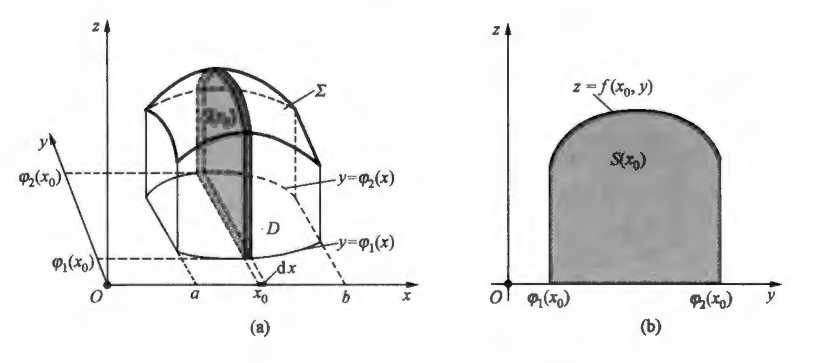
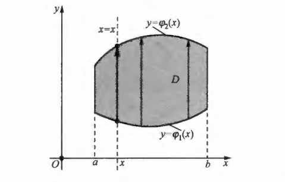
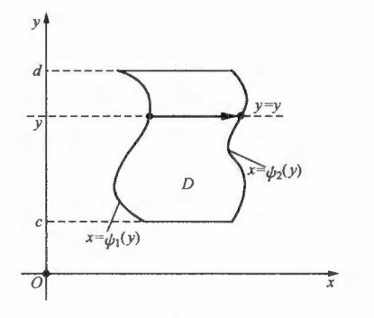
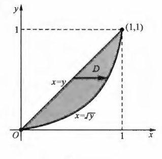
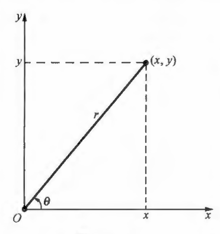
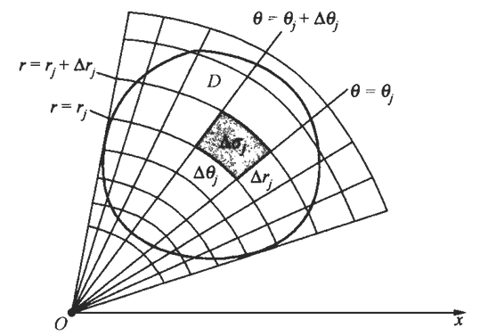
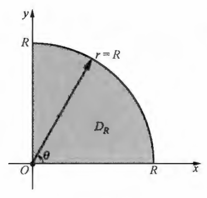

## 一、二重积分性质概念

**二重积分的相关概念**

二重积分的定义：设$z=f(x, y)$是定义在有界闭区域$D$上的函数。将$D$任意分割成$n$个小闭区域：$\Delta \sigma_{1}, \Delta \sigma_{2}, \cdots, \Delta \sigma_{n}$（它们也表示相应的小闭区域的面积）。在每个$\Delta \sigma_{i}$上任取一点$（\xi_{i}, \eta_{i}  ）$，做乘积  $f\left(\xi_{i}, \eta_{i}\right) \Delta \sigma_{i}(i=1,2, \cdots, n)$，并做和式$\sum_{i=1}^{n} f\left(\xi_{i}, \eta_{i}\right) \Delta \sigma_{i}$，如果各小闭区域直径中的最大值$\lambda \rightarrow 0$时，这个和式的极限存在，则称此极限值为函数$f(x, y)$在闭区域$D$上的二重积分，记为：

$$\iint_{D} f(x, y) \mathrm{d} \sigma  \Longrightarrow  \iint_{D} f(x, y) \mathrm{d} \sigma=\lim _{\lambda \rightarrow 0} \sum_{i=1}^{n} f\left(\xi_{i}, \eta_{i}\right) \Delta \sigma_{i} $$

其中$f(x, y)$称为被积函数， $f(x, y) \mathrm{d} \sigma$称为被积表达式，$\mathrm{d} \sigma$称为面积元素， $x$  和  $y$称为积分变量， $D$称为积分区域， $\sum_{i=1}^{n} f\left(\xi_{i}, \eta_{i}\right) \Delta \sigma_{i}$称为积分和，此时也称函数$f(x, y)$ 在$D$上可积。

上式中的极限是一种特殊的极限，它的意义是：无论对定义域$D$做何种分割，也无论各$\Delta \sigma_{i}$上的点$\left(\xi_{i}, \eta_{i}\right)$样选取，只要  $\lambda$充分小，积分和$\sum_{i=1}^{n} f\left(\xi_{i}, \eta_{i}\right) \Delta \sigma_{i}$就会与某个实数充分接近。

面积元素的记号$\mathrm{d} \sigma$是由积分和中的 $\Delta \sigma_{i}$转化而来，因此它的直观意义是微小的面积。

在二重积分的定义中，对区域$D$ 的分割是任意的，现考虑用平行于坐标轴的直线网来分割$D$，将含边界点的小闭区域记为$\Delta \sigma_{k}^{\prime}$；不含边界点的小闭区域都是矩形区域，记为$\Delta \sigma_{j}$，设其边长分别为$\Delta x_{j}, \Delta y_{j}$，则小矩形$\Delta \sigma_{j}$的面积为：

$$\Delta \sigma_{j}=\Delta x_{j} \Delta y_{j}$$

因此 ，积分和可分为两部分，即：

$$\sum_{i=1}^{n} f\left(\xi_{i}, \eta_{i}\right) \Delta \sigma_{i}=\sum_{j} f\left(\xi_{j}, \eta_{j}\right) \Delta x_{j} \Delta y_{j}+\sum_{k} f\left(\xi_{k}, \eta_{k}\right) \Delta \sigma_{k}^{\prime}$$

可以证明第二个和式的极限为：

$$\lim _{\lambda \rightarrow 0} \sum_{k} f\left(\xi_{k}, \eta_{k}\right) \Delta \sigma_{k}^{\prime}=0$$

则二重积分变为：

$$\iint_{D} f(x, y) \mathrm{d} \sigma=\lim _{\lambda \rightarrow 0} \sum_{j} f\left(\xi_{j}, \eta_{j}\right) \Delta x_{j} \Delta y_{j}$$

通常将这种分割下的二重积分记为：

$$\iint_{D} f(x, y) \mathrm{d} \sigma=\iint_{D} f(x, y) \mathrm{d} x \mathrm{~d} y$$

这时面积元素为$\mathrm{d} \sigma=\mathrm{d} x \mathrm{~d} y$，称之为直角坐标下的面积元素，它是由$\Delta x_{j} \Delta y_{j}$转化而来的。

根据二重积分的定义可以得到下列结论 ：若函数$f(x, y)$在有界闭区域$D$上可积，则$f(x, y)$  在$D$上有界；若函数$f(x, y)$在有界闭区域$D$上连续，则 $f(x, y)$  在$D$上可积。

**二重积分的相关性质**

性质$1$：常数因子$k$可以提到二重积分号外面，即：
$$\iint_{D} k f(x, y) \mathrm{d} \sigma=k \iint_{D} f(x, y) \mathrm{d} \sigma $$

性质 $2$ 函数和或差的二重积分等于二重积分的和或差，即：
$$\iint_{D}(f(x, y) \pm g(x, y)) \mathrm{d} \sigma=\iint_{D} f(x, y) \mathrm{d} \sigma \pm \iint_{D} g(x, y) \mathrm{d} \sigma $$

性质 $1$ 和性质 $2$ 统称为二重积分的线性性质，它们可以用如下统一的公式来表达：其中  $a, b$常数。
$$\iint_{D}(a f(x, y)+b g(x, y)) \mathrm{d} \sigma=a \iint_{D} f(x, y) \mathrm{d} \sigma+b \iint_{D} g(x, y) \mathrm{d} \sigma$$

性质$3$（区域可加性）若积分区域$D$被分为两个区域$D_{1}$与$D_{2}$（此时记 $D=D_{1}+D_{2}$），则$D$上的二重积分等于$D_{1}$与$D_{2}$上二重积分之和，即：
$$\iint_{D} f(x, y) \mathrm{d} \sigma=\iint_{D_{1}} f(x, y) \mathrm{d} \sigma+\iint_{D_{2}} f(x, y) \mathrm{d} \sigma$$

性质$4$（单调性）若在有界闭区域$D$上恒有  $f(x, y) \geqslant g(x, y)$  ，则：
$$\iint_{D} f(x, y) \mathrm{d} \sigma \geqslant \iint_{D} g(x, y) \mathrm{d} \sigma$$

由单调性可推知，若在有界闭区域 $D$ 上恒有  $f(x, y) \geqslant 0$，则  $\iint_{D} f(x, y) \mathrm{d} \sigma \geqslant 0$，又由于在有界闭区域  $D$上恒有  $-|f(x, y)| \leqslant f(x, y) \leqslant|f(x, y)|$，所以由单调性有：

$$-\iint_{D}|f(x, y)| \mathrm{d} \sigma \leqslant \iint_{D} f(x, y) \mathrm{d} \sigma \leqslant \iint_{D}|f(x, y)| \mathrm{d} \sigma \Longrightarrow   \left|\iint_{D} f(x, y) \mathrm{d} \sigma\right| \leqslant \iint_{D}|f(x, y)| \mathrm{d} \sigma $$

性质$5$（估值公式）设在有界闭区域$D$上恒有$m \leqslant f(x, y) \leqslant M$，其中  $m, M$  为常数，$|D|$ 表示区域$D$的面积（以下都用 $|D|$表示区域$D$ 的面积）则：
$$m|D| \leqslant \iint_{D} f(x, y) \mathrm{d} \sigma \leqslant M|D|$$

性质$6$（积分中值定理）设函数$f(x, y)$在有界闭区域$D$上连续，则在$D$ 上至少存在一点$(\xi, \eta)$，使得：
$$\iint_{D} f(x, y) \mathrm{d} \sigma=f(\xi, \eta)|D|$$

特别地，当$f(x, y) \equiv 1$时，有：
$$\iint_{D} f(x, y) \mathrm{d} \sigma=\iint_{D} 1 \mathrm{~d} \sigma=\iint_{D} \mathrm{~d} \sigma=|D|$$

## 二、直角坐标系下二重积分计算

**X型二重积分的计算**

将二重积分化为两个依次进行的定积分，称之为二次积分或累次积分。

设积分区域可以表示为 $D: a \leqslant x \leqslant b, \varphi_{1}(x) \leqslant y \leqslant \varphi_{2}(x)$， 其中$\varphi_{1}(x), \varphi_{2}(x)$在区间$[a, b]$上连续，能够表示为这种形式的区域称为$\mathbf{X}$型区域。

其特点是： $D$在$x$轴上的投影区间为$[a, b]$；过区间$(a, b)$中任一点$x$作垂直于$x$轴的直线$x=x$，它与$D$的边界最多有两个交点，当这样的直线沿水平方向移动时，这些交点的轨迹分别构成了$D$的两条边界线，位于下方的边界线$y=\varphi_{1}(x)$称为下边界，位于上方的边界线$y=\varphi_{2}(x)$称为上边界。

设连续函数$z=f(x, y) \geqslant 0,(x, y) \in D$，它所表示的曲面$\Sigma$在$O x y$平面上的投影就是区域$D$，以$\Sigma$为曲顶，$D$为底的曲顶柱体的体积$V$可表示为二重积分：
$$V=\iint_{D} f(x, y) \mathrm{d} x \mathrm{~d} y$$

我们采用定积分的方法来计算这个体积，在区间$[a, b]$上任意固定一点$x_{0}$，用过$x_{0}$且垂直于$x$轴的平面去截曲顶柱体，并设截面的面积为$S\left(x_{0}\right)$，截面在$O y z$平面上的投影是以区间$\left[\varphi_{1}\left(x_{0}\right), \varphi_{2}\left(x_{0}\right)\right]$为底，曲线$z=f\left(x_{0}, y\right)$  为曲边的曲边梯形，根据定积分求曲边梯形的面积公式，这个曲边梯形的面积为：
$$S\left(x_{0}\right)=\int_{\varphi_{1}\left(x_{0}\right)}^{\varphi_{2}\left(x_{0}\right)} f\left(x_{0}, y\right) \mathrm{d} y$$

把$x_{0}$记为$x$ ，则截面的面积为：
$$S(x)=\int_{\varphi_{1}(x)}^{\varphi_{2}(x)} f(x, y) \mathrm{d} y$$

于是，曲顶柱体的体积微元是$\mathrm{d} V=S(x) \mathrm{d} x$，从而曲顶柱体的体积为：
$$V=\int_{a}^{b} S(x) \mathrm{d} x$$

所以有计算公式：

$$\iint_{D} f(x, y) \mathrm{d} x \mathrm{~d} y=\int_{a}^{b}\left(\int_{\varphi_{1}(x)}^{\varphi_{2}(x)} f(x, y) \mathrm{d} y\right) \mathrm{d} x $$ 

或者记为：
$$\iint_{D} f(x, y) \mathrm{d} x \mathrm{~d} y=\int_{a}^{b} \mathrm{~d} x \int_{\varphi_{1}(x)}^{\varphi_{2}(x)} f(x, y) \mathrm{d} y$$

我们称上式为先对$y$，后对$x$的二次积分，如果$f(x, y)$不是非负函数，二重积分的计算可用以上公式。因此，如果$D$是$X$型区域，则$D$上的二重积分$\iint_{D} f(x, y) \mathrm{d} x \mathrm{~d} y$的计算可以分为如下两个定积分依次进行：

第一个定积分也称之为内层积分，在这个积分中将$x$看作常数，积分变量为$y$。这时被积函数$f(x, y)$是关于$y$的一元函数，积分上限$\varphi_{2}(x)$ 和下限$\varphi_{1}(x)$对于积分变量$y$来说也是常数，也就说求积分变量为$y$的定积分，其积分值与$x$位置有关，因此积分的结果是关于$x$的函数$S(x)$。第二个定积分称之为外层积分。它的积分变量是$x$，被积函数是内层积分的结果$S(x)$，积分的上，下限分别是常数$b$和$a$。

我们在计算二重积分时，确定二次积分的各积分限是重要的一步。为此，我们做出一个直观的描述：外层积分的积分限由积分区域$D$在 $x$轴上的投影区间 $[a, b]$确定，根据  $a \leqslant b$，取  $a$为下限， $b$为上限；内层积分由上边界$y=\varphi_{2}(x)$和下边界$y=\varphi_{1}(x)$确定，根据$\varphi_{1}(x) \leqslant \varphi_{2}(x)$，取$\varphi_{1}(x)$为下限，$\varphi_{2}(x)$为上限。

对于内层积分$\int_{\varphi_{1}(x)}^{\varphi_{2}(x)} f(x, y) \mathrm{d} y$，当把$x$看作常数，积分变量 $y$从$\varphi_{1}(x)$变到$\varphi_{2}(x)$时，点  $(x, y)$沿垂直于$x$轴的直线$x=x$从下边界点变到上边界点。我们用由下边界点指向上边界点的箭头来表示这种变化。每个箭头都由一个$x$确定，当$x$从$a$变到$b$时，这些箭头扫过了整个积分区域$D$ 。我们将确定积分限的方法归纳为一句话：从小到大，从边界到边界．这里＂从小到大＂是指积分的下限总是小于或等于上限。

**X型二重积分示例**

计算二重积分$I=\iint_{D} x y \mathrm{~d} x \mathrm{~d} y$，其中$D$是由抛物线$y=x^{2}$及直线$y=x$所围成的闭区域。

解：积分区域$D$如图所示，其中抛物线与直线的交点坐标由方程组$y=x^{2} \quad  y=x$的解确定,显然$D$在$x$轴上的投影区间为$[0,1]$，上边界为$y=x$，下边界为$y=x^{2}$，从而：
$$D: 0 \leqslant x \leqslant 1, x^{2} \leqslant y \leqslant x  \Longrightarrow   I=\int_{0}^{1} \mathrm{~d} x \int_{x^{2}}^{x} x y \mathrm{~d} y$$

如前所述，先做内层积分$\int_{x^{2}}^{x} x y \mathrm{~d} y$的计算，将$x$看作常数，对$y$求定积分，即：
$$\int_{x^{2}}^{x} x y \mathrm{~d} y=\left.\frac{x y^{2}}{2}\right|_{x^{2}} ^{x}=\frac{x \cdot x^{2}}{2}-\frac{x \cdot x^{4}}{2}=\frac{1}{2}\left(x^{3}-x^{5}\right)$$

可见，内层积分的结果是关于$x$的函数，外层积分就是对这个函数在$[0,1]$上求定积分，从而：

$$I=\frac{1}{2} \int_{0}^{1}\left(x^{3}-x^{5}\right) \mathrm{d} x=\left.\frac{1}{2}\left(\frac{1}{4} x^{4}-\frac{1}{6} x^{6}\right)\right|_{0} ^{1}=\frac{1}{24}$$

整个计算过程为：
$$I=\int_{0}^{1} \mathrm{~d} x \int_{x^{2}}^{x} x y \mathrm{~d} y=\int_{0}^{1}\left(\left.\frac{x y^{2}}{2}\right|_{x^{2}} ^{x}\right) \mathrm{d} x=\frac{1}{2} \int_{0}^{1}\left(x^{3}-x^{5}\right) \mathrm{d} x=\frac{1}{24}$$

在做内层积分时，由于$x$被看作常数，则$\int_{x^{2}}^{x} x y \mathrm{~d} y=x \int_{x^{2}}^{x} y \mathrm{~d} y$，这时二次积分也写为：
$$I=\int_{0}^{1} x \mathrm{~d} x \int_{x^{2}}^{x} y \mathrm{~d} y  \Longrightarrow  I=\int_{0}^{1} x\left(\left.\frac{y^{2}}{2}\right|_{x^{2}} ^{x}\right) \mathrm{d} x=\int_{0}^{1} x\left(\frac{x^{2}}{2}-\frac{x^{4}}{2}\right) \mathrm{d} x=\frac{1}{24} $$

**Y型二重积分的计算**

设积分区域 $D$可以表示为$D: c \leqslant y \leqslant d, \psi_{1}(y) \leqslant x \leqslant \psi_{2}(y)$，其中$\psi_{1}(y), \psi_{2}(y)$在区间$[c, d]$ 上连续，能够表示为这种形式的区域称为$\mathbf{Y}$型区域。

其特点是：$D$在$y$轴上的投影区间为$[c, d]$，过区间$(c, d)$内一点$y$作垂直于$y$轴的直线$y=y$，它与  $D$的边界最多有两个交点，当这样的直线沿垂直方向移动时，这些交点的轨迹分别构成了$D$的两条边界线，位于左边的边界线$x=\psi_{1}(y)$ 称为左边界，位于右边的边界线  $x=\psi_{2}(y)$称为右边界。

如果$f(x, y)$在$D$上连续，则有：

$$\iint_{D} f(x, y) \mathrm{d} x \mathrm{~d} y =\int_{c}^{d}\left(\int_{\psi_{1}(y)}^{\psi_{2}(y)} f(x, y) \mathrm{d} x\right) \mathrm{d} y=\int_{c}^{d} \mathrm{~d} y \int_{\psi_{1}(y)}^{\psi_{2}(y)} f(x, y) \mathrm{d} x$$

我们称上式为先对$x$，后对$y$的二次积分，外层积分的积分限由积分区域 $D$ 在$y$轴上的投影区间$[c, d]$确定；内层积分的下限是左边界$x=\psi_{1}(y)$，上限是右边界$x=\psi_{2}(y)$。做内层积分计算时，将 $y$ 看作常数，积分变量是$x$ 。这时需注意，左，右边界都应表示成$x$ 为 $y$的函数形式。

**Y型二重积分示例**

计算二重积分$I=\iint_{D} x y \mathrm{~d} x \mathrm{~d} y$，其中$D$是由抛物线$y=x^{2}$及直线$y=x$所围成的闭区域。

解：该积分区域$D$不仅是$X$型区域，它也是$Y$ 型区域，$D$ 在 $y$ 轴上的投影区间是$[0,1]$，左边界是$x=y$，右边界是$x=\sqrt{y}$，因此$D: 0 \leqslant y \leqslant 1, y \leqslant x \leqslant \sqrt{y}$ ，于是有：

$$\begin{aligned}
I=  \int_{0}^{1} \mathrm{~d} y \int_{y}^{\sqrt{y}} x y \mathrm{~d} x=\int_{0}^{1}\left(\int_{y}^{\sqrt{y}} x y \mathrm{~d} x\right) \mathrm{d} y 
=  \int_{0}^{1}\left(\left.\frac{x^{2} y}{2}\right|_{y} ^{\sqrt{y}}\right) \mathrm{d} y \\ \newline  =  \int_{0}^{1}\left(\frac{y \cdot y}{2}-\frac{y^{2} \cdot y}{2}\right) \mathrm{d} y =\frac{1}{2} \int_{0}^{1}\left(y^{2}-y^{3}\right) \mathrm{d} y=\frac{1}{24}  \\
\end{aligned}$$

**不规则二重积分**

如果积分区域$D$不是$X$型区域或$Y$型区域这两类区域，则需将$D$分割成若干个小的$X$型区域或$Y$型区域，然后利用区域可加性，分别在各小区域上做二次积分再相加，如图阴影部分的区域$D$，就可分为五个小的 $X$ 型区域： $D_{1}, D_{2}, D_{3}, D_{4}, D_{5}$。 

**二重积分选择不同示例**

依照不同的积分次序计算$I=\iint_{D} x y \mathrm{~d} x \mathrm{~d} y$，其中$D$由拋物线$y^{2}=x$及直线$y=x-2$围成。

解：先画出积分区域 $D$的图形。解方程组$y^{2}=x  \quad y=x-2$可得两个交点$(4,2),(1,-1)$，故区域$D$的图示。

如果先对$y$，后对$x$积分，这时的上边界为一条曲线$y=\sqrt{x}$，而下边界为两条曲线$y=-\sqrt{x}$和$y=x-2$，因此，需作出辅助线$x=1$ ，将$D$分为两个区域$D_{\text {左 }}$ 和 $D_{\text {右 }}$  ，它们在$x$轴上的投影区间分别为$[0,1]$和$[1,4]$ ，根据二重积分的区域可加性，有：
$$I=\iint_{D_{左}} x y \mathrm{~d} x \mathrm{~d} y+\iint_{D_{\text {右 }}} x y \mathrm{~d} x \mathrm{~d} y$$

分别在$D_{\text {左 }}, D_{\text {右  }}$这两个区域上做二次积分，此时：

$$\begin{aligned}
& D_{\text {左 }}: 0 \leqslant x \leqslant 1,-\sqrt{x} \leqslant y \leqslant \sqrt{x}  \\ \newline
& D_{\text {右 }}: 1 \leqslant x \leqslant 4, x-2 \leqslant y \leqslant \sqrt{x} \\  
\end{aligned}$$

$$\begin{aligned}
\iint_{D_{左}} x y \mathrm{~d} x \mathrm{~d} y & =\int_{0}^{1} x \mathrm{~d} x \int_{-\sqrt{x}}^{\sqrt{x}} y \mathrm{~d} y=\int_{0}^{1} x\left(\left.\frac{1}{2} y^{2}\right|_{-\sqrt{x}} ^{\sqrt{x}}\right) \mathrm{d} x \\  \newline
& =\frac{1}{2} \int_{0}^{1} x\left[(\sqrt{x})^{2}-(-\sqrt{x})^{2}\right] \mathrm{d} x=\frac{1}{2} \int_{0}^{1} 0 \mathrm{~d} x=0 \\ \newline
\iint_{D_{\text {右 }}} x y \mathrm{~d} x \mathrm{~d} y & =\int_{1}^{4} x \mathrm{~d} x \int_{x-2}^{\sqrt{x}} y \mathrm{~d} y=\int_{1}^{4} x\left(\left.\frac{1}{2} y^{2}\right|_{x-2} ^{\sqrt{x}}\right) \mathrm{d} x \\ \newline
& =\frac{1}{2} \int_{1}^{4} x\left[(\sqrt{x})^{2}-(x-2)^{2}\right] \mathrm{d} x \\ \newline
& =\frac{1}{2} \int_{1}^{4}\left(-x^{3}+5 x^{2}-4 x\right) \mathrm{d} x \\ \newline
& =\left.\frac{1}{2}\left(-\frac{x^{4}}{4}+\frac{5 x^{3}}{3}-2 x^{2}\right)\right|_{1} ^{4}=\frac{45}{8}  \\ \newline
& I=0+\frac{45}{8}=\frac{45}{8} \\  
\end{aligned}$$

如果先对$x$，后对$y$积分，这时左边界为$x=y^{2}$，右边界为$x=y+2$，它们各为一条曲线 ， $D$  在$y$轴上的投影区间为$[-1,2]$，因此 $D:-1 \leqslant y \leqslant 2, y^{2} \leqslant x \leqslant y+2$ ，从而：
$$\begin{aligned}
I & =\iint_{D} x y \mathrm{~d} x \mathrm{~d} y=\int_{-1}^{2} y \mathrm{~d} y \int_{y^{2}}^{y+2} x \mathrm{~d} x \\ \newline
& =\int_{-1}^{2} y\left(\left.\frac{x^{2}}{2}\right|_{y^{2}} ^{y+2}\right) \mathrm{d} y \\ \newline
& =\int_{-1}^{2} \frac{1}{2}\left[y(y+2)^{2}-y^{5}\right] \mathrm{d} y \\ \newline
& =\left.\frac{1}{2}\left(\frac{y^{4}}{4}+\frac{4 y^{3}}{3}+2 y^{2}-\frac{y^{6}}{6}\right)\right|_{-1} ^{2}=\frac{45}{8} 
\end{aligned}$$

设闭区域$D: 0 \leqslant y \leqslant 1, y \leqslant x \leqslant 2-y$，函数$f(x, y)$在$D$上连续，将二重积分$I=\iint_{D} f(x, y) \mathrm{d} x \mathrm{~d} y$表示为两种不同积分次序的二次积分。

解 画出$D$的图形时应先确定它的边界，将$D$中的不等式号改为等号，于是可得$D$的边界为$y=x, x=2-y$及$x$轴，从而$D$的图形如示：

先对$x$，后对$y$积分，得到：

$$I=\int_{0}^{1} \mathrm{~d} y \int_{y}^{2-y} f(x, y) \mathrm{d} x$$

如果先对$y$后对$x$积分，需用直线$x=l$将 $D$分为$D_左$ 和 $D_右$ 两部分，然后分别做出先对$y$，后对$x$的二次积分，则有:

$$I=\iint_{D_{\text {左 }}} f(x, y) \mathrm{d} x \mathrm{~d} y+\iint_{D_{\text {右 }}} f(x, y) \mathrm{d} x \mathrm{~d} y$$

$$I=\int_{0}^{1} \mathrm{~d} x \int_{0}^{x} f(x, y) \mathrm{d} y+\int_{1}^{2} \mathrm{~d} x \int_{0}^{2-x} f(x, y) \mathrm{d} y $$

 

设函数$f(x, y)$连续，改变下式二次积分的积分次序。
$$I=\int_{-2}^{2} \mathrm{~d} x \int_{-\sqrt{4-x^{2}}}^{4-x^{2}} f(x, y) \mathrm{d} y$$
解 先画出积分区域 $D$  的图形，由给出的积分限可知：
$$D:-2 \leqslant x \leqslant 2,-\sqrt{4-x^{2}} \leqslant y \leqslant 4-x^{2}$$

原积分是先对$y$，后对$x$的二次积分，若改变积分次序，先对$x$，后对$y$积分，需把$D$用直线$y=0$分为$D_{\text {上 }}  和  D_{\text {下 }}$两个区域，因此：

$$\begin{aligned}
I & =\iint_{D} f(x, y) \mathrm{d} x \mathrm{~d} y=\iint_{D_{\mathrm{L}}} f(x, y) \mathrm{d} x \mathrm{~d} y+\iint_{D_{\mathrm{F}}} f(x, y) \mathrm{d} x \mathrm{~d} y \\
& =\int_{0}^{4} \mathrm{~d} y \int_{-\sqrt{4-y}}^{\sqrt{4-y}} f(x, y) \mathrm{d} x+\int_{-2}^{0} \mathrm{~d} y \int_{-\sqrt{4-y^{2}}}^{\sqrt{4-y^{2}}} f(x, y) \mathrm{d} x
\end{aligned}$$

**二重积分的对称奇偶性**

设积分区域$D$关于$y$轴对称，它被$y$轴分为左，右对称的两部分：$D=D_{\text {左 }}+D_{\text {右。 }}$

若被积函数$f(x, y)$关于$x$是奇函数，即对于任何$y$，都有$f(-x, y)=-f(x, y)$，则：

$$I=\iint_{D} f(x, y) \mathrm{d} x \mathrm{~d} y=0$$

若被积函数$f(x, y)$关于$x$是偶函数，即对于任何$y$，都有$f(-x, y)=f(x, y)$，则：

$$I=\iint_{D} f(x, y) \mathrm{d} x \mathrm{~d} y=2 \iint_{D_{左}} f(x, y) \mathrm{d} x \mathrm{~d} y=2 \iint_{D_{右}} f(x, y) \mathrm{d} x \mathrm{~d} y $$

设$D$在$y$轴上的投影为$[a, b]$，由于$D$关于$y$轴对称，若右边界为$x=\psi(y)$，则左边界就为$x=-\psi(y)$于是：

$$I=\int_{a}^{b} \mathrm{~d} y \int_{-\phi(y)}^{\phi(y)} f(x, y) \mathrm{d} x $$

当$f(x, y)$关于$x$是奇函数时，内层积分为$0$：

$$\int_{-\phi(y)}^{\psi(y)} f(x, y) \mathrm{d} x=0   \Longrightarrow    I=\int_{a}^{b} 0 \mathrm{~d} y=0$$

 当$f(x, y)$ 关于 $x$是偶函数时，内层积分则：
$$\int_{-\psi(y)}^{\phi(y)} f(x, y) \mathrm{d} x=2 \int_{0}^{\phi(y)} f(x, y) \mathrm{d} x$$

$$I=2 \int_{a}^{b} \mathrm{~d} x \int_{0}^{\phi(y)} f(x, y) \mathrm{d} y=2 \iint_{D_{\text {右}}} f(x, y) \mathrm{d} x \mathrm{~d} y=I=2 \iint_{D_{左}} f(x, y) \mathrm{d} x \mathrm{~d} y$$

**二重积分的对称奇偶性举例**

计算二重积分$I=\iint_{D} y \cos (x y) \mathrm{d} x \mathrm{~d} y$，其中：

$$\begin{cases}
  & 1）\quad  D=[-1,1] \times[0,1]   \\
  & 2）\quad  D=[0,1] \times[-1,1] 
\end{cases}$$

当$D=[-1,1] \times[0,1]$，此时积分区域关于$y$轴对称，被积函数$y \cos (x y)$关于$x$是偶函数，从而：

$$\begin{aligned}
I & =\iint_{D} y \cos (x y) \mathrm{d} x \mathrm{~d} y=2 \int_{0}^{1} \mathrm{~d} y \int_{0}^{1} y \cos (x y) \mathrm{d} x=\left.2 \int_{0}^{1} \sin (x y)\right|_{0} ^{1} \mathrm{~d} y \\
& =2 \int_{0}^{1} \sin y \mathrm{~d} y=2(1-\cos 1)
\end{aligned}$$

当$D=[0,1] \times[-1,1]$，此时积分区域关于$x$轴对称，被积函数关于$y$是奇函数，从而 $I=0$。

如果积分区域是矩形区域$D=[a, b] \times[c, d]$，被积函数是分别关于$x$ 和$y$的两个一元函数的乘积$f(x, y)=h(x) g(y)$，则二重积分可以表示为两个定积分的乘积：
$$\iint_{D} f(x, y) \mathrm{d} x \mathrm{~d} y  =\int_{a}^{b} \mathrm{~d} x \int_{c}^{d} h(x) g(y) \mathrm{d} y  =\left(\int_{a}^{b} h(x) \mathrm{d} x\right)\left(\int_{c}^{d} g(y) \mathrm{d} y\right)$$

## 三、极坐标下二重积分计算

**平面点的极坐标表示**

对于平面上的点$(x, y)$，它到原点的距离为$r=\sqrt{x^{2}+y^{2}}$，设该点到原点的连线与$x$轴正向的夹角为$\theta$，于是 $r，\theta$与点的坐标$x, y$的关系为：

$$\left\{\begin{array}{l}
x=r \cos \theta \\
y=r \sin \theta
\end{array}\right.$$

称之为直角坐标的极坐标变换，此时，$0 \leqslant r<+\infty, \theta$的取值范围习惯上取为$0 \leqslant \theta<2 \pi$（有时根据需要也可取为$-\pi<\theta \leqslant \pi$ 等），按照这样的几何意义，平面上的每个点都对应一对实数$(r, \theta)$，称之为该点的极坐标表示，其中$r, \theta$称该点的极坐标，称原点$O$为极点，称$x$轴为极轴。

在极坐标下，某些曲线的方程形式被大大简化，例如，在直角坐标下，方程$x^{2}+y^{2}=1$表示圆心在原点，半径为 $1$ 的圆．而将极坐标变换代人该圆的方程得到极坐标下该圆的方程形式：

$$(r \cos \theta)^{2}+(r \sin \theta)^{2}=1  \Longrightarrow  r=1  $$

在直角坐标下，方程$y=x(x>0)$表示从原点出发的射线，而将极坐标变换代人这个方程得$r \sin \theta=r \cos \theta$，于是得到极坐标下该条射线的方程形式：

 $$\frac{r \sin \theta}{r \cos \theta}=\frac{\sin \theta}{\cos \theta}=\tan \theta=1 \Longrightarrow   \theta=\frac{\pi}{4}  $$

一般来说，在极坐标下，方程$r=r_{c}$，（$r_{c}$ 为大于零的常数）表示圆心在原点，半径为$r_{c}$的圆；方程$\theta=\theta_{c}$（常数）表示从原点出发的一条射线，该射线与$x$轴正向的夹角为$\theta_{c}$。

设积分区域为$D$，由二重积分的定义有：
$$\iint_{D} f(x, y) \mathrm{d} \sigma=\lim _{\lambda \rightarrow 0} \sum_{i=1}^{n} f\left(\xi_{i}, \eta_{i}\right) \Delta \sigma_{i}$$

以极点$O$为中心的一族同心圆$r=$常数以及从极点$O$出发的一族射线$\theta=$常数，可以将区域$D$分为$n$个小闭区域，在这些小区域中，含有$D$的边界的小闭区域记为  $\Delta \sigma_{k}{ }^{\prime}$，不含边界的小闭区域记为 $\Delta \sigma_{j}$ ，($\Delta \sigma_{j}$与$\Delta \sigma_{k}^{\prime}$)也表示相应的小闭区域的面积），根据扇形的面积公式，$\Delta \sigma_{j}$的面积为：

$$\begin{aligned}
\Delta \sigma_{j} & =\frac{1}{2}\left(r_{j}+\Delta r_{j}\right)^{2} \Delta \theta_{j}-\frac{1}{2} r_{j}^{2} \Delta \theta_{j}=\frac{1}{2}\left(2 r_{j}+\Delta r_{j}\right) \Delta r_{j} \Delta \theta_{j} \\ \newline
& =\frac{r_{j}+\left(r_{j}+\Delta r_{j}\right)}{2} \Delta r_{j} \Delta \theta_{j}=\bar{r}_{j} \Delta r_{j} \Delta \theta_{j}
\end{aligned}$$

其中$\bar{r}_{j}$是$r_{j}$与$r_{j}+\Delta r_{j}$的平均值，在小闭区域$\Delta \sigma_{j}$上任取极坐标下的点 $\left(\bar{r}_{j}, \bar{\theta}_{j}\right)$，它对应于$\Delta \sigma_{j}$上直角坐标下的点$\left(\xi_{j}, \eta_{j}\right)$，即 $\xi_{j}=\bar{r}_{j} \cos \bar{\theta}_{j}, \eta_{j}=\bar{r}_{j} \sin \bar{\theta}_{j}$于是：

$$\begin{aligned}
\sum_{i=1}^{n} f\left(\xi_{i}, \eta_{i}\right) \Delta \sigma_{i} & =\sum_{j} f\left(\xi_{j}, \eta_{j}\right) \Delta \sigma_{j}+\sum_{k} f\left(\xi_{k}, \eta_{k}\right) \Delta \sigma_{k}^{\prime} \\
& =\sum_{i} f\left(\bar{r}_{j} \cos \bar{\theta}_{j}, \bar{r}_{j} \sin \bar{\theta}_{j}\right) \bar{r}_{j} \Delta r_{j} \Delta \theta_{j}+\sum_{b} f\left(\xi_{k}, \eta_{k}\right) \Delta \sigma_{k}^{\prime}
\end{aligned}$$

可以证明$\lim _{\lambda \rightarrow 0} \sum_{k} f\left(\xi_{k}, \eta_{k}\right) \Delta \sigma_{k}^{\prime}=0$，从而：

$$\lim _{\lambda \rightarrow 0} \sum_{i=1}^{n} f\left(\xi_{i}, \eta_{i}\right) \Delta \sigma_{i}=\lim _{\lambda \rightarrow 0} \sum_{j} f\left(\bar{r}_{j} \cos \bar{\theta}_{j}, \bar{r}_{j} \sin \bar{\theta}_{j}\right) \bar{r}_{j} \Delta r_{j} \Delta \theta_{j}$$

由二重积分的定义可知，极坐标下的二重积分为：

$$\iint_{D} f(x, y) \mathrm{d} \sigma=\iint_{D} f(r \cos \theta, r \sin \theta) r \mathrm{~d} r \mathrm{~d} \theta $$

可见，极坐标下二重积分的形式就是将被积函数中的$x$和$y$分别用极坐标变换$x=r \cos \theta, y=r \sin \theta$去代换；将 $\mathrm{d} \sigma$换为 $r \mathrm{~d} r \mathrm{~d} \theta$，对区域 $D$在极坐标下的分割中，在相差高阶无穷小量的意义下，小区域$\Delta \sigma_{j}$的面积为下，因此，极坐标下的面积元素为  $\mathrm{d} \sigma=r \mathrm{~d} r \mathrm{~d} \theta$。

$$\Delta \sigma_{j} \approx r_{j} \Delta r_{j} \Delta \theta_{j}$$

极坐标下的二重积分仍要化为二次积分来计算，习惯上我们先对$r$，后对$\theta$积分，设积分区域在极坐标下可以表示为：
$$D: \alpha \leqslant \theta \leqslant \beta, \varphi_{1}(\theta) \leqslant r \leqslant \varphi_{2}(\theta)$$

其中 $\varphi_{1}(\theta), \varphi_{2}(\theta)$在区间$[\alpha, \beta]$上连续，$D$的形状如下图，可以证明，如果$f(x, y)$在$D$上连续，则：

$$\iint_{D} f(x, y) \mathrm{d} x \mathrm{~d} y=\iint_{D} f(r \cos \theta, r \sin \theta) r \mathrm{~d} r \mathrm{~d} \theta=\int_{\alpha}^{\beta} \mathrm{d} \theta \int_{\varphi_{1}(\theta)}^{\varphi_{2}(\theta)} f(r \cos \theta, r \sin \theta) r \mathrm{~d} r$$

这时积分区域$D$的特点是：它夹在两条射线$\theta=\alpha$与$\theta=\beta$之间；从原点出发穿过$D$内部的射线$l$与$D$的边界至多有两个交点，这两个交点一个离原点较近，另一个离原点较远，当$l$与$x$轴的夹角$\theta$在$[\alpha, \beta]$之间变化时，这些交点构成$D$ 的两条边界：近边界 $r=\varphi_{1}(\theta)$及远边界  $r=\varphi_{2}(\theta)$。

利用公式计算时，应先计算内层积分：
$$\int_{\varphi_{1}(\theta)}^{\varphi_{2}(\theta)} f(r \cos \theta, r \sin \theta) r \mathrm{~d} r$$

此时$\theta$看作固定不变的常数，积分变量是$r$，对于固定的$\theta$，当积分变量$r$由$\varphi_{1}(\theta)$变到$\varphi_{2}(\theta)$时，积分区域中的点$(r, \theta)$沿与极轴（  $x$  轴）的夹角为 $\theta$的射线$l$由近边界点变到远边界点，我们用从近边界点沿$l$到远边界点的箭头表示这种变化，对于每个固定的$\theta$，都对应这样一个箭头，当$\theta$在从 $\alpha$变到$\beta$时，这些箭头扫过了整个积分区域$D$，内层积分的结果是关于$\theta$的函数，外层积分就是对这个函数在$[\alpha, \beta]$上求定积分。

**高斯积分案例**

计算二重积分$I=\iint_{D_{R}} \mathrm{e}^{-x^{2}-y^{2}} \mathrm{~d} x \mathrm{~d} y$，其中$D_{R}$是圆形区域 $x^{2}+y^{2} \leqslant R^{2}$在第一象限的部分。

解 积分区域$D_{R}$ 如下图，在极坐标下，积分区域$D_{R}$的边界变为$r=R, \theta=0$和$\theta=\frac{\pi}{2}$  ，则：

$$D_{R}: 0 \leqslant \theta \leqslant \frac{\pi}{2}, \quad 0 \leqslant r \leqslant R $$

$$\begin{aligned}
I & =\iint_{D_{R}} \mathrm{e}^{-\left(x^{2}+y^{2}\right)} \mathrm{d} x \mathrm{~d} y \\
& =\int_{0}^{\frac{\pi}{2}} \mathrm{~d} \theta \int_{0}^{R} \mathrm{e}^{-r^{2}} r \mathrm{~d} r \\
& =\left(\int_{0}^{\frac{\pi}{2}} \mathrm{~d} \theta\right)\left(\int_{0}^{R} \mathrm{e}^{-r^{2}} r \mathrm{~d} r\right) \\
& =\frac{\pi}{4}\left(1-\mathrm{e}^{-R^{2}}\right)
\end{aligned}$$

由于积分 $\int \mathrm{e}^{-x^{2}} \mathrm{~d} x, \int \mathrm{e}^{-y^{2}} \mathrm{~d} y$不能用初等函数表示，所以无论先对$x$ 还是先对$y$积分都不可能计算出结果，由上式可以推出一个重要的积分公式：
$$I=\int_{0}^{+\infty} \mathrm{e}^{-x^{2}} \mathrm{~d} x=\frac{\sqrt{\pi}}{2}$$

事实上，令$I_{R}=\int_{0}^{R} \mathrm{e}^{-x^{2}} \mathrm{~d} x$，由无穷限广义积分的定义有：

$$I=\int_{0}^{+\infty} \mathrm{e}^{-x^{2}} \mathrm{~d} x=\lim _{R \rightarrow+\infty} I_{R}$$

$$I_{R}^{2}=\left(\int_{0}^{R} \mathrm{e}^{-x^{2}} \mathrm{~d} x\right)\left(\int_{0}^{R} \mathrm{e}^{-x^{2}} \mathrm{~d} x\right)=\left(\int_{0}^{R} \mathrm{e}^{-x^{2}} \mathrm{~d} x\right)\left(\int_{0}^{R} \mathrm{e}^{-y^{2}} \mathrm{~d} y\right)=\iint_{G_{R}} \mathrm{e}^{-x^{2}-y^{2}} \mathrm{~d} x \mathrm{~d} y$$

其中$G_{R}$ 是矩形区域 $[0, R] \times[0, R]$显然有$D_{R} \subset G_{R} \subset D_{\sqrt{2} R}$由于 被积函数$\mathrm{e}^{-x^{2}-y^{2}}>0$，所以有：

$$\iint_{D_{R}} \mathrm{e}^{-x^{2}-y^{2}} \mathrm{~d} x \mathrm{~d} y \leqslant \iint_{G_{R}} \mathrm{e}^{-x^{2}-y^{2}} \mathrm{~d} x \mathrm{~d} y \leqslant \iint_{D_{\sqrt{2 R}}} \mathrm{e}^{-x^{2}-y^{2}} \mathrm{~d} x \mathrm{~d} y $$

根据案例的结果，有：

$$\begin{array}{l}
\lim _{R \rightarrow+\infty} \iint_{D_{R}} \mathrm{e}^{-x^{2}-y^{2}} \mathrm{~d} x \mathrm{~d} y=\lim _{R \rightarrow+\infty} \frac{\pi}{4}\left(1-\mathrm{e}^{-R^{2}}\right)=\frac{\pi}{4}, \\
\lim _{R \rightarrow+\infty} \iint_{D_{\sqrt{2}}} \mathrm{e}^{-x^{2}-y^{2}} \mathrm{~d} x \mathrm{~d} y=\lim _{R \rightarrow+\infty} \frac{\pi}{4}\left(1-\mathrm{e}^{-2 R^{2}}\right)=\frac{\pi}{4} 
\end{array}$$

由夹逼准则得：

$$\begin{array}{l}
\begin{array}{c}
I^{2}=\lim _{R \rightarrow+\infty} I_{R}^{2}=\lim _{R \rightarrow+\infty} \iint_{G_{R}} \mathrm{e}^{-x^{2}-y^{2}} \mathrm{~d} x \mathrm{~d} y=\frac{\pi}{4}, \\
I=\int_{0}^{+\infty} \mathrm{e}^{-x^{2}} \mathrm{~d} x=\frac{\sqrt{\pi}}{2}
\end{array}
\end{array}$$

由于$\mathrm{e}^{-x^{2}}$是偶函数，进一步可以推出：
$$\int_{-\infty}^{+\infty} \mathrm{e}^{-x^{2}} \mathrm{~d} x=\sqrt{\pi}$$

一般来说，当积分区域$D$为圆形，扇形或环形区域，而被积函数含有$x^{2}+y^{2}$或 $\arctan \frac{y}{x}$ 等式子时，用极坐标计算二重积分往往比较简单。

