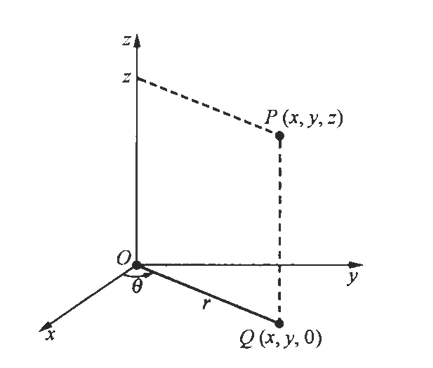
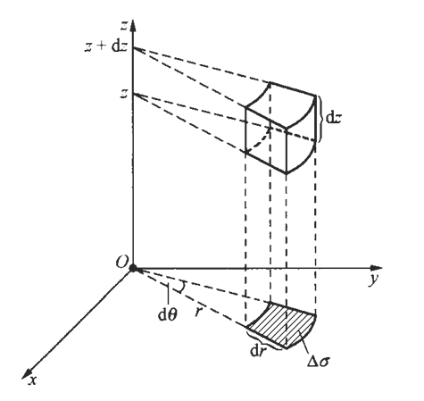
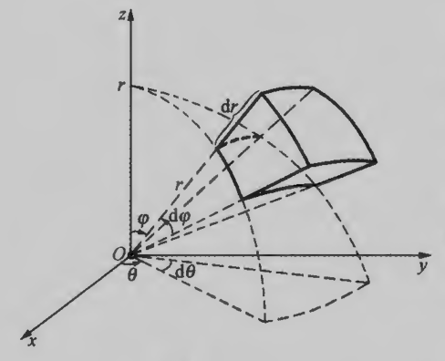
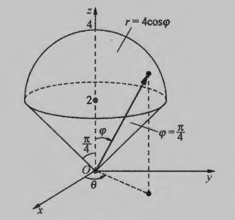

## 一、三重积分的性质概念

设一物体在空间中所占的区域为$\Omega$，其在点$(x, y, z)$处的体密度为$\rho(x, y, z) \geqslant 0$，并假定$\rho(x, y, z)$是连续的，求该物体的质量$M$，
如果该空间物体质量的分布是均匀的，即体密度$\rho(x, y, z) \equiv k$（常数），则：

$$M=k \times V_{\Omega} \quad  V_{\Omega}  表示 \Omega的体积$$

如果$\rho(x, y, z)  \neq k$，可以先将$\Omega$分为几个小闭区域：$\Delta v_{1}, \Delta v_{2}, \cdots, \Delta v_{n}$（它们也表示相应的小闭区域的体积），并设物体相应于各小闭区域部分的质量分别为$\Delta M_{1}, \Delta M_{2}, \cdots, \Delta M_{n}$，由于$\rho(x, y, z)$连续，因此当$\Delta v_{i}$很小时，$\rho(x, y, z)$在$\Delta v_{i}$上的变化幅度也很小．在每个小闭区域上任取一点$\left(\xi_{i}, \eta_{i}, \zeta_{i}\right) \in \Delta v_{i}$，将在$\Delta v_{i}$上的质量分布近似看作体密度为$\rho\left(\xi_{i}, \eta_{i}, \zeta_{i}\right)$的均匀分布，于是$\Delta M_{i} \approx \rho\left(\xi_{i}, \eta_{i}, \zeta_{i}\right) \Delta v_{i}$，从而：
$$M=\sum_{i=1}^{n} \Delta M_{i} \approx \sum_{i=1}^{n} \rho\left(\xi_{i}, \eta_{i}, \zeta_{i}\right) \Delta v_{i}$$

用$\lambda$表示所有小闭区域直径的最大值，$\lambda$越小，每个小闭区域也越小，和式$\sum_{i=1}^{n} \rho\left(\xi_{i}, \eta_{i}, \zeta_{i}\right) \Delta v_{i}$与$M$ 的近似程度就越好，因此，如果$\lambda \rightarrow 0$时，相应的和式$\sum_{i=1}^{n} \rho\left(\xi_{i}, \eta_{i}, \zeta_{i}\right) \Delta v_{i}$的极限存在，则把这个极限值定义为该物体的质量，即：
$$M=\lim _{i \rightarrow 0} \sum_{i=1}^{n} \rho\left(\xi_{i}, \eta_{i}, \zeta_{i}\right) \Delta v_{i} $$

**三重积分定义**

设函数$f(x, y, z)$是空间中有界闭区域$\Omega$上的函数，将$\Omega$任意分割为 $n$个小闭区域： $\Delta v_{1}, \Delta v_{2}, \cdots, \Delta v_{n}$ （它们也表示相应的小闭区域的体积）。在每个小闭区域  $\Delta v_{i}$  上任取一点  $\left(\xi_{i}, \eta_{i}, \zeta_{i}\right)$ ，做乘积  $f\left(\xi_{i}, \eta_{i}, \zeta_{i}\right) \Delta v_{i}(i=1,2, \cdots, n)$，并做和式 $\sum_{i=1}^{n} f\left(\xi_{i}, \eta_{i}, \zeta_{i}\right) \Delta v_{i}$。如果各小闭区域直径中的最大值$\lambda \rightarrow 0$时，这个和式的极限存在，则称此极限值为函数$f(x, y, z)$在区域$\Omega$上的三重积分，记作$\iiint_{a} f(x, y, z) \mathrm{d} v$，即：
$$\iiint_{\Omega} f(x, y, z) \mathrm{d} v=\lim _{\lambda \rightarrow 0} \sum_{i=1}^{n} f\left(\xi_{i}, \eta_{i}, \zeta_{i}\right) \Delta v_{i}$$

其中$\mathrm{d} v$称为三重积分的体积元素，它是由积分和$\sum_{i=1}^{n} f\left(\xi_{i}, \eta_{i}, \zeta_{i}\right) \Delta v_{i}  中的  \Delta v_{i}$转化而来，这时也称函数$f(x, y, z)$在区域$\Omega$上可积。

如果函数$f(x, y, z)$在空间有界闭区域$\Omega$上连续，则$f(x, y, z)$在$\Omega$上可积，空间物体的质量问题可以归结为计算三重积分的问题，即：
$$M=\iiint_{\Omega} \rho(x, y, z) \mathrm{d} v$$

在直角坐标下，体积元素记为$\mathrm{d} v=\mathrm{d} x \mathrm{~d} y \mathrm{~d} z$，它表示用平行于坐标面的平面族分割$\Omega$，于是：

$$\iiint_{\Omega} f(x, y, z) \mathrm{d} v=\iiint_{\Omega} f(x, y, z) \mathrm{d} x \mathrm{~d} y \mathrm{~d} z$$

特别地，若在$\Omega$上$f(x, y, z) \equiv 1$，其中$|\Omega|$表示 $\Omega$的体积，则有：

$$\iiint_{\Omega} 1 \mathrm{~d} v=\iiint_{\Omega} \mathrm{d} v=|\Omega|$$

## 二、直角坐标系下三重积分

设积分区域可以表示为$\Omega: z_{1}(x, y) \leqslant z \leqslant z_{2}(x, y),(x, y) \in D_{x y}$，其中  $D_{x y}$  是  $\Omega$  在  $O x y$ 平面上的投影，它是  $O x y$  平面上的有界闭区域， $z_{1}(x, y)$  和  $z_{2}(x, y)$  都是  $D_{x y}$  上的连续函数，这时$\Omega$的特点是：

过  $D_{x y}$  内任一点  $(x, y)$ 作平行于  $z$ 轴的直线，则直线与$\Omega$ 的边界至多有两个交点，这两个交点一个在上方，另一个在下方。当点$(x, y)$在$D_{x y}$上变动时，这些交点分别构成 $\Omega$ 的两个边界面：上边界面为 $z=z_{2}(x, y)$，下边界面为$z= z_{1}(x, y)$因此，$\Omega$的边界面由三部分组成，一部分是以$D_{x y}$ 的边界为准线，母线平行于$z$轴的柱面，另外两部分则是上边界面和下边界面。

计算三重积分时，先固定 $x$ 和 $y$ ，则 $f(x, y, z)$ 是关于$z$的函数，将它在闭区间 $\left[z_{1}(x, y)\right.  ， \left.z_{2}(x, y)\right]$ 上求定积分，积分变量为$z$，积分的结果是关于$x, y$ 的函数，记为：
$$F(x, y)=\int_{z_{1}(x, y)}^{z_{2}(x, y)} f(x, y, z) \mathrm{d} z$$

当$x, y$固定，积分变量 $z$ 从 $z_{1}(x, y)$ 变到 $z_{2}(x, y)$ 时，点 $(x, y, z)$ 沿图中的箭头从下边界面变到上边界面，然后，在$D_{x y}$上对$F(x, y)$ 做二重积分，则有：

$$\iiint_{\Omega} f(x, y, z) \mathrm{d} x \mathrm{~d} y \mathrm{~d} z=\iint_{D_{x y}} F(x, y) \mathrm{d} x \mathrm{~d} y=\iint_{D_{x y}}\left(\int_{z_{1}(x, y)}^{z_{2}(x, y)} f(x, y, z) \mathrm{d} z\right) \mathrm{d} x \mathrm{~d} y$$

通常记为：

$$\iiint \int_{\Omega} f(x, y, z) \mathrm{d} x \mathrm{~d} y \mathrm{~d} z=\iint_{D_{x y}} \mathrm{~d} x \mathrm{~d} y \int_{z_{1}(x, y)}^{z_{2}(x, y)} f(x, y, z) \mathrm{d} z$$

这样计算的三重积分称为＂先一后二＂的积分，如果$D_{x y}$ 还可以表示为 $a \leqslant x \leqslant b, y_{1}(x) \leqslant y \leqslant y_{2}(x)$ ，这时积分区域$\Omega$可以表示为：

$$a \leqslant x \leqslant b, \quad y_{1}(x) \leqslant y \leqslant y_{2}(x), \quad z_{1}(x, y) \leqslant z \leqslant z_{2}(x, y)$$

先对$z$，再对$y$ ，后对$x$ 的三次积分：

$$\iiint_{\Omega} f(x, y, z) \mathrm{d} x \mathrm{~d} y \mathrm{~d} z=\int_{a}^{b} \mathrm{~d} x \int_{y_{1}(x)}^{y_{2}(x)} \mathrm{d} y \int_{z_{1}(x, y)}^{z_{2}(x, y)} f(x, y, z) \mathrm{d} z $$

当用平行于$x$ 轴或$y$ 轴的直线穿过$\Omega$内部时，如果直线与 $\Omega$ 的边界至多有两个交点，我们同样可以将三重积分化为相应的＂先一后二＂的积分，进一步化为相应的三次积分。

设积分区域 $\Omega$如图所示，将积分区域 $\Omega$投影到 $z$轴上，投影的区间为 $[c, d]$ ，用平面  $z=z(c \leqslant z \leqslant d)$去截$\Omega$，截面为$D_{z}$它在$O x y$平面上的投影区域与$D_{z}$的形状相同，仍记为$D_{z}$，将$z$看作常数，则$f(x, y, z)$是关于$x, y$的二元函数，先对$x, y$做二重积分：

$$\iint_{D_{z}} f(x, y, z) \mathrm{d} x \mathrm{~d} y $$

由于$D_{z}$只与$z$有关，因此这个二重积分的结果是关于$z$的一元函数$F(z)$。再对$F(z)$在$[c, d]$上做定积分，可得：

$$\iiint_{\Omega} f(x, y, z) \mathrm{d} x \mathrm{~d} y \mathrm{~d} z=\int_{c}^{d} F(z) \mathrm{d} z=\int_{c}^{d} \mathrm{~d} z \iint_{D_{z}} f(x, y, z) \mathrm{d} x \mathrm{~d} y $$
这样计算的三重积分称为“先二后一＂的积分。

当积分区域关于坐标面对称，被积函数$f(x, y, z)$具有奇偶性时，像二重积分中一样，利用这些特点可以简化三重积分的计算，这样的简算也称为对称奇偶性。设积分区域$\Omega$关于$O x y$平面对称，则$O x y$平面将$\Omega$对称地分为 $\Omega_{上 }$ 和$\Omega_{下}$两部分。

如果被积函数$f(x, y, z)$关于 $z$是奇函数，即对于任何固定的$x, y$，总有：

$$f(x, y,-z)=-f(x, y, z)  \Longrightarrow     \iiint_{\Omega} f(x, y, z) \mathrm{d} x \mathrm{~d} y \mathrm{~d} z=0 $$

如果被积函数$f(x, y, z)$关于$z$是偶函数，即对于任何固定的$x, y$关于$f(x, y,-z)=f(x, y, z)$，总有：

$$ \iiint_{\Omega} f(x, y, z) \mathrm{d} x \mathrm{~d} y \mathrm{~d} z=2 \iiint_{\Omega_{ 上}} f(x, y, z) \mathrm{d} x \mathrm{~d} y \mathrm{~d} z=2 \iiint_{\Omega_{\mathrm{下}}} f(x, y, z) \mathrm{d} x \mathrm{~d} y \mathrm{~d} z$$

当 $\Omega$关于其他坐标面对称时，根据被积函数的奇偶性，也可得到与上述类似的结论。

## 三、柱面坐标下三重积分计算

给定空间中的点 $P(x, y, z)$，它在$O x y$平面上的投影点为$Q(x, y, 0)$，设这时原点到点 $Q$ 的距离为  $r$  ，线段$O Q$与$x$轴正向的夹角为$\theta$，则 $(r, \theta)$  就是点  $Q$  在  $O x y$  平面上的极坐标表示，且  $x=r \cos \theta, y=r \sin \theta$，这样，空间中的点  $P$  就可以用三个有序数  $r, \theta, z$来表示，记为  $P(r, \theta, z)$  ，其中  $r, \theta, z$  称为空间点  $P$  的柱面坐标，这时，坐标  $z$  表示点$P$的高度，坐标 $r$是点 $P$ 到 $z$  轴的距离，点 $P$  的柱面坐标与直角坐标的变换关系为：

$$\left\{\begin{array}{ll}
x=r \cos \theta & 0 \leqslant r<+\infty \\ \newline
y=r \sin \theta & 0 \leqslant \theta<2 \pi \\ \newline
z=z  & -\infty<z<+\infty
\end{array}\right.$$

方程 $r=r_{c}$ （常数），其意义是：点  $P(r, \theta, z)$  中的第一个坐标  $r$  取固定值  $r_{c}$  ，当其余两个坐标  $\theta, z$  任意变化时，动点  $P$  与  $z$  轴保持固定的距离  $r_{c}$根据  $r, \theta, z$  的几何意义，点  $P$  的轨迹是轴线为  $z$  轴，半径为  $r_{c}$  的圆柱面，它对应的直角坐标下的方程是：
$$x^{2}+y^{2}=r_{c}^{2} $$

方程  $\theta=\theta_{c}$ （常数），其意义是：点  $P(r, \theta, z)$  中的第二个坐标  $\theta$  取固定值  $\theta_{c}$  ，当其余两个坐标  $r, z$  任意变化时，动点  $P$  的轨迹是从  $z$  轴出发的半平面，它与  $x$  轴的夹角是  $\theta_{c}$，它的对应直角坐标下的方程是：
$$y=x \tan \theta_{c}$$

方程  $z=z_{c}$ （常数），其意义是：点  $P(r, \theta, z)$  中的第三个坐标  $z$  取固定值  $z_{c}$  ，当其余两个坐标  $r, \theta$  任意变化时，动点  $P$  的轨迹是垂直于$z$轴的平面，在$z$ 轴上的交点坐标为$z_{c}$，它对应的直角坐标下的方程仍是 
$$z=z_{c}$$

三族曲面 $r=$  常数， $\theta=$  常数， $z=$  常数，将空间分为一系列小闭区域，它们都是柱体，考虑其中由  $r, \theta, z$  的微小增量  $\mathrm{d} r, \mathrm{~d} \theta, \mathrm{~d} z$  所构成的小柱体的体积  $\Delta v$  ，它等于小柱体的底面积乘以高  $\mathrm{d} z$。设这个小柱体的底面在  $O x y$  平面上的投影为  $\Delta \sigma$ （它也表示对应小区域的面积）。根据极坐标变换，在相差高阶无穷小量的意义下， $\Delta \sigma \approx r \mathrm{~d} r \mathrm{~d} \theta$。于是，也在相差高阶无穷小量的意义下， $\Delta v \approx r \mathrm{~d} r \mathrm{~d} \theta \mathrm{~d} z$  ，从而得到柱面坐标下的体积元素为：
$$\mathrm{d} v=r \mathrm{~d} r \mathrm{~d} \theta \mathrm{~d} z$$

如果  $f(x, y, z)$  在有界闭区域  $\Omega$  上连续，将柱面坐标变换和体积元素代入三重积分就得到：

$$\iiint_{\Omega} f(x, y, z) \mathrm{d} v=\iiint_{\Omega} f(r \cos \theta, r \sin \theta, z) r \mathrm{~d} r \mathrm{~d} \theta \mathrm{~d} z$$

柱面坐标下的三重积分通常化为先对$z$，再对$r$ ，后对$\theta$的三次积分进行计算，在直角坐标下，这时的积分区域需表示为如下形式（有时可能需分割为几部分才能实现）：

$$\Omega: z_{1}(x, y) \leqslant z \leqslant z_{2}(x, y),(x, y) \in D$$

其中$D$ 是$\Omega$ 在$O x y$ 平面上的投影区域，在柱面坐标下，上边界面  $z=z_{2}(x, y)$  和下边界面  $z=z_{1}(x, y)$  分别变为  $z=\tilde{z}_{2}(r, \theta)  和  z=\tilde{z}_{1}(r, \theta)$，由＂先一后二＂方法，可变为：

$$\iiint_{\Omega} f(x, y, z) \mathrm{d} v   =\iint_{D} \mathrm{~d} x \mathrm{~d} y \int_{z_{1}(x, y)}^{z_{2}(x, y)} f(x, y, z) \mathrm{d} z =\iint_{D} \mathrm{~d} r \mathrm{~d} \theta \int_{z_{1}(r, \theta)}^{z_{2}(r, \theta)} f(r \cos \theta, r \sin \theta, z) r \mathrm{~d} z$$

如果投影区域$D$ 在极坐标下还可以表示为：

$$D: \alpha \leqslant \theta \leqslant \beta, r_{1}(\theta) \leqslant r \leqslant r_{2}(\theta) $$

则在柱面坐标下，有：
$$\Omega: \alpha \leqslant \theta \leqslant \beta, r_{1}(\theta) \leqslant r \leqslant r_{2}(\theta), \tilde{z}_{1}(r, \theta) \leqslant z \leqslant \tilde{z}_{2}(r, \theta) $$

于是，进一步可将以上公式化为三次积分：

 $$\iiint_{\Omega} f(x, y, z) \mathrm{d} v=\int_{ \alpha}^{\beta} \mathrm{d} \theta \int_{r_{1}(\theta)}^{r_{2}(\theta)} \mathrm{d} r \int_{z_{1}(r, \theta)}^{z_{2}(r, \theta)} f(r \cos \theta, r \sin \theta, z) r \mathrm{~d} z $$

## 四、球面坐标下三重积分计算

＊2．4 球面坐标下三重积分的计算
我们也可以引人空间点的球面坐标，并利用球面坐标计算三重积分．
给定空间中的点  P(x, y, z)  ，它在  O x y  平面上的投影点为  Q(x, y, 0) （图 3－50）．设线段  O P  的长度为  r  ，它与  z  轴正向的夹角设为  \varphi  ，则  z=r \cos \varphi  。线段  O Q  与  x  轴正向的夹角设为  \theta  ，从而它的长度为  |O Q|=r \sin \varphi  。再由  x=|O Q| \cos \theta, y=|O Q| \sin \theta  可得

\left\{\begin{array}{l}
x=r \cos \theta \sin \varphi \\
y=r \sin \theta \sin \varphi \\
z=r \cos \varphi
\end{array}\right.

称  r, \varphi, \theta  为点  P  的球面坐标，这时可将点  P  记为  P(r, \varphi, \theta)  ．根据  r, \varphi, \theta  的几何意义可知，它们的变化范围分别

0 \leqslant r<+\infty, \quad 0 \leqslant \varphi \leqslant \pi, \quad 0 \leqslant \theta<2 \pi

变换（11）称为空间点的直角坐标与球面坐标的变换公式．
在球面坐标下，根据变换（11）的几何意义，某些曲面方程的形式会变得十分简单。

例如：
1）．方程  r=r_{c} （常数），其意义是：点  P(r, \varphi, \theta)  中的第一个坐标  r  取固定值  r_{c}  ，当另外两个坐标  \varphi, \theta  变化时，动点  P  与原点保持固定的距离  r_{c}  。这样点  P  的轨迹是球心在原点，半径为  r_{c}  的球面（图3－51）。它对应的直角坐标下的方程是  x^{2}+y^{2}+z^{2}=r_{c}^{2}  。

2）方程  \varphi=\varphi_{c} （常数），其意义是：点  P(r, \varphi, \theta)  中的第二个坐标  \varphi  取固定值  \varphi_{c}  ，当其余两个坐标  r, \theta  变化时，原点到动点  P  的连线与  z  轴保持固定的夹角  \varphi_{c}  。根据  r, \varphi, \theta  的几何意义，此时点  P  的轨迹是顶点在原点，半顶角为  \varphi_{c}  的半锥面（图 3－52）。它对应的直角坐标下的方程是  x^{2}+y^{2}=z^{2} \tan ^{2} \varphi_{c}  ．

3）方程  \theta=\theta_{c} （常数），其意义是：点  P(r, \varphi, \theta)  中的第三个坐标  \theta  取固定值  \theta_{c}  ，当其余两个坐标  r, \varphi  变化时，原点到动点  P  的连线在  O x y  平面上的投影与  x  轴保持固定的夹角  \theta_{c}  。根据  r, \varphi, \theta  的几何意义，此时点  P  的轨迹是从  z  轴出发的半平面，它与  x  轴的夹角是  \theta_{c} （图 3－53）．它对应的直角坐标下的方程是  y=x \tan \theta_{c}  ．

此外，对于固定的  \varphi, \theta  ，当  r  在  [0,+\infty)  上变化时，点  P(r, \varphi, \theta)  的轨迹是从原点出发的射线  l  （图 3－54）．而当  \varphi  在  [0, \pi]  上变化， \theta  在  [0,2 \pi]  上变化时，这样的射线扫过整个空间．

三族曲面  r=  常数， \varphi=  常数， \theta=  常数，将空间分为一系列小闭区域．考虑由  r, \varphi, \theta  各取微小增量  \mathrm{d} r, \mathrm{~d} \varphi, \mathrm{~d} \theta  所张成的六面体的体积  \Delta v （图 3－55）．可以证明，在相差高阶无穷小量的意义下  \Delta v \approx r^{2} \sin \varphi \mathrm{~d} r \mathrm{~d} \varphi \mathrm{~d} \theta  。于是得到球面坐标下的体积元素

\mathrm{d} v=r^{2} \sin \varphi \mathrm{~d} r \mathrm{~d} \varphi \mathrm{~d} \theta

如果  f(x, y, z)  在有界闭区域  \Omega  上连续，将球面坐标变换（11）和体积元素（12）代人三重积分就得到

\iint_{\Omega} f(x, y, z) \mathrm{d} v=\iint_{\Omega} f(r \cos \theta \sin \varphi, r \sin \theta \sin \varphi, r \cos \varphi) r^{2} \sin \varphi \mathrm{~d} r \mathrm{~d} \varphi \mathrm{~d} \theta

球面坐标下的三重积分通常化为先对  r  ，再对  \varphi  ，最后对  \theta  的三次积分进行计算，这时积分区域在球面坐标下需具有如下形式：

\Omega: \alpha \leqslant \theta \leqslant \beta, \varphi_{1}(\theta) \leqslant \varphi \leqslant \varphi_{2}(\theta), r_{1}(\varphi, \theta) \leqslant r \leqslant r_{2}(\varphi, \theta)

则公式（13）变为

\iiint_{\Omega} f(x, y, z) \mathrm{d} v=\int_{\alpha}^{\beta} \mathrm{d} \theta \int_{\varphi_{1}(\theta)}^{\varphi_{2}(\theta)} \mathrm{d} \varphi \int_{r_{1}(\varphi, \theta)}^{r_{2}(\varphi, \theta)} f(r \cos \theta \sin \varphi, r \sin \theta \sin \varphi, r \cos \varphi) r^{2} \sin \varphi \mathrm{~d} r .

例 9 计算三重积分  I=\iint_{\Omega}\left(x^{2}+y^{2}+z^{2}\right) \mathrm{d} x \mathrm{~d} y \mathrm{~d} z  ，其中  \Omega  为上半球体：

x^{2}+y^{2}+z^{2} \leqslant 1, \quad z \geqslant 0

解 由球面坐标下三重积分的计算公式（13）可得

I=\iint_{B} r^{4} \sin \varphi \mathrm{~d} r \mathrm{~d} \varphi \mathrm{~d} \theta

上半球面  x^{2}+y^{2}+z^{2}=1, z \geqslant 0  是  \Omega  的一个边界面，将球面坐标变换（11）代人这个球面方程，得到  r=1  。

先对  r  积分时，将  \varphi, \theta  都看作固定的常数．当  r ＂从小到大＂变化时，相应的动点  (r, \varphi, \theta)  画出从原点出发穿过  \Omega  到达边界面  r=1  的箭头（图 3－56）．这表明  0 \leqslant r \leqslant 1  ．对于每一对固定的  \varphi, \theta  ，都可对应这样一个箭头，当  \varphi, \theta  在  0 \leqslant \theta \leqslant 2 \pi, 0 \leqslant \varphi \leqslant \frac{\pi}{2}  内变化时，这些箭头扫过整个积分区域  \Omega  ．因此，在球面坐标下，有  \Omega: 0 \leqslant \theta \leqslant 2 \pi, 0 \leqslant \varphi \leqslant \frac{\pi}{2}, 0 \leqslant   r \leqslant 1  ，于是

I=\iiint_{a} r^{4} \sin \varphi \mathrm{~d} r \mathrm{~d} \varphi \mathrm{~d} \theta=\int_{0}^{2 \pi} \mathrm{~d} \theta \int_{0}^{\frac{\pi}{2}} \sin \varphi \mathrm{~d} \varphi \int_{0}^{1} r^{4} \mathrm{~d} r=2 \pi \cdot 1 \cdot \frac{1}{5}=\frac{2}{5} \pi

例 10 设空间区域为  \Omega: x^{2}+y^{2}+z^{2} \leqslant 4 z, z \geqslant \sqrt{x^{2}+y^{2}}  ． \Omega  上任意一点的体密度等于该点到  O x y  平面的距离，求  \Omega  的质量  M  ．

解 此时在  \Omega  上点  (x, y, z)  处的体密度为  \rho(x, y, z)=|z|  ．由公式（2）得

M=\iint_{n}|z| \mathrm{d} v

用球面坐标计算这个三重积分． \Omega  的边界面为上半锥面  z=\sqrt{x^{2}+y^{2}}  和球面  x^{2}+   y^{2}+z^{2}=4 z  ．该球面的方程可以变为  x^{2}+y^{2}+(z-2)^{2}=4  ，它表明球面的球心在点  (0,0,2)  ，半径为 2 （图 3－57）．将球面坐标变换公式（11）代人该球面的方程  x^{2}+y^{2}+z^{2}=4 z  ，可得  r=4 \cos \varphi  ．该上半锥面的顶点在原点，开口向上，在球面坐标下它的方程为  \varphi=\frac{\pi}{4}  ．由于在  \Omega  上  z \geq 0  ，则体密度  \rho(x, y, z)=z  ．由公式（13）有

M=\iiint_{\Omega} z \mathrm{~d} x \mathrm{~d} y \mathrm{~d} z=\iiint_{\Omega} r^{3} \cos \varphi \sin \varphi \mathrm{~d} r \mathrm{~d} \varphi \mathrm{~d} \theta

先对  r  积分时，将  \varphi, \theta  都看作常数．当  r ＂从小到大＂变化时，相应的动点  (r, \varphi, \theta)  画出从原点出发穿过  \Omega  到达边界面  r=4 \cos \varphi  的箭头．这表明  0 \leqslant r \leqslant 4 \cos \varphi  ．对于每一对固定的  \varphi, \theta  ，都对应这样一个箭头，当  \varphi, \theta  在  0 \leqslant \varphi \leqslant \frac{\pi}{4}, 0 \leqslant \theta \leqslant 2 \pi  内变化时，这些箭头扫过整个积分区域  \Omega  ．因此，在球面坐标下，有  \Omega: 0 \leqslant \theta \leqslant 2 \pi, 0 \leqslant \varphi \leqslant \frac{\pi}{4}, 0 \leqslant r \leqslant 4 \cos \varphi  ，于是

\begin{aligned}
M & =\int_{0}^{2 \pi} \mathrm{~d} \theta \int_{0}^{\frac{\pi}{4}} \cos \varphi \sin \varphi \mathrm{~d} \varphi \int_{0}^{40 \cos \varphi} r^{3} \mathrm{~d} r=2 \pi \int_{0}^{\frac{\pi}{4}} \cos \varphi \sin \varphi\left(\left.\frac{1}{4} r^{4}\right|_{0} ^{4 \cos \varphi}\right) \mathrm{d} \varphi \\
& =128 \pi \int_{0}^{\frac{\pi}{4}} \cos ^{5} \varphi \sin \varphi \mathrm{~d} \varphi=-128 \pi \int_{0}^{\frac{\pi}{4}} \cos ^{5} \varphi \mathrm{~d}(\cos \varphi) \\
& =-\left.\frac{128 \pi}{6} \cos ^{6} \varphi\right|_{0} ^{\frac{\pi}{4}}=\frac{56}{3} \pi .
\end{aligned}

