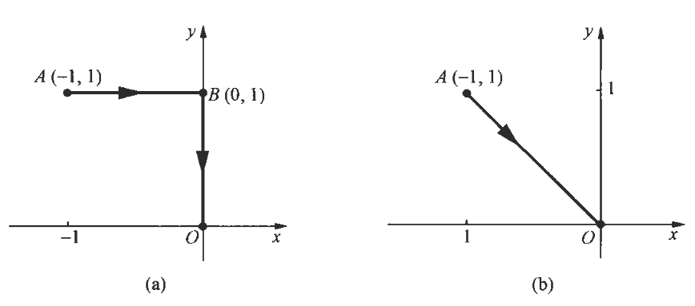

**对坐标的曲线积分的概念引入**

设一质点在$O x y$平面内沿一条光滑有向曲线弧$L$从其起点$A$运动到终点$B$，在运动过程中，该质点受到变力如下式，其中$P(x, y), Q(x, y)$在$L$上连续。现要计算运动过程中力$\boldsymbol{F}(x, y)$对质点所做的功。
$$\boldsymbol{F}(x, y)=P(x, y) \boldsymbol{i}+Q(x, y) \boldsymbol{j}$$

我们知道，如果质点在常力$\boldsymbol{F}$作用下沿直线从点$A$运动到点$B$，则常力$\boldsymbol{F}$对质点所做的功$W$ 应等于$\boldsymbol{F}$与$\overrightarrow{A B}$的数量积，即：

$$W=\boldsymbol{F} \cdot \overrightarrow{A B}$$

力$\boldsymbol{F}(x, y)$不是常力，而是随点$(x, y)$的变化而变化的变力；质点不是沿直线运动，而是沿曲线弧$L$运动，那么解决方法是：在曲线弧 $L$上自点$A$向点$B$插入$n-1$个点$M_{1}\left(x_{1}, y_{1}\right)  ，  M_{2}\left(x_{2}, y_{2}\right), \cdots, M_{i}\left(x_{i}, y_{i}\right), \cdots, M_{n-1}\left(x_{n-1}, y_{n-1}\right)$，将其分成$n$段有向小弧，并令$M_{0}=A, M_{n}=B$，取其中的有向弧段$\widetilde{M_{i-1}} M_{i}$作代表进行分析，由于$\widetilde{M_{i-1}} M_{i}$  光滑且很短，故可以用有向线段：

$$\overrightarrow{M_{i-1} M_{i}}=\Delta x_{i} \boldsymbol{i}+\Delta y_{i} \boldsymbol{j}$$

来近似代替它，其中$\Delta x_{i}=x_{i}-x_{i-1}, \Delta y_{i}=y_{i}-y_{i-1}$，又由于函数$P(x, y), Q(x, y)$在 $L$上连续，因此可以在$\overparen{M_{i-1}} M_{i}$上任取一点$\left(\xi_{i}, \eta_{i}\right)$，用这点处的力：
$$\boldsymbol{F}\left(\xi_{i}, \eta_{i}\right)=P\left(\xi_{i}, \eta_{i}\right) \boldsymbol{i}+Q\left(\xi_{i}, \eta_{i}\right) \boldsymbol{j}$$

来近似代替这一小段上各点处的力，于是，质点沿$L$从点$M_{i-1}$运动到点$M_{i}$ 时，力$\boldsymbol{F}(x, y)$对该质点所做的功 $\Delta W_{i}$ 就可以用常力  $\boldsymbol{F}\left(\xi_{i}, \eta_{i}\right)$沿$\overline{M_{i-1} M_{i}}$所做的功来近似代替，即：

$$\begin{aligned}
\Delta W_{i} & \approx \boldsymbol{F}\left(\xi_{i}, \eta_{i}\right) \cdot \overrightarrow{M_{i-1} M_{i}} \\ \newline
& =\left(P\left(\xi_{i}, \eta_{i}\right) \boldsymbol{i}+Q\left(\xi_{i}, \eta_{i}\right) \boldsymbol{j}\right) \cdot\left(\Delta x_{i} \boldsymbol{i}+\Delta y_{i} \boldsymbol{j}\right) \\ \newline
& =P\left(\xi_{i}, \eta_{i}\right) \Delta x_{i}+Q\left(\xi_{i}, \eta_{i}\right) \Delta y_{i} 
\end{aligned}$$

所以，该质点沿曲线弧$L$从点$A$ 运动到点$B$时，力$\boldsymbol{F}$对它所做的功为：

$$\sum_{i=1}^{n} \Delta W_{i} \approx \sum_{i=1}^{n}\left(P\left(\xi_{i}, \eta_{i}\right) \Delta x_{i}+Q\left(\xi_{i}, \eta_{i}\right) \Delta y_{i}\right)$$

为了将上述功的近似值转化为精确值，注意到近似程度的好坏依赖于对曲线弧 $L$ 分割的细密程度，分割越细，精确度越好，我们用  $\lambda$  表示  $n$  段小弧长度的最大值，令  $\lambda \rightarrow 0$ （分割无限变细），对上述和式取极限，若极限存在，则定义此极限值为我们所要求的功$W$。

$$\lim _{\lambda \rightarrow 0} \sum_{i=1}^{n}\left(P\left(\xi_{i}, \eta_{i}\right) \Delta x_{i}+Q\left(\xi_{i}, \eta_{i}\right) \Delta y_{i}\right)$$

**对坐标的曲线积分的定义**

定义 ：设$L$为$O x y$平面上从点$A$到点$B$ 的一条有向光滑曲线弧，函数$P(x, y), Q(x  ，  y  ）$在 $L$上有界，在 $L$上沿$L$的方向任意插入$n-1$个点：

$$M_{1}\left(x_{1}, y_{1}\right), M_{2}\left(x_{2}, y_{2}\right), \cdots, M_{i}\left(x_{i}, y_{i}\right), \cdots, M_{n-1}\left(x_{n-1}, y_{n-1}\right)$$

把$L$分成$n$段有向小弧 $\widehat{M_{i-1}} M_{i}\left(i=1,2, \cdots, n ; M_{0}=A, M_{n}=B\right)$，设$\Delta x_{i}=x_{i}-x_{i-1}, \Delta y_{i}=   y_{i}-y_{i-1}$，点 $\left(\xi_{i}, \eta_{i}\right)$为$\widetilde{M_{i-1}} M_{i}$上任意取定的一点。

如果各小弧段长度的最大值$\lambda \rightarrow 0$时，和式$\sum_{i=1}^{n} P\left(\xi_{i}, \eta_{i}\right) \Delta x_{i}$的极限存在，则称此极限值为函数$P(x, y)$ 在有向曲线弧 $L$上对坐标$x$的曲线积分，记作：

$$\int_{L} P(x, y) \mathrm{d} x$$

如果极限 $\lim _{i \rightarrow 0} \sum_{i=1}^{n} Q\left(\xi_{i}, \eta_{i}\right) \Delta y_{i}$存在，则称此极限值为函数$Q(x, y)$在有向曲线弧 $L$ 上对坐标$y$的曲线积分，记作：

$$\int_{L} Q(x, y) \mathrm{d} y$$

这时$P(x, y), Q(x, y)$叫作被积函数，$L$叫作积分弧段，以上两个积分也称为第二类曲线积分。

可以证明，当$L$是光滑曲线弧，且 $P(x, y), Q(x, y)$在曲线弧$L$上连续时，对坐标$x$ 和对坐标$y$的两个曲线积分都存在。今后如不声明，我们总假定$P(x, y), Q(x, y)$ 在曲线弧 $L$上是连续的。在实际应用中，经常会遇到对坐标$x$的曲线积分与对坐标$y$的曲线积分之和，所以通常使用如下记法：
$$\int_{L} P(x, y) \mathrm{d} x+\int_{L} Q(x, y) \mathrm{d} y=\int_{L} P(x, y) \mathrm{d} x+Q(x, y) \mathrm{d} y$$

因此，若一质点在力$\boldsymbol{F}(x, y)=P(x, y) \boldsymbol{i}+Q(x, y) \boldsymbol{j}$作用下沿光滑有向曲线弧$L$从其起点$A$运动到终点$B$ ，当 $P(x, y), Q(x, y)$ 在$L$上连续时，力$\boldsymbol{F}$ 对该质点所做的功为：

$$W=\int_{L} P(x, y) \mathrm{d} x+Q(x, y) \mathrm{d} y$$

上述定义可以完全类似地推广到积分弧段为空间有向光滑曲线弧$L$ 的情形，记与曲线弧 $L$ 上的有向小弧段  $M_{i-1} M_{i}$  对应的有向线段为：

$$\overrightarrow{M_{i-1} M_{i}}=\Delta x_{i} i+\Delta y_{i} j+\Delta z_{i} k$$

并设作用在质点上的变力为三维向量

$$\boldsymbol{F}(x, y, z)=P(x, y, z) \boldsymbol{i}+Q(x, y, z) \boldsymbol{j}+R(x, y, z) \boldsymbol{k}$$

则力$\boldsymbol{F}(x, y, z)$对质点所做的功为：

$$W=\lim _{\lambda \rightarrow 0} \sum_{i=1}^{n}\left(P\left(\xi_{i}, \eta_{i}, \zeta_{i}\right) \Delta x_{i}+Q\left(\xi_{i}, \eta_{i}, \zeta_{i}\right) \Delta y_{i}+R\left(\xi_{i}, \eta_{i}, \zeta_{i}\right) \Delta z_{i}\right)$$

由此引入的对坐标的曲线积分为：

$$\int_{L} P(x, y, z) \mathrm{d} x+Q(x, y, z) \mathrm{d} y+R(x, y, z) \mathrm{d} z$$

**对坐标的曲线积分的性质**

对坐标的曲线积分有下列性质（假设讨论的曲线积分存在）：

可加性：如果有向曲线弧$L$的起点为$A$，终点为$B, M$为曲线弧 $L$上一点，记弧段 $\overparen{A M} 为  L_{1}, \overparen{M B}  为  L_{2}$ ，则
$$\int_{L} P \mathrm{~d} x+Q \mathrm{~d} y=\int_{L_{1}} P \mathrm{~d} x+Q \mathrm{~d} y+\int_{L_{2}} P \mathrm{~d} x+Q \mathrm{~d} y$$

设 $L$是有向曲线弧，$-L$ 是与$L$方向相反的有向曲线弧，则：
$$\int_{-L} P(x, y) \mathrm{d} x=-\int_{L} P(x, y) \mathrm{d} x  \quad \int_{-L} Q(x, y) \mathrm{d} y=-\int_{L} Q(x, y) \mathrm{d} y $$

**对坐标的曲线积分的计算**

根据对坐标的曲线积分的定义：

$$\int_{L_{A B}} P(x, y) \mathrm{d} x+Q(x, y) \mathrm{d} y$$

容易看出上式中点$(x, y)$总是在曲线弧 $L_{A B}$上，$\mathrm{d} x, \mathrm{~d} y$分别为$L_{A B}$上点 $(x, y)$的坐标的微分。因此，如果曲线弧$L_{A B}$的参数方程为：
$$\left\{\begin{array}{l}x=\psi(t)  \\  \newline y=\varphi(t)  \end{array}\right.$$

当参数$t$单调地由 $\alpha$ 变到 $\beta$时，点$(x, y)  从  L_{A B}$ 的起点 $A$沿$L_{A B}$ 运动到终点$B$，即点$A$ 的坐标为$(\psi(\alpha), \varphi(\alpha))$，点 $B$ 的坐标为$(\psi(\beta), \varphi(\beta))$ ，又设 $\psi(t), \varphi(t)$在以$\alpha$及$\beta$为端点的闭区间上具有连续的一阶导数，且$\left(\psi^{\prime}(t)\right)^{2}+\left(\varphi^{\prime}(t)\right)^{2} \neq 0$，则有：

$$x=\psi(t), \quad y=\varphi(t), \quad \mathrm{d} x=\psi^{\prime}(t) \mathrm{d} t, \quad \mathrm{~d} y=\varphi^{\prime}(t) \mathrm{d} t$$

且有下面的计算公式：

$$\int_{L_{A B}} P(x, y) \mathrm{d} x+Q(x, y) \mathrm{d} y=\int_{\alpha}^{\beta}\left(P(\psi(t), \varphi(t)) \psi^{\prime}(t)+Q(\psi(t), \varphi(t)) \varphi^{\prime}(t)\right) \mathrm{d} t$$

类似地，可将公式推广到积分弧段为空间曲线弧的情形，设空间曲线弧$L_{A B}$的参数方程为：

$$\left\{\begin{array}{l}
x=\psi(t) \\   \newline
y=\varphi(t) \\   \newline
z=\omega(t)
\end{array}\right.$$

当参数  $t$  单调地由  $\alpha$  变到  $\beta$  时， $L_{A B}$  上的点  $M(x, y, z)$  从  $L_{A B}$  的起点  $A$  沿  $L_{A B}$  运动到终点  $B$  ，又设  $\psi(t), \varphi(t), \omega(t)$  在以  $\alpha$  及  $\beta$  为端点的闭区间上具有连续的一阶导数，且$\left(\psi^{\prime}(t)\right)^{2}+\left(\varphi^{\prime}(t)\right)^{2}+\left(\omega^{\prime}(t)\right)^{2} \neq 0$则有对坐标的曲线积分的公式：

$$\begin{aligned}
&\int_{L_{A B}} P(x, y, z) \mathrm{d} x+Q(x, y, z) \mathrm{d} y+R(x, y, z) \mathrm{d} z \\ \newline
=& \int_{\alpha}^{\beta}   {\Large[}   P(\psi(t), \varphi(t), \omega(t)) \psi^{\prime}(t)+Q(\psi(t), \varphi(t), \omega(t)) \varphi^{\prime}(t)+R(\psi(t), \varphi(t), \omega(t)) \omega^{\prime}(t)  {\Large]}   \mathrm{d} t 
\end{aligned}$$

值得注意的是，上述公式中定积分的下限  $\alpha$  不一定小于或等于上限  $\beta$。

**对坐标的曲线积分示例**

计算对坐标的曲线积分$I=\int_{L}(x+y) \mathrm{d} x+(x-y) \mathrm{d} y$ ，其中$L$为：以原点$O$为圆心，$R$为半径的圆上从点$A(R, 0)$到点 $B(0, R)$的四分之一圆（图左）；有向折线$A O B$（图右）。

图左：曲线弧$L$的参数方程为：

$$\left\{\begin{array}{l}
x=R \cos t \\ \newline
y=R \sin t
\end{array} \quad\left(0 \leqslant t \leqslant \frac{\pi}{2}\right)\right.$$

且当 $t$单调地由 $0$  变为 $\frac{\pi}{2}$ 时，$L$  上的点 $(x, y)$从起点$A(R, 0)$运动到终点$B(0, R)$，所以 ：
$$\begin{aligned}
I & =\int_{0}^{\frac{\pi}{2}}[R(\cos t+\sin t) \cdot R(-\sin t)+R(\cos t-\sin t) \cdot R \cos t] \mathrm{d} t \\ \newline
& =R^{2} \int_{0}^{\frac{\pi}{2}}\left[\left(\cos ^{2} t-\sin ^{2} t\right)-2 \sin t \cos t\right] \mathrm{d} t=R^{2} \int_{0}^{\frac{\pi}{2}}(\cos 2 t-\sin 2 t) \mathrm{d} t \\ \newline
& =\left.\frac{R^{2}}{2}(\sin 2 t+\cos 2 t)\right|_{0} ^{\frac{\pi}{2}}=-R^{2} 
\end{aligned}$$

图右：直线$A O$的方程为$y=0$，所以在$A O$上  $\mathrm{d} y=0$；直线$O B$的方程为$x=0$，所以在$O B$上$\mathrm{d} x=0$于是：
$$\begin{aligned}
I & =\int_{A O}(x+y) \mathrm{d} x+(x-y) \mathrm{d} y+\int_{O B}(x+y) \mathrm{d} x+(x-y) \mathrm{d} y \\ \newline
& =\int_{R}^{0} x \mathrm{~d} x+\int_{0}^{R}(-y) \mathrm{d} y=-R^{2} 
\end{aligned}$$

计算对坐标的曲线积分$I=\int_{L} x y \mathrm{~d} x+(y-x) \mathrm{d} y$，其中$L$为：
图左：中的有向折线 $A B O$，其中$A, B, O$三点依次为$(-1,1),(0,1),(0,0)$。
图右：中的有向线段$A O$。

直线$A B$的方程为$y=1$，直线$B O$的方程为$x=0$ ，从而在$A B$上 $\mathrm{d} y=0$，在$B O$上 $\mathrm{d} x=0$，因此：
$$\begin{aligned}
I & =\int_{L} x y \mathrm{~d} x+(y-x) \mathrm{d} y \\ \newline
& =\int_{A B} x y \mathrm{~d} x+(y-x) \mathrm{d} y+\int_{B O} x y \mathrm{~d} x+(y-x) \mathrm{d} y \\ \newline
& =\int_{-1}^{0} x \mathrm{~d} x+\int_{1}^{0} y \mathrm{~d} y=-1 
\end{aligned}$$

直线$A O$的方程为$y=-x$ ，从而在$A O$ 上 $\mathrm{d} y=-\mathrm{d} x$，因此：
$$\begin{aligned}
I & =\int_{L} x y \mathrm{~d} x+(y-x) \mathrm{d} y=\int_{A O} x y \mathrm{~d} x+(y-x) \mathrm{d} y \\
& =\int_{-1}^{0}\left(-x^{2}\right) \mathrm{d} x-(-x-x) \mathrm{d} x=\int_{-1}^{0}\left(2 x-x^{2}\right) \mathrm{d} x \\
& =\left.\left(x^{2}-\frac{1}{3} x^{3}\right)\right|_{-1} ^{0}=-\frac{4}{3} .
\end{aligned}$$

注：例$1$中积分弧段的起点，终点相同，选取的积分路径不同，但积分值相同。在例$2$的积分弧段的起点，终点也相同，但选取的积分路径不同，积分值也不相同。

计算对坐标的曲线积分$I=\int_{L} x y \mathrm{~d} x$，其中$L$为抛物线$y^{2}=x$上从点$A(1,-1)$到$B(1,1)$的一段弧。

解法 $1$ 化为对$x$ 的定积分计算：曲线弧$L$在$\overparen{A O}$段的方程为 $y=-\sqrt{x}(0 \leqslant x \leqslant 1)$，在$\overparen{O B}$段的方程为：  $y=\sqrt{x}(0 \leqslant x \leqslant 1)$，故：

$$\begin{aligned}
I & =\int_{\widehat{A O}} x y \mathrm{~d} x+\int_{\widehat{O B}} x y \mathrm{~d} x \\ \newline
& =\int_{1}^{0}(-x \sqrt{x}) \mathrm{d} x+\int_{0}^{1} x \sqrt{x} \mathrm{~d} x \\ \newline
& =2 \int_{0}^{1} x \sqrt{x} \mathrm{~d} x=\frac{4}{5}
\end{aligned}$$

解法$2$化为对$y$的定积分计算：曲线弧$L$的方程为$x=y^{2}(-1 \leqslant y \leqslant 1)$，从而$\mathrm{d} x=2 y \mathrm{~d} y$，于是：

$$I=\int_{-1}^{1} y^{3} \cdot 2 y \mathrm{~d} y=4 \int_{0}^{1} y^{4} \mathrm{~d} y=\frac{4}{5}$$

