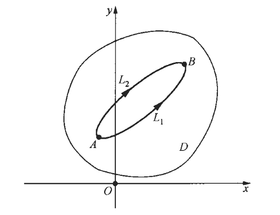
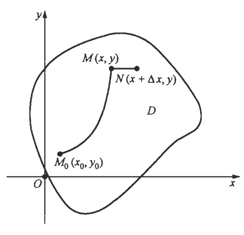

## 一、格林公式

在定积分中，我们知道，如果函数$f(x)$在区间 $[a, b]$上连续，$F(x)$是$f(x)$的一个原函数，则有$Newton－Leibniz$公式：

$$\int_{a}^{b} f(x) \mathrm{d} x=F(b)-F(a)$$

它说明， $f(x)$  在区间$[a, b]$  上的定积分可以用它的原函数  $F(x)$  在区间  $[a, b]$  两个端点（即区间  $[a, b]$  的边界）的函数值来表示，这个重要的公式的推广就是格林 （$Green$）公式，它告诉我们如何把一个平面有界闭区域上的二重积分用其边界曲线上对坐标的曲线积分来表示。

平面单连通区域： 设$D$为平面区域，若$D$内任一闭曲线所围的部分都属于$D$，称$D$为单连通区域；否则称为复连通区域，通俗地说，平面单连通区域就是不含有＂洞＂（包括＂点洞＂）的区域，复连通区域就是含有＂洞＂（包括＂点洞＂）的区域，例如， 单连通区域：
$$\left\{(x, y) \mid x^{2}+y^{2}<1\right\}, \quad\{(x, y) \mid y>0\}$$

复连通区域：
$$\left\{(x, y) \mid 1<x^{2}+y^{2}<2\right\}, \quad\left\{(x, y) \mid 0<x^{2}+y^{2}<1\right\}$$

单连通区域示意图：

复连通区域示意图：

平面区域边界曲线的定向：设平面区域$D$的边界曲线为$L$。当人沿$L$行走时，若区域$D$总位于其左边，则规定人行走的方向为$L$的正向。所以，下图中，外边界曲线$L$的正向为逆时针方向，而内边界曲线$l$的正向为顺时针方向。

格林公式定理：设平面有界闭区域$D$由分段光滑的闭曲线$L$围成，函数$P(x, y)$，$Q(x, y)$在 $D$上具有连续的一阶偏导数，其中$L$是$D$的取正向的边界曲线，则有：

$$\iint_{D}\left(\frac{\partial Q}{\partial x}-\frac{\partial P}{\partial y}\right) \mathrm{d} x \mathrm{~d} y=\oint_{L} P \mathrm{~d} x+Q \mathrm{~d} y$$

**格林公式定理证明**

假设$D$既是 $X$ 型区域，又是 $Y$ 型区域（如下图），其特点是：穿过区域$D$内部且平行于坐标轴的直线与$D$ 的边界曲线$L$ 最多有两个交点，设$D=\left\{(x, y) \mid \psi_{1}(x) \leqslant y \leqslant \psi_{2}(x), a \leqslant x \leqslant b\right\}$，因为$\frac{\partial P}{\partial y}$连续，所以由二重积分的计算方法有：

$$\iint_{D} \frac{\partial P}{\partial y} \mathrm{~d} x \mathrm{~d} y =\int_{a}^{b}\left(\int_{\psi_{1}(x)}^{\psi_{2}(x)} \frac{\partial P(x, y)}{\partial y} \mathrm{~d} y\right) \mathrm{d} x  =\int_{a}^{b}\left(P\left(x, \psi_{2}(x)\right)-P\left(x, \psi_{1}(x)\right)\right) \mathrm{d} x  $$

另外，由对坐标的曲线积分的性质及计算方法有：

$$\begin{aligned}
\oint_{L} P \mathrm{~d} x & =\int_{L_{1}} P \mathrm{~d} x+\int_{L_{2}} P \mathrm{~d} x \\ \newline
& =\int_{a}^{b} P\left(x, \psi_{1}(x)\right) \mathrm{d} x+\int_{b}^{a} P\left(x, \psi_{2}(x)\right) \mathrm{d} x \\ \newline
& =\int_{a}^{b}\left(P\left(x, \psi_{1}(x)\right)-P\left(x, \psi_{2}(x)\right)\right) \mathrm{d} x \\ \newline
& =-\int_{a}^{b}\left(P\left(x, \psi_{2}(x)\right)-P\left(x, \psi_{1}(x)\right)\right) \mathrm{d} x 
\end{aligned}$$

因此：

$$-\iint_{D} \frac{\partial P}{\partial y} \mathrm{~d} x \mathrm{~d} y=\oint_{L} P \mathrm{~d} x$$

因为$D$又是 $Y$ 型区域，故也可设  $D=\left\{(x, y) \mid \varphi_{1}(y) \leqslant x \leqslant \varphi_{2}(y), c \leqslant y \leqslant d\right\}$，类似地，可以得出：

$$\iint_{D} \frac{\partial Q}{\partial x} \mathrm{~d} x \mathrm{~d} y =\int_{c}^{d}\left(\int_{\psi_{1}(y)}^{\psi_{2}(y)} \frac{\partial Q(x, y)}{\partial x} \mathrm{~d} x\right) \mathrm{d} y  =\int_{c}^{d}\left(Q\left(\psi_{2}(y),y\right)-Q\left(\psi_{1}(y), y\right)\right) \mathrm{d} y$$  

另外，由对坐标的曲线积分的性质及计算方法有：
$$\begin{aligned}
\oint_{L} Q \mathrm{~d} y & =\int_{L_{1}} Q \mathrm{~d} y+\int_{L_{2}} Q \mathrm{~d} y \\ \newline
& =\int_{d}^{c} Q\left(\psi_{1}(y),y \right) \mathrm{d} y+\int_{c}^{d} Q\left(\psi_{2}(y), y \right) \mathrm{d} y\\ \newline
& =\int_{c}^{d}\left(Q\left(\psi_{2}(y),y \right)-Q\left(\psi_{1}(y),y \right)\right) \mathrm{d} y \\ 
\end{aligned}$$

因此：

$$\iint_{D} \frac{\partial Q}{\partial x} \mathrm{~d} x \mathrm{~d} y=\oint_{L} Q \mathrm{~d} y$$

由于$D$既是$X$型区域，又是 $Y$ 型的区域，合并两式后即得目标公式。

对于一般情形，如果闭区域$D$不满足上面的条件，那么可以引人一条或几条辅助线，将  $D$分成几个满足上述条件的闭区域，例如，设闭区域 $D$ 如下图示，其边界曲线$L$为$\widehat{M N P M}$，引人一条辅助线$A B C$，可把 $D$ 分成 $D_{1}, D_{2}, D_{3}$三部分，其中每部分都满足上述条件，对每部分应用公式，得：

$$\begin{array}{l}
\iint_{D_{1}}\left(\frac{\partial Q}{\partial x}-\frac{\partial P}{\partial y}\right) \mathrm{d} x \mathrm{~d} y=\oint_{\widehat{M C B A M}} P \mathrm{~d} x+Q \mathrm{~d} y \\ \newline
\iint_{D_{2}}\left(\frac{\partial Q}{\partial x}-\frac{\partial P}{\partial y}\right) \mathrm{d} x \mathrm{~d} y=\oint_{\widehat{B P A B}} P \mathrm{~d} x+Q \mathrm{~d} y  \\ \newline
\iint_{D_{3}}\left(\frac{\partial Q}{\partial x}-\frac{\partial P}{\partial y}\right) \mathrm{d} x \mathrm{~d} y=\oint_{\widehat{C N B C}} P \mathrm{~d} x+Q \mathrm{~d} y  
\end{array}$$

把这三个等式相加，注意到相加时辅助线上的曲线积分相互抵消，其中$L$为闭区域 $D$的正向边界曲线，可得：

$$\iint_{D}\left(\frac{\partial Q}{\partial x}-\frac{\partial P}{\partial y}\right) \mathrm{d} x \mathrm{~d} y=\oint_{L} P \mathrm{~d} x+Q \mathrm{~d} y$$

**格林公式推导**

$$\begin{aligned}
 \oint_{\partial D_{i}} P \mathrm{~d} x+Q \mathrm{~d} y & =\int_{\overline{A_{i} B_{i}}} P \mathrm{~d} x+\int_{\overline{B_{i} C_{i}}} Q \mathrm{~d} y+\int_{\overline{C_{i} E_{i}}} P \mathrm{~d} x+\int_{\overline{E_{i} A_{i}}} Q \mathrm{~d} y  \\ \newline
& =\int_{x_{i-1}}^{x_{i}} P\left(x, y_{i-1}\right) \mathrm{d} x+\int_{y_{i-1}}^{y_{i}} Q\left(x_{i}, y\right) \mathrm{d} y+\int_{x_{i}}^{x_{i-1}} P\left(x, y_{i}\right) \mathrm{d} x+\int_{y_{i}}^{y_{i-1}} Q\left(x_{i-1}, y\right) \mathrm{d} y   \\ \newline
& =\int_{y_{i-1}}^{y_{i}}\left(Q\left(x_{i}, y\right)-Q\left(x_{i-1}, y\right)\right) \mathrm{d} y+\int_{x_{i-1}}^{x_{i}}\left(P\left(x, y_{i-1}\right)-P\left(x, y_{i}\right)\right) \mathrm{d} x        \\ \newline
& =\int_{y_{i-1}}^{y_{i}} \int_{x_{i-1}}^{x_{i}} \frac{\partial Q}{\partial x} \mathrm{~d} x \mathrm{~d} y-\int_{x_{i-1}}^{x_{i}} \int_{y_{i-1}}^{y_{i}} \frac{\partial P}{\partial y} \mathrm{~d} y \mathrm{~d} x       \\ \newline
& =\int_{y_{i-1}}^{y_{i}} \int_{x_{i-1}}^{x_{i}} \frac{\partial Q}{\partial x} \mathrm{~d} x \mathrm{~d} y-\int_{y_{i-1}}^{y_{i}} \int_{x_{i-1}}^{x_{i}} \frac{\partial P}{\partial y} \mathrm{~d} x \mathrm{~d} y=\int_{y_{i-1}}^{y_{i}} \int_{x_{i-1}}^{x_{i}}\left(\frac{\partial Q}{\partial x}-\frac{\partial P}{\partial y}\right) \mathrm{d} x \mathrm{~d} y       \\ \newline
& = \iint_{D_{i}}\left(\frac{\partial Q}{\partial x}-\frac{\partial P}{\partial y}\right) \mathrm{d} x \mathrm{~d} y      \\  
\end{aligned}$$

设$D$的正向边界曲线为$L$，为了将此二重积分转化为曲线积分，需适当地选择函数$P(x, y), Q(x, y)$，使得在$D$上 $\frac{\partial Q}{\partial x}-\frac{\partial P}{\partial y}=1$，所以，可以选择（当然这样的选择不唯一）：

$$Q=\frac{1}{2} x, \quad P=-\frac{1}{2} y  \Longrightarrow   A=\iint_{D} \mathrm{~d} x \mathrm{~d} y=\frac{1}{2} \oint_{L} x \mathrm{~d} y-y \mathrm{~d} x$$

## 二、与路径无关的条件

设$P(x, y), Q(x, y)$是定义在区域$D$内的连续函数，$L$为$D$ 内任意一条分段光滑的有向曲线弧，如果对于区域$D$ 内任意两点$A, B$ ，以及$D$内从点$A$到点$B$的任意两条分段光滑的曲线弧$L_{1}, L_{2}$，总有：

$$\int_{L_{1}} P \mathrm{~d} x+Q \mathrm{~d} y=\int_{L_{2}} P \mathrm{~d} x+Q \mathrm{~d} y$$

则称曲线积分$\int_{L} P \mathrm{~d} x+Q \mathrm{~d} y$在 $D$内与路径无关；否则，称该曲线积分在$D$内与路径有关。

如果曲线积分与路径无关，在$D$内任取一条分段光滑的有向闭曲线$L$，并在其上任取两点$A, B$，该闭曲线被分成由点 $A$到点$B$的曲线弧$L_{1}$和由点$B$到点  $A$的曲线弧$L_{2}$，则有：

$$\oint_{L} P \mathrm{~d} x+Q \mathrm{~d} y=\int_{L_{1}} P \mathrm{~d} x+Q \mathrm{~d} y+\int_{L_{2}} P \mathrm{~d} x+Q \mathrm{~d} y $$

如果记$-L_{2}$为沿$L_{2}$ 的相反方向从点$A$到点 $B$的曲线弧，则由对坐标的曲线积分的性质有：

$$\int_{-L_{2}} P \mathrm{~d} x+Q \mathrm{~d} y=-\int_{L_{2}} P \mathrm{~d} x+Q \mathrm{~d} y $$

因为在$D$内曲线积分与路径无关，所以：

$$-\int_{L_{2}} P \mathrm{~d} x+Q \mathrm{~d} y=\int_{L_{1}} P \mathrm{~d} x+Q \mathrm{~d} y $$

于是：

$$\oint_{L} P \mathrm{~d} x+Q \mathrm{~d} y=-\int_{L_{2}} P \mathrm{~d} x+Q \mathrm{~d} y+\int_{L_{2}} P \mathrm{~d} x+Q \mathrm{~d} y=0 $$

这表明，如果曲线积分在$D$内与路径无关，则在$D$内沿任意一条分段光滑的有向闭曲线$L$的曲线积分为零，即：

$$\oint_{L} P \mathrm{~d} x+Q \mathrm{~d} y=0$$

反之，若在$D$ 内沿任意一条分段光滑的有向闭曲线$C$ 的曲线积分都为零，则该曲线积分在$D$内与路径无关。由此得结论：曲线积分$\int_{L} P \mathrm{~d} x+Q \mathrm{~d} y$ 在  $D$  内与路径无关的充要条件是它沿 $D$ 内任何一条分段光滑的有向闭曲线$C$的曲线积分为零。

定理： 设开区域$D$是一个单连通区域，函数$P(x, y), Q(x, y)$ 在$D$内具有连续的一阶偏导数，则曲线积分$\int_{L} P \mathrm{~d} x+Q \mathrm{~d} y$在$D$内与路径无关（或沿$D$内任意一条分段光滑的有向闭曲线的曲线积分为零）的充要条件是以下公式在$D$内处处成立。

$$\frac{\partial Q}{\partial x}=\frac{\partial P}{\partial y}$$

## 三、二元函数的全微分求积

设$P(x, y) \mathrm{d} x+Q(x, y) \mathrm{d} y$恰好是某个二元函数$u(x, y)$的全微分，即：
$$\mathrm{d} u(x, y)=P(x, y) \mathrm{d} x+Q(x, y) \mathrm{d} y \Longrightarrow  \frac{\partial u}{\partial x}=P(x, y), \quad \frac{\partial u}{\partial y}=Q(x, y)$$

如果$P(x, y), Q(x, y)$具有连续的一阶偏导数，则可知：
$$\begin{cases}
  & \dfrac{\partial^{2} u}{\partial x \partial y}=\dfrac{\partial}{\partial x}\left(\dfrac{\partial u}{\partial y}\right)=\dfrac{\partial}{\partial x}(Q(x, y))=\dfrac{\partial Q}{\partial x} \\  \newline
  & \dfrac{\partial^{2} u}{\partial y \partial x}=\dfrac{\partial}{\partial y}\left(\dfrac{\partial u}{\partial x}\right)=\dfrac{\partial}{\partial y}(P(x, y))=\dfrac{\partial P}{\partial y} \\  
\end{cases}  \Longrightarrow  \frac{\partial^{2} u}{\partial x \partial y}=\frac{\partial^{2} u}{\partial y \partial x} \quad 即 \quad \frac{\partial P}{\partial y}=\frac{\partial Q}{\partial x} $$

定理 ：设开区域$D$为单连通区域，函数$P(x, y), Q(x, y)$ 在$D$内具有连续的一阶偏导数，则$P(x, y) \mathrm{d} x+Q(x, y) \mathrm{d} y$在$D$内为某个函数$u(x, y)$的全微分的充要条件是以下等式在$D$内处处成立。
$$\frac{\partial P}{\partial y}=\frac{\partial Q}{\partial x}$$

推论：设开区域$D$为单连通区域，函数$P(x, y), Q(x, y)$在$D$内具有连续的一阶偏导数，$L$为$D$内任意一条分段光滑的有向曲线弧，则曲线积分$\int_{L} P \mathrm{~d} x+Q \mathrm{~d} y$ 在$D$内与路径无关的充要条件是在$D$内存在函数$u(x, y)$，使得：

$$\mathrm{d} u(x, y)=P(x, y) \mathrm{d} x+Q(x, y) \mathrm{d} y$$

**全微分形式证明**

充分性证明：由于在单连通区域$D$内处处有$\frac{\partial P}{\partial y}=\frac{\partial Q}{\partial x}$，根据定理知在区域$D$内曲线积分：

$$\int_{L} P(x, y) \mathrm{d} x+Q(x, y) \mathrm{d} y$$

只与$L$的起点$M_{0}\left(x_{0}, y_{0}\right)$和终点$M(x, y)$有关，而与积分路径无关。与一元微积分中定义变上限函数类似，可以定义：

$$u(x, y)=\int_{\left(x_{0}, y_{0}\right)}^{(x, y)} P(x, y) \mathrm{d} x+Q(x, y) \mathrm{d} y \Longrightarrow  u(x+\Delta x, y)=\int_{\left(x_{0} \cdot y_{0}\right)}^{(x+\Delta x, y)} P(x, y) \mathrm{d} x+Q(x, y) \mathrm{d} y$$

其中$M_{0}\left(x_{0}, y_{0}\right)$是区域$D$内的一个固定点，点 $M(x, y) \in D$，这里积分弧段可以取$D$ 内从点 $M_{0}\left(x_{0}, y_{0}\right)$到点$M(x, y)$的任意路径，则$u(x, y)$是定义在$D$内的二元函数。下面证明$u(x, y)$的全微分就是$P(x, y) \mathrm{d} x+Q(x, y) \mathrm{d} y$这只要证明：

$$\frac{\partial u}{\partial x}=P(x, y)  \quad \frac{\partial u}{\partial y}=Q(x, y)$$

根据偏导数的定义，有：
$$\frac{\partial u}{\partial x}=\lim _{\Delta x \rightarrow 0} \frac{u(x+\Delta x, y)-u(x, y)}{\Delta x}$$

由于在$D$内曲线积分与路径无关，因此我们可以选取由点$M_{0}\left(x_{0}, y_{0}\right)$到点 $M(x, y)$的任意路径，然后选取沿平行于$x$轴的线段从点$M(x, y)$到点$N(x+\Delta x, y)$ 的路径，这样就有：

$$u(x+\Delta x, y)=\int_{\left(x_{0}, y_{0}\right)}^{(x, y)} P(x, y) \mathrm{d} x+Q(x, y) \mathrm{d} y+\int_{(x, y)}^{(x+\Delta x, y)} P(x, y) \mathrm{d} x+Q(x, y) \mathrm{d} y$$

从而

$$u(x+\Delta x, y)-u(x, y)=\int_{(x, y)}^{(x+\Delta r, y)} P(x, y) \mathrm{d} x+Q(x, y) \mathrm{d} y$$

因为直线$MN$ 的方程为$y=$ 常数，所以$\mathrm{d} y=0$，根据对坐标的曲线积分的计算公式知，上式即为：

$$u(x+\Delta x, y)-u(x, y)=\int_{x}^{x+\Delta x} P(x, y) \mathrm{d} x$$

根据积分中值定理，得：

$$u(x+\Delta x, y)-u(x, y)=P(\xi, y) \Delta x$$

其中$\xi$是$x$与  $x+\Delta x$之间的某个数值，上式两边同时除以$\Delta x$，并令 $\Delta x \rightarrow 0$，取极限，因为$P(x, y)$在$D$内具有连续的一阶偏导数，所以$P(x, y)$在$D$内连续，从而有：
$$\frac{\partial u(x, y)}{\partial x}=P(x, y)$$

同理可证：
$$\frac{\partial u(x, y)}{\partial y}=Q(x, y)$$

这就证明了定理的充分性，我们也可以取：

$$u(x, y)=\int_{\left(x_{0}, y_{0}\right)}^{(x, y)} P(x, y) \mathrm{d} x+Q(x, y) \mathrm{d} y \Longrightarrow  u(x, y)=\int_{\left(x_{0}, y_{0}\right)}^{(x, y)} P(x, y) \mathrm{d} x+Q(x, y) \mathrm{d} y+C$$

