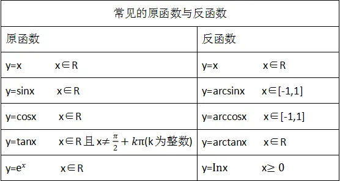

## 一、反函数概念

 设函数$y=f(x)(x∈A)$的值域是$C$，若存在一个函数$g(y)$使得对于每一个 $y∈C$都有$g(y)=x$,那么这个函数$x= g(y)(y∈C)$被称为函数$y=f(x)(x∈A)$的反函数，记作$x=f-1(y)$。
 
-  反函数$x=f^{-1}(y)$的定义域、值域分别是函数$y=f(x)$的值域、定义域。
- 若一函数有反函数，此函数便称为可逆的$（invertible）$。
- 相对于反函数$y=f^{-1}(x)$来说，原来的函数$y=f(x)$称为直接函数。

## 二、反函数性质特点

  - 函数存在反函数的充要条件是，函数的定义域与值域是一一映射,并且必须是双射；

  - 一个函数与它的反函数在相应区间上单调性一致；
  - 大部分偶函数不存在反函数；
  - 一段连续的函数的单调性在对应区间内具有一致性；
  - 严格增（减）的函数一定有严格增（减）的反函数；
  - 反函数是相互的且具有唯一性；  
  - 定义域、值域相反对应法则互逆；
  - 反函数存在定理:严格单调函数必定有严格单调的反函数，并且二者单调性相同。

## 三、反函数图像

反函数示意:

常见反函数:

