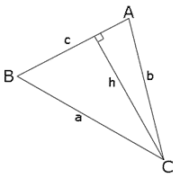
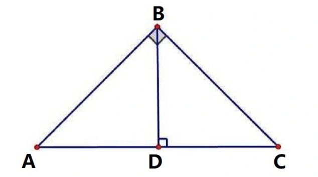

## 一、角的基本概念

 角的概念：用于描述两条射线之间的夹角或两条线段之间的旋转。完整的圆周角为$360$度,$1$弧度 $≈ 57.3$度。

 弧度制：以圆弧长与半径之比来度量圆心角大小的单位制。符号为 $rad$, $1$弧度是圆弧长等于半径时圆心角的大小。

   - 角度制以圆周的$1/360$ 作为单位，称为度，符号为 "$°$"
   - 弧度制以圆弧长与半径之比作为单位，没有具体的单位名称，符号为 $rad$
   - $1°$等于 $\pi/180$ 弧度，$1$弧度等于 $180°/\pi$
   - 设圆心角 $∠AOB$的圆弧 $AB$的长度为$s$，圆的半径为 $r$，则称$∠AOB$的弧度为：
$$∠AOB= \Large \frac{s}{r}$$

- 弧度制与角度制的换算：

$$\frac{圆周长}{半径}=\frac{2\pi r}{r}=2\pi (弧度)=360°(角度)$$

- 弧度制到角度制的换算：角度 $=$ 弧度 $\times  (180 / \pi)$
  $$1°=\frac{1}{360}\times 360°=\frac{1}{360} \times 2\pi =\frac{\pi}{180}$$
- 角度制到弧度制的换算：弧度 $=$ 角度 $\times (\pi / 180)$
 $$1rad=\frac{1}{2\pi }\times 2\pi =\frac{1}{2\pi }\times 360°=\frac{180}{\pi}$$

## 二、任意角的三角函数

  单位圆是以原点为圆心、半径长度为1的圆。
  
  在单位圆上，对于一个角度为$\theta$的角，它对应的点在单位圆上的坐标可以表示为$(cos\theta , sin\theta )$,
  
  $cos \theta$表示角度对应的点在单位圆上的横坐标（余弦值），$sin\theta$表示角度对应的点在单位圆上的纵坐标（正弦值）,

  在单位圆上，标准角度的度数为$0°、30°、45°、60°$和$90°$对应的弧度为$0、\pi /6、\pi /4、\pi /3和\pi /2$。

  三角函数（$Trigonometric$）是基本初等函数之一，是以角度（数学上最常用弧度制，下同）为自变量，角度对应任意角终边与单位圆交点坐标或其比值为因变量的函数。设点$P(x,y)$为半径为$r$的圆上的点,如示意图：
  
  

  
  

  正弦函数（$Sine$）：对应角度的正弦值，即一个角的对边与斜边之比。
$$sin(\theta ) =\frac{ 对 \quad 边}{斜\quad边} =\frac{y}{r}$$

  余弦函数（$Cosine$）：对应角度的余弦值，即一个角的邻边与斜边之比。
$$cos(\theta ) =\frac{邻\quad边}{斜\quad边} =\frac{x}{r}$$

  正切函数（$Tangent$）：对应角度的正切值，即一个角的对边与邻边之比。
$$tan(\theta ) =\frac{对\quad边}{邻\quad边} =\frac{y}{x}$$

  余割函数（$Cosecant$）：对应角度的余割值，即正弦值的倒数。
$$csc(\theta ) =\frac{斜\quad边}{对\quad边} =\frac{1}{sin(\theta )}  = \frac{r}{y}$$

  正割函数（$Secant$）：对应角度的正割值，即余弦值的倒数。
$$sec(\theta ) =\frac{斜\quad边}{邻\quad边} =\frac{1 }{ cos(\theta )}  =\frac{r }{ x}$$

  余切函数（$Cotangent$）：对应角度的余切值，即正切值的倒数。
$$cot(\theta ) =\frac{邻\quad边}{对\quad边} =\frac{ 1}{tan(\theta )}=\frac{ x}{y}$$

## 三、基本定理

 同角三角函数是指在同一个角度下的正弦、余弦、正切等三角函数之间的关系。

  平方关系：

  商数关系：
  

  倒数关系：

  平方关系变形：
  $$(\sin\alpha  \pm \cos\alpha  )^2=1 \pm 2 \sin\alpha \cos\alpha$$ 
  $$\sin\alpha  \cdot  \sin\alpha=(1+\cos\alpha) (1-\cos\alpha)\longrightarrow \frac{1+\cos\alpha}{\sin\alpha} =\frac{\sin\alpha}{1-\cos\alpha}$$
  $$\cos\alpha  \cdot  \cos\alpha=(1+\sin\alpha)(1-\sin\alpha)\longrightarrow \frac{1+\sin\alpha}{\cos\alpha} =\frac{\cos\alpha}{1-\sin\alpha}$$

  商数关系的变形：

$$\begin{cases} {\huge } 
  & \text{} \sin \alpha =\cos\alpha\cdot \tan \alpha  \quad(1) \\
  & \text{} \tan\alpha={ \large \frac{\sin \alpha}{\cos\alpha}}  \quad \quad  (2)\\
  & \text{}  \sin^2 \alpha +\cos^2\alpha=1   \quad(3)
\end{cases} \Longrightarrow   \begin{cases}
  & \text{ } \cos^2\alpha= \Large \frac{1}{1+\tan^2 \alpha }  \\  \\
  & \text{ } \sin^2 \alpha=\Large \frac{\tan^2 \alpha}{1+\tan^2 \alpha}
\end{cases}$$

**正弦定理 ($Law of sines$):** 在任意一个平面三角形中，各边和它所对角的正弦值的比相等且等于外接圆的直径。

$$\frac{a}{sinA}=\frac{ b}{sinB}=  \frac{c}{sinC}= 2r=D$$

证明：做一个边长为$a,b, c$的三角形，对应角分别是$A,B, C$。

$$\begin{cases}
  & \text{} \sin A=\frac{h}{b}  \\
  & \text{} \sin B=\frac{h}{a}  
\end{cases}\longrightarrow  h=b\sin A=a \sin B \longrightarrow \frac{\sin A}{a} =\frac{\sin B}{b} \quad 同理可证: \quad \frac{\sin B}{b} =\frac{\sin C}{c}$$

**余弦定理（$law of cosines$）：** 三角形任何一条边的平方等于其它两边平方的和减去这两边与它们夹角的余弦的积的两倍。

$$a^2 = b^2 + c^2 - 2bc·cos(A)$$
$$b^2 = a^2 + c^2 - 2ac·cos(B)$$
$$c^2 = a^2 + b^2 - 2ab·cos(C)$$

我们在直角坐标系中来推导，如图，以 $C$点为原点，$B$点在 $x$ 轴正方向上，则各点坐标为：
$$C(0,0),B(a,0),A(b·cosC,b·sinC)$$

根据正弦定理：
$$\frac{b}{sinB} =\frac{c}{sinC}\longrightarrow b·sinC=c·sinB$$

由两点之间的距离公式，有:
$$c^2=(\overrightarrow{AB})^2=(b·cosC-a)^2+(b·sinC-0)^2=a^2+b^2-2ab·cosC$$

**三角函数公式算面积：** 三角形的面积等于两邻边及其夹角正弦值的乘积的一半。($h$为底边的高)
$$S=\frac{1}{2}ah=\frac{1}{2}ab·sinC$$

**射影定理：** 在一个直角三角形中，一条直角边的平方，相等于三角形的斜边乘以该直角边在斜边上的正投影。

斜边上的高是两条直角边在斜边射影的比例中项，每一条直角边又是这条直角边在斜边上的射影和斜边的比例中项。

**证明:**$\frac{AD}{BD} =\frac{BD}{CD}$
$$\begin{cases}
  & \text{} AD^2+BD^2=AB^2 \\
  & \text{} CD^2+BD^2=BC^2
\end{cases}
\Longrightarrow  \begin{cases}
  & \text{} AD^2+CD^2+2BD^2=AB^2+BC^2 \\
  & \text{}  AD^2+CD^2+2BD^2=AC^2
\end{cases}$$

$$\begin{cases}
 & \text{} (AD+CD)^2−2(AD∙CD)+2BD^2=AC^2 \\ \\
 & \text{}  AC^2−2(AD∙CD)+2BD^2=AC^2 \\ \\
 & \text{}   2BD^2=2(AD∙CD) \\ \\
& \text{}  BD^2=AD·CD \quad \Longrightarrow \quad \frac{AD}{BD} =\frac{BD}{CD}
\end{cases}$$

**证明:**$\frac{AC}{AB} =\frac{AB}{AD}$
$$\begin{cases}
  & \text{}  AD^2+BD^2=AB^2\\
  & \text{}  AB^2+BC^2=AC^2
\end{cases}
\Longrightarrow  \begin{cases}
  & \text{}  AD^2+(BC^2−CD^2)=AB^2\\
  & \text{}  AC^2−BC^2=AB^2
\end{cases}$$

$$\begin{cases}
 & \text{} AD^2+AC^2−CD^2=2AB^2   \\ \\
 & \text{} AD^2+AC^2−(AC−AD)^2=2AB^2   \\ \\
& \text{}  AD^2+AC^2−(AC^2+AD^2−2AC∙AD)=2AB^2
\end{cases}$$

$$2(AC∙AD)=2AB^2 \Longrightarrow   AB^2=AC·AD \quad  \Longrightarrow \quad\frac{AC}{AB} =\frac{AB}{AD}$$

**证明:** $\frac{AC}{BC} =\frac{BC}{CD}$
$$\begin{cases}
  & \text{}  AC^2−AB^2=BC^2\\
  & \text{}  CD^2+BD^2=BC^2
\end{cases}
\Longrightarrow  \begin{cases}
  & \text{}  CD^2+(AB^2−AD^2)=BC^2\\
  & \text{}  AC^2+CD^2−AD^2=2BC^2 
\end{cases}$$

$$AC^2+CD^2−(AC−CD)^2=2BC^2 \Longrightarrow 2(AC∙CD)=2BC^2$$

$$BC^2=CD·AC \quad  \Longrightarrow \quad\frac{AC}{BC} =\frac{BC}{CD}$$

