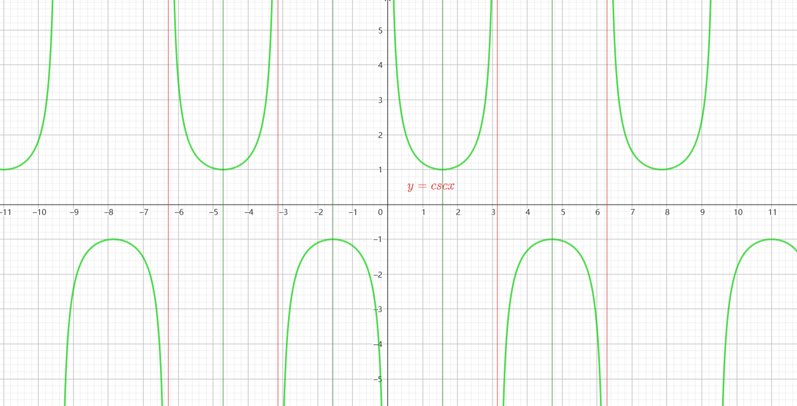

## 一、正弦函数的性质与图像

**正弦函数的性质:**
   - 是周期性函数,$sin(x+2\pi)=sin(x)$表示正弦函数以$2\pi$为周期。

   - 定义域为所有实数$R$,值域为区间$[−1,1]$即正弦函数的取值范围在$[−1,1]$之间。
   - 是一个奇函数，即满足$sin(−x)=−sin(x)$这意味着正弦函数关于原点对称。
   - 在$[ - \frac{\pi}{2}+2k\pi，\frac{\pi}{2}+2k\pi]$上是单调递增,在$[\frac{\pi}{2}+2k\pi，\frac{3\pi}{2}+2k\pi]$上是单调递减($k∈Z$)。
   - 对称中心为$(k\pi,0)$,对称轴为$x=k\pi+\frac{\pi}{2}$。
   - 振幅为 1，即振动的最大幅度为 1。振幅可以通过在函数前面乘以一个常数来调整。
   - 周期为$2\pi$，则频率为$\frac{1}{2\pi}$​。频率的倒数表示单位时间内振动的个数。
   - 零点对应的坐标点为$(k\pi,0),k∈Z$。
   - 在$x = \frac{\pi}{2}​ +2k\pi$,最大值为$1$。在$x=−\frac{\pi}{2} ​+2k\pi$,最小值为$-1$,其中$k$是任意整数。

   

**正弦型函数的图像:** 
   - 正弦型函数是形如$y = A sin(\omega x + \phi ) + k$的函数,其中$A,\omega ,\phi ,k$是常数,且$A>0，\omega >0$
   
   - 正弦型函数的周期为$T =\frac{2\pi}{\omega }$。 
   - 定义域$x∈R$,值域为$[-A，A]$。
   - 当$\phi =k\pi(k∈Z)$，是奇函数。当$\phi =\pi/2+k\pi(k∈Z)$是偶函数。当$\phi$取其他值时，$y=Asin(\omega x+\phi )$非奇非偶。
   - 在区间$( -\frac{\pi+2\phi }{2\omega }+2k\pi,\frac{\pi-2\phi }{2\omega }+2k\pi)$上递增。在区间$(\frac{\pi-2\phi }{2\omega }+2k\pi,\frac{3\pi-2\phi }{2\omega }+2k\pi)$上递减。
   - 零点：$(k\pi-\phi )/\omega ,k∈Z$
   - 在$x=\frac{\pi-2\phi }{2\omega }+2k\pi$,最大值。
   - 在$x=-\frac{\pi+2\phi }{2\omega }+2k\pi$,最小值,其中$k$是任意整数。

## 二、余弦函数的性质与图像

**余弦函数的性质:**
   - 周期为$2\pi$,对于任意实数$x$$cos(x+2\pi)=cos(x)$。

   - 定义域为所有实数$R$,值域为区间$[−1,1]$即正弦函数的取值范围在$[−1,1]$之间。
   - 是一个偶函数，即$cos(−x)=cos(x)$,图像关于$y$轴对称。
   - 在$[2k\pi,\pi+2k\pi]$区间上是单调递减的，在$[\pi+2k\pi,2\pi+2k\pi]$区间上是单调递增的。
   - 对称轴是$x＝k\pi$,频率为$\frac{1}{2\pi}$​。
   - 零点对应的坐标点为$(\frac{\pi}{2}+k\pi,0),k∈Z$。
   - 值范围在$−1≤cos(x)≤1$，在$x=2n\pi$（其中$n$是任意整数）。

## 二、正切函数的性质与图像

**正切函数的性质:**
   - 正切函数是周期性函数，其周期为$k\pi ,k∈Z$,对于任意实数$x$，$tan(x+\pi)=tan(x)$。
   
   - 定义域为$\left \{ x|x≠\frac{\pi}{2}+k\pi,k∈Z \right\}$值域是整个实数集$R$。
   - 正切函数是一个奇函数，即$tan(−x)=−tan(x)$,图像关于原点对称。
   - 正切函数在每个周期内有无数个增区间,增区间:$\left \{x|(-\frac{\pi}{2}+k\pi<x<\frac{\pi}{2}+k\pi,k∈Z\right\}$增区间的长度为$\pi$。
   - 正切函数具有垂直渐近线,垂直渐近线是$\frac{\pi}{2}+k\pi$（其中$k∈Z$是任意整数）。
   - 正切函数在$(k\pi,0)$（其中$k$是任意整数）处有零点。

## 四、余切函数的性质与图像

**余切函数的性质:**
- 定义域： $x \neq k \pi, ~ k \in \mathbb{Z}$ （即 $x$  不等于  $\pi$  的整数倍）。值域：$(-\infty,+\infty)$  。
- 单调性：在每个连续区间  $(k \pi,(k+1) \pi)$  内，  $\cot (x)$  是单调递减的。
- 奇偶性：$\cot (x)$  是奇函数，即  $\cot (-x)=-\cot (x)$  。
- 周期性：$\cot (x)$  是周期函数，周期为  $\pi$  ，即  $\cot (x+\pi)=\cot (x)$  。
- 渐近线：在  $x=k \pi(k \in \mathbb{Z})$  处，  $\cot (x)$  有垂直渐近线。
- 零点：$\cot (x)=0$  时， $x=\frac{\pi}{2}+k \pi, ~ k \in \mathbb{Z}$

## 五、正割函数的性质与图像

**正割函数的性质:**
- 定义域：$x\neq \frac{\pi}{2}+k\pi, ~ k \in \mathbb{Z}$（即$x$不等于$\frac{\pi}{2}$的奇数倍，因为此时$\cos (x)=0）$，值域：$(-\infty,-1] \cup[1,+\infty)$。
- 单调性： 在每个区间$(2 k \pi, 2 k \pi+\pi)$内，单调递增的。在每个区间 $(2 k \pi+\pi, 2 k \pi+2 \pi)$内，单调递减的。
- 奇偶性：$\sec (x)$是偶函数，即$\sec (-x)=\sec (x)$。
- 周期性：$\sec (x)$是周期函数，周期为$2 \pi$，即$\sec (x+2 \pi)=\sec (x)$。
- 渐近线：在$x=\frac{\pi}{2}+k \pi(k \in \mathbb{Z})$  处，  $\sec (x)$  有垂直渐近线。
- 零点：$\sec (x)$  没有零点，因为$\sec (x)=\frac{1}{\cos (x)}$的绝对值始终大于或等于 $1$ 。

## 六、余割函数的性质与图像

**余割函数的性质:**

- 定义域： $x \neq k \pi, ~ k \in \mathbb{Z}$（即$x$不等于$\pi$的整数倍，因为此时$\sin (x)=0）$。值域：$(-\infty,-1] \cup[1,+\infty)$。
- 单调性： 在区间$(-\frac{\pi}{2}+2k\pi,\frac{\pi}{2}+2k\pi)$内，单调递减，在区间$(\frac{\pi}{2}+2k\pi ,\frac{3\pi}{2}+2k\pi   )$内，单调递增。

- 奇偶性：$\csc (x)$  是奇函数，即  $\csc (-x)=-\csc (x)$  。
- 周期性：$\csc (x)$  是周期函数，周期为  $2 \pi$  ，即  $\csc (x+2 \pi)=\csc (x)$  。
- 渐近线：在  $x=k \pi(k \in \mathbb{Z})$  处，  $\csc (x)$  有垂直渐近线。
- 零点：$\csc (x)$  没有零点，因为  $\csc (x)=\frac{1}{\sin (x)}$  的绝对值始终大于或等于$1$ 。

