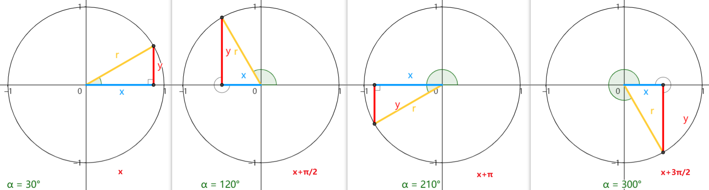

## 一、基础诱导公式

 基础性质：奇变偶不变，符号看象限，对于$k\pi /2±\alpha (k∈Z)$的三角函数值
   - 当$k$是偶数时，得到$\alpha$的同名函数值，即函数名不改变。
   - 当$k$是奇数时，得到$\alpha$相应的余函数值，即：
$$
 \begin{cases}
  & \text{} sin\alpha →cos\alpha  \quad  \\\newline
  & \text{} cos\alpha →sin\alpha  \quad  \\\newline
  & \text{} tan\alpha →cot\alpha  \quad  \\\newline
  & \text{} cot\alpha →tan\alpha  
\end{cases}
$$
   - 最后在前面加上把$\alpha$看成锐角时原函数值的符号：

$$
 \begin{cases}
  & \text{} 第一象限内:  \quad  任何一个角+  \\\newline
  & \text{} 第二象限内:  \quad  正弦、余割是+ \\\newline
  & \text{} 第三象限内:  \quad  正切、余切+ \\\newline
  & \text{} 第四象限内:  \quad  余弦、正割是+
\end{cases}
$$

  

**公式一：$x=x+2k\pi$**
$$
 x=x+2k\pi  \quad \begin{cases}
  & \text{} sin(\alpha +2k\pi )=sin \alpha  \\\newline
  & \text{} cos(\alpha +2k\pi )=cos \alpha  \\\newline
  & \text{} tan(\alpha +2k\pi )=tan \alpha  \\\newline
  & \text{} cot(\alpha +2k\pi )=cot \alpha  \\\newline
  & \text{} sec(\alpha +2k\pi )=sec \alpha  \\\newline
  & \text{} csc(\alpha +2k\pi )=csc \alpha 
\end{cases}
$$

**公式二：$x=-x$**
$$
 x=-x \quad \begin{cases}
  & \text{} sin(-\alpha )=-sin \alpha  \\\newline
  & \text{} cos(-\alpha )=cos \alpha  \\\newline
  & \text{} tan(-\alpha )=-tan \alpha  \\\newline
  & \text{} cot(-\alpha )=-cot \alpha  \\\newline
  & \text{} sec(-\alpha )=sec \alpha  \\\newline
  & \text{} csc(-\alpha )=-csc \alpha 
\end{cases}
$$

**公式三：$x=-x+2k\pi$**
$$
 x=-x+2k\pi  \quad \begin{cases}
  & \text{} sin(-\alpha +2\pi )=-sin \alpha  \\\newline
  & \text{} cos(-\alpha +2\pi )=cos \alpha  \\\newline
  & \text{} tan(-\alpha +2\pi )=-tan \alpha  \\\newline
  & \text{} cot(-\alpha +2\pi )=-cot \alpha  \\\newline
  & \text{} sec(-\alpha +2\pi )=sec \alpha  \\\newline
  & \text{} csc(-\alpha +2\pi )=-csc \alpha 
\end{cases}
$$

**公式四：$x=x+\pi$**
$$
 x=x+\pi  \quad \begin{cases}
  & \text{} sin(\alpha +\pi )=-sin \alpha  \\\newline
  & \text{} cos(\alpha +\pi )=-cos \alpha  \\\newline
  & \text{} tan(\alpha +\pi )=tan \alpha  \\\newline
  & \text{} cot(\alpha +\pi )=cot \alpha  \\\newline
  & \text{} sec(\alpha +\pi )=-sec \alpha  \\\newline
  & \text{} csc(\alpha +\pi )=-csc \alpha 
\end{cases}
$$

**公式五：$x=-x+\pi$**
$$
 x=-x+\pi  \quad \begin{cases}
  & \text{} sin(-\alpha +\pi )=sin \alpha  \\\newline
  & \text{} cos(-\alpha +\pi )=-cos \alpha  \\\newline
  & \text{} tan(-\alpha +\pi )=-tan \alpha  \\\newline
  & \text{} cot(-\alpha +\pi )=-cot \alpha  \\\newline
  & \text{} sec(-\alpha +\pi )=-sec \alpha  \\\newline
  & \text{} csc(-\alpha +\pi )=csc \alpha 
\end{cases}
$$

**公式六：$x=x-\pi$**
$$
 x=x-\pi  \quad \begin{cases}
  & \text{} sin(\alpha -\pi )=-sin \alpha  \\\newline
  & \text{} cos(\alpha -\pi )=-cos \alpha  \\\newline
  & \text{} tan(\alpha -\pi )=tan \alpha  \\\newline
  & \text{} cot(\alpha -\pi )=cot \alpha  \\\newline
  & \text{} sec(\alpha -\pi )=-sec \alpha  \\\newline
  & \text{} csc(\alpha -\pi )=-csc \alpha 
\end{cases}
$$

**公式七：$x=x+ \frac{\pi }{2}$**
$$
 x=x+ \frac{\pi }{2} \quad \begin{cases}
  & \text{} sin(\alpha +\frac{\pi }{2})=cos\alpha  \\\newline
  & \text{} cos(\alpha +\frac{\pi }{2})=−sin\alpha  \\\newline
  & \text{} tan(\alpha +\frac{\pi }{2})=-cot\alpha  \\\newline
  & \text{} cot(\alpha +\frac{\pi }{2})=-tan\alpha  \\\newline
  & \text{} sec(\alpha +\frac{\pi }{2})=-csc\alpha  \\\newline
  & \text{} csc(\alpha +\frac{\pi }{2})=sec\alpha  
\end{cases}
$$

**公式八：$x=-x+ \frac{\pi }{2}$**
$$
 -x+ \frac{\pi }{2} \quad \begin{cases}
  & \text{} sin(-\alpha +\frac{\pi }{2})=cos\alpha  \\\newline
  & \text{} cos(-\alpha +\frac{\pi }{2})=sin\alpha  \\\newline
  & \text{} tan(-\alpha +\frac{\pi }{2})=cot\alpha  \\\newline
  & \text{} cot(-\alpha +\frac{\pi }{2})=tan\alpha  \\\newline
  & \text{} sec(-\alpha +\frac{\pi }{2})=csc\alpha  \\\newline
  & \text{} csc(-\alpha +\frac{\pi }{2})=sec\alpha 
\end{cases}
$$

**公式九：$x=x+ \frac{3\pi }{2}$**
$$
 x=x+ \frac{3\pi }{2} \quad \begin{cases}
  & \text{} sin(\alpha +\frac{3\pi }{2})=-cos\alpha  \\\newline
  & \text{} cos(\alpha +\frac{3\pi }{2})=sin\alpha  \\\newline
  & \text{} tan(\alpha +\frac{3\pi }{2})=-cot\alpha  \\\newline
  & \text{} cot(\alpha +\frac{3\pi }{2})=-tan\alpha  \\\newline
  & \text{} sec(\alpha +\frac{3\pi }{2})=csc\alpha  \\\newline
  & \text{} csc(\alpha +\frac{3\pi }{2})=-sec\alpha 
\end{cases}
$$

**公式十：$-x+ \frac{3\pi }{2}$**
$$
-x+ \frac{3\pi }{2}  \quad  \begin{cases} 
  & \text{} sin(-\alpha +\frac{3\pi }{2})=-cos\alpha  \\ 
\newline
  & \text{} cos(-\alpha +\frac{3\pi }{2})=-sin\alpha  \\
\newline
  & \text{} tan(-\alpha +\frac{3\pi }{2})=cot\alpha  \\
\newline
  & \text{} cot(-\alpha +\frac{3\pi }{2})=tan\alpha  \\
\newline
  & \text{} sec(-\alpha +\frac{3\pi }{2})=-csc\alpha  \\
\newline
  & \text{} csc(-\alpha +\frac{3\pi }{2})=-sec\alpha  \end{cases}$$
  

## 二、和角公式

**两角和与差的正弦：**
$$sin(\alpha ±\beta )=sin\alpha ·cos\beta ±cos\alpha ·sin\beta $$

**两角和与差的余弦：**
$$cos(\alpha ±\beta )=cos\alpha ·cos\beta ∓sin\alpha ·sin\beta $$

**两角和与差的正切：**
$$tan(\alpha ±\beta )=\frac{tan\alpha ±tan\beta }{1∓tan\alpha ·tan\beta }$$

**✅正弦和角公式推导过程：面积法**

$${\color{Orange} 
两角和的正弦 \begin{cases}
  & \text{} S_{∆ABC}=S_{∆ABD}+S_{∆ACD} \\ \newline
  & \text{} \frac{1}{2} AB·AC·sin(\alpha +\beta )=\frac{1}{2} AB·AD·sin\alpha +\frac{1}{2} AC·AD·sin\beta  \\ \newline
  & \text{} sin(\alpha +\beta )= \frac{AD}{AC}·sin\alpha +\frac{AD}{AB}·sin\beta =sin\alpha ·cos\beta +cos\alpha ·sin\beta  \newline
\end{cases} } 
$$

$${\color{Orange} 
两角差的正弦 \begin{cases}
  & \text{} sin(\alpha +\beta )= cos\beta ·sin\alpha +cos\alpha ·sin\beta   \\ \newline
  & \text{} sin[\alpha +(-\beta )]= cos(-\beta )·sin\alpha +cos\alpha ·sin(-\beta ) \\ \newline
  & \text{} sin(\alpha -\beta )= sin\alpha ·cos\beta -cos\alpha ·sin\beta  \newline
\end{cases} }
$$

**✅余弦和角公式推导过程：向量法**

在单位圆上取两个角$∠\alpha$和$∠\beta$，其终边与单位圆的交点分别是$P、Q$,其坐标分别为$P(cos\alpha ,sin\alpha ),Q(cos\beta ,sin\beta )$。
 
$${\color{Orange}
两角差的余弦 \begin{cases}
  & \text{}    \overrightarrow{AQ}·\overrightarrow{AP} =|\overrightarrow{AQ}|·|\overrightarrow{AP}|· cos(\alpha -\beta )=cos\alpha ·cos\beta +sin\alpha ·sin\beta  \\ \newline
  & \text{} |\overrightarrow{AQ}|=|\overrightarrow{AP}|=1 \\ \newline
  & \text{}  cos(\alpha -\beta )=cos\alpha ·cos\beta +sin\alpha ·sin\beta  \newline
\end{cases} }$$

$${\color{Orange}
两角和的余弦 \begin{cases}
  & \text{}   cos[\alpha -(-\beta )]=cos\alpha ·cos(-\beta )+sin\alpha ·sin(-\beta ) \\ \newline
  & \text{}   cos(\alpha +\beta )=cos\alpha ·cos\beta -sin\alpha ·sin\beta  \newline
\end{cases} }$$

**✅正切和角公式推导过程：**
$${\large   {\color{Orange}
两角和的正切 \begin{cases}
  & \text{}  tan(\alpha +\beta )=\frac{ sin(\alpha +\beta )}{cos(\alpha +\beta )}=\frac{cos\beta ·sin\alpha +cos\alpha ·sin\beta  }{cos\alpha ·cos\beta -sin\alpha ·sin\beta }   \\ \newline
  & \text{}  tan(\alpha +\beta )=\frac{(cos\beta ·sin\alpha +cos\alpha ·sin\beta )· \frac{1}{cos\alpha ·cos\beta } }{(cos\alpha ·cos\beta -sin\alpha ·sin\beta )· \frac{1}{cos\alpha ·cos\beta }}   \\ \newline
  & \text{}  tan(\alpha +\beta )=\frac{tan\alpha +tan\beta }{1-tan\alpha ·tan\beta }   \\ 
\end{cases} } }$$

$${\large   {\color{Orange}
两角差的正切 \begin{cases}
  & \text{}  tan(\alpha -\beta )=\frac{ sin(\alpha -\beta )}{cos(\alpha -\beta )}= \frac{cos\beta ·sin\alpha -cos\alpha ·sin\beta }{cos\alpha ·cos\beta +sin\alpha ·sin\beta }  \\ \newline
  & \text{}  tan(\alpha -\beta )=\frac{(cos\beta ·sin\alpha -cos\alpha ·sin\beta )· \frac{1}{cos\alpha ·cos\beta } }{(cos\alpha ·cos\beta +sin\alpha ·sin\beta )· \frac{1}{cos\alpha ·cos\beta }}   \\ \newline
  & \text{}  tan(\alpha -\beta )=\frac{tan\alpha -tan\beta }{1+tan\alpha ·tan\beta }   \\ 
\end{cases} } }$$

## 三、倍角公式

**二倍角公式：**
$$sin2\alpha =2sin\alpha ·cos\alpha =\frac{2}{tan\alpha +cot\alpha }$$
$$cos2\alpha =cos^2\alpha -sin^2\alpha =2cos^2\alpha -1=1-2sin^2\alpha =\frac{1-tan^2\alpha }{1+tan^2\alpha }$$
$$tan2\alpha =\frac{2tan\alpha }{1-tan^2\alpha }$$
$$cot2\alpha =\frac{cot^2\alpha -1}{2cot\alpha }$$
$$sec2\alpha =\frac{sec^2\alpha }{1-tan^2\alpha }$$
$$csc2\alpha =\frac{1}{2sin\alpha ·cos\alpha }=\frac{1}{2}sec\alpha ·csc\alpha $$

**三倍角公式：**
$$sin3\alpha = 3sin\alpha -4sin^3\alpha  =4sin\alpha ·sin(60°+\alpha )·sin(60°-\alpha )$$
$$cos3\alpha  = 4cos^33\alpha -3cos\alpha  = 4cos\alpha ·cos(60°+\alpha )·cos(60°-\alpha )$$
$$tan3\alpha  =\frac{3tan\alpha -tan^3\alpha }{1-3tan^2\alpha }=tan\alpha ·tan(\frac{\pi }{3}+\alpha )·tan(\frac{\pi }{3}-\alpha )$$
$$cot3\alpha =\frac{cot^3\alpha -3cot\alpha }{3cot^2\alpha -1}$$

**✅二倍角公式推导过程：**
$${\large{\color{Red}
sin2\alpha  \quad \begin{cases}
  & \text{} =sin(\alpha +\alpha ) \\ \newline
  & \text{} =sin\alpha ·cos\alpha +sin\alpha ·cos\alpha  \\ \newline
  & \text{} =2sin·cos\alpha  \\ \newline
  & \text{} =\frac{2sin·cos\alpha }{sin^2\alpha +cos^2\alpha }  \\ \newline
  & \text{} =\frac{2}{\frac{sin^2\alpha +cos^2\alpha }{sin\alpha ·cos\alpha } } \\ \newline
  & \text{} =\frac{2}{tan\alpha +cot\alpha } \\ 
\end{cases} }  }$$

$${\large{\color{Red}
cos2\alpha  \quad \begin{cases}
  & \text{} =cos(\alpha +\alpha )\\ \newline
  & \text{} =cos^2\alpha -sin^2\alpha  \\ \newline
  & \text{} =2cos^2\alpha -1 \\ \newline
  & \text{} =1-2sin^2\alpha   \\ \newline
  & \text{} =\frac{cos^2\alpha -sin^2\alpha }{cos^2\alpha +sin^2\alpha } \\ \newline
  & \text{} =\frac{\frac{cos^2\alpha -sin^2\alpha }{cos^2\alpha }}{\frac{cos^2\alpha +sin^2\alpha }{cos^2\alpha }} \\ \newline
  & \text{} =\frac{1-tan^2\alpha }{1+tan^2\alpha } \\ 
\end{cases} }  }$$

$${\large{\color{Red}
tan2\alpha  \quad \begin{cases}
  & \text{} =tan(\alpha +\alpha )\\ \newline
  & \text{} =\frac{tan\alpha +tan\alpha }{1-tan\alpha ·tan\alpha }   \\ \newline
  & \text{} =\frac{2tan\alpha }{1-tan^2\alpha }    \\ 
\end{cases} }  }$$

$${\large{\color{Red}
cot2\alpha  \quad \begin{cases}
  & \text{} =\frac{1}{tan2\alpha }\\ \newline
  & \text{} =\frac{1-tan^\alpha }{2tan\alpha } \\ \newline
  & \text{} =\frac{1-\frac{1}{cot^2\alpha }}{\frac{2}{cot\alpha }} \\ \newline
  & \text{} =\frac{cot^2\alpha -1}{2cot\alpha }  \\ 
\end{cases} }  }$$

$${\large{\color{Red}
sec2\alpha  \quad \begin{cases}
  & \text{} =\frac{1}{cos2\alpha } \\ \newline
  & \text{} =\frac{1}{2cos^\alpha -1}  \\ \newline
  & \text{} =\frac{1+tan^2\alpha }{1-tan^2\alpha }  \\  \newline
  & \text{} =\frac{sec^2\alpha }{1-tan^2\alpha }  \\ 
\end{cases} }  }$$

$${\large{\color{Red}
csc2\alpha  \quad \begin{cases}
  & \text{} =\frac{1}{sin2\alpha }   \\ \newline
  & \text{} =\frac{1}{2sin\alpha ·cos\alpha }   \\ \newline
  & \text{} =\frac{sec\alpha ·csc\alpha }{2}  \\ \newline
  & \text{} =\frac{tan\alpha +cot\alpha }{2} \\ 
\end{cases} }  }$$

**✅三倍角公式推导过程：由二倍角及和角公式推出**
$$
{\color{Purple}
sin3\alpha  \quad \begin{cases}
  & \text{} =sin(2\alpha +\alpha )   \\ \newline
  & \text{} =sin2\alpha ·cos\alpha  + cos2\alpha ·sin\alpha  \\ \newline
  & \text{} =2sin\alpha ·(1-sin^2\alpha )+(1-2sin^2\alpha )·sin\alpha  \\ \newline
  & \text{} =3sin\alpha -4sin^3\alpha  \\ \newline
  & \text{} =4sin\alpha (\frac{3}{4}-sin^2\alpha ) \\ \newline
  & \text{} =4sin\alpha [(\frac{\sqrt{3}}{2})^2-sin^2\alpha ] \\ \newline
  & \text{} =4sin\alpha (sin^2\frac{\pi }{3}-sin^2\alpha ) \\ \newline
  & \text{} =4sin\alpha (sin\frac{\pi }{3}+sin\alpha )·(sin\frac{\pi }{3}-sin\alpha ) \\ \newline
  & \text{} =4sin\alpha ·2sin(\frac{\pi }{6}+\frac{\alpha }{2})·cos(\frac{\pi }{6}-\frac{\alpha }{2})·2sin(\frac{\pi }{6}-\frac{\alpha }{2})·cos(\frac{\pi }{6}+\frac{\alpha }{2}) \\ \newline
  & \text{} =4sin\alpha ·sin(\frac{\pi }{3}+\alpha )·sin(\frac{\pi }{3}-\alpha ) \\
\end{cases} }  
$$

$$
{\color{Purple}
cos3\alpha  \quad \begin{cases}
  & \text{} =cos(2\alpha +\alpha )   \\ \newline
  & \text{} =cos2\alpha ·cos\alpha  - sin2\alpha ·sin\alpha  \\ \newline
  & \text{} =(2cos^2\alpha -1)·cos\alpha -2(1-cos^2\alpha )·cos\alpha  \\ \newline
  & \text{} =4cos^3\alpha -3cos\alpha  \\ \newline
  & \text{} =4cos\alpha (cos^2\alpha -\frac{3}{4}) \\ \newline
  & \text{} =4cos\alpha [cos^2\alpha -(\frac{\sqrt{3}}{2})^2] \\ \newline
  & \text{} =4cos\alpha (cos^2\alpha -cos^2 \frac{\pi }{6}) \\ \newline
  & \text{} = 4cos\alpha ·(cos\alpha +cos\frac{\pi }{6})·(cos\alpha -cos\frac{\pi }{6})\\ \newline
  & \text{} = 4cos\alpha ·2cos(\frac{\alpha }{2}+\frac{\pi }{12})·cos(\frac{\alpha }{2}-\frac{\pi }{12})·-2sin(\frac{\alpha }{2}+\frac{\pi }{12})·sin(\frac{\alpha }{2}-\frac{\pi }{12})  \\ \newline
  & \text{} =-4cos\alpha ·sin(\alpha +\frac{\pi }{6})·sin(\alpha -\frac{\pi }{6}) \\ \newline
 & \text{} =4cos\alpha ·sin(\frac{\pi }{6}-\alpha )·sin(\frac{\pi }{6}+\alpha ) \\ \newline
  & \text{} =4cos\alpha ·cos(\frac{\pi }{3}-\alpha )·cos(\frac{\pi }{3}+\alpha ) \\
\end{cases} }  
$$

$$
{\color{Purple}
tan3\alpha  \quad \begin{cases}
  & \text{} sin3\alpha =4sin\alpha ·sin(\frac{\pi }{3}+\alpha )·sin(\frac{\pi }{3}-\alpha )  \\ \newline
  & \text{} cos3\alpha =4cos\alpha ·cos(\frac{\pi }{3}-\alpha )·cos(\frac{\pi }{3}+\alpha ) \\ \newline
  & \text{} =tan(\alpha +2\alpha ) \\ \newline
  & \text{} { \large= \frac{tan\alpha +\frac{2tan\alpha }{1-tan^2\alpha }}{1-tan\alpha ·\frac{2tan\alpha }{1-tan^2\alpha }}}  \\ \newline
  & \text{} { \large=\frac{\frac{tan\alpha (1-tan^2\alpha )+2tan\alpha }{1-tan^\alpha }}{\frac{1-tan^2\alpha -2tan^2\alpha }{1-tan^2\alpha }} } \\ \newline
  & \text{} { \large=\frac{3tan\alpha -tan^3\alpha }{1-3tan^2\alpha } }  \\ \newline
  & \text{} =\frac{sin3\alpha }{cos3\alpha } =tan\alpha ·tan(\frac{\pi }{3}-\alpha )·tan(\frac{\pi }{3}+\alpha ) \\ 
\end{cases} } 
$$

## 四、半角公式

**半角的正弦、余弦和正切：**(正负由$\frac{\alpha }{2}$所在的象限决定)
$$sin\frac{\alpha }{2} =±\sqrt{\frac{1-cos\alpha }{2} }$$
$$cos\frac{\alpha }{2} =±\sqrt{\frac{1+cos\alpha }{2} }$$
$$tan\frac{\alpha }{2} =±\sqrt{\frac{1-cos\alpha }{1+cos\alpha } } =\frac{sin\alpha }{1+cos\alpha } =\frac{1-cos\alpha }{sin\alpha } =csc\alpha -cot\alpha $$
$$cot\frac{\alpha }{2} =±\sqrt{\frac{1+cos\alpha }{1-cos\alpha } } =\frac{1+cos\alpha }{sin\alpha } =\frac{sin\alpha }{1-cos\alpha } =csc\alpha +cot\alpha $$
$$sec\frac{\alpha }{2} =±\sqrt{\frac{2sec\alpha }{sec\alpha +1} }$$
$$csc\frac{\alpha }{2} =±\sqrt{\frac{2sec\alpha }{sec\alpha -1} }$$

**✅半角公式推导过程：由二倍角及和角公式推出**
$${ \color{Brown}   sin\frac{\alpha }{2}  \quad \begin{cases}
& \text{} sin2\alpha  =2sin\alpha ·cos\alpha  \\ \newline
  & \text{} cos2\alpha  =cos^2\alpha -sin^2\alpha =2cos^2\alpha -1=1-2sin^2\alpha  \\ \newline
  & \text{} sin^2\alpha =\frac{1-cos2\alpha }{2} \\ \newline
  & \text{}  sin^2\frac{\alpha }{2} =\frac{1-cos\alpha }{2}\\ \newline
  & \text{} { \large sin\frac{\alpha }{2} =±\sqrt{\frac{1-cos\alpha }{2} } }
\end{cases} }$$

$${  \color{Blue}  cos\frac{\alpha }{2}  \quad \begin{cases}
& \text{} sin2\alpha  =2sin\alpha ·cos\alpha  \\ \newline
  & \text{} cos2\alpha  =cos^2\alpha -sin^2\alpha =2cos^2\alpha -1=1-2sin^2\alpha  \\ \newline
  & \text{} 2cos^2\alpha =cos2\alpha +1 \\ \newline
  & \text{}  cos^2\frac{\alpha }{2} =\frac{1+cos\alpha }{2}  \\ \newline
  & \text{} { \large cos\frac{\alpha }{2}=±\sqrt{\frac{1+cos\alpha }{2} } }
\end{cases} }$$

$${  \color{Maroon}  tan\frac{\alpha }{2}  \quad \begin{cases}
  & \text{}  sin\frac{\alpha }{2} =±\sqrt{\frac{1-cos\alpha }{2} }  \\ \newline
  & \text{}   cos\frac{\alpha }{2}=±\sqrt{\frac{1+cos\alpha }{2} }  \\ \newline
  & \text{}  { \large tan\frac{\alpha }{2} =\frac{sin\frac{\alpha }{2}}{cos\frac{\alpha }{2}} } \\ \newline
  & \text{} { \large tan\frac{\alpha }{2} =±\sqrt{ \frac{1-cos\alpha }{1+cos\alpha } } }
\end{cases} }$$

## 五、积化和差与和差化积

**积化和差：**
$$cos\alpha ·sin\beta =\frac{1}{2} [sin(\alpha +\beta )-sin(\alpha -\beta )]$$
$$sin\alpha ·cos\beta =\frac{1}{2} [sin(\alpha +\beta )+sin(\alpha -\beta )]$$
$$cos\alpha ·cos\beta =\frac{1}{2} [cos(\alpha +\beta )+cos(\alpha -\beta )]$$
$$sin\alpha ·sin\beta =-\frac{1}{2} [cos(\alpha +\beta )-cos(\alpha -\beta )]$$

**和差化积口诀：**  正加正，正在前，余加余，余并肩，正减正，余在前，余减余，负正弦
$$sin\alpha +sin\beta =2sin\frac{\alpha +\beta }{2}· cos\frac{\alpha -\beta }{2}$$
$$sin\alpha -sin\beta =2sin\frac{\alpha -\beta }{2}· cos\frac{\alpha +\beta }{2}$$
$$cos\alpha +cos\beta =2cos\frac{\alpha +\beta }{2}· cos\frac{\alpha -\beta }{2}$$
$$cos\alpha -cos\beta =-2sin\frac{\alpha +\beta }{2}· sin\frac{\alpha -\beta }{2}$$
$$tan\alpha +tan\beta =\frac{sin(\alpha +\beta )}{cos\alpha ·cos\beta }$$
$$tan\alpha -tan\beta =\frac{sin(\alpha -\beta )}{cos\alpha ·cos\beta }$$
$$cot\alpha +cot\beta =\frac{sin(\alpha +\beta )}{sin\alpha ·sin\beta }$$
$$cot\alpha -cot\beta =-\frac{sin(\alpha -\beta )}{sin\alpha ·sin\beta }$$
$$tan\alpha +cot\beta =\frac{cos(\alpha -\beta )}{cos\alpha ·sin\beta }$$
$$tan\alpha -cot\beta =-\frac{cos(\alpha +\beta )}{cos\alpha ·sin\beta }$$

**平方形式和差化积：**
$$sin^2\alpha -sin^2\beta =sin(\alpha +\beta )·sin(\alpha -\beta )$$
$$cos^2\alpha -cos^2\beta =-sin(\alpha +\beta )·sin(\alpha -\beta )$$
$$cos^2\alpha -sin^2\beta =cos(\alpha +\beta )·cos(\alpha -\beta )$$
$$sin^2\beta -cos^2\beta =-cos(\alpha +\beta )·cos(\alpha -\beta )$$

**✅积化和差与和差化积推导：**
$${ \color{Purple} 积化和差  \quad \begin{cases}
  & \text{}  sin(\alpha +\beta )=sin\alpha ·cos\beta +cos\alpha ·sin\beta   \qquad (1)  \\ \newline
  & \text{}  sin(\alpha -\beta )=sin\alpha ·cos\beta -cos\alpha ·sin\beta    \qquad (2)  \\ \newline
  & \text{}  cos(\alpha +\beta )=cos\alpha ·cos\beta -sin\alpha ·sin\beta     \qquad (3)  \\ \newline
  & \text{}  cos(\alpha -\beta )=cos\alpha ·cos\beta +sin\alpha ·sin\beta     \qquad (4)  \\ \newline
  & \text{}  cos\alpha ·sin\beta =\frac{1}{2}·[(1)-(2)]  \\ \newline
  & \text{}  sin\alpha ·cos\beta =\frac{1}{2}·[(1)+(2)]  \\ \newline
  & \text{}  cos\alpha ·cos\beta =\frac{1}{2}·[(3)+(4)]  \\ \newline
  & \text{}  sin\alpha ·sin\beta =-\frac{1}{2}·[(3)-(4)]  \\ 
\end{cases} }$$

$${ \color{red} 和差化积  \quad \begin{cases}
  & \text{}  \alpha =\frac{\alpha +\beta }{2}+\frac{\alpha -\beta }{2} \\ \newline
  & \text{}  \beta =\frac{\alpha +\beta }{2}-\frac{\alpha -\beta }{2} \\ \newline
  & \text{}  sin\alpha =sin(\frac{\alpha +\beta }{2}+\frac{\alpha -\beta }{2}) \\ \newline
  & \text{}  sin\beta =sin(\frac{\alpha +\beta }{2}-\frac{\alpha -\beta }{2})  \\ \newline
  & \text{}  sin\alpha =sin\frac{\alpha +\beta }{2}·cos\frac{\alpha -\beta }{2}+cos\frac{\alpha +\beta }{2}·sin\frac{\alpha -\beta }{2} \\ \newline
  & \text{}  sin\beta =sin\frac{\alpha +\beta }{2}·cos\frac{\alpha -\beta }{2}-cos\frac{\alpha +\beta }{2}·sin\frac{\alpha -\beta }{2}  \\ \newline
  & \text{}  sin\alpha +sin\beta =2sin\frac{\alpha +\beta }{2}·cos\frac{\alpha -\beta }{2}  \\ \newline
  & \text{}  sin\alpha -sin\beta =2sin\frac{\alpha -\beta }{2}·cos\frac{\alpha +\beta }{2} \\ \newline
  & \text{}  cos\alpha =cos(\frac{\alpha +\beta }{2}+\frac{\alpha -\beta }{2}) \\ \newline
  & \text{}  cos\beta =cos(\frac{\alpha +\beta }{2}-\frac{\alpha -\beta }{2})  \\ \newline
  & \text{}  cos\alpha =cos\frac{\alpha +\beta }{2}·cos\frac{\alpha -\beta }{2}-sin\frac{\alpha +\beta }{2}sin\frac{\alpha -\beta }{2} \\ \newline
  & \text{}  cos\beta =cos\frac{\alpha +\beta }{2}·cos\frac{\alpha -\beta }{2}+sin\frac{\alpha +\beta }{2}·sin\frac{\alpha -\beta }{2}  \\ \newline
  & \text{}  cos\alpha +cos\beta =2cos\frac{\alpha +\beta }{2}·cos\frac{\alpha -\beta }{2}  \\ \newline
  & \text{}  cos\alpha -cos\beta =-sin\frac{\alpha +\beta }{2}·sin\frac{\alpha -\beta }{2}   \\ \newline
  & \text{}  tan\alpha ±tan\beta =\frac{sin\alpha }{cos\alpha }±\frac{sin\beta }{cos\beta }=\frac{sin\alpha ·cos\beta ±cos\alpha ·sin\beta }{cos\alpha ·cos\beta }=\frac{sin(\alpha ±\beta )}{cos\alpha ·cos\beta }   \\
\end{cases} }$$

## 六、万能公式

**由二倍角公式推出**
$$sin\alpha =\frac{2tan\frac{\alpha }{2}}{1+tan^2\frac{\alpha }{2} }$$
$$cos\alpha =\frac{1-tan^2\frac{\alpha }{2} }{1+tan^2\frac{\alpha }{2} }$$
$$tan\alpha =\frac{2tan\frac{\alpha }{2}}{1-tan^2\frac{\alpha }{2}}$$

## 七、辅助角公式

$$asin\alpha +bcos\alpha =\sqrt{a^2+b^2}·sin(\alpha +φ),tanφ=\frac{b}{a}$$

**✅辅助角公式证明：**
$${ \color{Navy}   \quad \begin{cases}
  & \text{} sin(\alpha +φ)=sin\alpha ·cosφ+cos\alpha ·sin\alpha φ \\ \newline
  & \text{} tanφ=\frac{b}{a}   \\ \newline
  & \text{} sinφ=\frac{b}{\sqrt{a^2+b^2}}   \\ \newline
  & \text{} cosφ=\frac{a}{\sqrt{a^2+b^2}}   \\ \newline
  & \text{} \sqrt{a^2+b^2}·sin(\alpha +φ)=\sqrt{a^2+b^2}·sin\alpha ·\frac{a}{\sqrt{a^2+b^2}}+\sqrt{a^2+b^2}·cos\alpha ·\frac{b}{\sqrt{a^2+b^2}}   \\ \newline
  & \text{} asin\alpha +bcos\alpha =\sqrt{a^2+b^2}sin(\alpha +φ)   
\end{cases} }$$

## 八、降幂公式

**由二倍角公式推出:**
$$sin^2\alpha =\frac{1-cos2\alpha }{2}$$
$$cos^2\alpha =\frac{1+cos2\alpha }{2}$$
$$tan^2\alpha =\frac{1-cos2\alpha }{1+cos2\alpha }$$

## 九、常见三角函数特殊值

**倍半角规律：** 如果角$a$的余弦值为$\frac{1}{2}$，那么$\frac{a}{2}$的余弦值为$\frac{\sqrt{3}}{2}$

注：$±∞$有时会写作无定义（不存在）。

