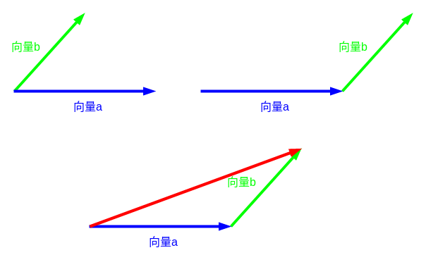

## 一、向量的性质概念

**向量的定义：**

向量（vector）又称欧几里得向量（Euclidean vector），指具有大小（magnitude）和方向的量。

它可以形象化地表示为带箭头的线段。箭头所指：代表向量的方向；线段长度：代表向量的大小。

 **表示方法：**
 
  几何法：使用带箭头的线段表示向量，例如,向量$\overrightarrow{AB}$。

  坐标法：使用一个有序数对表示向量，例如,在二维空间中，向量$(x, y)$ 表示从原点到点$(x, y)$的有向线段。

  符号法：使用字母或符号表示向量，例如,向量$\vec{a}$表示一个向量。

 **向量性质特点：**
  - 向量的模（长度）：表示向量的大小，通常用$|v|$ 表示，$|v|=\sqrt{x^2+y^2}$
  - 方向(方向角)：表示向量与某个参考方向的夹角，通常用$\theta$表示。可用反正切函数计算，如 $\theta =arctan(\frac{y}{x})$
  - 单位向量：模为$1$的向量称为单位向量，表示方向但不表示大小,记做$\Large \frac{\vec{a}}{a}$
  - 零向量：模为零的向量称为零向量，记作$\vec{0}$，它没有方向，但是它和任何向量相加都不改变另一个向量。
  - 相等向量：有相同大小和方向的向量称为相等向量，它们可以在平面上平移但不改变相对位置。
  - 相反向量:反向向量是指方向与原向量相反的向量。
  - 平行和共线：两个向量平行表示它们的方向相同或相反，共线表示它们在同一条直线上。
  - 负向量：对于给定的向量$\vec{a}$，具有相同大小但方向相反的向量称为$-\vec{a}$。
  - 向量的投影：表示一个向量在另一个向量方向上的投影长度，它可以用于计算一个向量在另一个向量方向上的分量。
  - 分量：向量可以在坐标系中表示为一组数值，这些数值称为向量的分量，向量的分量通常表示为$(x, y)$。
  - 正交向量:正交向量是指两向量的内积为零。
  - 法向量:直线$l⊥\alpha$,取直线$l$的方向向量$\vec{a}$，则向量$\vec{a}$叫做平面$\alpha$的法向量。

 **向量的相关计算：**
  - 向量的加法：将两个向量的对应分量相加，得到一个新的向量，表示两个向量的合成效果。
  - 向量的数量乘法：将一个向量的每个分量都乘以一个标量，得到一个新的向量。
  - 向量的点积（内积）：表示两个向量对应分量相乘后求和，结果是一个标量。
  - 向量的叉积（外积）：结果是一个新的向量，其方向与给定的平面垂直，大小等于这个平面的面积。

**方向向量:** 
  - 空间直线的方向用一个与该直线平行的非零向量来表示，该向量称为这条直线的一个方向向量。
  - 方向向量的求解:只要给定直线,便可构造两个方向向量(以原点为起点)
  - 已知直线$l$：$ax+by+c=0$则直线$l$的方向向量为$\vec{a}=(-b,a)或(b,-a)$
  - 若直线$l$的斜率为$k$,则$l$的一个方向向量为$\vec{a}=(1,k)$
  - 若$A(x1,y1),B(x2,y2)$则$AB$所在直线的一个方向向量为$\vec{a}=(x2-x1,y2-y1)$

## 二、平面向量的线性运算

线性运算：向量的加、减、数乘运算统称为向量的线性运算,向量线性运算的结果仍是向量。

**向量的加法：**

平行四边形法则: 将两个向量平移至公共起点，以向量的两条边作平行四边形，结果为公共起点的对角线。

三角形法则:将各个向量依次首尾顺次相接，结果为第一个向量的起点指向最后一个向量的终点。 

首尾相连法则::多个向量相加时，只需要将向量进行首尾相连，就可以计算出结果。

**向量的减法：**
  - 向量不存在减法，如果真的要去计算减法，我们得从几何意义上入手。
  - 例:我们要求$\vec{a}-\vec{b}$,我们就要转换思维了，可以转换为以下:
$$\vec{a}-\vec{b}=\vec{a}+(-\vec{b})$$
  - 向量减法的几何意义:当$\vec{a}$，$\vec{b}$同起点时，$\vec{a}-\vec{b}$可以表示为从向量$\vec{b}$的终点指向向量$\vec{a}$的终点的向量。
  - 简记:减向量的终点指向被减向量的终点。
$$\overrightarrow{OA} - \overrightarrow{OB} =\overrightarrow{BA}$$

## 三、数乘向量

**数乘概念：**
  - 一般地，我们规定实数$\lambda$与向量$\vec{a}$的积是一个向量，这种运算叫做向量的数乘，记作$\lambda \vec{a}$。
  - 向量的数乘是指将一个标量与一个向量的每个分量相乘得到一个新的向量。
  - 向量的数乘的几何意义是将向量沿其方向伸缩 $k$ 倍。
  - 实数$\lambda$与向量$a$的乘积$\lambda a$是一个向量，它的模为$|\lambda a|=|\lambda |·|a|$

$$ \begin{cases}
  & \text{}  当\lambda >0时,\lambda a与a同向  \\ \newline
  & \text{}  当\lambda <0时,\lambda a与a反向   \\ \newline
  & \text{}  当\lambda =0时,有\lambda a=0
\end{cases} $$

 由定义知$\lambda a$与$a$是共线向量，任意非零向量$a$都可写作以下方式，这说明非零向量$a$乘以它的模的倒数，便可得到与它同方向的单位向量$a^0$，简称为把$a$单位化。
 
$$ \begin{cases}   & \text{} a=|a|·a^0 \\ \newline  & \text{} a^0=\frac{a}{|a|} \end{cases}$$ 

**数乘具有以下性质：**

  其中，$a、b$为任意向量，$\lambda ,\mu$为任意实数。
$$ \begin{cases}
  & \text{}  1·a= a  \\ \newline
  & \text{}  结合律： \lambda (μa) = (\lambda μ)a  \\ \newline
  & \text{}  第一分配律： (\lambda +μ)a=\lambda a+μa \\ \newline
  & \text{}  第二分配律： \lambda (a+b)=\lambda a+\lambda b
\end{cases} $$

