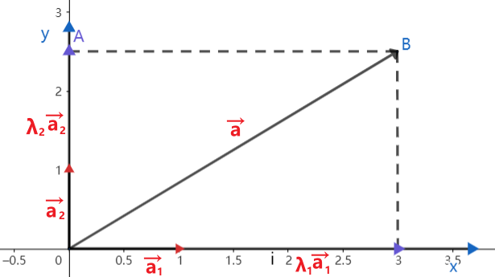

##  一、基本定理及坐标表示

**平面向量的基本定理：**

设$\vec{e_1},\vec{e_2}$同一平面内的两个不共线向量，$\vec{a}$是该平面内任一向量，则存在唯一实数对$(\lambda,\mu)$，使得如下公式：

$$\vec{a}=\lambda  \vec{e_1}+μ\vec{e_2}$$

我们把$\left \{ \vec{e_1},\vec{e_2} \right \}$叫做基底，平面内任意向量都可以表示为同一平面内两个不共线向量的线性组合。

**平面向量的坐标表示：**

利用平面直角坐标系$xoy$分别取与$x$轴，$y$轴方向相同的两个单位向量$\vec{i},\vec{j}$作为基底，记做$\left \{ \vec{i},\vec{j} \right \}$,则平面内任一向量$\vec{a}$,由平面向量基本定理，必存在唯一一对实数$x、y$使得:    
$$\vec{a}=x\vec{i}+y\vec{j}$$

把$(x,y)$叫做向量的直角坐标，记做$\vec{a}=(x,y)$,其中$x$叫做向量$\vec{a}$在$x$轴上的坐标，$y$叫做向量$\vec{a}$在$y$轴上的坐标。

平面向量的坐标表示揭示了点、向量与坐标间的关系，类似地可以拓展到空间向量中。 
    

##  二、向量的坐标运算

向量的正交分解：若不共线的两个向量相互垂直,由平面向量的基本定理，对平面上的任意向量$\vec{a}$,均可以分解为两个互相垂直的向量$\lambda  _1\vec{a_1}$和$\lambda  _2\vec{a_2}$,使$\vec{a}=\lambda  _1\vec{a_1}+\lambda  _2\vec{a_2}$这样把一个向量分解为两个互相垂直的向量，叫做把向量正交分解。 
   

**向量的坐标运算：**

如果有两个向量$\vec{a} =(a_1,a_2)$和  $\vec{b} =(b_1,b_2)$，则对应的坐标运算为：
$$ \begin{cases}
  & \text{}  加法运算：  \vec{a}+\vec{b}=(a_1+b_1,a_2+b_2)  \\ \newline
  & \text{}  减法运算：  \vec{a}-\vec{b}=(a_1-b_1,a_2-b_2) \\ \newline
  & \text{}  数乘运算：   k·\vec{a}=(ka_1,ka_2) \\ \newline
  & \text{}  内积(点积)： \vec{a}·\vec{b}=a_1·b_1+a_2·b_2  \\ \newline
  & \text{}  叉积(叉乘)： \vec{a}\times\vec{b}=a_1·b_2-a_2·b_1
\end{cases} $$

##  三、点积坐标运算推导

点积的几何推导：

$$ \begin{cases}
  & \text{}  \vec{a} \cdot \vec{b} = |\vec{a}| |\vec{b}| \cos\theta   \\ \newline
  & \text{} \vec{a} \cdot \vec{b} = \sqrt{a_1^2 + a_2^2 + a_3^2} \times \sqrt{b_1^2 + b_2^2 + b_3^2} \times \cos\theta   \\ \newline
  & \text{} \vec{a} = a_1 \vec{i} + a_2 \vec{j} + a_3 \vec{k}, \quad \vec{b} = b_1 \vec{i} + b_2 \vec{j} + b_3 \vec{k}  \\ \newline
  & \text{}  \vec{i}  \cdot \vec{j}=\vec{j}  \cdot \vec{k}=\vec{k} \cdot \vec{i}=0 \qquad  (互相垂直则点积为0) \\ \newline
  & \text{} \vec{a} \cdot \vec{b} = (a_1 \vec{i} + a_2 \vec{j} + a_3 \vec{k}) \cdot (b_1 \vec{i} + b_2 \vec{j} + b_3 \vec{k}) \\ \newline
  & \text{} \vec{a} \cdot \vec{b} = a_1b_1 (\vec{i} \cdot \vec{i})+  a_2b_2 (\vec{j} \cdot \vec{j}) + a_3b_3 (\vec{k} \cdot \vec{k}) \\ \newline
  & \text{}  \vec{a} \cdot \vec{b} = a_1 b_1 + a_2 b_2 + a_3 b_3  \\ 
\end{cases} $$