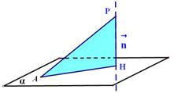
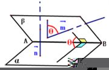

## 一、求证垂直

若设两直线的方向向量分别为$a=(x_1,y_1,z_1)$和$b=(x_2,y_2,z_2)$，则转化为求证两直线的方向向量垂直:
  
$$\vec{a}⊥\vec{b}  \Longleftrightarrow   \vec{a} \cdot \vec{b}=0  \Longleftrightarrow  x_1x_2+y_1y_2+z_1z_2=0$$

## 二、求向量的模

若$\vec{a}=(x_1,y_2,z_3)$则:

$$|\vec{a}|=\sqrt{x_1^2+y_2^2+z_3^2}$$

## 三、求两直线的夹角

若设两直线的方向向量分别为$a=(x_1,y_1,z_1)$和$b=(x_2,y_2,z_2)$则两直线的夹角转化为求两直线的方向向量的夹角:
  
$$cos\theta=\frac{\vec{a}\cdot \vec{b}}{|\vec{a}|\cdot |\vec{b}|}=\frac{x_1x_2+y_1y_2+z_1z_2}{\sqrt{x_1^2+y_1^2+z_1^2}\cdot \sqrt{x_2^2+y_2^2+z_2^2}}$$

## 四、求两点间的距离

若$A(x_1,y_1,z_1)$,$B(x_2,y_2,z_2)$则两点间的距离转化为求以这两点为始终点的有向线段的长度，即求向量的模:
$$|\overrightarrow{AB} |=\sqrt{(x_2-x_1)^2+(y_2-y_1)^2+(z_2-z_1)^2}$$

## 五、求平面的法向量

平面的法向量：如果，$\vec{a}⊥\alpha$那么向量$\vec{a}$叫做平面$\alpha$的法向量。

求平面的法向量：设非零向量$a=(x_1,y_1,z_1)$和$b=(x_2,y_2,z_2)$,

使得$\vec{a}||\alpha$, $\vec{b}||\alpha$, $\vec{a},\vec{b}$不共线,若非零向量$\vec{n}=(x_0,y_0,z_0)$为平面$\alpha$的法向量,则:

$$\vec{n}⊥α \Longleftrightarrow  \begin{cases}
  & \text{} \vec{n}⊥\vec{a} \\
  & \text{} \vec{n}⊥\vec{b}
\end{cases}   \Longleftrightarrow   \begin{cases}
  & \text{} \vec{n}\cdot \vec{a} =0\\
  & \text{} \vec{n}\cdot \vec{b} =0
\end{cases}  \Longleftrightarrow \begin{cases}
  & \text{} x_0x_1+y_0y_1+z_0z_1=0 \quad(1) \\
  & \text{} x_0x_2+y_0y_2+z_0z_2=0  \quad(2)
\end{cases}$$

$$
\begin{cases}
  & \text{} (1)\times z_2=x_0x_1z_2+y_0y_1z_2+z_0z_1z_2=0  \quad(3) \\
  & \text{} (2)\times z_1=x_0x_2z_1+y_0y_2z_1+z_0z_2z_1=0 \quad(4) \\ \newline 
  & \text{} (1)\times x_2=x_0x_1x_2+y_0y_1x_2+z_0z_1x_2=0 \quad(5) \\
  & \text{} (2)\times x_1=x_0x_2x_1+y_0y_2x_1+z_0z_2x_1=0 \quad(6)
\end{cases}$$

$$\begin{cases}
  & \text{} (x_0x_1z_2+y_0y_1z_2+z_0z_1z_2)-(x_0x_2z_1+y_0y_2z_1+z_0z_2z_1)=0\\
  & \text{} x_0(x_1z_2-x_2z_1)=-y_0(y_1z_2-y_0y_2z_1)  \\ \newline
  & \text{}(x_0x_1x_2+y_0y_1x_2+z_0z_1x_2)-( x_0x_2x_1+y_0y_2x_1+z_0z_2x_1)=0 \\
  & \text{} z_0(z_1x_2-z_2x_1)=-y_0(y_1x_2-y_2x_1)  \\ 
\end{cases}$$

$$ \large{
解得  \quad \begin{cases}
  & \text{} x_0= -y_0 \frac{y_1z_2-y_2z_1}{x_1z_2-x_2z_1} \\ \newline
  & \text{} z_0=-y_0\frac{y_1x_2-y_2x_1}{z_1x_2-z_2x_1}
\end{cases}} $$

令$y_0=t,t∈R$,$t$可取使$\vec{n}$尽量简单的常数值，则法向量:
$$\vec{n}=\bigg(-\frac{y_1z_2-y_2z_1}{x_1z_2-x_2z_1}t,t,-\frac{y_1x_2-y_2x_1}{z_1x_2-z_2x_1}t \bigg)$$

## 六、求空间点面距离

如图,设平面$\alpha$的法向量$\vec{n}$及平面$\alpha$上一点$A$,则点$P$到平面$α$的距离$d$为:

$$d=|PH|=\bigg||AP|\cdot cos∠APH \bigg|=\bigg| |AP|\cdot \frac{\overrightarrow{AP} \cdot \vec{n}}{ |\overrightarrow{AP}|\cdot |\vec{n}|}\bigg|=\bigg| \frac{\overrightarrow{AP}\cdot \vec{n}}{|\vec{n}|}\bigg|$$

## 七、求直线与平面的夹角

设直线$L$的方向向量为$\vec{v}=(x_1,y_1,z_1)$,平面$\alpha$的法向量为$\vec{n}=(x_2,y_2,z_2)$,向量$\vec{v}$与$\vec{n}$的夹角为$\theta_1$,直线$L$与平面$\alpha$所成的角为$\theta$,则:$\theta=|\frac{\pi}{2}-\theta_1|$

$$sin\theta=|cos\theta_1|=\frac{|\vec{v}\cdot \vec{n}|}{|\vec{v}|\cdot |\vec{n}|}=\frac{|x_1x_2+y_1y_2+z_1z_2|}{\sqrt{x_1^2+y_1^2+z_1^2}\cdot \sqrt{x_2^2+y_2^2+z_2^2}}$$

## 八、求空间二面角

  - 从一条直线出发的两个半平面所组成的图形叫做二面角，这条直线叫做二面角的棱，这两个半平面叫做二面角的面
  - $\pi =$二面角$+$法向量夹角

设平面$\alpha$的法向量为$\vec{n}$,平面$\beta$的法向量为$\vec{m}$,向量$\vec{n},\vec{m}$所成的角为$\theta$,若$\vec{n}=(x_1,y_1,z_1),\vec{m}=(x_2,y_2,z_2)$则:
$$cos\theta=\frac{\vec{n}\cdot \vec{m}}{|\vec{n}|\cdot |\vec{m}|}=\frac{x_1x_2+y_1y_2+z_1z_2}{\sqrt{x_1+y_1+z_1}\cdot \sqrt{x_1+y_1+z_1}}$$

那么二面角$\alpha-AB-\beta$的大小为$\theta$或$\pi -\theta$,视具体情况而定(如图)。

