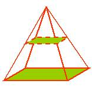
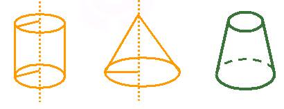
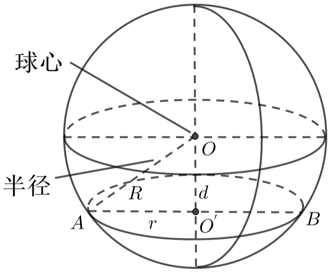

## 一、几何体的基本元素

  - 所有的几何体都是由点、线、面构成的。点、线、面是构成空间几何体的基本元素。

  - 其中线有直线（直线段）和曲线（曲线段）之分，面有平面（或一部分）和曲面（或一部分）之分。

## 二、棱柱、棱锥、棱台

  - 一般地，由一个平面多边形沿某一方向平移形成的空间几何体叫做棱柱。
  - 棱柱的性质：棱柱的两个底面是全等的多边形，且对应边互相平行，侧面都是平行四边形。

  - 当棱柱的一个底面收缩为一个点时，得到的几何体叫棱锥。
  - 棱锥的特点：底面是多边形，各侧面是有一个公共顶点的三角形。

  - 棱台：用一个平行于棱锥底面的平面去截棱锥，底面与截面之间的部分是棱台。
  - 侧面是梯形，两底是相似多边形。

## 三、圆柱、圆锥、圆台

  - 将矩形、直角三角形、直角梯形分别绕着它的一边、一直角边、垂直于底边的腰所在的直线旋转一周，形成的几何体分别叫做圆柱、圆锥、圆台。
  - 这条线叫做轴，垂直于轴的边旋转而成的圆面叫做底面，不垂直于轴的边旋转而成的曲面叫做侧面，无论旋转到什么位置这条边都叫做母线。

**圆柱的特点：**
  - （1）两底互相平行且相等，平行底的截面是与底相等的圆。
  - （2）所有的母线都相等且平行，并与底垂直。
  - （3）通过轴的截面是以底为直径和母线为邻边的矩形（叫做圆柱的轴截面）。

**圆锥的特点：**
  - 所有母线都相等。
  - 通过轴的截面是以母线为腰、底圆直径为底的等腰三角形（叫做圆锥的轴截面）。

**圆台的特点：**

 通过轴的截面是以上、下底直径为底、母线为腰的等腰梯形．

## 四、球体

  - 以半圆的直径所在直线为旋转轴，半圆面旋转一周形成的几何体。
  - 球面可以看作空间中到一个定点的距离等于定长的点的集合。
  - 球体就可以看作空间中到一个定点的距离小于或等于定长的点的集合。
  - 如图，球心和截面圆心的连线垂直于截面，球心到截面的距离$d$与球的半径$R$及截面的半径$r$有下面关系：
  $$r=\sqrt{R^2-d^2}$$

## 五、旋转体

 旋转面：一条平面曲线绕着它所在平面内的一条定直线旋转所形成的曲面叫作旋转面。

 旋转体：封闭的旋转面围成的几何体叫作旋转体。

## 六、投影与直观图、三视图

  - 投影是光线通过物体,向选定的面投射,并在该面上得到图形的方法.这里的光线称为投影线，被选定的面称为投影面。
  - 投影线交于一点的投影称为中心投影。
  - 投影线互相平行的投影称为平行投影。
  - 平行投影的分类：按投影方向是否正对着投影面,可以把平行投影分为正投影与斜投影。

  **三视图:**

  - 将物体按正投影向投影面投影所得到的图形，称为视图。
  - 自物体的前面向后投射所得的投影称为主视图或正视图，自上向下的称为俯视图，自左向右的称为左视图。
  - 用这三种视图刻画空间物体的结构，称为三视图。

  **三视图规则:**

  - 位置：正视图(左)、侧视图(右)、俯视图(下)
  - 大小：长对正，高平齐，宽相等

  **斜二测画法：**

  - （1）在已知图形中取互相垂直的$x$轴、$y$轴．画直观图时，把它画成对应的$x′$轴、$y′$轴，使$∠x′O′y′=45°(或135°)。$
  - （2）已知图形中平行于$x$轴或$y$轴的线段，在直观图中分别画成平行于$x′$轴或$y′$轴的线段。
  - （3）已知图形中平行于$x$轴的线段，在直观图中保持原长度不变；平行于$y$轴的线段，长度为原来的一半。

## 七、表面积计算

$$ \begin{cases}
  & \text{}  S_{直棱柱侧}＝ch  \quad(c底面周长,h为高)\\ \newline
  & \text{}  S_{正棱锥侧}＝\frac{1}{2}ch´ \quad （c为底面周长，h´为斜高） \\ \newline
  & \text{}  S_{正棱台侧}＝\frac{1}{2}(c + c´)h´  \quad（c,c´为上下底周长，h´为斜高）  \\ \newline
  & \text{}  S_{圆柱侧}＝cl=2\pi rl  \quad  （半径是r，底周长是c，母线长是l） \\ \newline
  & \text{}  S_{圆锥侧}＝\frac{1}{2}cl=\pi rl  \quad  （半径是r，底周长是c，母线长是l）  \\ \newline
  & \text{}  S_{圆台侧}＝\frac{1}{2}(c´+c)l=\pi (r´+r)l   \quad  （上下半径r´,r,周长c´,c,侧母线l）  \\ \newline
  & \text{}  S_球=4\pi R^2  \\ 
\end{cases} $$

## 八、体积计算

  祖暅原理:两等高的几何体若在所有等高处的水平截面的面积相等，则这两个几何体的体积相等。
$$ \begin{cases}
  & \text{} 柱体的体积: V=sh   \\ \newline
  & \text{}  锥体的体积: V=\frac{1}{3}sh \\ \newline
  & \text{}  台体的体积: V=\frac{1}{3}h(s+\sqrt{ss´}+s´) \\ \newline
  & \text{}  球的体积: V=\frac{4}{3}πR^3  \\ 
\end{cases} $$