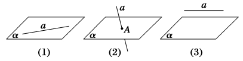
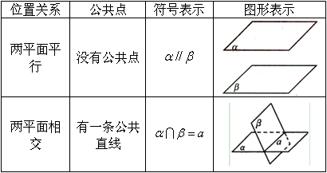
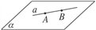
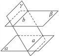
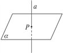
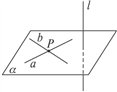
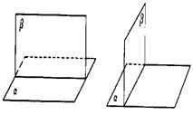

## 一、直线与直线的位置关系

  - 相交直线：在同一平面内，有且只有一个公共点
  - 平行直线：在同一平面内，没有一个公共点
  - 异面直线：不同在任何一个平面内的两条直线,没有一个公共点

- 为了表示异面直线不共面的特点，作图时，通常用一个或两个平面来衬托

## 二、直线与平面的位置关系

  - 位置关系：在平面内，与平面相交，与平面平行
  - 当直线与平面相交或平行时，直线不在平面内，也称为直线在平面外
  - 符号表示：$a\subset \alpha$、$a∩\alpha＝A$、$a∥\alpha$
    

  - 直线与平面的位置关系的图形与符号表示：

## 三、平面与平面的位置关系

  - 位置关系:两个平面平行,两个平面相交
  - 符号表示：两个平面$\alpha，\beta$平行，记作$\alpha∥\beta$,两个平面$\alpha，\beta$相交于直线$l$,记作$\alpha∩\beta＝l$
  - 图示：两个平面$\alpha,\beta$平行，；两个平面$\alpha,\beta$相交于直线$l$

  - 平面与平面的位置关系的图形与符号表示：

## 四、平面的基本性质与推论

 `公理一：` 如果一条直线上的两个点在一个平面内，那么这条直线上所有的点都在这个平面内。

  - 符号：若$A∈a,B∈a$，且$A∈\alpha,B∈\alpha$则$a∈\alpha$
  - 作用：直线在平面内作图，判断或证明直线在平面内的依据。

 `公理二：` 经过不在同一直线上的三点，有且只有一个平面。

  - 符号：若$C∉$直线$AB$,则$A,B,C∈$平面$\alpha$且$\alpha$是唯一的。
  - 作用：确定平面的判断与作图，是判断或证明空间图形共面或异面的依据。

 `公理三：` 如果两个平面有一个公共点，那么它们有且只有一条通过这个点的公共直线。

  - 符号：若$P∈\alpha,P∈\beta$,则$\alpha∩\beta=l$,且$P∈l$。
  - 作用：判定两个平面相交、点在直线上、点共线的的依据。

 `公理四：` 平行于同一条直线的两条直线互相平行。

  - 符号：$a//b,b//c⇒ a//c$。
  - 作用：平行线的传递性作用，是判断或证明空间两条直线平行的依据。

## 五、平行的判定及其性质

  直线与平面平行的判定:

  - 定理：平面外一条直线与此平面内的一条直线平行，则该直线与此平面平行。
  - 用符号表示：$a//b,a\not\subseteq  \alpha ,b \subseteq \alpha ⇒ a// \alpha$

  直线与平面平行的性质：

  - 定理：一条直线与一个平面平行，则过这条直线的任一平面与此平面的交线与该直线平行。
  - 此定理也可用符号表示：$a//\alpha,a\subset \beta,\alpha∩\beta=b⇒a//b$
  - 用图形表示：即“线面平行，则线线平行”

平面与平面平行的判定：

  - 定理：一个平面内的两条相交直线和另一个平面平行，则这两个平面平行。
  - 此定理也可用符号表示：$a\subset \beta,b\subset \beta,a∩b=P,a//\alpha,b//\alpha⇒\alpha//\beta$
  - 推论：如果一个平面内的两条相交直线分别平行于另一个平面内的两条相交直线，那么这两个平面平行。

平面与平面平行的性质:
  - 定理：如果两个平行平面同时和第三个平面相交，那么它们的交线平行。
  - 此定理也可用符号表示：$\alpha//\beta,\alpha∩\gamma =a,\beta∩\gamma =b⇒a//b$
  - 推论：$\alpha//\beta,a\subset \alpha⇒a// \beta$

## 六、垂直的判定及其性质

  直线与平面垂直的定义：

  - 定义：如果直线$l$与平面$\alpha$内的任意一条直线都垂直，我们就说直线$l$与平面$\alpha$的垂直，
  - 直线与平面垂直的表示：记作$a⊥\alpha$。

  直线与平面垂直的判定：

  - 定理：一条直线与一个平面内的两条相交直线都垂直，则该直线与此平面垂直。
$$\left.\begin{matrix} l⊥a  \\ l⊥b  \\ a∩b=P  \\ a\subset \alpha  \\ b\subset \alpha  \\ \end{matrix}\right\}⇒ l⊥a$$

  平面与平面垂直定义：

  - 两平面互相垂直的定义：一般地，两个平面相交，如果它们所成的二面角是直二面角，就说这两个平面互相垂直。
  - 两个互相垂直的平面通常画成以下页图的样子，平面$\alpha$与$\beta$垂直,记作$\alpha⊥\beta$

  平面与平面垂直的判定：

  - 定理：一个平面过另一个平面的垂线，则这两个平面垂直。
$$\left.\begin{matrix} AB⊥\beta  \\ AB\subset \alpha  \\ \end{matrix}\right\}⇒  \alpha⊥\beta$$

 平面与平面垂直的性质：

  - 定理：两个平面垂直，则一个平面内垂直于交线的直线与另一个平面垂直。
  - 用符号语言表示：已知$\alpha⊥\beta,\alpha∩\beta=a,AB\subset \alpha,AB⊥a于B⇒AB⊥\beta$

$$\left. \begin{matrix} 
\alpha⊥\beta \\ 
AB\subset \alpha  \\  
\alpha∩\beta=CD \\  
AB⊥CD \\  
AB\cap CD=B 
\end{matrix}\right\}⇒   
AB⊥\beta$$

