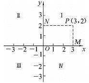

## 一、平面直角坐标系

  - 数轴：一条给出了原点、度量单位和正方向的直线叫做数轴，用一对有序实数来确定平面上点的位置。
  - 在平面上画两条原点重合、互相垂直且具有相同单位长度的数轴,这就建立了平面直角坐标系。

## 二、极坐标系

  - 在平面内取一点$O,O$点叫作极点，从$O$起引一条射线$Ox$，这条从极点起的射线$Ox$叫作极轴；
  - 选定长度单位，再选定角度的正方向（逆时针转角为正方向）；
  - 这种取定了极点、极轴、长度单位与角度正向的坐标系系统的叫作极坐标系。

## 三、柱坐标系

  - 柱坐标是在极坐标的基础上发展起来的，相当于将极坐标面向$z$方向拓展，
  - 在极坐标里确定一点的位置坐标为$(\rho,\varphi)$,在柱坐标里则为$P(\rho,\varphi,z)$,
  - 其中$\rho$代表该点到$z$轴的距离,$\varphi$代表与$x$轴的夹角,$z$与直角坐标系相同。

## 四、球坐标系

  - 是一种利用球坐标表示一个点$p(r,\theta,\varphi)$在三维空间的位置的三维正交坐标系。
  - 原点到$P$点的距离$r$,原点到点$P$的连线与正$z-$轴之间的“极角” $\theta$。
  - 原点到点$P$的连线在$xy-$平面的投影线，与正$x-$轴之间的“方位角”$\varphi$。

## 五、数轴上的基本公式

  - 绝对值：对于任意实数$x$,其绝对值表示为$|x|$,表示$x$到原点的距离。
  - 两点之间的距离：设有两个点$A$和$B$在数轴上，其坐标分别为$x_1$和$x_2$。两点$A$和$B$之间的距离可以表示为$|x_2 - x_1|$。
  - 中点坐标：对于数轴上的两个点$A$和$B$,它们的中点$C$的坐标可以通过取它们的坐标的平均值得到,即 $C = (A + B) / 2$。

## 六、坐标系中的基本公式

  - 平面两点的距离公式：两点$P_1(x_1,y_1),P_2(x_2,y_2)$的距离公式表示为：
$$d=\sqrt{(x_2-x_1)^2+(y_2-y_1)^2}$$
  - 中点公式：已知点$A(x_1,y_1),B(x_2,y_2)$，且$M(x,y)$是线段$AB$的中点,则有:
$$\begin{cases}&  x= {\Large \frac{x_1+x_2}{2} }\\ \newline &   y={\Large \frac{y_1+y_2}{2} }  \\\end{cases}$$
  - 空间两点的距离公式：设$P_1(x_1,y_1,z_1),P_2(x_2,y_2,z_2)$则:
$$|P_1P_2|=\sqrt{(x_2-x_1)^2+(y_2-y_1)^2+(z_2-z_1)^2}$$