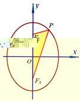
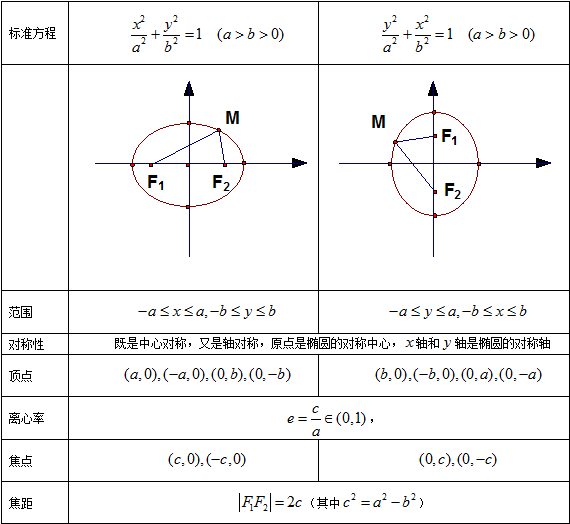

**椭圆的定义:**

 第一定义：平面内动点$P$与两个点$F_1,F_2$,(其中$|F_1F_2=2c>0|$)的距离之和为常数$2a$,(其中$2a>2c$)的点的轨迹是椭圆
  - 定点$F_1,F_2$是椭圆的焦点。
  - 线段$F_1,F_2$叫做椭圆的焦距。

  

  
  

  第二定义：椭圆是平面内到一个定点$F$和到一条定直线$l$($F$不在$l$上)的距离的比等于常数$e,0<e<1$的点的轨迹。

   - $e$是椭圆的离心率。
   - 定点$F$是椭圆的焦点。
   - 定直线$l$是椭圆的准线。

  

  
  

**椭圆的标准方程**

 焦点在$x$轴的椭圆标准方程：
$$\frac{x^2}{a^2}+\frac{y^2}{b^2}=1 \quad (a>b>0,c^2=a^2-b^2)$$

  

  
  

  焦点在$y$轴的椭圆标准方程：
  $$\frac{y^2}{a^2}+\frac{x^2}{b^2}=1 \quad (a>b>0,c^2=a^2-b^2)$$

   

   
   

  相同离心率的椭圆系方程为:
  $$\frac{x^2}{a^2}+\frac{y^2}{b^2}=\lambda \quad (\lambda>0)$$

  `椭圆准方程推导：`

   - 以$F1,F2$所在直线为$x$轴，线段$F1F2$的垂直平分线为$y$轴，建立直角坐标系$xOy$
   - 则$F1,F2$的坐标分别为$(-c,0),(c,0)$
   - 设$M(x,y)$为椭圆上任意一点，根据椭圆定义知$|MF1|+|MF2|=2a, (a>0)$

   $$\begin{cases} 
    & \sqrt{(x+c)^2+y^2}=2a-\sqrt{(x-c)^2+y^2} \\ \newline
    & \bigg(\sqrt{(x+c)^2+y^2}\bigg)^2=\bigg(2a-\sqrt{(x-c)^2+y^2}\bigg)^2 \Longrightarrow a^2-cx=a\sqrt{(x-c)^2+y^2}  \\ \newline
    & \bigg(a^2-cx\bigg)^2=\bigg(a\sqrt{(x-c)^2+y^2}\bigg)^2\Longrightarrow (a^2-c^2)x^2+a^2y^2=a^2(a^2-c^2)\\ \newline
    & (a^2-c^2)x^2+a^2y^2=a^2(a^2-c^2) \Longrightarrow  b^2x^2+a^2y^2=a^2b^2\\ \newline
    &  b^2x^2+a^2y^2=a^2b^2 \Longrightarrow {\Large {\frac{x^2}{a^2}+\frac{y^2}{b^2}}  }=1 \quad(a>b>0) 
    \end{cases} $$

  

  
  

**椭圆的几何性质**
  - 范围:椭圆位于直线$x=±a$和$y=±b$所围成的矩形框里。
  - 对称性:关于$x$轴、$y$轴和原点对称。坐标轴是椭圆的对称轴,原点是对称中心,椭圆的对称中心叫椭圆的中心。
  - 顶点:椭圆与坐标轴的交点有四个，这四个交点叫做椭圆的顶点。
  - 轴:椭圆的长轴为$2a$,短轴为$2b$。
  - 离心率：椭圆的焦距与长轴的比$e=\Large{\frac{c}{a}}$叫椭圆的离心率。
  - 定型三角形:即在$Rt△OB_2F_2$中, $|B_2F_2|^2=|OB_2|^2+|OF_2|^2 \quad(即a^2=b^2+c^2)$

  

  
  

 椭圆的焦半径：设$P(x_0,y_0)$为椭圆上任意一点,$F_1F_2$为椭圆的两个焦点，则椭圆焦半径为：

   - 左右焦点：  $|PF_1=a+ex_0|$,$PF_2=a-ex_0$
   - 下上焦点：  $|PF_1=a+ey_0|$,$PF_2=a-ey_0$

  

  
  

  准线方程：当点$P$到定点$F(c,0)$的距离和它到定直线$l:x=\frac{a^2}{c}$的距离的比是常数$\frac{c}{a} \quad (a>c>0)$时，这个点的轨迹是椭圆,这条定直线叫椭圆的准线$l$。

   - 焦点在$x$轴上：  $x=±\Large{\frac{a^2}{c}}$
   - 焦点在$y$轴上：  $y=±\Large{\frac{a^2}{c}}$

  椭圆的简单几何性质:

  

  
  

