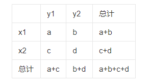

**相关系数:**

用于衡量两个变量之间线性关系强弱的统计量,它表示了两个变量之间的关联程度,取值范围在$-1$到$1$之间,定义式:  

$$r(X,Y)=\frac{Cov(X,Y)}{\sqrt{Var[X]Var[Y]}}$$
    
当$S_{xy}≠0$,以下公式为$\{x_i\}$和$\{y_i\}$的相关系数

$$\begin{cases}  
&  \large{r_{xy}=\frac{S_{xy}}{S_xS_y}} \\ \newline
& \Large{S_{xy}=\sum_{i=1}^{n} \frac{(x_i-\bar{x})(y_i-\bar{y})}{n}=\frac{(x_1-\bar{x})(y_1-\bar{x})+(x_2-\bar{x})(y_2-\bar{y})+...+(x_n-\bar{x})(y_n-\bar{y})}{n}}\\ \newline
& S_{xy}=Cov(x,y)=E[(X-E[X])(Y-E[Y])]=E[XY]-E[X]E[Y]
\end{cases} $$

 相关系数特点：(其中$S_x$表示$\{x_i\}$的标准差,$S_y$表示$\{y_i\}$的标准差)

 - 当$S_{xy}>0$,我们称$\{x_i\}$和$\{y_i\}$正相关。
 - 当$S_{xy}<0$,我们称$\{x_i\}$和$\{y_i\}$负相关。
 - 当$S_{xy}=0$,我们称$\{x_i\}$和$\{y_i\}$不相关。

**独立性检验:**

 独立性检验（$Independence \quad Test$）是统计学中用于检验两个变量之间是否存在独立关系的方法。它用于确定两个变量在总体中是否独立,即一个变量的取值不受另一个变量的影响。
  
  (1).假设有两个分类变量$X$和$Y$,它们的值域分另为$\{x1, x2\}和\{y1, y2\}$,其样本频数列联表为：

  

  
  

  (2).举例：肺癌与吸烟是否有关

  

  
  

  (3).参数化：

  

  
  

  $K^2$的值越大,说明$X$与$Y$有关系成立的可能性越大

  $$K^2=\frac{n(ad-bc)^2}{(a+b)(c+d)(a+c)(b+d)} \quad (a+b+c+d=n)$$

**线性回归模型:**

 建立回归直线:

 $$y=bx+a \quad (b=\frac{s_{xy}}{s_x^2},a=\bar{y}-b\bar{x})$$

