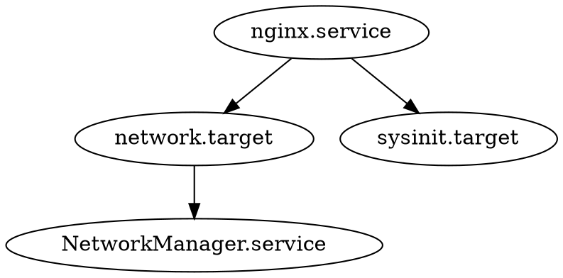

## 📚 目录

1. [systemd依赖关系概述](#1-systemd依赖关系概述)
2. [依赖关系类型详解](#2-依赖关系类型详解)
3. [启动顺序控制机制](#3-启动顺序控制机制)
4. [冲突处理与条件启动](#4-冲突处理与条件启动)
5. [依赖关系调试与故障排查](#5-依赖关系调试与故障排查)
6. [核心要点总结](#6-核心要点总结)

---

## 1. 🔗 systemd依赖关系概述


### 1.1 什么是systemd依赖关系


**通俗理解**：就像现实生活中做事有先后顺序一样，系统服务启动也需要讲究顺序。

```
现实场景类比：
开车出门 = 启动某个服务
先决条件：
1. 车有油 (依赖：燃料系统)
2. 电瓶有电 (依赖：电力系统)  
3. 路况良好 (依赖：交通环境)

如果缺少任何一个条件，就无法正常开车
systemd的依赖关系就是这个道理
```

> 📌 **核心概念**  
> systemd依赖关系定义了服务之间的启动顺序和相互依赖，确保系统按照正确的顺序启动各项服务。

### 1.2 依赖关系的作用机制


**系统启动流程示意**：
```
系统启动过程：
┌──────────────┐
│   内核启动    │
└──────┬───────┘
       │
┌──────▼───────┐    ┌─────────────┐
│   systemd    │───▶│ 解析依赖关系 │
│   进程启动    │    │  构建依赖树  │
└──────┬───────┘    └─────┬───────┘
       │                   │
┌──────▼───────┐    ┌─────▼───────┐
│ 按依赖顺序   │    │  并行启动    │
│ 启动服务     │    │ 无依赖服务   │
└──────────────┘    └─────────────┘
```

**依赖关系基本类型**：
- **强依赖**：必须满足，否则启动失败
- **弱依赖**：最好满足，但不强制要求
- **顺序依赖**：只控制启动顺序，不强制依赖
- **冲突关系**：不能同时运行的服务

---

## 2. ⚙️ 依赖关系类型详解


### 2.1 Wants vs Requires vs Requisite


> 💡 **记忆技巧**  
> - **Wants** = 想要(可有可无)：弱依赖，失败也能继续
> - **Requires** = 需要(必须有)：强依赖，失败就停止
> - **Requisite** = 先决条件：必须已经启动，否则立即失败

#### 🔸 Wants - 弱依赖关系


**含义**：希望某个服务启动，但不是必需的

```ini
# 示例：Web服务希望数据库服务启动，但没有也能运行
[Unit]
Description=Web Application
Wants=mysql.service    # 希望mysql启动，但mysql失败也不影响web启动
After=mysql.service    # 如果mysql要启动，让它先启动

[Service]
ExecStart=/usr/bin/webapp
```

**实际应用场景**：
```
Web应用 Wants 缓存服务
├─ 缓存服务正常 → Web应用获得更好性能
└─ 缓存服务异常 → Web应用仍能正常运行(性能差点)

日志服务 Wants 网络服务  
├─ 网络正常 → 可以发送远程日志
└─ 网络异常 → 仍能记录本地日志
```

#### 🔸 Requires - 强依赖关系


**含义**：绝对需要某个服务，缺少就无法启动

```ini
# 示例：数据库应用必须有存储挂载
[Unit]
Description=Database Service
Requires=data-mount.service    # 数据目录挂载失败，数据库就不启动
After=data-mount.service

[Service]
ExecStart=/usr/bin/database
```

**Requires的连锁反应**：
```
服务A Requires 服务B
│
├─ 启动A时：
│  ├─ systemd自动启动B
│  ├─ B启动成功 → A开始启动
│  └─ B启动失败 → A启动失败
│
└─ 停止B时：
   └─ systemd自动停止A (连锁停止)
```

#### 🔸 Requisite - 先决条件


**含义**：要求依赖服务必须已经在运行，不会自动启动依赖

```ini
# 示例：安全服务要求防火墙已经启动
[Unit]
Description=Security Service
Requisite=firewall.service    # 防火墙必须已经在运行
After=firewall.service

[Service]
ExecStart=/usr/bin/security-daemon
```

**三种依赖类型对比表**：

| 依赖类型 | **自动启动依赖** | **依赖失败时行为** | **依赖停止时行为** | **典型场景** |
|---------|-----------------|-------------------|-------------------|-------------|
| `Wants` | ✅ 会启动 | 🟢 继续启动 | 🟢 继续运行 | 可选功能增强 |
| `Requires` | ✅ 会启动 | 🔴 启动失败 | 🔴 连锁停止 | 核心功能依赖 |
| `Requisite` | ❌ 不启动 | 🔴 立即失败 | 🔴 连锁停止 | 预置条件检查 |

### 2.2 高级依赖关系类型


#### 🔸 BindsTo - 绑定依赖


**含义**：比Requires更强的依赖关系，依赖服务的任何状态变化都会影响本服务

```ini
# 示例：容器服务与网络命名空间绑定
[Unit]
Description=Container Service  
BindsTo=network-namespace.service
After=network-namespace.service

[Service]
ExecStart=/usr/bin/container-runtime
```

**BindsTo特点**：
```
普通依赖：依赖服务重启 → 本服务继续运行
BindsTo：依赖服务重启 → 本服务也重启

适用场景：
- 容器与宿主机网络绑定
- 虚拟机与物理资源绑定
- 应用与专用数据库绑定
```

#### 🔸 PartOf - 部分依赖


**含义**：作为某个服务的一部分，当父服务停止时自动停止

```ini
# 示例：Web应用的worker进程
[Unit]  
Description=Web Worker Process
PartOf=webapp.service

[Service]
ExecStart=/usr/bin/worker
```

---

## 3. ⏰ 启动顺序控制机制


### 3.1 After与Before - 时序控制


> 📌 **重要理解**  
> After/Before只控制启动顺序，不创建依赖关系。想要依赖关系+顺序控制，需要同时使用依赖指令和时序指令。

#### 🔸 After - 在某服务之后启动


```ini
# 示例：Web服务在网络启动后再启动
[Unit]
Description=Web Server
After=network.target    # 网络就绪后再启动
After=mysql.service     # MySQL启动后再启动

[Service]
ExecStart=/usr/bin/httpd
```

**After的工作机制**：
```
启动顺序示例：
时间线： ────▶
服务A： ──[启动中]──[运行中]────
服务B：     ────[等待]──[启动中]──[运行中]
                ↑
            After=A.service
```

#### 🔸 Before - 在某服务之前启动


```ini
# 示例：日志服务必须先于应用服务启动
[Unit]
Description=Logging Service  
Before=webapp.service    # 在webapp之前启动

[Service]
ExecStart=/usr/bin/logger
```

### 3.2 DefaultDependencies - 默认依赖


**含义**：systemd为每个服务自动添加的基础依赖关系

**默认添加的依赖**：
```
一般服务默认依赖：
├─ After=sysinit.target     # 系统初始化完成后
├─ Before=shutdown.target   # 关机前先停止
├─ Conflicts=shutdown.target # 与关机冲突
└─ 其他基础系统依赖...

网络服务额外依赖：
└─ After=network.target     # 网络就绪后启动
```

**禁用默认依赖**：
```ini
[Unit]
Description=Early Boot Service
DefaultDependencies=no    # 不添加默认依赖
# 手动指定最基础的依赖
After=sysinit.target
Before=shutdown.target
```

> ⚠️ **注意事项**  
> 禁用DefaultDependencies时要非常小心，必须手动指定所有必要依赖，否则可能导致启动顺序混乱。

### 3.3 依赖关系组合使用


**常见组合模式**：

```ini
# 模式1：强依赖+顺序控制
[Unit]
Description=Database Application
Requires=mysql.service    # 强依赖MySQL
After=mysql.service       # MySQL启动后再启动
```

```ini
# 模式2：弱依赖+顺序控制  
[Unit]
Description=Web Server
Wants=redis.service       # 希望有Redis缓存
After=redis.service       # 如果Redis要启动，让它先启动
After=network.target      # 网络就绪后启动
```

```ini
# 模式3：多重依赖
[Unit]
Description=Complex Application
# 强依赖数据库
Requires=postgresql.service
After=postgresql.service
# 弱依赖缓存
Wants=redis.service  
After=redis.service
# 弱依赖消息队列
Wants=rabbitmq.service
After=rabbitmq.service
```

---

## 4. ⚔️ 冲突处理与条件启动


### 4.1 Conflicts - 冲突关系


**含义**：定义不能同时运行的服务

```ini
# 示例：Apache与Nginx不能同时运行
[Unit]
Description=Apache HTTP Server
Conflicts=nginx.service    # 与nginx冲突

[Service] 
ExecStart=/usr/bin/httpd
```

**冲突关系的行为**：
```
冲突处理流程：
启动Apache时 → 发现nginx在运行 → 自动停止nginx → 启动Apache
启动nginx时  → 发现Apache在运行 → 自动停止Apache → 启动nginx
```

**实际应用场景**：
- 不同的Web服务器(Apache vs Nginx)
- 不同的数据库服务(MySQL vs PostgreSQL)  
- 互斥的网络配置服务

### 4.2 PropagatesReloadTo - 重载传播


**含义**：当本服务重载时，自动重载相关服务

```ini
# 示例：主配置服务重载时，同时重载相关服务
[Unit]
Description=Main Config Service
PropagatesReloadTo=webapp.service
PropagatesReloadTo=worker.service

[Service]
ExecStart=/usr/bin/config-manager
ExecReload=/bin/kill -HUP $MAINPID
```

**重载传播示例**：
```bash
# 重载主服务
systemctl reload main-config.service

# 结果：以下服务自动重载
# - main-config.service (主动重载)
# - webapp.service (传播重载)  
# - worker.service (传播重载)
```

### 4.3 条件启动机制


#### 🔸 ConditionPathExists - 路径存在条件


**含义**：只有当指定路径存在时才启动服务

```ini
# 示例：只有配置文件存在时才启动服务
[Unit]
Description=Application Service
ConditionPathExists=/etc/myapp/config.ini    # 配置文件必须存在
ConditionPathExists=/var/lib/myapp           # 数据目录必须存在

[Service]
ExecStart=/usr/bin/myapp
```

**其他路径条件**：
```ini
ConditionPathExists=/path/file       # 文件或目录存在
ConditionPathExistsGlob=/path/*.conf # 匹配模式的文件存在
ConditionPathIsDirectory=/path/dir   # 是目录
ConditionPathIsSymbolicLink=/path/link # 是符号链接
ConditionPathIsMountPoint=/mount     # 是挂载点
```

#### 🔸 ConditionHost - 主机条件


```ini
# 示例：只在特定主机上启动
[Unit]
Description=Production Service
ConditionHost=prod-server-01    # 只在指定主机名启动
ConditionHost=|prod-server-02   # 或者在这个主机启动

[Service]
ExecStart=/usr/bin/prod-service
```

#### 🔸 其他条件类型


```ini
# 虚拟化环境条件
ConditionVirtualization=kvm      # 在KVM虚拟机中启动
ConditionVirtualization=!docker  # 不在Docker容器中启动

# 架构条件  
ConditionArchitecture=x86-64     # 只在x64架构启动

# 内核条件
ConditionKernelVersion=>=5.0     # 内核版本要求

# 权限条件
ConditionUser=root               # 必须是root用户
ConditionGroup=admin             # 必须是admin组
```

### 4.4 断言机制 - Assert


**断言vs条件的区别**：
```
条件 (Condition)：不满足时静默跳过启动
断言 (Assert)：不满足时报错并记录到日志

使用场景：
条件 → 可选功能，环境不满足可以不启动
断言 → 必需功能，环境不满足是配置错误
```

#### 🔸 AssertPathExists - 路径断言


```ini
# 示例：数据库服务必须有数据目录
[Unit]
Description=Database Service
AssertPathExists=/var/lib/database    # 数据目录必须存在
AssertDirectoryNotEmpty=/var/lib/database # 数据目录不能为空

[Service]
ExecStart=/usr/bin/database
```

#### 🔸 常用断言类型


```ini
# 文件系统断言
AssertPathExists=/critical/file         # 关键文件必须存在
AssertDirectoryNotEmpty=/data           # 目录不能为空  
AssertFileIsExecutable=/usr/bin/app     # 文件必须可执行

# 权限断言
AssertUser=database                     # 必须以指定用户运行
AssertGroup=database                    # 必须以指定组运行

# 系统状态断言
AssertKernelVersion=>=4.0              # 内核版本断言
AssertArchitecture=x86-64               # 系统架构断言
```

**断言失败处理示例**：
```bash
# 启动服务时断言失败
$ systemctl start myapp.service
Job for myapp.service failed because of assertion.

# 查看详细错误信息
$ journalctl -u myapp.service
-- Assert failed: AssertPathExists=/missing/file
```

---

## 5. 🔍 依赖关系调试与故障排查


### 5.1 systemd-analyze - 依赖分析工具


#### 🔸 依赖树可视化


```bash
# 生成依赖关系DOT图
systemd-analyze dot > dependencies.dot

# 生成特定服务的依赖图
systemd-analyze dot nginx.service > nginx-deps.dot

# 转换为PNG图片 (需要安装graphviz)
dot -Tpng dependencies.dot -o dependencies.png
```

**生成的DOT图示例内容**：


#### 🔸 启动时间分析


```bash
# 查看系统启动时间总览
systemd-analyze

# 输出示例：
# Startup finished in 2.547s (kernel) + 8.903s (initrd) + 45.022s (userspace) = 56.472s

# 查看每个服务的启动时间
systemd-analyze blame

# 输出示例：
#  8.421s mysql.service
#  3.231s NetworkManager.service  
#  2.543s docker.service
```

#### 🔸 关键路径分析


```bash
# 查看启动关键路径 (影响总启动时间的服务链)
systemd-analyze critical-chain

# 输出示例：
# graphical.target @45.022s
# └─multi-user.target @45.021s
#   └─mysql.service @36.600s +8.421s
#     └─network.target @36.599s
#       └─NetworkManager.service @33.368s +3.231s
```

**关键路径分析的意义**：
```
关键路径 = 影响系统总启动时间的服务链

优化思路：
├─ 并行化：让更多服务并行启动
├─ 延迟启动：非关键服务可以稍后启动
└─ 服务优化：优化关键路径上的慢服务
```

### 5.2 循环依赖问题排查


**什么是循环依赖**：
```
循环依赖示例：
服务A → 依赖服务B
服务B → 依赖服务C  
服务C → 依赖服务A  (形成循环!)

结果：没有服务能启动，因为都在等待其他服务
```

#### 🔸 检测循环依赖


```bash
# 检查特定服务的循环依赖
systemd-analyze verify myapp.service

# 检查整个系统的循环依赖
systemd-analyze verify

# 示例输出：
# Dependency loop found: myapp.service -> database.service -> storage.service -> myapp.service
```

#### 🔸 循环依赖解决方案


**方案1：使用socket激活**
```ini
# 原有循环：webapp.service ↔ database.service
# 解决：使用socket激活打破循环

# webapp.service
[Unit] 
Description=Web Application
After=webapp.socket    # 依赖socket而非database

# webapp.socket  
[Socket]
ListenStream=8080
Accept=no

[Install]
WantedBy=sockets.target
```

**方案2：调整依赖类型**
```ini
# 将强依赖改为弱依赖
[Unit]
Description=Service A
# Requires=serviceB.service  # 强依赖，可能形成循环
Wants=serviceB.service       # 弱依赖，打破循环
After=serviceB.service
```

**方案3：重新设计依赖关系**
```
原始设计（有问题）：
Web服务 → 数据库服务 → 日志服务 → Web服务 (循环!)

重新设计：
基础服务层：日志服务 (独立启动)
数据层：数据库服务 → 依赖日志服务  
应用层：Web服务 → 依赖数据库服务
```

### 5.3 依赖问题常见故障


#### 🔸 依赖服务启动失败


**问题现象**：
```bash
# 服务启动失败
$ systemctl start webapp.service
Job for webapp.service failed because a dependency job failed.

# 查看详细状态
$ systemctl status webapp.service
● webapp.service - Web Application
   Active: failed (Result: dependency)
   
# 依赖失败的服务会显示dependency状态
```

**排查步骤**：
```bash
# 1. 查看依赖链
systemd-analyze critical-chain webapp.service

# 2. 检查失败的依赖服务
systemctl --failed

# 3. 查看具体失败原因
journalctl -u failed-service.service

# 4. 修复依赖服务后重试
systemctl start webapp.service
```

#### 🔸 启动超时问题


```bash
# 查看超时配置
systemctl show webapp.service | grep Timeout

# 输出示例：
# TimeoutStartUSec=1min 30s
# TimeoutStopUSec=1min 30s

# 调整超时时间
# 在service文件中添加：
[Service]
TimeoutStartSec=300    # 启动超时5分钟
TimeoutStopSec=60      # 停止超时1分钟
```

#### 🔸 依赖关系配置错误


**常见错误类型**：

```ini
# 错误1：拼写错误
[Unit]
Requires=mysql.sevice    # 应该是mysql.service

# 错误2：不存在的服务
[Unit]  
Requires=nonexistent.service

# 错误3：循环依赖
[Unit]
Requires=serviceB.service
# serviceB.service也依赖当前服务

# 错误4：依赖类型使用错误
[Unit]
Requisite=network.target    # 应该用After
```

**配置验证方法**：
```bash
# 验证service文件语法
systemd-analyze verify /etc/systemd/system/myapp.service

# 重载配置后测试
systemctl daemon-reload
systemctl start myapp.service
```

---

## 6. 📋 核心要点总结


### 6.1 必须掌握的核心概念


```
🔸 依赖关系本质：服务间的启动先后顺序和相互依赖
🔸 三大依赖类型：Wants(弱)、Requires(强)、Requisite(先决)
🔸 时序控制：After/Before只控制顺序，不创建依赖
🔸 条件启动：Condition静默跳过，Assert报错记录
🔸 循环依赖：相互依赖形成环路，需要重新设计打破
```

### 6.2 关键理解要点


**🔹 依赖关系 vs 启动顺序**
```
常见误区：以为After就是依赖关系
正确理解：
- 依赖关系：决定是否启动
- 启动顺序：决定启动先后
- 完整配置：依赖关系 + 启动顺序
```

**🔹 强依赖 vs 弱依赖的选择**
```
选择原则：
强依赖(Requires) → 核心功能，缺少无法运行
弱依赖(Wants) → 增强功能，有更好没有也能用

实例：
数据库应用 Requires 存储挂载 (强依赖)
Web应用 Wants 缓存服务 (弱依赖)
```

**🔹 条件启动的实际价值**
```
应用场景：
- 多环境部署：不同环境启动不同服务
- 硬件适配：根据硬件条件启动服务  
- 配置检查：确保运行环境正确
```

### 6.3 实际应用指导


**🎯 依赖关系设计原则**
- **最小依赖**：只依赖真正必要的服务
- **层次清晰**：避免复杂的相互依赖
- **并行优化**：减少不必要的串行依赖
- **错误隔离**：关键服务不要被非关键服务影响

**🔧 故障排查流程**
1. **查看服务状态**：`systemctl status`
2. **分析依赖链**：`systemd-analyze critical-chain`
3. **检查日志**：`journalctl -u service`
4. **验证配置**：`systemd-analyze verify`

**💡 最佳实践建议**
- 新服务上线前先用`systemd-analyze verify`验证
- 定期检查系统启动时间，优化关键路径
- 复杂系统使用弱依赖减少启动失败风险
- 为重要服务配置合适的超时时间

**🚨 常见陷阱提醒**
- DefaultDependencies=no时必须手动指定基础依赖
- 循环依赖会导致服务无法启动
- 断言失败和条件失败的表现不同
- socket激活可以有效解决某些依赖问题

**核心记忆口诀**：
- 依赖分强弱，顺序要明确
- 条件静默过，断言要报错  
- 循环是大敌，设计需谨慎
- 工具助调试，日志查根因