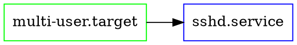

## 📚 目录

1. [依赖关系可视化概述](#1-依赖关系可视化概述)
2. [systemd-analyze dot命令详解](#2-systemd-analyze-dot命令详解)
3. [Graphviz格式依赖图生成](#3-Graphviz格式依赖图生成)
4. [依赖关系图分析解读](#4-依赖关系图分析解读)
5. [循环依赖问题诊断](#5-循环依赖问题诊断)
6. [依赖关系优化策略](#6-依赖关系优化策略)
7. [实际应用场景](#7-实际应用场景)
8. [核心要点总结](#8-核心要点总结)

---

## 1. 🔍 依赖关系可视化概述


### 1.1 什么是服务依赖关系可视化


**基本概念**：
服务依赖关系可视化是将Linux系统中复杂的服务依赖关系通过图形化的方式展示出来，让管理员能够直观地看到服务之间的启动顺序、依赖链条和相互关系。

```
传统方式理解依赖关系：
systemctl list-dependencies sshd
├─system.slice
└─sysinit.target
  ├─dev-hugepages.mount
  ├─dev-mqueue.mount
  ├─kmod-static-nodes.service
  ...（文本列表，不够直观）

可视化方式：
    网络服务 ←── SSH服务 ←── 用户登录
       ↑           ↓
    基础系统 ──→ 文件系统挂载
    
更直观、更容易发现问题！
```

### 1.2 为什么需要依赖关系可视化


**解决的核心问题**：

> 💡 **系统启动慢**：通过可视化图表快速找到启动瓶颈

> ⚠️ **服务启动失败**：直观看到哪个依赖环节出了问题

> 🔧 **系统优化**：识别不必要的依赖关系，优化启动流程

> 🚨 **故障排查**：快速定位服务间的复杂依赖问题

### 1.3 适用场景


**最适合的使用场景**：
- 🖥️ **服务器系统优化**：生产环境启动性能调优
- 🔧 **系统故障排查**：复杂依赖问题诊断
- 📚 **系统学习理解**：深入了解Linux服务架构
- 🏗️ **自定义服务开发**：设计合理的依赖关系

---

## 2. 🛠️ systemd-analyze dot命令详解


### 2.1 基本语法与原理


**命令格式**：
```bash
systemd-analyze dot [选项] [单元名称...]
```

**工作原理**：
`systemd-analyze dot`命令会分析systemd的依赖关系数据库，然后生成DOT格式的图形描述文件。DOT是Graphviz图形可视化软件使用的标准格式。

```
工作流程：
systemd依赖数据 → systemd-analyze分析 → DOT格式文件 → Graphviz渲染 → 可视化图片

类比理解：
就像把复杂的家族关系图谱，转换成一张清晰的族谱图表
```

### 2.2 常用参数详解


| 参数 | 作用 | 使用场景 |
|------|------|----------|
| `--to-pattern=PATTERN` | 只显示依赖于指定模式的单元 | 查看谁依赖某个服务 |
| `--from-pattern=PATTERN` | 只显示指定模式依赖的单元 | 查看某个服务依赖什么 |
| `--order` | 显示启动顺序依赖 | 分析启动时间问题 |
| `--require` | 显示强制依赖关系 | 查看关键依赖 |

**实际使用示例**：
```bash
# 生成完整的依赖关系图
systemd-analyze dot > dependencies.dot

# 只查看网络相关服务的依赖
systemd-analyze dot --to-pattern='*network*' > network-deps.dot

# 查看SSH服务依赖什么
systemd-analyze dot --from-pattern='sshd.service' > ssh-deps.dot

# 显示启动顺序依赖（时序关系）
systemd-analyze dot --order > boot-order.dot
```

### 2.3 输出格式理解


**DOT格式基本结构**：


> 📝 **理解要点**：
> - `digraph`：有向图（箭头表示依赖方向）
> - `node`：图中的服务或target
> - `edge`：连线表示依赖关系
> - 颜色和形状：表示不同类型的单元

---

## 3. 🎨 Graphviz格式依赖图生成


### 3.1 Graphviz工具安装与配置


**安装步骤**：
```bash
# CentOS/RHEL系统
sudo yum install graphviz

# Ubuntu/Debian系统  
sudo apt install graphviz

# 验证安装
dot -V
```

**核心组件说明**：
- **dot**：层次化布局渲染器（最常用）
- **neato**：弹簧模型布局
- **fdp**：力导向布局
- **circo**：圆形布局

### 3.2 生成可视化图表


**完整的生成流程**：

```bash
# 第一步：生成DOT格式文件
systemd-analyze dot > system-deps.dot

# 第二步：转换为图片格式
dot -Tpng system-deps.dot -o system-deps.png
dot -Tsvg system-deps.dot -o system-deps.svg  # SVG矢量格式
dot -Tpdf system-deps.dot -o system-deps.pdf  # PDF格式
```

**支持的输出格式**：
- **PNG**：适合查看，文件小
- **SVG**：矢量格式，可缩放，适合网页
- **PDF**：适合打印和文档
- **HTML**：交互式网页格式

### 3.3 优化图表显示效果


**DOT文件调优**：
```bash
# 生成更清晰的图表
systemd-analyze dot | \
sed 's/rankdir=LR/rankdir=TB/' | \    # 改为上下布局
sed 's/node \[/node [fontsize=10,/' |  # 调整字体大小
dot -Tpng -o optimized-deps.png
```

**布局选择指导**：

```
不同布局的特点：

上下布局（TB）：
     A
    / \
   B   C
适合：启动流程展示

左右布局（LR）：
A → B → C
适合：依赖链条展示

圆形布局（circo）：
   A
  /|\
 B-C-D
适合：网状依赖关系
```

---

## 4. 📊 依赖关系图分析解读


### 4.1 图表元素解读


**节点类型识别**：
```
不同颜色代表不同类型：

绿色框：target单元（系统状态目标）
    例：multi-user.target, graphical.target
    
蓝色框：service单元（具体服务）
    例：sshd.service, httpd.service
    
黄色框：mount单元（挂载点）
    例：boot.mount, home.mount
    
红色框：有问题的单元
    例：failed状态的服务
```

**连线类型理解**：
- **实线箭头**：强依赖关系（Requires）
- **虚线箭头**：弱依赖关系（Wants）
- **粗线箭头**：启动顺序依赖（After/Before）

### 4.2 关键路径分析


**启动关键路径识别**：
```
典型的启动关键路径：

基础系统初始化：
sysinit.target → basic.target → multi-user.target

关键路径分析：
    内核启动
        ↓
    早期用户空间
        ↓
    systemd初始化  ← 这里是关键瓶颈
        ↓
    基础服务启动
        ↓
    网络服务启动
        ↓
    用户服务启动
```

> 🎯 **分析要点**：
> - 找到最长的依赖链条
> - 识别启动瓶颈服务
> - 发现并行启动机会

### 4.3 异常模式识别


**常见问题模式**：

**孤立节点**：
```
正常情况：A → B → C （连贯的依赖链）
异常情况：A    B → C （A成了孤立节点）

问题：A服务可能配置错误，没有正确的依赖关系
```

**过度依赖**：
```
正常情况：
    A
   / \
  B   C

问题情况：
  A → D
  ↓   ↓
  B → E
  ↓   ↓
  C → F

问题：依赖链条过长，启动缓慢
```

---

## 5. 🔄 循环依赖问题诊断


### 5.1 循环依赖的危害


**什么是循环依赖**：
循环依赖是指两个或多个服务相互依赖，形成一个闭环，导致systemd无法确定启动顺序。

```
简单循环依赖：
A依赖B → B依赖C → C依赖A
    A ←─── C
    ↓     ↑
    B ────┘

复杂循环依赖：
A依赖B，B依赖C，C依赖D，D依赖A
更难发现和解决！
```

**循环依赖的后果**：
- 🚨 **系统启动失败**：服务无法正常启动
- ⏰ **启动时间过长**：systemd尝试解决循环依赖
- 💥 **服务状态异常**：部分服务处于不稳定状态

### 5.2 循环依赖检测方法


**使用systemd-analyze检测**：
```bash
# 检测循环依赖
systemd-analyze verify

# 生成包含循环依赖的图表
systemd-analyze dot --order | grep -i cycle

# 详细的依赖分析
systemd-analyze dump | grep -A5 -B5 "cycle\|circular"
```

**可视化检测**：
```bash
# 生成依赖图并查看循环
systemd-analyze dot --order > deps.dot
dot -Tpng deps.dot -o deps.png

# 在图中寻找环形结构
# 循环依赖在图中会显示为环形连线
```

### 5.3 循环依赖解决策略


**解决步骤**：

> 🔍 **第一步：识别循环**  
> 使用可视化图表找到形成环的服务

> ⚡ **第二步：分析必要性**  
> 确定哪些依赖是真正必要的

> 🔧 **第三步：打破循环**  
> 移除不必要的依赖或调整依赖类型

**具体解决方法**：
```bash
# 方法1：使用弱依赖替代强依赖
# 将 Requires= 改为 Wants=

# 方法2：调整启动顺序而非依赖关系
# 使用 After= 而不是 Requires=

# 方法3：引入中间服务
# A → 中介服务 → B，打破A→B→A的循环

# 示例：修改服务配置文件
sudo systemctl edit problem-service.service
```

**配置文件修改示例**：
```ini
[Unit]
# 原来的强依赖（可能导致循环）
# Requires=other-service.service

# 改为弱依赖
Wants=other-service.service
After=other-service.service

[Service]
Type=oneshot
ExecStart=/usr/local/bin/my-script.sh

[Install]
WantedBy=multi-user.target
```

---

## 6. 🚀 依赖关系优化策略


### 6.1 依赖关系设计原则


**最佳实践原则**：

> 💡 **最小依赖原则**：只依赖真正需要的服务

> ⚡ **并行启动原则**：减少不必要的顺序依赖

> 🎯 **清晰职责原则**：每个服务职责单一明确

> 🔒 **容错设计原则**：依赖失败时有降级策略

**依赖类型选择指导**：

| 依赖类型 | 使用场景 | 失败处理 | 性能影响 |
|----------|----------|----------|----------|
| `Requires=` | 绝对必须的依赖 | 依赖失败则本服务失败 | 串行启动，较慢 |
| `Wants=` | 希望有但非必须 | 依赖失败不影响本服务 | 可以并行，较快 |
| `After=` | 仅控制启动顺序 | 不关心依赖状态 | 顺序启动 |
| `Before=` | 必须先于某服务启动 | 控制启动时机 | 影响其他服务 |

### 6.2 性能优化技巧


**并行启动优化**：
```bash
# 分析哪些服务可以并行启动
systemd-analyze critical-chain

# 查看启动时间分布
systemd-analyze plot > bootup.svg

# 优化前后对比
systemd-analyze time
```

**依赖关系重构示例**：
```ini
# 优化前：过度串行依赖
[Unit]
Requires=network.service
After=network.service
Requires=database.service  
After=database.service

# 优化后：合理的并行依赖
[Unit]
Wants=network.service
After=network.service
# 移除对数据库的硬依赖，改为运行时检查
```

### 6.3 服务解耦策略


**解耦方法**：

**1. 使用Socket激活**：
```ini
# 服务不直接依赖，通过socket按需启动
[Unit]
Requires=my-service.socket

[Socket]
ListenStream=8080
WantedBy=sockets.target
```

**2. 使用Path监控**：
```ini
# 基于文件系统变化启动服务
[Unit]
Requires=my-watcher.path

[Path]
PathChanged=/etc/myconfig
Unit=my-service.service
```

**3. 引入消息队列**：
```
原来：服务A → 直接调用 → 服务B
现在：服务A → 消息队列 → 服务B
     解除了直接依赖关系！
```

---

## 7. 🎯 实际应用场景


### 7.1 Web服务器环境优化


**场景描述**：
优化一个典型的LAMP环境（Linux + Apache + MySQL + PHP）的启动依赖关系。

**问题分析**：
```bash
# 生成当前依赖图
systemd-analyze dot --to-pattern='*http*' --to-pattern='*mysql*' > lamp.dot
dot -Tpng lamp.dot -o lamp.png
```

**优化步骤**：
```
发现问题：
Apache → MySQL → PHP-FPM → Apache
存在循环依赖！

解决方案：
1. Apache启动不强依赖MySQL
2. 使用健康检查而非启动依赖
3. PHP-FPM独立启动
```

**优化配置**：
```ini
# /etc/systemd/system/httpd.service.d/override.conf
[Unit]
# 移除强依赖
# Requires=mariadb.service

# 改为弱依赖和顺序控制
Wants=mariadb.service
After=mariadb.service

# 添加健康检查
ExecStartPost=/usr/local/bin/check-mysql-connection.sh
```

### 7.2 容器化环境依赖管理


**Docker环境的systemd服务**：
```ini
[Unit]
Description=Application Container
Wants=docker.service
After=docker.service
Wants=network-online.target
After=network-online.target

[Service]
Type=oneshot
RemainAfterExit=yes
ExecStart=/usr/bin/docker run -d --name myapp myapp:latest
ExecStop=/usr/bin/docker stop myapp
ExecStopPost=/usr/bin/docker rm myapp

[Install]
WantedBy=multi-user.target
```

### 7.3 高可用集群环境


**集群服务依赖设计**：
```
集群节点启动顺序：
基础网络 → 共享存储 → 集群管理 → 业务服务

依赖关系设计：
- 每层内部可以并行
- 层与层之间有依赖
- 失败时有降级机制
```

---

## 8. 📋 核心要点总结


### 8.1 必须掌握的核心概念


```
🔸 依赖可视化本质：将复杂的服务关系图形化展示
🔸 systemd-analyze dot：生成DOT格式依赖关系文件
🔸 Graphviz工具：将DOT文件转换为可视化图片
🔸 循环依赖危害：导致启动失败或性能问题  
🔸 依赖优化原则：最小化、并行化、容错化
```

### 8.2 关键理解要点


**🔹 依赖类型的选择**：
```
强依赖（Requires）：
- 用于关键服务
- 失败会连锁影响
- 启动必须等待

弱依赖（Wants）：
- 用于可选服务
- 失败不影响主服务
- 可以并行启动

顺序依赖（After/Before）：
- 仅控制启动顺序
- 不关心服务状态
- 避免资源竞争
```

**🔹 循环依赖的识别与解决**：
```
识别方法：
- 可视化图表中的环形结构
- systemd-analyze verify命令
- 启动日志中的警告信息

解决策略：
- 弱化非关键依赖
- 使用Socket/Path激活
- 引入中间服务打破循环
- 运行时检查替代启动依赖
```

**🔹 性能优化思路**：
```
减少串行依赖：
- 识别可以并行的服务
- 使用Wants替代Requires
- 按需启动机制

缩短关键路径：
- 找到启动瓶颈服务
- 优化慢启动服务
- 延迟非关键服务启动
```

### 8.3 实际应用价值


**🎯 系统管理应用**：
- **故障排查**：快速定位依赖问题根因
- **性能调优**：优化系统启动速度
- **架构设计**：设计合理的服务依赖关系
- **文档生成**：生成系统架构图

**🔧 运维实践**：
- **变更管理**：评估服务变更影响范围
- **容量规划**：了解服务间资源依赖
- **监控告警**：基于依赖关系设计监控策略

### 8.4 学习要点提醒


> 📝 **实践建议**：
> - 先在测试环境练习生成依赖图
> - 对比优化前后的启动性能
> - 建立服务依赖关系文档

> ⚠️ **注意事项**：
> - 修改依赖关系前要备份配置
> - 在非生产环境验证修改效果
> - 循环依赖的解决需要深入理解业务逻辑

> 🎯 **进阶学习**：
> - 学习systemd的高级特性（Socket、Path激活）
> - 了解容器环境的服务依赖管理
> - 掌握集群环境的依赖设计模式

**核心记忆**：
- 依赖可视化让复杂关系一目了然
- dot命令生成图，Graphviz来渲染
- 循环依赖要识别，优化策略需合理
- 并行启动提性能，最小依赖是原则